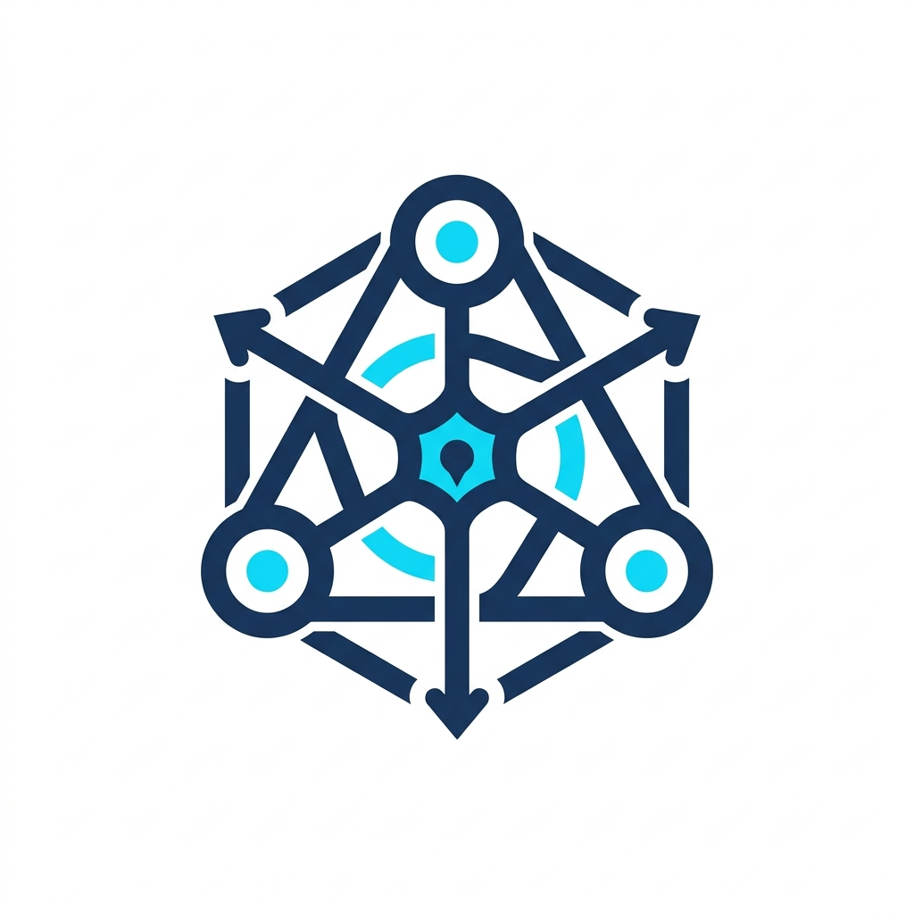
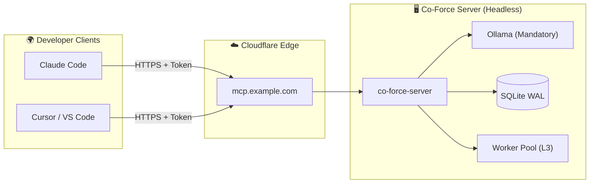

# Co-Force — Multi-Agent Coordination and Quality Control Core

Co-Force is a local-first, production-ready Multi-Agent (A2A) Orchestration platform and MCP Server. It bridges the gap between single-agent cognitive limits and collaborative software engineering tasks by implementing mandatory quality gates, cross-agent messaging, logical file locking, and multi-provider worker pools.

<p align="center">
  
</p>

---

## ⚡ Core Vision & Principles

*   **Quality-First, Speed is Secondary:** AI agents excel when they are cross-checked. Co-Force mandates structural quality gates (spec reviews, verification evidence execution, and cross-agent peer review) by default.
*   **Separation of Duties:** The agent that writes the code cannot review the code. The system enforces logical partitioning of duties across roles.
*   **Context Isolation:** High-concurrency lanes are isolated using server-side git worktrees or explicit client directives to prevent prompt hallucinations and context contamination.
*   **Heavy Server, Light Client:** Client machines require no binary installations. Agents speak standard HTTP/JSON-RPC directly through an encrypted Cloudflare Tunnel to the centralized backend.

---

## 🏗️ Architecture & Deployment

Co-Force employs a centralized server architecture that interacts with multiple developer clients over a secure Cloudflare Tunnel.



### 1. The 3 Execution Lanes
*   **Lane 1 (Interactive L1):** User-facing IDE sessions (Claude Code, Cursor) running locally on developer workstations.
*   **Lane 2 (Spawn-by-Directive L2):** Background sub-agents spawned on client machines by executing commands returned in tool envelopes.
*   **Lane 3 (Server Workers L3):** Headless workers spawned directly on the server in isolated git worktree sandboxes to perform automated testing, code reviews, and spec rechecks.

### 2. Guardrails & Agent Operating Protocol
AI agents check in and discover rules in-band. Uniform behavior is enforced across four interlocking layers:
1.  **Layer 1 (Rules):** Static `AGENTS.md` and project instructions injected during onboarding.
2.  **Layer 2 (Descriptions):** Action-oriented tool descriptions guiding LLM tool selection.
3.  **Layer 2 (Interlocking):** Server-side verification (e.g., throwing `CHECK_IN_REQUIRED` to force session setups).
4.  **Layer 4 (In-Band State):** Response envelopes piggybacking active locks, inbox messages, and task cues directly into the agent's active context window.

---

## 📦 Project Structure

```
.
├── Cargo.toml                  # Cargo Workspace config
├── AGENTS.md                   # Subagent development rules
├── icon.png                    # Project logo / icon
├── README.md                   # This overview
├── crates/
│   ├── co-force-core/          # Database, RAG, and quality engine logic
│   └── co-force-mcp/           # MCP server router, CLI subcommands
└── docs/
    ├── URD.md                  # User Requirements Document
    ├── architecture.md         # Architecture specification
    ├── progress.md             # Project roadmap progress tracker
    ├── review_findings.md      # Technical review & pivot history
    └── plans/                  # 11 Detailed workstream implementation plans (00 to 10)
```

---

## 🚀 Quick Start

### Server Installation (Ubuntu 22.04+)
To install the headless server backend and pull all mandatory models (`mxbai-embed-large`, `gemma4:e2b`, and `qwen3:14b`):
```bash
curl -fsSL https://github.com/hiimtrung/co-force/releases/latest/download/install-server.sh | sudo sh
```

### Client Enrollment (< 60s)
Copy the enrollment one-liner from the server dashboard, then run it in your project root folder:
```bash
curl -fsSL https://mcp.example.com/setup | sh -s -- --token cfk_enrollment_***
```
This automatically configures local configurations (`~/.claude.json` or `.cursor/mcp.json`), configures standard rule blocks, and verifies server handshake status.

---

## 🛠️ Tool Catalog (39 Tools)

Co-Force exposes a rich suite of tools for agents to navigate workstreams:
*   **Identity:** `check_in`, `whoami`, `guide`
*   **Tasks:** `create_tasks`, `list_tasks`, `update_task`, `approve_tasks`, `recheck_tasks`, `delegate_task`, `submit_verification`
*   **Locks:** `lock_files`, `unlock_files`, `check_conflicts`
*   **Awareness:** `list_agents`, `workspace_status`, `get_agent_context`, `get_workspace_activity`
*   **Messaging/A2A:** `send_message`, `respond_message`, `wait_events`, `share_context`, `spawn_agent`, `handover`, `plan_team`
*   **Quality:** `request_review`, `submit_review`, `request_critique`, `submit_critique`
*   **RAG/Memory:** `store_memory`, `recall`, `classify`, `create_skill`, `list_skills`, `get_skill`, `consolidate_memory`
*   **Config/Admin:** `config`, `register_role`, `quality_policy`, `health`

---

## 📄 License
This project is licensed under the Apache 2.0 License. See [LICENSE](LICENSE) for details.
