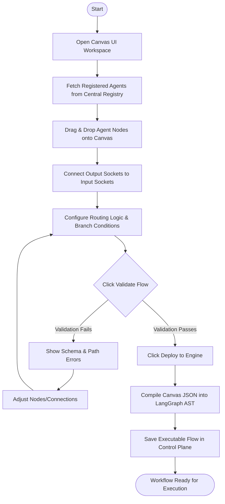
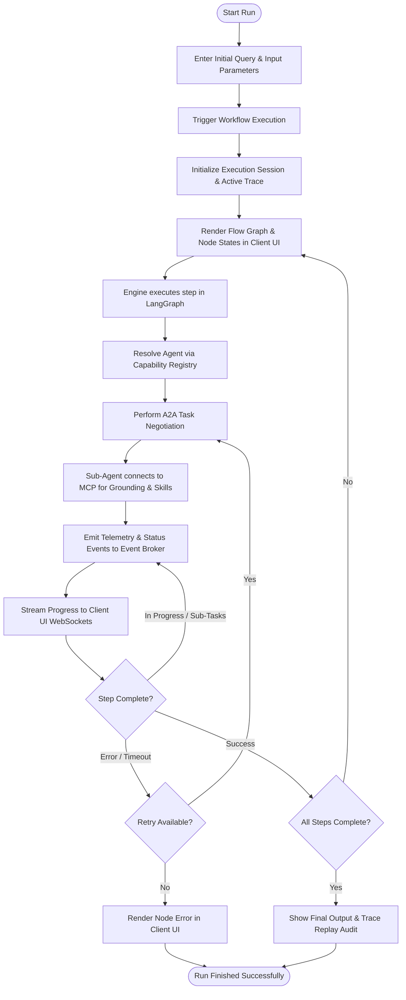

# User Requirements Document (URD)
## Project Co-Force: Centralized Agent Orchestration & Canvas Swarm Platform

### 1. Vision & Objectives
Project Co-Force is an enterprise-grade centralized agent orchestration and execution platform. It utilizes the **Agent2Agent (A2A) Protocol** for cross-agent coordination and the **Model Context Protocol (MCP)** as the primary layer for knowledge retrieval, grounding, and system capabilities (skills).

The system decouples the front-end user experience and agent processes from the back-end services:
*   **Headless Server Core:** The backend server runs completely headless without a user interface. It is responsible for providing API Gateways, databases (Registry/State store), storage solutions, and local LLM orchestration (e.g., via **Ollama**).
*   **Tauri-Based Cross-Platform Clients:** Clients are built using Tauri (supporting Desktop for macOS/Linux, and Mobile targets) and are divided into:
    *   **Control Client (Client Điều khiển):** A GUI app (mobile or desktop) with a visual Canvas (SvelteFlow/ReactFlow) used by human operators to design, trigger, and monitor workflows.
    *   **Client Agent (AI Agent):** An autonomous execution client (such as a local Antigravity AI Agent) running on the user's machine (macOS/Linux). It connects programmatically to the server, receives commands, and executes local development tasks.
*   **A2A & MCP Coordination:** The system routes tasks between the Control Client, the Client Agent, and server-side sub-agents via the A2A protocol, using MCP servers as the grounding source of truth and capabilities.

---

### 2. Target Roles & Client Types
*   **Human Operator (Control Client):** Interacts via mobile/desktop UI to manage active agents, edit LangGraph visual schemas, and oversee trace logs.
*   **Autonomous Client Agent (Antigravity):** A developer-facing AI agent installed locally on macOS/Linux. It interfaces directly with the server's APIs, running commands, writing code, and reporting progress via A2A.
*   **The Agent Swarm (Sub-Agents):** Server-side or distributed worker agents registered in the central system that handle sub-tasks delegated by the orchestrator.
*   **Local Infrastructure (Server):** Operates headless on a local network or server machine, running database storage, indexing, and serving local LLM models (e.g. Ollama).

---

### 3. Core User Stories & Use Cases

#### US-1: Canvas-Based Workflow Design & Compiler
*   **As a** Workflow Designer,
*   **I want to** use a visual canvas interface to drop agent nodes, connect inputs/outputs, and define logic branches,
*   **So that** I can automatically compile the layout into a runnable LangGraph workflow.
*   **Acceptance Criteria:**
    *   The canvas displays registered agents from the registry as draggable nodes.
    *   Connection points validate that data schemas match between output and input sockets.
    *   The compiled JSON output can be executed by the LangGraph runner.

#### US-2: Centralized Orchestration, Coordination & Tracing
*   **As a** Operations Monitor,
*   **I want to** watch the live execution of a workflow from a single control client, tracking tasks delegated from the master agent to sub-agents,
*   **So that** I can inspect payload details, negotiation outcomes, and errors at each hop.
*   **Acceptance Criteria:**
    *   The client streams execution events (negotiations, progress updates, task completion) from all involved agents.
    *   The user can pause, step through, or terminate active runs.
    *   Full execution logs are stored and available for audit playback.

#### US-3: A2A-Driven Task Delegation
*   **As a** Parent Agent,
*   **I want to** discover specialized sub-agents via their published `AgentCard` and delegate sub-tasks using A2A payloads,
*   **So that** I do not need tight compile-time coupling with worker implementations.
*   **Acceptance Criteria:**
    *   Agents check capability mappings in the central registry.
    *   Task requests and progress updates follow a standardized, secure network protocol (A2A).

#### US-4: MCP as the Knowledge & Skill Engine
*   **As an** Execution Agent,
*   **I want to** connect to standardized MCP servers to read vector search data (knowledge), fetch system statuses (grounding truths), and invoke tools (skills),
*   **So that** my prompt context remains grounded, verified, and capable of operating on target environments.
*   **Acceptance Criteria:**
    *   Agents dynamically load available skills, database queries, and tools from configured MCP endpoints.
    *   All external side effects (writing files, run scripts, database edits) are mediated through MCP.

#### US-5: Dynamic Workstation & Multi-Sandbox Agent Discovery
*   **As a** Developer / Operator,
*   **I want to** start the Co-Force client daemon or Tauri app on my computer (workstation) and have it automatically register itself and its hosted, sandboxed sub-agents with the Headless Server,
*   **So that** they instantly appear as usable nodes on the visual Canvas UI.
*   **Acceptance Criteria:**
    *   On workstation startup, the daemon registers a batch of `AgentCards` representing its active sandboxed sub-agents.
    *   The Headless Server validates registration, adds them to the Central Registry, and broadcasts the event.
    *   The Canvas UI dynamically updates its sidebar nodes list to reflect the new agents without requiring page reload.
    *   Each registered sub-agent on the workstation is isolated inside its own folder/process sandbox.

---

### 4. User Flow Diagrams

#### 4.1. Workflow Creation & Deployment Flow
This flow represents the developer's journey when building and publishing an agent swarm workflow on the canvas.

#### 4.2. Task Execution & Monitoring Flow
This flow represents the operator's journey when triggering and monitoring execution runs.

---

### 5. Functional Requirements

| Req ID | Title | Description | Priority |
| :--- | :--- | :--- | :--- |
| **FR-1** | Centralized Agent Registry | The system must host an active directory of registered agents, containing their identity, location, and published `AgentCard` schemas. | P0 |
| **FR-2** | Visual Canvas UI | A node-based UI editor allowing users to assemble, edit, and export agent execution paths. | P0 |
| **FR-3** | LangGraph Workflow Compiler | The engine must parse canvas configurations and execute them as LangGraph state machines. | P0 |
| **FR-4** | A2A Protocol Implementation | Core engine must support standardized task negotiation, delegation message passing, and status streams between parent/sub-agents. | P0 |
| **FR-5** | MCP Knowledge & Skill Layer | Sub-agents must utilize MCP connections to ground their logic in real-time information systems and trigger external actions securely. | P0 |
| **FR-6** | Centralized Monitoring Stream | The client app must receive execution logs, agent message trails, and state changes via a real-time event pipeline (WebSocket/SSE). | P1 |

---

### 6. Non-Functional Requirements

#### NFR-1: Scalability & Network Abstraction
*   The architecture must run seamlessly across any network topology (single host containerized setup, multi-node VM clusters, or hybrid cloud environments).
*   Agent discovery and registration must rely on dynamic service resolution.

#### NFR-2: Grounding & Security
*   MCP servers must enforce access control lists (ACL) ensuring agents only access authorized databases and file directories.
*   A2A communications must support mutual authentication and end-to-end payload signing.

