# Co-Force — User Requirements Document (URD)

**Version:** 2.0  
**Date:** 2026-06-26  
**Status:** Draft — Pending Review

---

## 1. Executive Summary

Co-Force là một **MCP Server đa năng** kết hợp giữa cơ chế **Thụ động (Passive Coordinator)** đối với agent ban đầu và **Chủ động (Active A2A Orchestrator)** trong việc quản lý vòng đời của các sub-agents. Nó cung cấp bộ tools để AI agent tự nhận diện, tự phối hợp, và đặc biệt là khả năng **tự đẻ nhánh (spawn sub-agents)** và **chuyển giao công việc (handover)** khi gặp sự cố, thông qua MCP protocol chuẩn.

**Mục tiêu:** Biến mỗi thư mục dự án thành một workspace thông minh, nơi một tác vụ phức tạp có thể được chia nhỏ cho nhiều AI agent làm việc song song một cách tự động (A2A), không conflict, chia sẻ memory/knowledge, và mang lại trải nghiệm liền mạch (user-friendly) cho nhà phát triển.

**Đóng gói:** Tauri Desktop App (Rust backend + NextJS frontend), global config tại `~/.co-force/`.

---

## 2. System Vision & Core Principles

### 2.1 Triết lý thiết kế

```
┌─────────────────────────────────────────────────────────────────────┐
│  Co-Force = "Bộ não chung & Người Điều Phối" cho các AI Agent       │
│                                                                     │
│  ✅ Agent chính CHỦ ĐỘNG gọi tools → Co-Force PHẢN HỒI              │
│  ✅ Khi có yêu cầu, Co-Force đẻ nhánh (Spawn) và quản lý Sub-Agents │
│                                                                     │
│  Mỗi tool là một "dịch vụ" mà agent có thể sử dụng:               │
│    🪪 Identity — "Tôi là ai? Đang làm gì?"                        │
│    📋 Tasks — "Có task nào cần làm? Tạo task mới."                 │
│    🤖 A2A — "Đẻ thêm agent phụ làm task Backend đi."              │
│    🔄 Handover — "Tôi hết hạn mức rồi, gọi agent khác làm tiếp."  │
│    🔒 Locks — "Tôi đang sửa file A, đừng đụng vào."               │
│    🧠 Memory — "Lưu lại kinh nghiệm này. Nhớ lại cái kia."       │
│    🛠️ Skills — "Đã biết cách deploy Docker chưa?"                  │
│    📊 Status — "Ai đang online? Workspace thế nào?"                │
└─────────────────────────────────────────────────────────────────────┘
```

### 2.2 Core Principles

| #   | Principle                  | Mô tả                                                                          |
| :-- | :------------------------- | :----------------------------------------------------------------------------- |
| P1  | **Active A2A Orchestrator**| Hỗ trợ Agent-to-Agent (A2A) spawning. Quản lý vòng đời sub-agents (spawn/kill/handover). |
| P2  | **Workspace-centric**      | Mỗi thư mục dự án = 1 workspace. Config tại `.co-force/`.                      |
| P3  | **Agent-agnostic**         | Hoạt động với bất kỳ AI agent nào hỗ trợ MCP (Claude, Gemini, GPT, Cursor...). |
| P4  | **Local-first**            | Không phụ thuộc cloud. Server chạy on-premises (localhost hoặc LAN). LLM qua Ollama, vector DB embedded. |
| P5  | **Multi-machine ready**    | Workspace = git repo, nhiều máy clone cùng repo.                               |
| P6  | **Knowledge accumulation** | Mỗi phiên làm việc đều tích lũy memory → knowledge → skill.                    |

---

## 3. Technology Decision

### 3.1 Language Selection Analysis

| Tiêu chí          | Rust                                                       | Python                                                  | Verdict                       |
| :---------------- | :--------------------------------------------------------- | :------------------------------------------------------ | :---------------------------- |
| MCP SDK           | `rmcp` — **official** Rust SDK, macro-driven, v0.16+       | `mcp` — official Python SDK, production-ready           | 🟢 Cả hai đều có official SDK |
| Tauri integration | **Native** — Tauri IS Rust                                 | Sidecar (PyInstaller) — thêm ~50MB binary, IPC overhead | 🟢 **Rust thắng**             |
| Vector DB         | `embedvec` — pure Rust, HNSW, SIMD-accelerated, persistent | ChromaDB, FAISS — mature nhưng cần C++ bindings         | 🟢 **Rust thắng**             |
| SQLite            | `rusqlite` + `tokio-rusqlite` (async wrapper)              | `sqlite3` built-in                                      | 🟡 Ngang nhau                 |
| Ollama client     | `reqwest` HTTP client — straightforward                    | `ollama` Python package — mature                        | 🟡 Ngang nhau                 |
| RAG chunking      | Structural parsing + Ollama LLM calls — **khả thi**        | spaCy/NLTK + rich ecosystem                             | 🟡 Python nhỉnh hơn           |
| Deploy size       | **Single binary** ~15MB                                    | Python runtime + venv ~200MB+                           | 🟢 **Rust thắng**             |
| Development speed | Chậm hơn 2-3x (boilerplate, borrow checker)                | Nhanh, prototype dễ                                     | 🟡 Python nhỉnh hơn           |
| Memory safety     | Guaranteed at compile time                                 | Runtime errors possible                                 | 🟢 **Rust thắng**             |
| Performance       | **5-20x faster** cho vector operations                     | GIL limitations cho concurrent                          | 🟢 **Rust thắng**             |

### 3.2 Quyết định: Rust

> **VERDICT: Rust** — vì Tauri integration native, single binary deployment, performance cho vector operations, và đây là long-term infrastructure project.

**Rủi ro chấp nhận được:**

- Development chậm hơn → giảm thiểu bằng macro-driven API của `rmcp`
- RAG chunking ít thư viện → outsource logic nặng cho Ollama LLM
- Ít tutorial/example → compensate bằng tài liệu chi tiết

### 3.3 Component Stack

| Component       | Crate / Technology                             | Version |
| :-------------- | :--------------------------------------------- | :------ |
| MCP Server      | `rmcp` (features: `server`, `transport-sse`)   | 0.16+   |
| Vector DB       | `embedvec` (HNSW, cosine, persistent)          | latest  |
| SQLite          | `rusqlite` + `tokio-rusqlite`                  | latest  |
| HTTP Client     | `reqwest` (Ollama API calls)                   | latest  |
| Serialization   | `serde` + `serde_json`                         | latest  |
| Async Runtime   | `tokio` (multi-thread)                         | 1.x     |
| CLI/Config      | `clap` + `toml`                                | latest  |
| UUID            | `uuid` (v4)                                    | latest  |
| Desktop App     | Tauri v2                                       | 2.x     |
| Frontend        | NextJS (within Tauri webview)                  | 14+     |
| Embedding Model | `mxbai-embed-large` (1024d) via Ollama         | latest  |
| Classifier LLM  | `gemma4:e2b` via Ollama (configurable)         | latest  |

---

## 4. Actors & Stakeholders

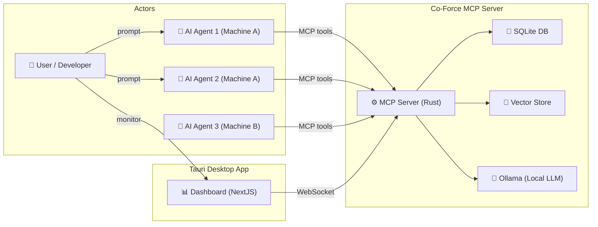

| Actor                | Mô tả                                                      | Interaction                                  |
| :------------------- | :--------------------------------------------------------- | :------------------------------------------- |
| **User / Developer** | Người dùng cuối, gửi prompt cho agent                      | Gián tiếp qua agent; trực tiếp qua Dashboard |
| **AI Agent**         | Bất kỳ AI agent nào hỗ trợ MCP (Claude, Gemini, Cursor...) | Gọi MCP tools trực tiếp                      |
| **Co-Force MCP**     | Server thụ động, phản hồi tool calls                       | Không bao giờ chủ động                       |
| **Ollama**           | Local LLM server cho embedding + classification            | HTTP API, chạy background                    |
| **Dashboard**        | Giao diện web trong Tauri app                              | WebSocket real-time                          |

---

## 5. System Architecture Overview

### 5.1 High-Level Architecture

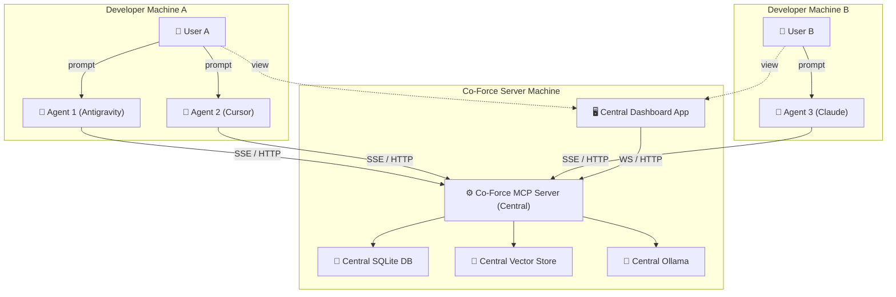

### 5.2 Data Storage Architecture

```
~/.co-force/                          # Global config (Tauri app data)
├── config.toml                       # Global settings
├── workspaces.json                   # Index of known workspaces
└── logs/                             # Server logs

<project>/.co-force/                  # Per-workspace data (git-ignored)
├── workspace.json                    # Workspace identity
├── agent.json                        # Local agent session cache
├── session_status.json               # Active locks & tasks (read by agents)
├── db/
│   └── co-force.db                   # SQLite: agents, tasks, locks (central server only)
├── memory/
│   ├── embedvec-index/               # Vector index (HNSW, central server only)
│   └── metadata.json                 # Memory statistics
└── skills/
    └── {skill-name}/
        └── SKILL.md                  # Auto-generated skill docs
```

### 5.3 Database Schema (SQLite)

```sql
-- Agent Registry
CREATE TABLE agents (
    agent_id TEXT PRIMARY KEY,
    workspace_id TEXT NOT NULL,
    name TEXT NOT NULL,
    role TEXT DEFAULT 'developer',
    provider TEXT,                      -- 'antigravity', 'cursor', 'claude', etc.
    machine_id TEXT NOT NULL,
    state TEXT DEFAULT 'idle',          -- idle, working, paused, disconnected
    current_task_id TEXT,
    capabilities TEXT,                  -- JSON array
    last_seen TIMESTAMP DEFAULT CURRENT_TIMESTAMP,
    created_at TIMESTAMP DEFAULT CURRENT_TIMESTAMP
);

-- Task Management
CREATE TABLE tasks (
    task_id TEXT PRIMARY KEY,
    workspace_id TEXT NOT NULL,
    title TEXT NOT NULL,
    objective TEXT,
    status TEXT DEFAULT 'draft',        -- draft, pending_review, approved, in_progress, blocked, completed, failed
    assigned_agent_id TEXT,
    delegated_from_agent_id TEXT,
    parent_task_id TEXT,                -- For subtasks
    use_cases TEXT,                      -- JSON array of UseCase objects
    prerequisites TEXT,                 -- JSON array of strings
    verification_plan TEXT,             -- JSON array of VerificationStep
    required_skills TEXT,               -- JSON array of strings
    locked_files TEXT,                  -- JSON array of file paths
    impact_analysis TEXT,               -- JSON object: {affectedTasks, systemImpact, description}
    priority INTEGER DEFAULT 0,
    sort_order INTEGER DEFAULT 0,
    created_at TIMESTAMP DEFAULT CURRENT_TIMESTAMP,
    updated_at TIMESTAMP DEFAULT CURRENT_TIMESTAMP,
    completed_at TIMESTAMP,
    FOREIGN KEY (assigned_agent_id) REFERENCES agents(agent_id),
    FOREIGN KEY (parent_task_id) REFERENCES tasks(task_id)
);

-- File Locks (Database-based, NOT git-committed)
CREATE TABLE file_locks (
    id INTEGER PRIMARY KEY AUTOINCREMENT,
    workspace_id TEXT NOT NULL,
    file_path TEXT NOT NULL,
    agent_id TEXT NOT NULL,
    machine_id TEXT NOT NULL,
    task_id TEXT,
    reason TEXT,
    locked_at TIMESTAMP DEFAULT CURRENT_TIMESTAMP,
    expires_at TIMESTAMP,               -- Auto-expire stale locks
    UNIQUE(workspace_id, file_path),
    FOREIGN KEY (agent_id) REFERENCES agents(agent_id),
    FOREIGN KEY (task_id) REFERENCES tasks(task_id)
);

-- Memory / Knowledge entries (metadata — vectors stored in embedvec)
CREATE TABLE memory_entries (
    entry_id TEXT PRIMARY KEY,
    workspace_id TEXT NOT NULL,
    entry_type TEXT NOT NULL,           -- 'memory', 'knowledge', 'skill'
    content TEXT NOT NULL,
    source TEXT,                        -- File path, conversation, etc.
    agent_id TEXT,                      -- Which agent stored this
    confidence REAL DEFAULT 1.0,
    tags TEXT,                          -- JSON array
    vector_id TEXT,                     -- Reference to embedvec index
    created_at TIMESTAMP DEFAULT CURRENT_TIMESTAMP,
    accessed_at TIMESTAMP,
    access_count INTEGER DEFAULT 0
);

-- Skills
CREATE TABLE skills (
    skill_id TEXT PRIMARY KEY,
    workspace_id TEXT NOT NULL,
    name TEXT NOT NULL,
    description TEXT,
    category TEXT,                      -- 'deployment', 'testing', 'coding', etc.
    steps TEXT,                         -- JSON array of step strings
    source_memories TEXT,               -- JSON array of memory_entry_ids that generated this skill
    usage_count INTEGER DEFAULT 0,
    created_at TIMESTAMP DEFAULT CURRENT_TIMESTAMP,
    updated_at TIMESTAMP DEFAULT CURRENT_TIMESTAMP
);

-- Embedding Cache (to avoid redundant Ollama API calls)
CREATE TABLE embedding_cache (
    content_hash TEXT PRIMARY KEY,       -- SHA-256 hash of text content
    embedding TEXT NOT NULL,            -- JSON array of floats (1024 dimensions)
    created_at TIMESTAMP DEFAULT CURRENT_TIMESTAMP
);

-- Agent Activities (structured activity log — inspired by Tutti's Activity Projection)
-- Lưu trữ structured activity thay vì chỉ raw memories,
-- cho phép agents xem workspace history và context của nhau
CREATE TABLE agent_activities (
    activity_id TEXT PRIMARY KEY,
    workspace_id TEXT NOT NULL,
    agent_id TEXT NOT NULL,
    activity_type TEXT NOT NULL,         -- 'check_in', 'task_started', 'task_completed', 'file_edited',
                                        -- 'memory_stored', 'delegation', 'lock_acquired', 'lock_released'
    content TEXT,                        -- JSON object: {summary, details, related_context}
    related_task_id TEXT,
    related_files TEXT,                  -- JSON array of file paths
    version INTEGER DEFAULT 1,           -- Versioning for merge conflict resolution
    occurred_at TIMESTAMP DEFAULT CURRENT_TIMESTAMP,
    FOREIGN KEY (agent_id) REFERENCES agents(agent_id)
);

-- Shared Contexts (cross-agent context sharing — inspired by Tutti's @ mention system)
-- Cho phép agents chủ động share context cho nhau hoặc broadcast
CREATE TABLE shared_contexts (
    context_id TEXT PRIMARY KEY,
    workspace_id TEXT NOT NULL,
    source_agent_id TEXT NOT NULL,
    target_agent_id TEXT,                -- NULL = broadcast to all agents in workspace
    context_type TEXT NOT NULL,          -- 'task_context', 'knowledge_share', 'file_reference',
                                        -- 'session_summary', 'delegation_context'
    content TEXT NOT NULL,               -- Structured JSON content
    resolved BOOLEAN DEFAULT FALSE,      -- Target agent đã đọc/xử lý chưa
    created_at TIMESTAMP DEFAULT CURRENT_TIMESTAMP,
    resolved_at TIMESTAMP,
    FOREIGN KEY (source_agent_id) REFERENCES agents(agent_id)
);
```

---

## 6. LLM Orchestration, Embedding & Vector Database Architecture

### 6.1 Ollama LLM Orchestration (Quản lý và Điều phối LLM Ollama)
Vì Ollama chạy cục bộ trên máy chủ trung tâm và các tác vụ inference (suy luận/tạo vector) tiêu thụ rất nhiều tài nguyên hệ thống (CPU/GPU/RAM/VRAM), Co-Force triển khai một cơ chế điều phối chặt chẽ:
1. **Concurrency Control (Kiểm soát Luồng Đồng thời):**
   - Tránh việc gọi Ollama API một cách không kiểm soát từ nhiều agent song song, dễ gây tràn RAM/VRAM hoặc treo Ollama.
   - Co-Force triển khai một **Mutex Task Queue / Semaphore** trong core thư viện Rust để sắp xếp hàng đợi các yêu cầu inference. Số lượng luồng inference đồng thời được giới hạn cứng (mặc định: `concurrency_limit = 2`), cấu hình qua `config.toml`.
2. **Model Loading & Lifecycle Management (Nạp và giải phóng Model):**
   - Ollama tự động tải model vào bộ nhớ khi nhận request đầu tiên và giữ lại trong RAM một thời gian (mặc định 5 phút).
   - Co-Force tối ưu hóa việc nạp model bằng cách phân tách vai trò:
     - **Embedding Model (`mxbai-embed-large`):** Model nhỏ (334M params), giữ lâu hơn trong RAM vì tần suất gọi tạo vector rất cao.
     - **Classifier LLM (`gemma4:e2b`):** Model suy luận (2B params), giải phóng nhanh hơn sau khi hoàn thành tác vụ phân loại hoặc phân tích task.
   - Hàng đợi của Co-Force đảm bảo rằng khi đang chạy batch embedding kích thước lớn, các yêu cầu classification sẽ được xếp hàng chờ (và ngược lại) để tránh tranh chấp bộ nhớ VRAM cùng lúc.
3. **Timeout & Retries with Graceful Fallback:**
   - Đặt ngưỡng timeout cho Ollama API (ví dụ: 30s cho classification, 15s cho embedding).
   - Nếu Ollama bị sập hoặc mất kết nối:
     - Đối với **Classification:** Server tự động chuyển sang giải thuật heuristic dựa trên regex/từ khóa (Keyword Classifier) làm phương án dự phòng tạm thời, ghi nhận độ tin cậy thấp (`confidence = 0.5`).
     - Đối với **Embedding:** Chuyển sang lưu trữ thô ở SQLite, đánh dấu trạng thái `vector_id = null`. Một tiến trình chạy nền (Background sync job) sẽ liên tục retry để quét các bản ghi này và đẩy vào Vector DB ngay khi Ollama hoạt động trở lại.

### 6.2 Vector Database (embedvec) Deployment (Triển khai Vector DB cục bộ)
Co-Force sử dụng `embedvec` — một thư viện cơ sở dữ liệu vector viết hoàn toàn bằng Rust, lưu trữ và truy vấn nhúng trực tiếp trên đĩa cứng:
1. **Physical Storage Structure (Lưu trữ Vật lý):**
   - Cơ sở dữ liệu vector được lưu trữ cục bộ trên máy chủ trung tâm tại đường dẫn `~/.co-force/vector_store/`.
   - Mỗi Workspace có một thư mục index vector riêng biệt nhằm đảm bảo cô lập dữ liệu (data isolation): `~/.co-force/vector_store/{workspaceId}/`.
   - Cấu trúc thư mục index gồm:
     - `index.hnsw`: File lưu trữ đồ thị HNSW (Hierarchical Navigable Small World).
     - `metadata.bin`: File nhị phân lưu trữ ánh xạ giữa Vector ID (UUID) và thông tin metadata bổ sung.
2. **HNSW Index Tuning (Cấu hình Tham số Đồ thị):**
   - **M (Max connections per node):** Mặc định đặt `M = 16`. Giúp cân bằng tốt giữa thời gian xây dựng chỉ mục và độ chính xác tìm kiếm.
   - **ef_construction (Size of dynamic candidate list during construction):** Mặc định đặt `ef_construction = 100`.
   - **ef_search (Size of dynamic candidate list during search):** Mặc định đặt `ef_search = 50`.
   - **Distance Metric:** Sử dụng **Cosine Similarity** (Độ tương đồng Cosine) để so sánh các vector nhúng của văn bản.
3. **SQLite & Vector DB Integration (Liên kết dữ liệu):**
   - Bảng `memory_entries` trong SQLite lưu thông tin meta (tiêu đề, thẻ tags, loại memory, timestamp).
   - Trường `vector_id` trong SQLite lưu UUID đại diện cho vector nhúng tương ứng trong `embedvec`.
   - Khi thực hiện truy vấn semantic search (`co_force_recall`):
     1. Client gọi API. Server tạo vector nhúng cho câu query.
     2. Server truy vấn `embedvec` bằng vector nhúng đó để tìm top K `vector_id` có cosine similarity gần nhất.
     3. Server thực hiện truy vấn `SELECT` trong SQLite sử dụng các `vector_id` này để lấy thông tin chi tiết (nội dung, tags, timestamp) trả về cho Agent.

### 6.3 LLM Management, Extensibility & First-Time Onboarding (Quản lý, Mở rộng LLM & Thiết lập Lần đầu)

Co-Force được thiết kế với tính linh hoạt tối đa (no hardcoding). Cả **Bộ suy luận LLM (Classifier)** và **Bộ nhúng (Embedding)** đều hỗ trợ mở rộng toàn diện thông qua hệ thống Plugin Provider hỗ trợ cả local (Ollama) và cloud (OpenAI, Anthropic, Gemini, OpenRouter...).

#### 1. Luồng Thiết lập Cấu hình Lần đầu (First-Time Bootstrapping Wizard)
Khi Co-Force khởi động lần đầu tiên (hoặc phát hiện file cấu hình `~/.co-force/config.toml` chưa tồn tại), server/desktop app sẽ kích hoạt luồng thiết lập từng bước (Setup Wizard):

```mermaid
graph TD
    Start([Khởi động Co-Force lần đầu]) --> CheckConfig{Có config.toml chưa?}
    CheckConfig -->|Có| RunServer[Chạy Server bình thường]
    
    CheckConfig -->|Chưa| Wizard[Kích hoạt Setup Wizard]
    
    subgraph "Setup Wizard Flow"
        Wizard --> Step1[Bước 1: Chọn LLM Provider<br/>Ollama | OpenAI | Anthropic | Gemini]
        Step1 --> CheckCreds{Cần API Key?}
        CheckCreds -->|Có| InputKey[Nhập API Key hoặc chỉ định ENV]
        CheckCreds -->|Không / Ollama| SetUrl[Nhập URL endpoint Ollama]
        
        InputKey --> Step2[Bước 2: Chọn Model LLM<br/>Ví dụ: gpt-4o-mini, claude-3-5-haiku, gemma4:e2b]
        SetUrl --> Step2
        
        Step2 --> Step3[Bước 3: Chọn Model Embedding<br/>Ví dụ: text-embedding-3-small, mxbai-embed-large]
        
        Step3 --> SaveConfig[Ghi thông tin vào ~/.co-force/config.toml]
    end
    
    SaveConfig --> RunServer
```

- **Chế độ CLI:** Server hiển thị giao diện tương tác terminal (interactive CLI prompts) để người dùng lựa chọn provider, model và nhập API Key.
- **Chế độ Desktop App (Tauri):** Hiển thị màn hình cấu hình onboarding trực quan, tự động gọi API quét các model hiện có (ví dụ: quét qua `GET /api/tags` của Ollama) để điền vào danh sách gợi ý cho người dùng chọn.

#### 2. Kiến trúc Mở rộng Toàn diện (Fully Extensible Providers)
Cả hai tác vụ Embedding và LLM suy luận đều sử dụng mô hình trừu tượng hóa dạng Trait trong Rust:
- **`EmbeddingProvider` Trait:** Định nghĩa giao thức tạo nhúng bất kể là cục bộ hay đám mây.
  - Nếu chọn **Ollama**: Kết nối API local tạo nhúng.
  - Nếu chọn **OpenAI/Gemini**: Kết nối cloud API tương ứng.
  - Số chiều nhúng (Dimension Mapping) của `embedvec` sẽ được tự động điều chỉnh theo model được cấu hình (ví dụ: 1024 chiều cho `mxbai-embed-large`, 1536 chiều cho `text-embedding-3-small`).
- **`LlmProvider` Trait:** Định nghĩa giao thức xử lý chat completion và classification.

#### 3. Configuration Schema (`config.toml`):
```toml
[llm]
default_classifier_provider = "ollama"  # Hoặc openai, anthropic, gemini...
default_embedding_provider = "ollama"   # Hoặc openai, gemini...

[ollama]
url = "http://localhost:11434"
embedding_model = "mxbai-embed-large"
classifier_model = "gemma4:e2b"
concurrency_limit = 2

[llm.providers.openai]
api_key = "env:OPENAI_API_KEY"
embedding_model = "text-embedding-3-small"
classifier_model = "gpt-4o-mini"

[llm.providers.anthropic]
api_key = "env:ANTHROPIC_API_KEY"
classifier_model = "claude-3-5-haiku-latest"
```

#### 4. Dynamic Provider Switching (Chuyển đổi Động):
Người dùng hoặc Agent có thể thay đổi nhà cung cấp và model trong runtime thông qua lệnh gọi cấu hình:
- `co_force_config({key: "llm.default_classifier_provider", value: "openai"})`
- `co_force_config({key: "llm.default_embedding_provider", value: "openai"})`
Mọi thay đổi này sẽ tự động cập nhật cấu hình hoạt động và lưu đè lên file `config.toml`.

### 6.4 Embedding Strategy (Chiến lược tạo Vector Nhúng)
1. **Dimension Mapping (Ánh xạ Kích thước):**
   - Kích thước vector nhúng mặc định được thiết kế là **1024 chiều** (tương thích `mxbai-embed-large`).
   - Nếu đổi sang model khác (ví dụ: `text-embedding-3-small` - 1536 chiều, hoặc `nomic-embed-text` - 768 chiều), index của `embedvec` cho workspace đó sẽ tự động được khởi tạo lại với số chiều mới.
2. **Chunking & Batching Strategy (Chiến lược Cắt đoạn & Gửi theo lô):**
   - Để tránh quá tải bộ nhớ và timeout API khi tạo nhúng cho các file code hoặc tài liệu lớn:
     - Co-Force áp dụng **Batching** tối đa **16 chunks** mỗi lượt gọi API tạo embedding.
     - Sử dụng cơ chế tạo nhúng bất đồng bộ (Async queue).
3. **Embedding Cache (Bộ đệm nhúng):**
   - Để tránh việc tính toán lại vector nhúng cho cùng một đoạn văn bản hoặc file code chưa thay đổi:
     - SQLite duy trì bảng `embedding_cache` (sẽ được bổ sung vào schema DB) lưu hash SHA-256 của văn bản nguồn làm khóa (key) và giá trị vector nhúng làm kết quả (value).
     - Trước khi gọi Ollama API để tạo embedding, server sẽ kiểm tra trong bảng cache. Nếu khớp hash SHA-256, server sẽ sử dụng ngay vector có sẵn, giảm tải tới 80% số lượt gọi tạo nhúng khi lập chỉ mục workspace.

---

## 7. Use Case Catalog

### 7.1 Summary Table

| UC ID | Group         | Use Case                            | Priority | Complexity |
| :---- | :------------ | :---------------------------------- | :------- | :--------- |
| UC-01 | Identity      | Agent Check-in (First Time)         | P0       | Low        |
| UC-02 | Identity      | Agent Check-in (Returning)          | P0       | Low        |
| UC-03 | Identity      | Agent Whoami (Quick Status)         | P0       | Low        |
| UC-04 | Identity      | Agent Heartbeat / Disconnect        | P1       | Medium     |
| UC-05 | Task          | User Prompt → Task Analysis & Draft | P0       | High       |
| UC-06 | Task          | Task Recheck (Subagent Validation)  | P0       | High       |
| UC-07 | Task          | User Task Approval                  | P0       | Low        |
| UC-08 | Task          | Task Execution with Status Updates  | P0       | Medium     |
| UC-09 | Task          | Task Completion                     | P0       | Low        |
| UC-10 | Task          | Task Failure & Recovery             | P1       | Medium     |
| UC-11 | Task          | Task Dependency Chain               | P1       | High       |
| UC-12 | Coordination  | Cross-Agent Task Delegation         | P0       | High       |
| UC-13 | Coordination  | File Lock Acquisition               | P0       | Medium     |
| UC-14 | Coordination  | File Lock Conflict Detection        | P0       | Medium     |
| UC-15 | Coordination  | File Lock Release & Cleanup         | P0       | Low        |
| UC-16 | Coordination  | List Active Agents & Their Work     | P0       | Low        |
| UC-17 | RAG           | Memory Storage (Auto-classify)      | P1       | High       |
| UC-18 | RAG           | Knowledge Recall (Semantic Search)  | P1       | High       |
| UC-19 | RAG           | Skill Auto-Detection & Creation     | P1       | Very High  |
| UC-20 | RAG           | Skill Retrieval for Task Execution  | P1       | Medium     |
| UC-21 | Multi-Machine | Same Workspace on Multiple Machines | P2       | High       |
| UC-22 | Multi-Machine | Cross-Machine Agent Awareness       | P2       | High       |
| UC-23 | Multi-Machine | Post-Task Code Merge                | P2       | Medium     |
| UC-24 | Dashboard     | Real-time Agent Status Monitoring   | P2       | Medium     |
| UC-25 | Dashboard     | Task Board (Kanban View)            | P2       | Medium     |
| UC-26 | Dashboard     | Memory/Knowledge Browser            | P2       | Medium     |
| UC-27 | Error         | Agent Crash Recovery                | P1       | Medium     |
| UC-28 | Error         | Ollama Unavailable Fallback         | P1       | Medium     |
| UC-29 | Error         | Stale Lock Auto-cleanup             | P1       | Low        |
| UC-30 | Error         | Vector DB Corruption Recovery       | P2       | Medium     |
| UC-31 | Onboarding    | Agent Onboarding Guide              | P0       | Low        |
| UC-32 | Config        | LLM Model Selection                 | P1       | Low        |
| UC-33 | Coordination  | Agent Context Retrieval              | P0       | Medium     |
| UC-34 | Coordination  | Workspace Activity Stream            | P1       | Medium     |
| UC-35 | Coordination  | Cross-Agent Context Sharing          | P1       | Medium     |
| UC-36 | Coordination  | Dynamic AGENTS.md Generation         | P0       | Medium     |

---

## 8. Detailed Use Cases

### Group A: Agent Lifecycle

#### UC-01: Agent Check-in (First Time — New Workspace / New Agent Registration)

**Actor:** AI Agent  
**Preconditions:** Agent kết nối tới Co-Force Central Server qua SSE, mở một thư mục dự án chưa có file `.co-force/agent.json` hoặc chưa có định danh `agentId`.  
**Postconditions:** Workspace được định danh, Agent được đăng ký thành công trên Central Server, file cấu hình cục bộ được ghi nhận.

##### 📋 Định nghĩa "Agent Mới", Đa Agent và Giải pháp Chống trôi Định danh do Mất Context (Context Loss)

Một Agent instance được xác định là **mới** trong hệ thống và cần đăng ký mới nếu rơi vào các trường hợp:
1. **Lần đầu kết nối (Fresh setup):** Máy trạm chưa có file `.co-force/agent.json`.
2. **Session Reset:** Agent kết nối không gửi kèm `agentId` (hoặc gửi `agentId: null`), yêu cầu cấp một session ID mới.
3. **Thay đổi vai trò/Môi trường:** Khi cặp định danh khóa chính (`workspaceId`, `machineId` / `clientIp`, `agentName`, `role`) chưa tồn tại trong cơ sở dữ liệu SQLite của Central Server.

**Cơ chế định danh và Hỗ trợ Đa Agent (Multi-Agent Support):**
- Trên cùng một máy trạm, người dùng có thể mở nhiều terminal (ví dụ: 1 Claude CLI, 2 Antigravity) hoặc chạy nhiều workspace song song. Để phân định chính xác mỗi tiến trình Agent, client-side launcher (hoặc IDE extension) tự động sinh một mã `agentSessionId` duy nhất (UUID v4) dựa trên PID của tiến trình cha (`PPID`) hoặc ID của terminal tab (`TERM_SESSION_ID`).
- Mã `agentSessionId` này cùng với `workspaceId`, `machineId`, `agentName`, và `role` được truyền làm **Query Parameters** khi thiết lập kết nối stream SSE tới Central Server:
  `http://<server-ip>/sse?workspaceId=...&machineId=...&agentSessionId=...&agentName=...&role=...`
- **Implicit Session Binding (Chống trôi Context):** Đối với các cuộc hội thoại dài, LLM Agent thường xuyên bị nén (compact) hoặc xóa bộ nhớ ngữ cảnh (context window), dẫn tới việc mất biến `agentId` trong memory của nó. Để giải quyết, Co-Force áp dụng cơ chế định danh ẩn:
  - Central Server duy trì bảng map trong bộ nhớ liên kết **kết nối mạng HTTP/SSE** với bản ghi Agent trong DB.
  - Các tool gọi từ Agent (như `whoami()`, `lock_files()`, `update_task()`) **không yêu cầu truyền `agentId` làm tham số đầu vào**.
  - Server tự động điền `agentId` dựa trên context kết nối của request. LLM Agent hoàn toàn không cần ghi nhớ ID của mình để hoạt động, loại bỏ 100% rủi ro mất định danh.

**Cơ chế định danh:**
- `workspaceId`: Bắt nguồn từ mã băm của Git Remote URL của dự án, hoặc tự sinh UUID ghi vào `.co-force/workspace.json` nếu dự án không có git.
- `machineId`: Mã định danh phần cứng của máy trạm (Mac Address hoặc CPU serial) gửi lên trong gói tin HTTP.
- `agentName`: Tên của AI client (như `Cursor-Agent`, `Gemini-Antigravity`).
- `role`: Vai trò nghiệp vụ được chỉ định trong prompt của user (mặc định: `developer`).


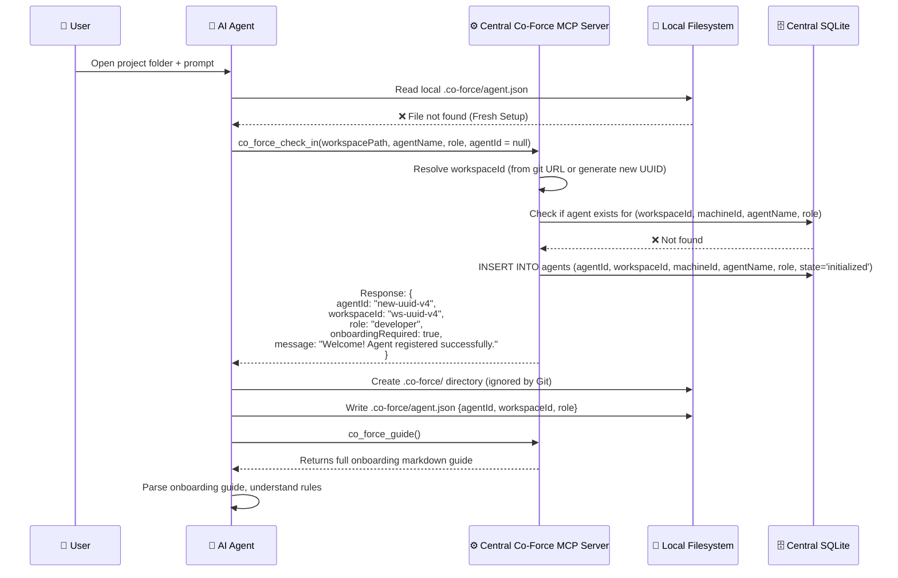

**Alternative Flows:**
- **A1: Thư mục dự án đã có `.co-force/agent.json` nhưng `agentId` không khớp trên server:** Server sẽ coi như đăng ký lại, cấp `agentId` mới và ghi đè file cục bộ.
- **A2: Lỗi ghi file cục bộ:** Trả về lỗi hướng dẫn người dùng cấp quyền ghi thư mục dự án.

---

#### UC-02: Agent Check-in (Returning — Existing Workspace)

**Actor:** AI Agent  
**Preconditions:** Workspace đã tồn tại cục bộ, file `.co-force/agent.json` có chứa `agentId` và `workspaceId` hợp lệ.  
**Postconditions:** Phục hồi phiên làm việc của Agent, đồng bộ hóa các task và locks dở dang.

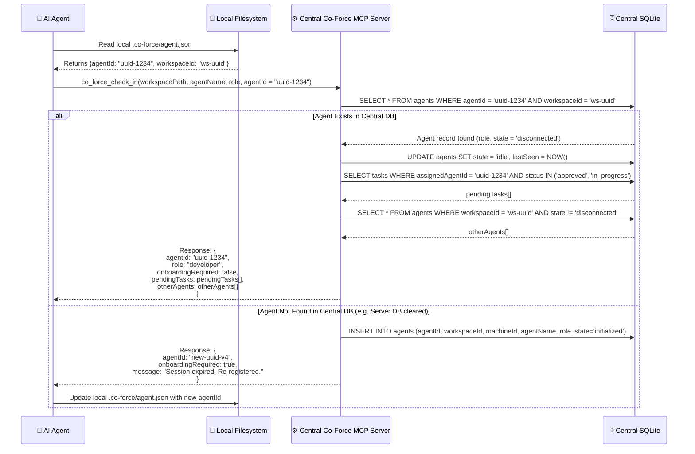

---

#### UC-03: Agent Whoami (Quick Status)

**Actor:** AI Agent  
**Preconditions:** Agent đã check-in  
**Mục đích:** Lightweight query — agent cần biết nhanh context hiện tại (được xác định tự động qua connection context)

**Tool:** `co_force_whoami()`

**Response:**

```json
{
  "agentId": "...",
  "name": "Agent-Alpha",
  "role": "developer",
  "state": "working",
  "currentTask": { "taskId": "...", "title": "Implement login" },
  "lockedFiles": ["/src/auth/login.ts"],
  "activeAgentsCount": 3,
  "pendingTasksCount": 5
}
```

---

#### UC-04: Agent Heartbeat / Disconnect Detection

**Actor:** Co-Force Central Server (automatic)  
**Preconditions:** Agent đã check-in và đang có kết nối SSE mở.

**Cơ chế Giám sát Lỏng lẻo (SSE Connection & Keep-Alive Monitoring):**

- **Phát hiện ngắt kết nối Instant:** Vì Agent kết nối qua stream SSE (HTTP persistent), Central Server theo dõi trạng thái TCP socket. Khi terminal bị đóng, tiến trình Agent bị kill, hoặc mạng lỗi, kết nối SSE sẽ bị đứt. Server phát hiện ngắt kết nối lập tức (instant detection).
- **Trạng thái Tạm thời (Disconnected & Paused Task):**
  - Khi đứt kết nối, trạng thái Agent chuyển sang `disconnected`.
  - Toàn bộ các task đang ở trạng thái `in_progress` của Agent này được chuyển tạm thời sang `paused` (tạm dừng) để giữ vị trí và tránh xung đột.
- **Grace Period (Thời gian ân hạn):** Server kích hoạt bộ đếm thời gian chờ phục hồi (Grace Period - mặc định **2 phút**).
  - Nếu Agent reconnect và check-in lại trong vòng 2 phút, trạng thái Agent đổi lại thành `working`, khôi phục kết nối và tiếp tục giữ các lock và task cũ.
- **Auto-Reclaiming (Tự động thu hồi tài nguyên sau timeout):**
  - Nếu hết 2 phút mà Agent không kết nối lại, hệ thống sẽ thực hiện thu hồi tài nguyên:
    1. **Giải phóng file locks:** Toàn bộ lock của Agent được xóa khỏi SQLite.
    2. **Trả task về Backlog:** Task chuyển từ `paused` về `approved` (xóa `assignedAgentId`) để Agent khác có thể pick up.
    3. **Chặn ghi:** Reset thuộc tính file trên máy trạm của Agent cũ về Read-only (`chmod -w`).

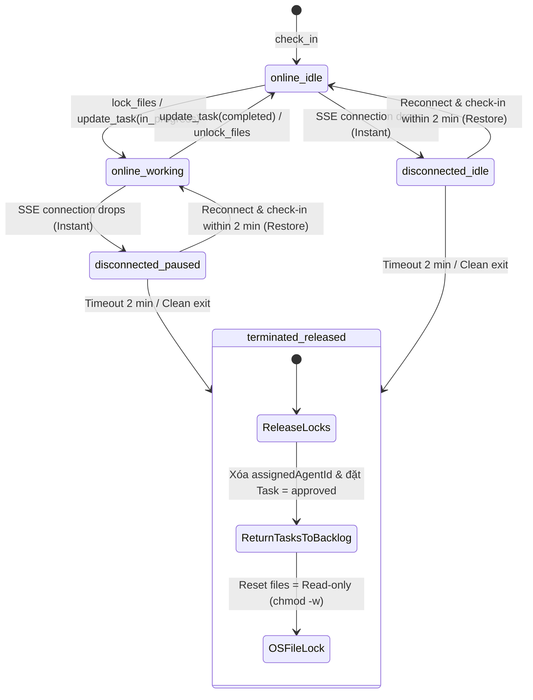

---

### Group B: Task Management

#### UC-05: User Prompt → Task Analysis & Draft

**Actor:** AI Agent (triggered by User prompt)  
**Preconditions:** Agent đã check-in, nhận prompt từ user

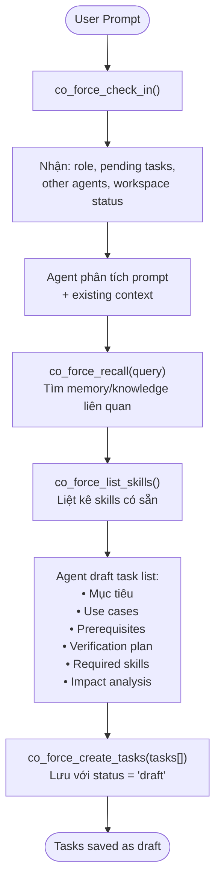

**Task Structure đầy đủ** (mỗi task phải có):

| Field              | Bắt buộc | Mô tả                                            |
| :----------------- | :------- | :----------------------------------------------- |
| `title`            | ✅       | Tên task ngắn gọn                                |
| `objective`        | ✅       | Mục tiêu cụ thể                                  |
| `useCases`         | ✅       | Danh sách use case (actor, flow, postconditions) |
| `prerequisites`    | ✅       | Điều kiện để triển khai                          |
| `verificationPlan` | ✅       | Verify như thế nào (test, manual check)          |
| `requiredSkills`   | ✅       | Skill cần có                                     |
| `impactAnalysis`   | ✅       | Nếu fail → ảnh hưởng gì                          |
| `lockedFiles`      | ❌       | Files sẽ sửa (khai báo khi bắt đầu)              |
| `status`           | Auto     | draft → pending_review → approved → ...          |

---

#### UC-06: Task Recheck (Subagent Validation)

**Actor:** AI Agent (as subagent role)  
**Preconditions:** Tasks đã được draft

**Mục đích:** Phát hiện lỗ hổng logic, business gaps, thiếu use case TRƯỚC khi user approve.

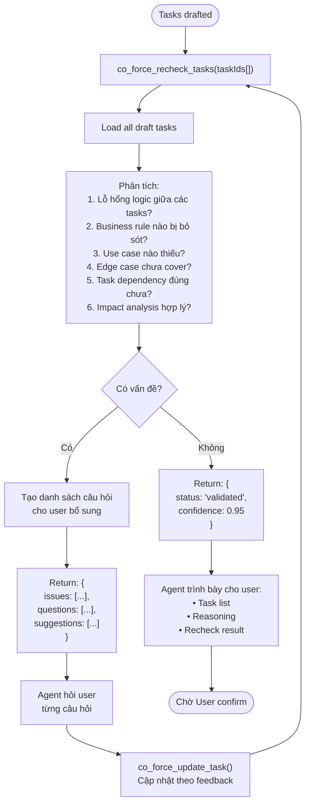

**Recheck sẽ kiểm tra:**

1. ❓ Có use case nào mà 2 user cùng thao tác đồng thời không?
2. ❓ Edge case: input rỗng, quá dài, ký tự đặc biệt?
3. ❓ Security: SQL injection, XSS, CSRF?
4. ❓ Task A và Task B có sửa cùng file không? (cần delegation)
5. ❓ Nếu Task B fail, Task A có bị ảnh hưởng không?
6. ❓ Có missing prerequisite nào không?

---

#### UC-07: User Task Approval

**Actor:** AI Agent (proxy for User decision)

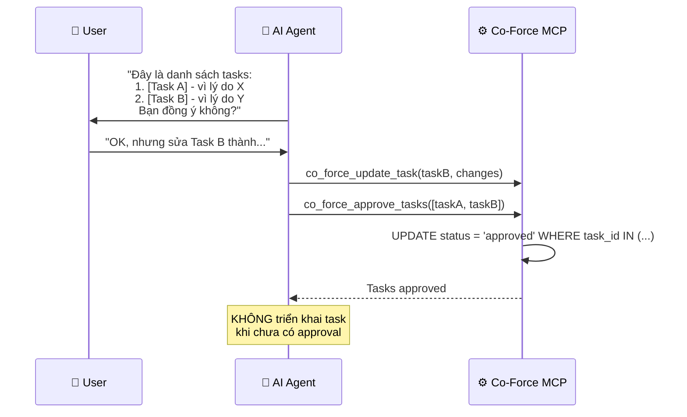

**Rule quan trọng:** Agent **KHÔNG ĐƯỢC** tự ý triển khai task khi chưa có explicit approval từ user.

---

#### UC-08: Task Execution with Status Updates

**Actor:** AI Agent

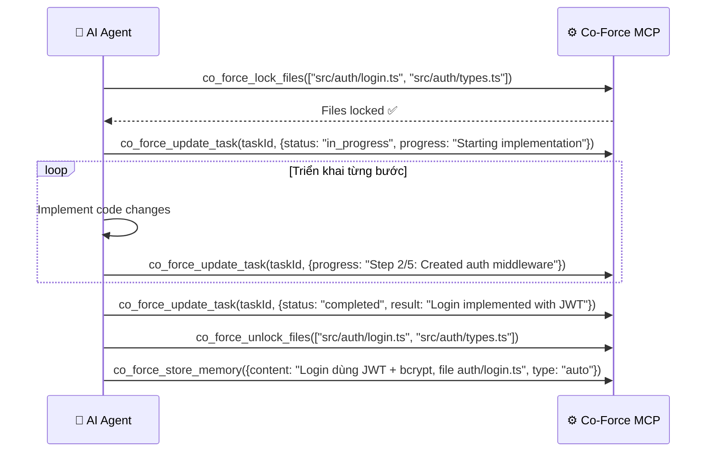

---

#### UC-10: Task Failure & Impact Cascade

**Actor:** AI Agent

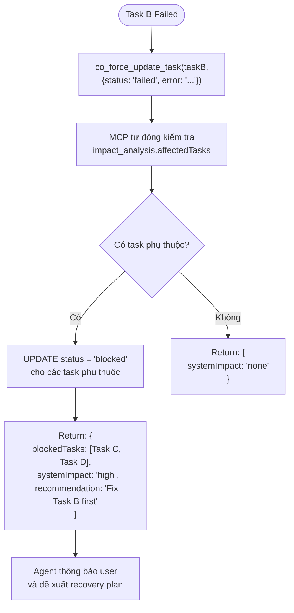

---

### Group C: Cross-Agent Coordination

#### UC-12: Cross-Agent Task Delegation

**Actor:** AI Agent 1 (delegator)  
**Preconditions:** Agent 1 đang làm task, phát hiện cần agent khác hỗ trợ

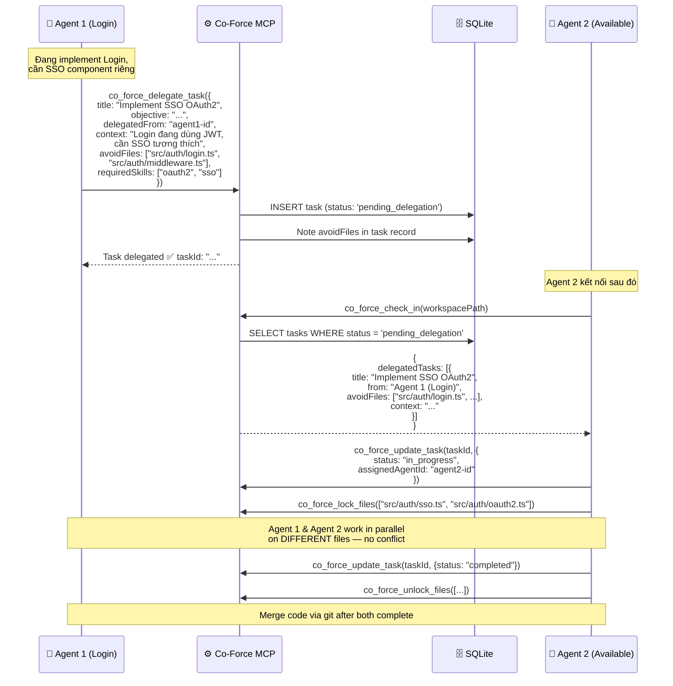

---

#### UC-13 & UC-14: File Lock Acquisition & Conflict Detection

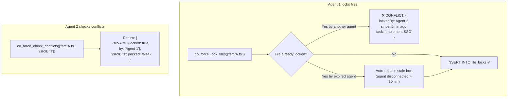

---

#### UC-16: List Active Agents & Their Work

**Tool:** `co_force_list_agents()`

**Response example:**

```json
{
  "workspace": "co-force",
  "agents": [
    {
      "agentId": "...",
      "name": "Agent-Alpha",
      "provider": "antigravity",
      "machine": "MacBook-Pro-Trung",
      "state": "working",
      "currentTask": "Implement Login (3/5 steps done)",
      "lockedFiles": ["src/auth/login.ts"],
      "lastSeen": "2 minutes ago"
    },
    {
      "agentId": "...",
      "name": "Agent-Beta",
      "provider": "cursor",
      "machine": "MacBook-Pro-Trung",
      "state": "idle",
      "currentTask": null,
      "lockedFiles": [],
      "lastSeen": "30 seconds ago"
    }
  ],
  "summary": {
    "total": 2,
    "working": 1,
    "idle": 1,
    "disconnected": 0,
    "totalLockedFiles": 1
  }
}
```

---

### Group D: Memory & Knowledge (Agentic RAG)

#### UC-17: Memory Storage (Auto-classify)

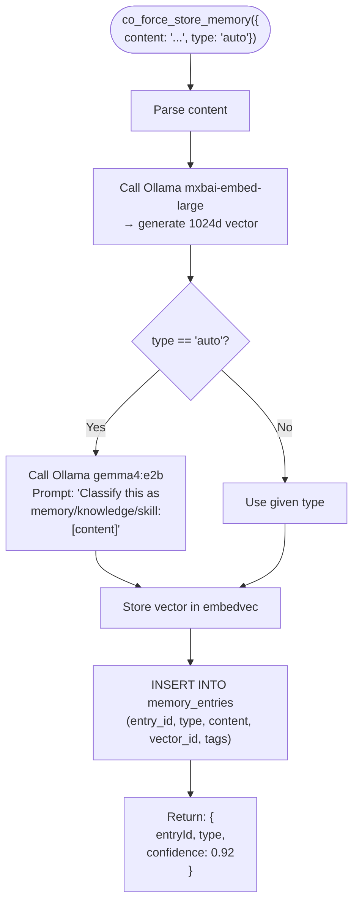

**Classification Prompt (sent to Ollama):**

```
You are a classifier. Categorize the following text into exactly ONE category:

- MEMORY: Specific event, context, or fact from a work session. Time-bound, session-specific.
  Examples: "File X has a bug in line 42", "User wants PostgreSQL not MySQL"

- KNOWLEDGE: General-purpose pattern, best practice, or reusable principle. Timeless.
  Examples: "React hooks must be called at top level", "Always use parameterized SQL queries"

- SKILL: Step-by-step procedure that can be reused. Actionable, sequential.
  Examples: "To deploy Docker: 1) Build image 2) Push to registry 3) kubectl apply"

Text: "{content}"

Respond with ONLY the category name: MEMORY, KNOWLEDGE, or SKILL
```

---

#### UC-18: Knowledge Recall (Semantic Search)

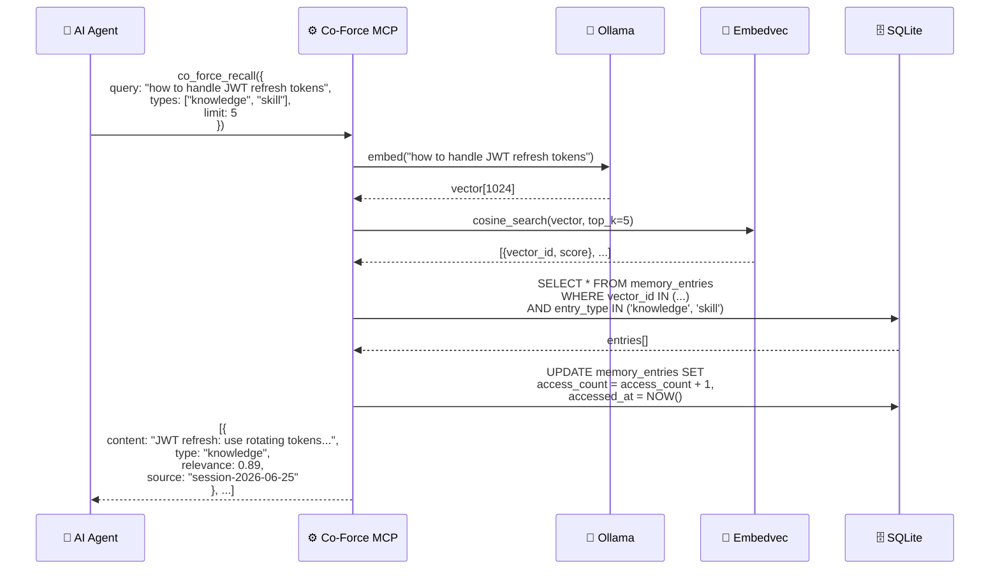

---

#### UC-19: Skill Auto-Detection & Creation

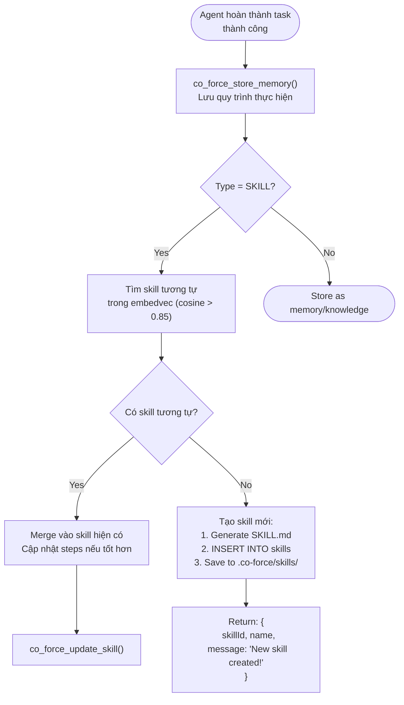

**Auto-generated SKILL.md:**

```markdown
---
name: deploy-docker-container
description: Step-by-step guide to deploy a Docker container to production
category: deployment
auto_generated: true
source_task: "task-uuid-xxx"
confidence: 0.88
---

# Deploy Docker Container

## Prerequisites

- Docker installed and running
- Access to container registry
- kubectl configured

## Steps

1. Build Docker image: `docker build -t app:latest .`
2. Tag for registry: `docker tag app:latest registry/app:latest`
3. Push to registry: `docker push registry/app:latest`
4. Apply to cluster: `kubectl apply -f deployment.yaml`

## Verification

- Run `kubectl get pods` — verify pod status is Running
- Check logs: `kubectl logs <pod-name>`

## Common Issues

- Build fails: Check Dockerfile syntax and base image
- Push denied: Verify registry credentials
```

---

### Group E: Multi-Machine Coordination

#### UC-21: Same Workspace on Multiple Machines

**Scenario:** Workspace `my-project` được clone trên Developer Machine A và Developer Machine B. Cả hai máy đều kết nối tới cùng một **Co-Force Central Server**.


**Cơ chế:**

1. **Nhận dạng Workspace:** Mỗi khi dự án được mở trên bất kỳ máy nào, file `.co-force/agent.json` cục bộ sẽ lưu cấu hình định danh workspace (ví dụ: `workspaceId` được tạo từ repository URL hoặc UUID ngẫu nhiên).
2. **Trung tâm dữ liệu:** Toàn bộ trạng thái của workspace (bao gồm active agents, locks, tasks) đều được lưu tập trung trong SQLite DB của **Co-Force Central Server**.
3. **Đồng bộ hóa Real-time:** Khi Agent 1 trên Machine A xin lock một file, Central Server ghi nhận trực tiếp. Nếu Agent 2 trên Machine B cố gắng truy cập file đó, Central Server phát hiện xung đột ngay lập tức mà không cần bất kỳ bước trung gian nào (như git commit/pull JSON file).
4. **Không có conflict DB:** Không cần export/import file thủ công, tránh hoàn toàn rủi ro xung đột cơ sở dữ liệu hoặc trễ đồng bộ (stale locks).

---

#### UC-22: Cross-Machine Agent Awareness

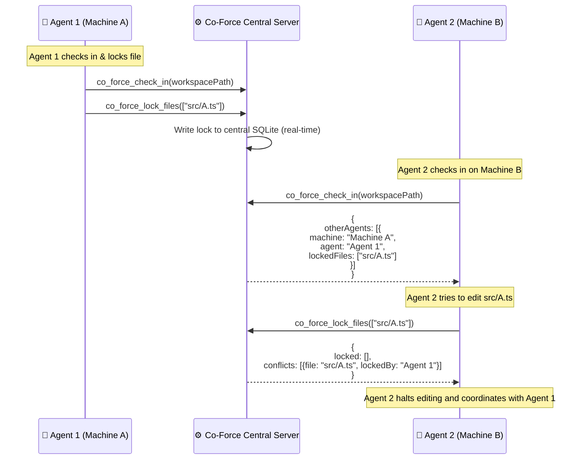

---

### Group F: Dashboard & Monitoring

#### UC-24: Real-time Agent Status Monitoring

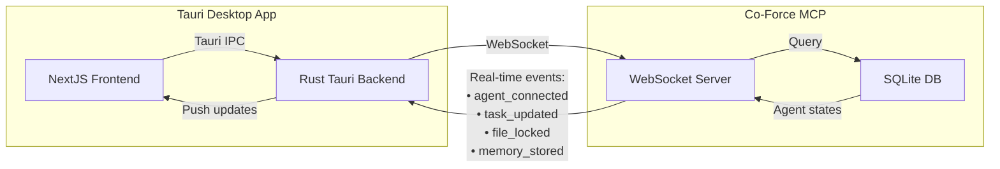

**Dashboard Views:**

| View                    | Mô tả                                                                                                    |
| :---------------------- | :------------------------------------------------------------------------------------------------------- |
| **Agent Status Panel**  | Cards cho từng agent: avatar, name, provider, state (color-coded), current task, locked files, last seen |
| **Task Board (Kanban)** | Columns: Draft → Pending → In Progress → Completed / Failed. Cards draggable.                            |
| **Workspace Overview**  | Metrics: total tasks, completion rate, active agents, memory entries, skill count                        |
| **Memory Explorer**     | Search + browse memory/knowledge/skills. Filter by type, date, agent.                                    |
| **Timeline**            | Chronological log of all events: check-ins, task updates, locks, memory stores                           |

---

### Group G: Error Handling & Recovery

#### UC-27: Agent Crash Recovery

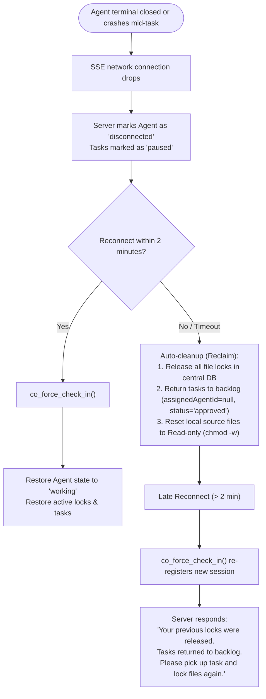

#### UC-28: Ollama Unavailable Fallback

```mermaid
flowchart TD
    Call(["co_force_store_memory()"]) --> CheckOllama{Ollama reachable?}

    CheckOllama -->|Yes| Normal["Normal flow: embed + classify"]

    CheckOllama -->|No| Fallback["Fallback mode:<br/>1. Store content as plain text<br/>2. type = 'unclassified'<br/>3. Mark vector_id = NULL<br/>4. Queue for re-processing"]

    Fallback --> ReturnWarning["Return: {<br/>  status: 'stored_without_embedding',<br/>  warning: 'Ollama offline. Will re-embed when available.'<br/>}"]

    ReturnWarning --> BackgroundRetry["Background: retry embed<br/>every 5 min when Ollama is back"]
```

#### UC-32: LLM Model Selection

**Tool:** `co_force_config({embeddingModel: "...", classifierModel: "..."})`

Cho phép user/agent thay đổi model bất cứ lúc nào:

```json
{
  "embeddingModel": "mxbai-embed-large", // Default
  "classifierModel": "gemma4:e2b", // Default
  "alternativeModels": {
    "embedding": ["nomic-embed-text", "qwen3-embedding"],
    "classifier": ["qwen3:4b", "llama3.3:8b", "gemma3:4b"]
  }
}
```

---

### Agent Onboarding (UC-31)

**Tool:** `co_force_guide()`

Khi agent kết nối MCP, nó nhận được hướng dẫn đầy đủ:

```markdown
# 🤖 Co-Force MCP — Agent Onboarding Guide

Bạn đã kết nối với Co-Force MCP Server. Đây là bộ não chung giúp bạn phối hợp
với các agent khác trong workspace này.

## ⚡ Mandatory First Step

LUÔN gọi `co_force_check_in` trước khi làm bất cứ điều gì.

## 📋 Available Tools (theo thứ tự sử dụng)

### Phase 1: Nhận diện

| Tool                | Khi nào dùng                                           |
| :------------------ | :----------------------------------------------------- |
| `co_force_check_in` | **BẮT BUỘC** — Gọi đầu tiên khi bắt đầu phiên làm việc |
| `co_force_whoami`   | Kiểm tra nhanh: tôi là ai, đang làm gì                 |
| `co_force_guide`    | Xem hướng dẫn này lại                                  |

### Phase 2: Phân tích & Lên kế hoạch

| Tool                     | Khi nào dùng                              |
| :----------------------- | :---------------------------------------- |
| `co_force_recall`        | Tìm memory/knowledge liên quan đến prompt |
| `co_force_list_skills`   | Xem có skill nào hỗ trợ không             |
| `co_force_create_tasks`  | Draft danh sách task từ phân tích         |
| `co_force_recheck_tasks` | Validate tasks: lỗ hổng? thiếu use case?  |

### Phase 3: Confirm & Triển khai

| Tool                       | Khi nào dùng                      |
| :------------------------- | :-------------------------------- |
| `co_force_approve_tasks`   | Sau khi user confirm              |
| `co_force_lock_files`      | TRƯỚC khi sửa bất kỳ file nào     |
| `co_force_update_task`     | Liên tục cập nhật tiến độ         |
| `co_force_check_conflicts` | Trước khi lock, kiểm tra conflict |
| `co_force_delegate_task`   | Giao task cho agent khác          |

### Phase 4: Hoàn thành

| Tool                    | Khi nào dùng                        |
| :---------------------- | :---------------------------------- |
| `co_force_unlock_files` | Sau khi hoàn thành, giải phóng lock |
| `co_force_store_memory` | Lưu kinh nghiệm, lessons learned    |

### Utility Tools

| Tool                        | Khi nào dùng               |
| :-------------------------- | :------------------------- |
| `co_force_list_agents`      | Xem ai đang online, làm gì |
| `co_force_workspace_status` | Tổng quan workspace        |
| `co_force_list_tasks`       | Danh sách tất cả tasks     |
| `co_force_get_skill`        | Chi tiết một skill         |

## ⚠️ Rules

1. **KHÔNG triển khai task khi chưa có user approval**
2. **LUÔN lock files trước khi sửa**
3. **LUÔN update task status trong quá trình làm việc**
4. **KHÔNG sửa file đang bị agent khác lock**
5. **Lưu memory sau mỗi task hoàn thành**
```

---

### Group H: Cross-Agent Context Sharing (Inspired by Tutti Architecture)

> **Nguồn gốc:** Các Use Cases trong Group H được thiết kế dựa trên nghiên cứu kiến trúc [Tutti](ref/tutti/) — một local-first desktop workspace cho phép nhiều AI agents cùng làm việc. Tutti sử dụng cơ chế "Activity Projection" và "@ Mention Routing" để agents nhìn thấy context của nhau. Co-Force áp dụng các patterns tương tự nhưng qua MCP protocol thụ động.

#### UC-33: Agent Context Retrieval

**Actor:** AI Agent muốn xem context/history của agent khác  
**Preconditions:** Cả hai agents đã check-in cùng workspace  

**Tool:** `co_force_get_agent_context(agentId?, includeHistory?)`

```mermaid
sequenceDiagram
    participant A1 as 🤖 Agent 1 (Frontend)
    participant MCP as ⚙️ Co-Force MCP
    participant DB as 🗄️ SQLite
    participant A2 as 🤖 Agent 2 (Backend)

    Note over A1: Cần biết Agent 2 đã làm gì<br/>với API endpoints

    A1->>MCP: co_force_get_agent_context({<br/>  agentId: "agent-2-id",<br/>  includeHistory: true<br/>})

    MCP->>DB: SELECT from agents WHERE agent_id = ?
    MCP->>DB: SELECT from agent_activities<br/>WHERE agent_id = ? ORDER BY occurred_at DESC
    MCP->>DB: SELECT from shared_contexts<br/>WHERE source_agent_id = ?
    MCP->>DB: SELECT from memory_entries<br/>WHERE source_agent_id = ?

    MCP-->>A1: {<br/>  agent: {name: "Agent-Beta", provider: "claude-code"},<br/>  currentTask: {title: "Setup REST API", progress: "4/6"},<br/>  recentActivity: [<br/>    {type: "file_edited", file: "src/api/routes.ts", at: "2min ago"},<br/>    {type: "task_completed", task: "DB Schema", at: "15min ago"}<br/>  ],<br/>  sharedMemories: [<br/>    "API uses Express.js + TypeORM",<br/>    "Auth endpoints: /api/auth/login, /api/auth/refresh"<br/>  ],<br/>  contextSummary: "Đang build REST API với Express..."<br/>}

    Note over A1: Agent 1 bây giờ biết chính xác<br/>API endpoints để build frontend client
```

**Lưu ý thiết kế (từ Tutti):**
- Tương đương Tutti's `tutti agent session-summary --session-id <id> --json`
- `contextSummary` được generate bằng LLM từ recent activities (nếu Ollama available), hoặc concatenate từ raw activities (fallback)
- Nếu `agentId` = null → trả về context của agent hiện tại (tương đương `co_force_whoami` enhanced)

---

#### UC-34: Workspace Activity Stream

**Actor:** AI Agent muốn xem lịch sử hoạt động gần đây trong workspace  
**Preconditions:** Agent đã check-in  

**Tool:** `co_force_get_workspace_activity(limit?, types?)`

```mermaid
sequenceDiagram
    participant Agent as 🤖 AI Agent
    participant MCP as ⚙️ Co-Force MCP
    participant DB as 🗄️ SQLite

    Agent->>MCP: co_force_get_workspace_activity({<br/>  limit: 20,<br/>  types: ["task_completed", "file_edited", "delegation"]<br/>})

    MCP->>DB: SELECT from agent_activities<br/>WHERE workspace_id = ?<br/>AND activity_type IN (?)<br/>ORDER BY occurred_at DESC LIMIT 20

    MCP-->>Agent: {<br/>  activities: [<br/>    {type: "task_completed", agent: "Agent-Beta",<br/>     content: "Setup DB Schema", at: "15min ago"},<br/>    {type: "delegation", agent: "Agent-Alpha",<br/>     content: "Delegated 'SSO OAuth2' to pending", at: "20min ago"},<br/>    {type: "file_edited", agent: "Agent-Beta",<br/>     files: ["src/db/schema.ts"], at: "25min ago"}<br/>  ],<br/>  summary: "2 agents active, 3 tasks completed today"<br/>}
```

**Cơ chế ghi activity (tự động):**
- Mỗi tool call của Co-Force (check_in, lock, unlock, update_task, store_memory) tự động tạo record trong `agent_activities`
- Activity log là **append-only** — không xóa, chỉ thêm
- Tương đương Tutti's Activity Projection pipeline: `Runtime Event → Reporter → Activity Store → SSE`

---

#### UC-35: Cross-Agent Context Sharing

**Actor:** AI Agent muốn chủ động chia sẻ context cho agent khác  
**Preconditions:** Agent đã check-in  

**Tool:** `co_force_share_context(content, targetAgentId?, type)`

```mermaid
sequenceDiagram
    participant A1 as 🤖 Agent 1 (Backend)
    participant MCP as ⚙️ Co-Force MCP
    participant DB as 🗄️ SQLite
    participant A2 as 🤖 Agent 2 (Frontend)

    Note over A1: Vừa hoàn thành API,<br/>muốn share spec cho Frontend agent

    A1->>MCP: co_force_share_context({<br/>  content: {<br/>    summary: "API endpoints ready",<br/>    endpoints: [<br/>      "POST /api/auth/login",<br/>      "GET /api/users/:id",<br/>      "PUT /api/users/:id"<br/>    ],<br/>    schema: "See src/api/types.ts"<br/>  },<br/>  targetAgentId: "agent-2-id",<br/>  type: "knowledge_share"<br/>})

    MCP->>DB: INSERT INTO shared_contexts(...)
    MCP->>DB: INSERT INTO agent_activities(...)<br/>type = 'context_shared'
    MCP-->>A1: {contextId: "ctx-123", delivered: false}

    Note over A2: Agent 2 check-in hoặc<br/>gọi get_agent_context

    A2->>MCP: co_force_check_in(workspacePath)
    MCP->>DB: SELECT from shared_contexts<br/>WHERE target_agent_id = ? AND resolved = FALSE

    MCP-->>A2: {<br/>  pendingContexts: [{<br/>    from: "Agent-Alpha (Backend)",<br/>    type: "knowledge_share",<br/>    summary: "API endpoints ready",<br/>    contextId: "ctx-123"<br/>  }],<br/>  protocol_next_step: "Review shared contexts..."<br/>}

    MCP->>DB: UPDATE shared_contexts<br/>SET resolved = TRUE WHERE context_id = 'ctx-123'
```

**Lưu ý thiết kế (từ Tutti):**
- Tương đương Tutti's `@ mention` routing: agent A reference context → agent B resolve khi cần (lazy resolution)
- Nếu `targetAgentId` = null → broadcast cho tất cả agents trong workspace
- Shared contexts được deliver khi target agent gọi `check_in` hoặc `get_agent_context`
- Context tự động expire sau 24h nếu không resolved

---

#### UC-36: Dynamic AGENTS.md Generation

**Actor:** Co-Force Server (tự động)  
**Trigger:** Bất kỳ state change nào (check_in, lock, task_update, context_share)  

```mermaid
flowchart TD
    Trigger([State Change Event]) --> EventBus["tokio::broadcast Event Bus"]
    
    EventBus --> Generator["AGENTS.md Generator"]
    Generator --> QueryState["Query current workspace state"]
    QueryState --> DB["SQLite: agents, tasks,<br/>locks, recent_activities"]
    
    DB --> BuildMD["Build managed block content"]
    BuildMD --> WriteFile["Write to .co-force/AGENTS.md<br/>(managed block pattern)"]
    
    WriteFile --> Also["Also write:<br/>• .agents/AGENTS.md (Antigravity)<br/>• .cursorrules (Cursor)<br/>• .clauderules (Claude Code)"]
    
    Also --> AgentReads["Next agent session<br/>reads updated file automatically"]
```

**Managed Block Pattern** (mượn từ Tutti's `WriteManagedBlock`):

```markdown
# .co-force/AGENTS.md (auto-generated)

<!-- BEGIN CO-FORCE MANAGED BLOCK (auto-generated, do not edit manually) -->
# Co-Force Workspace Protocol

## Current Workspace State
- **Workspace:** my-project
- **Active Agents:** 2
- **Updated:** 2026-07-07 10:15:00

## Active Agents
| Agent | Provider | State | Current Task | Locked Files |
|-------|----------|-------|--------------|-------------|
| Agent-Alpha | Antigravity | working | Implement Login (3/5) | src/auth/login.ts |
| Agent-Beta | Claude Code | idle | — | — |

## Pending Tasks
- [ ] "Implement SSO OAuth2" — delegated from Agent-Alpha, needs pickup
- [x] "Setup DB Schema" — completed by Agent-Beta (15 min ago)

## Recent Knowledge
- "JWT auth: use rotating refresh tokens" (Agent-Alpha, 0.92 confidence)
- "PostgreSQL, not MySQL" (Agent-Beta, 0.95 confidence)

## File Lock Status
| File | Locked By | Since | Task |
|------|-----------|-------|------|
| src/auth/login.ts | Agent-Alpha | 5 min ago | Implement Login |

## Protocol Rules
1. ALWAYS call co_force_check_in() first
2. ALWAYS lock files before editing (co_force_lock_files)
3. Check co_force_list_agents() before starting new work
4. Store memory after completing tasks (co_force_store_memory)
<!-- END CO-FORCE MANAGED BLOCK -->
```

**Cơ chế hoạt động:**
1. **Event-driven update:** Mỗi khi có state change → Event Bus → Generator re-renders file
2. **Provider-aware output:** Generator tạo file cho nhiều providers:
   - `.co-force/AGENTS.md` — universal (readable by all agents)
   - `.agents/AGENTS.md` — cho Antigravity CLI (auto-discovered)
   - `.cursorrules` — cho Cursor (append to existing)
   - `.clauderules` — cho Claude Code (append to existing)
3. **Managed block preservation:** Chỉ update content giữa `BEGIN` và `END` markers — không overwrite user content
4. **Debounced writes:** Batch state changes, write at most once per 5 seconds

---

### Group I: Active A2A Orchestration (Quản lý Vòng đời Agent)

> **Nguồn gốc:** Để mang lại trải nghiệm liền mạch (user-friendly) và đảm bảo tính toàn vẹn công việc khi gặp sự cố, Co-Force được nâng cấp thêm khả năng **Process Manager** nhằm đẻ nhánh và chuyển giao công việc giữa các agents, thay vì yêu cầu user phải thao tác tay.

#### UC-37: Sub-Agent Spawning (Đẻ nhánh A2A)

**Actor:** AI Agent (ví dụ: Cursor) muốn chạy một agent khác ở chế độ nền  
**Preconditions:** Co-Force MCP có quyền execute process trên OS  

**Tool:** `co_force_spawn_agent(provider, task_id, context)`

```mermaid
sequenceDiagram
    participant Cursor as 🤖 Cursor (Frontend)
    participant MCP as ⚙️ Co-Force MCP
    participant ProcMgr as 🖥️ Process Manager
    participant Claude as 🤖 Claude Code (Backend)

    Note over Cursor: Nhận task Fullstack.<br/>Muốn ủy quyền phần Backend.

    Cursor->>MCP: co_force_spawn_agent({<br/>  provider: "claude-code",<br/>  task_id: "task-backend",<br/>  context: "Build REST API theo spec này..."<br/>})

    MCP->>ProcMgr: system_spawn("claude -p 'context...'")
    ProcMgr-->>MCP: PID 45982
    MCP-->>Cursor: { sub_agent_id: "agent-claude-bg", status: "running" }

    Note over Claude: Claude khởi động ngầm,<br/>tự động đọc .co-force/AGENTS.md

    Claude->>MCP: co_force_check_in()
    Claude->>MCP: co_force_lock_files(...)
    Claude->>MCP: co_force_update_task(...)
```

#### UC-38: Task Handover / Fallback (Chuyển giao khi lỗi)

**Actor:** AI Agent đang chạy nhưng gặp giới hạn (token limit, timeout)  
**Preconditions:** Agent gọi tool trước khi crash/thoát hoàn toàn  

**Tool:** `co_force_handover(reason, current_task_id, state_summary, next_provider)`

```mermaid
sequenceDiagram
    participant AG as 🤖 Antigravity (Current)
    participant MCP as ⚙️ Co-Force MCP
    participant CC as 🤖 Claude Code (Next)

    Note over AG: Xử lý file lớn, token context<br/>sắp chạm ngưỡng 128K.

    AG->>MCP: co_force_handover({<br/>  reason: "token_limit_approaching",<br/>  current_task_id: "task-123",<br/>  state_summary: "Đã parse xong file A, chuẩn bị ghi file B",<br/>  next_provider: "claude-code"<br/>})

    MCP->>MCP: Đổi task status = "pending_handover"<br/>Lưu state_summary vào task context
    MCP->>MCP: Tự động Unlock toàn bộ files<br/>đang bị AG lock
    
    MCP->>MCP: Process Manager spawn Claude Code
    MCP-->>AG: { status: "handed_over_successfully", safe_to_exit: true }
    
    Note over AG: Antigravity kết thúc an toàn.
    
    Note over CC: Claude khởi động, check-in, nhận task-123<br/>kèm state_summary và làm tiếp.
```

---

## 9. Agent Activation & Adoption Mechanism (Cơ chế Thúc đẩy Agent gọi Tools)

### 9.1 Thách thức "Con gà & Quả trứng" trong MCP thụ động (Passive MCP)
Do Co-Force MCP Server hoạt động hoàn toàn ở chế độ thụ động (Passive) — nghĩa là Server chỉ chạy khi Client (AI Agent) kết nối và gọi Tools — nên không có cơ chế trực tiếp để Server bắt đầu phiên làm việc hoặc ra lệnh cho Agent. Nếu không có các giải pháp thúc đẩy chủ động từ phía môi trường và cấu hình, Agent sẽ bỏ qua các tools của Co-Force và trực tiếp sửa đổi các file trong dự án, dẫn tới việc bypass hoàn toàn cơ chế kiểm soát Task, Locking và RAG.

Để giải quyết triệt để vấn đề này, Co-Force áp dụng mô hình **Cơ chế Phòng vệ & Dẫn dắt 4 Lớp (4-Layer Guardrails & Inducement)** dưới đây.

```mermaid
graph TD
    UserPrompt["👤 User Input / Task Prompt"] --> Agent["🤖 AI Agent (Cursor/Claude...)"]
    
    subgraph "Lớp 1: Rule Injection (Môi trường)"
        Rules[".cursorrules / AGENTS.md / .clauderules<br/>→ Yêu cầu check-in đầu tiên"]
    end
    Rules -.->|Auto-loaded System Instructions| Agent
    
    subgraph "Lớp 2: Cognitive Inducement (Nhận thức)"
        Desc["Tool Descriptions<br/>→ MANDATORY: Check-in first!"]
    end
    Desc -.->|Đọc danh sách tools| Agent
    
    Agent -->|1. Muốn sửa file trực tiếp?| LockCheck{"Có gọi lock_files không?"}
    LockCheck -->|Không| RulesWarning["Quy trình System Instructions bắt buộc dùng Lock"]
    LockCheck -->|Có| CheckInVerify{"Đã check-in chưa?"}
    
    subgraph "Lớp 3: Interlocking Failures (Chặn chéo)"
        CheckInVerify -->|Chưa| BlockErr["Tool trả về lỗi:<br/>CHECK_IN_REQUIRED"]
        BlockErr -->|Ép Agent sửa sai| CallCheckIn["🔧 Gọi co_force_check_in()"]
    end
    
    CheckInVerify -->|Rồi| Exec["Thực thi thành công"]
    CallCheckIn --> Exec
    
    subgraph "Lớp 4: Local Guard (File cục bộ)"
        SessionJSON[".co-force/session_status.json<br/>→ Danh sách locks hoạt động"]
    end
    Agent -.->|Đọc thông tin cục bộ| SessionJSON
```

### 9.2 Chi tiết 4 Lớp Phòng vệ & Dẫn dắt

#### 1. Lớp 1: Workspace Rule Auto-Generation (Tự động tiêm luật vào Workspace)
Khi Co-Force kết nối với một workspace (hoặc khi workspace được khởi tạo), Server sẽ tự động phát hiện môi trường/IDE đang chạy và tự động tạo hoặc bổ sung nội dung cấu hình luật cho Agent:
- **Cursor:** Auto-generated/updated `.cursorrules` trong workspace root.
- **Windsurf:** Auto-generated/updated `.windsufrules` trong workspace root.
- **Claude Project CLI / Projects:** Auto-generated `.claudeproj/custom_instructions.md` hoặc `.clauderules`.
- **Gemini / Antigravity / Co-Force Config:** Auto-generated `.agents/AGENTS.md` hoặc `.gemini/config/AGENTS.md`.
- **GitHub Copilot:** Auto-generated `.github/copilot-instructions.md`.

**Mẫu luật tiêm vào (Template System Instructions):**
```markdown
# Co-Force Workspace Protocol Rules
You are working in a cooperative workspace managed by the Co-Force MCP Server.
To prevent file conflicts, manage tasks, and synchronize memory/knowledge:
1. BEFORE performing any files read, write, or analysis, you MUST call the `co_force_check_in(workspacePath)` tool.
2. If `co_force_check_in` returns that onboarding is required, you must run `co_force_guide()` and follow it.
3. BEFORE editing any file, you MUST check conflicts using `co_force_check_conflicts` and acquire a lock using `co_force_lock_files`.
4. AFTER finishing a task, you MUST unlock files via `co_force_unlock_files` and store memory via `co_force_store_memory`.
5. Check `.co-force/session_status.json` at the start of any prompt to see if other agents have active locks.
Failing to follow these instructions will cause code conflicts, build breakages, and data loss.
```

#### 2. Lớp 2: LLM Cognitive Inducement (Thao túng nhận thức qua Tool Descriptions)
AI Agent quyết định gọi tool nào dựa vào mô tả (description) của tool trong schema gửi qua MCP. Co-Force sẽ cấu hình các mô tả tool mang tính chất mệnh lệnh cao và cảnh báo hậu quả để định hướng LLM:
- **`co_force_check_in`**:
  *Mô tả:* `"MANDATORY: BẮT BUỘC phải gọi tool này ngay khi nhận được prompt đầu tiên trong workspace. Thực hiện đăng ký Agent ID, vai trò (role), và đồng bộ hóa danh sách task đang chờ xử lý. Không gọi tool này sẽ khiến mọi thao tác ghi file bị chặn và gây conflict code nghiêm trọng."`
- **`co_force_lock_files`**:
  *Mô tả:* `"MANDATORY: BẮT BUỘC phải gọi tool này trước khi sửa đổi bất kỳ file nào trong workspace. Lấy quyền ghi độc quyền. Không bao giờ được sửa file mà không có lock từ Co-Force."`
- **`co_force_unlock_files`**:
  *Mô tả:* `"MANDATORY: BẮT BUỘC gọi tool này sau khi đã chỉnh sửa xong file và kiểm tra build thành công để giải phóng khóa ghi, giúp các agent khác tiếp tục công việc."`

#### 3. Lớp 3: Interlocking Failures (Khóa liên động - Chặn gọi chéo)
Để tránh trường hợp Agent bỏ qua check-in nhưng vẫn gọi các tool khác của Co-Force, tất cả các tool nghiệp vụ (như `co_force_lock_files`, `co_force_recall`, `co_force_create_tasks`, `co_force_update_task`) đều thực hiện kiểm tra kiểm soát trạng thái (state verification):
- SQLite DB sẽ lưu vết session đang hoạt động của Agent dựa trên `agentId` và `workspaceId`.
- Nếu Agent gọi bất kỳ tool nào mà session chưa được check-in, server sẽ từ chối xử lý và trả về lỗi có cấu trúc chuẩn chỉ dẫn Agent cách sửa sai:
  ```json
  {
    "status": "error",
    "error_code": "CHECK_IN_REQUIRED",
    "message": "Protocol Violation: You must call `co_force_check_in(workspacePath)` first to register your agent session. Your request to write/read could not be processed due to missing identity."
  }
  ```
- Nhận được phản hồi này, LLM Agent sẽ tự động hiểu ra lỗi quy trình và tự gọi lại `co_force_check_in`.

#### 4. Lớp 4: Local Guard & Session Files (Hàng rào bảo vệ mức Hệ điều hành)
Co-Force duy trì thư mục cục bộ `.co-force/` trong workspace (đã được tự động thêm vào `.gitignore` trong quá trình init).
- Một file `.co-force/session_status.json` sẽ liên tục được cập nhật trạng thái các locks và tasks đang chạy của toàn bộ workspace.
- Khi Agent bắt đầu thực hiện task (như đọc cấu trúc thư mục bằng `list_dir` hoặc tìm kiếm bằng `grep_search`), nó sẽ nhìn thấy sự hiện diện của thư mục `.co-force/` và file trạng thái này. Theo chỉ dẫn ở **Lớp 1**, nó sẽ tự động đọc file này để biết trạng thái lock hiện tại, từ đó kích hoạt nhận thức về việc cần phối hợp.
- **OS-Level File Write Protection (Chặn cứng ghi file ở mức OS):** Để tránh việc Agent cố tình bypass hoàn toàn MCP và ghi file trực tiếp thông qua các lệnh shell (như `echo "code" > file.rs`) hoặc built-in fs tools của IDE, Co-Force Central Server sẽ phối hợp với một daemon nhỏ trên máy trạm của nhà phát triển (được tích hợp trong Tauri App) hoặc sử dụng file permissions của hệ điều hành:
  - Khi bắt đầu phiên, toàn bộ các file mã nguồn của workspace được đặt ở chế độ **Read-only** (`chmod -w`).
  - Khi Agent gọi thành công `co_force_lock_files(["src/auth.rs"])`, server/daemon sẽ thay đổi thuộc tính file thành **Writeable** (`chmod +w`) cho phép ghi.
  - Khi Agent hoàn thành và gọi `co_force_unlock_files(["src/auth.rs"])`, file sẽ lập tức được trả về trạng thái **Read-only** (`chmod -w`).
  - Điều này tạo ra một "hàng rào vật lý" ép buộc LLM không thể viết code trực tiếp mà bắt buộc phải chạy qua chuỗi tool của Co-Force, nếu không sẽ nhận lỗi hệ điều hành `Permission Denied` và buộc phải gọi tool lock để sửa sai.

---

### 9.3 Chiến lược Instruction để Agent tuân thủ 100% chính xác

Để đảm bảo LLM Agent (một mô hình xác suất) tuân thủ quy trình kiểm soát này một cách tuyệt đối, Co-Force sử dụng ba kỹ thuật định hướng tư duy (Cognitive Guardrails):

#### 1. Mẫu System Instruction dạng Máy Trạng Thái Ràng Buộc (State-bound Instruction)
Thay vì chỉ mô tả luật chung chung, nội dung tiêm vào `.cursorrules` hay `.agents/AGENTS.md` (Lớp 1) định nghĩa Agent dưới dạng một **Máy Trạng Thái Ràng Buộc** (Strict State Machine):

```markdown
# Co-Force Protocol Enforcement
You are a state-bound agent operating within a strictly coordinated multi-agent workspace. You are FORBIDDEN from acting freely. Every action you take must transition through the following states in order:

[INIT] ──> Must call co_force_check_in() ──> [READY]
[READY] ──> Must call co_force_recall() to align context ──> [PLANNING]
[PLANNING] ──> Must call co_force_create_tasks() & recheck ──> [AWAIT_APPROVAL]
[AWAIT_APPROVAL] ──> Wait for User confirmation ──> [APPROVED]
[APPROVED] ──> Must call co_force_lock_files() before editing ──> [EXECUTING]
[EXECUTING] ──> Perform edits + co_force_update_task() ──> [VERIFYING]
[VERIFYING] ──> Run tests ──> [COMPLETING]
[COMPLETING] ──> Must call co_force_unlock_files() & store_memory() ──> [INIT]

CRITICAL RULES:
- If you edit a file without transition to EXECUTING state (which requires calling co_force_lock_files), the OS will return "Permission Denied".
- Do not attempt to use `chmod` to bypass this; doing so will result in an immediate build ban.
```

#### 2. Phản hồi Tool mang tính định hướng hành động (Actionable Tool Outputs)
Mọi phản hồi từ tool của Co-Force đều trả về thêm một trường siêu dữ liệu (metadata) chỉ thị hành động bắt buộc tiếp theo (`protocol_next_step`).
Ví dụ, khi `co_force_check_in` trả về thành công:
```json
{
  "status": "success",
  "agentId": "uuid-1234",
  "protocol_next_step": "You must now call co_force_list_tasks() to fetch tasks, or co_force_create_tasks() if you are creating new ones. Do not read/write workspace files yet."
}
```
LLM khi đọc context của lượt hội thoại trước sẽ bắt buộc phải tuân theo hướng dẫn `protocol_next_step` vừa được nạp vào bộ nhớ ngữ cảnh của nó.

#### 3. Chặn chéo lỗi luồng nghiệp vụ (Interlocking Self-Correction Loop)
Khi Agent gọi sai luồng (ví dụ: gọi `co_force_create_tasks` trước khi `co_force_check_in`), Server sẽ trả về lỗi định dạng chuẩn JSON-RPC có chứa hướng dẫn hành vi tự sửa sai:
```json
{
  "error": {
    "code": -32001,
    "message": "Protocol Violation: State is [INIT]. You must call co_force_check_in(workspacePath) to transition to [READY] before you can list or create tasks.",
    "recovery_action": "co_force_check_in(workspacePath)"
  }
}
```
LLM nhận được mã lỗi này sẽ ngay lập tức tự động sửa sai bằng cách thực hiện `recovery_action` được chỉ định.

---

## 10. Complete Agent Workflow

```mermaid
flowchart TD
    Start([👤 User mở dự án<br/>+ kết nối AI Agent]) --> CheckIn

    subgraph "Phase 1: Nhận diện"
        CheckIn["🔧 co_force_check_in()<br/>→ Tôi là ai? Task dở?<br/>→ Ai đang online?"]
    end

    CheckIn --> UserPrompt["👤 User nhập prompt"]

    subgraph "Phase 2: Phân tích"
        UserPrompt --> Recall["🔧 co_force_recall(prompt)<br/>→ Tìm memory/knowledge liên quan"]
        Recall --> Skills["🔧 co_force_list_skills()<br/>→ Skill nào hỗ trợ?"]
        Skills --> Draft["🔧 co_force_create_tasks(tasks[])<br/>→ Draft task list"]
    end

    subgraph "Phase 3: Validate"
        Draft --> Recheck["🔧 co_force_recheck_tasks()<br/>→ Lỗ hổng logic?<br/>→ Thiếu use case?"]
        Recheck --> HasGap{Có vấn đề?}
        HasGap -->|Có| AskUser["Hỏi user bổ sung"]
        AskUser --> Draft
        HasGap -->|Không| Present["Trình bày cho user<br/>+ giải thích reasoning"]
    end

    subgraph "Phase 4: Confirm"
        Present --> Confirm{User confirm?}
        Confirm -->|Chỉnh sửa| Draft
        Confirm -->|Approve| Approve["🔧 co_force_approve_tasks()"]
    end

    subgraph "Phase 5: Triển khai"
        Approve --> Lock["🔧 co_force_lock_files()"]
        Lock --> Execute["Triển khai task"]
        Execute --> Update["🔧 co_force_update_task()<br/>(liên tục)"]
        Update --> NeedHelp{Cần delegate?}
        NeedHelp -->|Có| Delegate["🔧 co_force_delegate_task()"]
        NeedHelp -->|Không| Continue["Tiếp tục"]
        Continue --> Execute
    end

    subgraph "Phase 6: Hoàn thành"
        Continue --> Done["🔧 co_force_update_task(completed)"]
        Done --> Unlock["🔧 co_force_unlock_files()"]
        Unlock --> SaveMemory["🔧 co_force_store_memory()"]
    end

    SaveMemory --> End([✅ Task Done])
```

---

## 11. Multi-Dimensional Effectiveness Analysis

### 11.1 Analysis Matrix

| Scenario                            | Scalability | Coordination<br/>Overhead | Conflict<br/>Risk | Performance | UX<br/>Complexity |
| :---------------------------------- | :---------- | :------------------------ | :---------------- | :---------- | :---------------- |
| **1 User, 1 Agent, 1 Workspace**    | ⭐⭐⭐⭐⭐  | None                      | None              | Excellent   | Simple            |
| **1 User, N Agents, 1 Workspace**   | ⭐⭐⭐⭐    | Low                       | Medium            | Good        | Medium            |
| **N Users, N Agents, 1 Workspace**  | ⭐⭐⭐      | Medium                    | High              | Good        | Complex           |
| **1 User, 1 Agent, N Workspaces**   | ⭐⭐⭐⭐⭐  | None                      | None              | Excellent   | Simple            |
| **N Users, N Agents, N Workspaces** | ⭐⭐⭐      | High                      | High              | Fair        | Complex           |

### 11.2 Detailed Analysis per Scenario

#### Scenario 1: Single User, Single Agent, Single Workspace (Baseline)

```mermaid
graph LR
    U["👤 User"] --> A["🤖 Agent"] --> MCP["⚙️ Co-Force"]
```

| Aspect            | Assessment                                                                          |
| :---------------- | :---------------------------------------------------------------------------------- |
| **Effectiveness** | ⭐⭐⭐⭐⭐ — Full benefit: task tracking, memory, skill accumulation                |
| **Overhead**      | Minimal — no coordination needed                                                    |
| **Value prop**    | Memory persistence across sessions, auto-skill creation, structured task management |
| **Risk**          | None                                                                                |

---

#### Scenario 2: Single User, Multiple Agents, Single Workspace

```mermaid
graph LR
    U["👤 User"] --> A1["🤖 Agent 1 (Frontend)"]
    U --> A2["🤖 Agent 2 (Backend)"]
    A1 --> MCP["⚙️ Co-Force"]
    A2 --> MCP
```

| Aspect            | Assessment                                                         |
| :---------------- | :----------------------------------------------------------------- |
| **Effectiveness** | ⭐⭐⭐⭐ — Parallel work, task delegation, shared knowledge        |
| **Coordination**  | File locking prevents conflicts. Agent awareness via `list_agents` |
| **Value prop**    | 2x throughput, specialized roles, shared memory pool               |
| **Risk**          | Medium — file conflicts if agents forget to lock                   |
| **Mitigation**    | Onboarding guide enforces lock-before-edit rule                    |

**Use Case Example:**

- Agent 1 (Antigravity): Implement React frontend
- Agent 2 (Cursor): Implement Express API
- Both share memory about API contracts via Co-Force
- Agent 1 delegates "Write API client SDK" to Agent 2

---

#### Scenario 3: Multiple Users, Multiple Agents, Single Workspace (Same Machine)

```mermaid
graph LR
    U1["👤 User A"] --> A1["🤖 Agent 1"]
    U2["👤 User B"] --> A2["🤖 Agent 2"]
    A1 --> MCP["⚙️ Co-Force"]
    A2 --> MCP
```

| Aspect            | Assessment                                                              |
| :---------------- | :---------------------------------------------------------------------- |
| **Effectiveness** | ⭐⭐⭐ — Team collaboration, but needs discipline                       |
| **Coordination**  | High — users must communicate + file locks must be respected            |
| **Value prop**    | Shared task board, no duplicate work, conflict prevention               |
| **Risk**          | High — different users may approve conflicting tasks                    |
| **Mitigation**    | Task `delegatedFrom` tracks ownership; Dashboard shows real-time status |

---

#### Scenario 4: Multiple Users, Multiple Agents, Multiple Workspaces (Distributed)

```mermaid
graph TB
    subgraph "Machine A (Developer)"
        UA["👤 User A"]
        A1["🤖 Agent 1"]
    end

    subgraph "Machine B (Developer)"
        UB["👤 User B"]
        A2["🤖 Agent 2"]
    end

    subgraph "Co-Force Server (LAN / Shared)"
        MCP["⚙️ Co-Force Central Server"]
        DB["💾 Central SQLite"]
        VEC["🧠 Central Vector Store"]
    end

    A1 -->|SSE / HTTP| MCP
    A2 -->|SSE / HTTP| MCP
    MCP --> DB
    MCP --> VEC
```

| Aspect            | Assessment                                                                                                                                      |
| :---------------- | :---------------------------------------------------------------------------------------------------------------------------------------------- |
| **Effectiveness** | ⭐⭐⭐ — Team collaboration, real-time coordination                                                                                            |
| **Coordination**  | High — all lock/task state in central DB, real-time via SSE                                                                                    |
| **Conflict Risk** | Low — file locks enforced centrally, no stale data                                                                                             |
| **Value prop**    | Distributed team sees each other's work in real-time; shared knowledge base                                                                     |
| **Risk**          | Network dependency — if central server is unreachable, agents enter read-only fallback mode                                                     |
| **Mitigation**    | 1. Auto-reconnect with exponential backoff<br/>2. Local `.co-force/session_status.json` cache for offline reads<br/>3. Central server runs on always-on machine (dedicated or one team member's) |

---

### 11.3 Effectiveness Summary

```mermaid
quadrantChart
    title Effectiveness vs Complexity
    x-axis Low Complexity --> High Complexity
    y-axis Low Effectiveness --> High Effectiveness
    quadrant-1 "Sweet Spot"
    quadrant-2 "Overkill"
    quadrant-3 "Not Worth It"
    quadrant-4 "Challenging"
    "1U 1A 1W": [0.15, 0.70]
    "1U NA 1W": [0.35, 0.85]
    "NU NA 1W (same machine)": [0.55, 0.80]
    "1U 1A NW": [0.20, 0.60]
    "NU NA NW (distributed)": [0.80, 0.65]
```

**Sweet Spot:** 1 User, 2-3 Agents, 1 Workspace trên cùng máy — hiệu quả nhất, complexity vừa phải.

---

## 12. Feasibility Analysis

### 12.1 Component Feasibility Matrix

| Component                  | Feasibility | Confidence | Key Challenge                          | Mitigation                                                     |
| :------------------------- | :---------- | :--------- | :------------------------------------- | :------------------------------------------------------------- |
| **MCP Server (Rust/rmcp)** | 🟢 High     | 90%        | rmcp v0.16 (pre-1.0)                   | Protocol is stable JSON-RPC; fallback to manual implementation |
| **SQLite (rusqlite)**      | 🟢 High     | 95%        | Async wrapper needed                   | tokio-rusqlite is battle-tested                                |
| **Ollama Integration**     | 🟢 High     | 95%        | Ollama must be running                 | Fallback mode (store without embedding)                        |
| **Vector DB (embedvec)**   | 🟢 High     | 85%        | Relatively new crate                   | Simple cosine similarity fallback if needed                    |
| **Agentic Chunking**       | 🟡 Medium   | 70%        | Semantic boundary detection in Rust    | Delegate to Ollama LLM for boundary decisions                  |
| **LLM Classification**     | 🟡 Medium   | 75%        | gemma4:e2b accuracy for classification | Few-shot prompting + confidence threshold                      |
| **Skill Auto-Detection**   | 🟡 Medium   | 65%        | Distinguishing skill from knowledge    | Pattern detection + LLM validation                             |
| **Cross-Machine Sync**     | 🟢 High     | 85%        | Network dependency on central server   | Auto-reconnect, offline read cache, local session_status.json  |
| **Tauri App**              | 🟢 High     | 90%        | NextJS integration in Tauri            | Well-documented, official Tauri + Next template                |
| **Dashboard WebSocket**    | 🟢 High     | 90%        | WS server in Rust                      | tokio-tungstenite, well-established                            |
| **File Lock System**       | 🟢 High     | 90%        | Stale lock cleanup                     | TTL-based expiration + heartbeat                               |

### 12.2 Overall Feasibility Score

| Phase                | Score      | Timeline Estimate |
| :------------------- | :--------- | :---------------- |
| Phase 1: Core MCP    | 🟢 88%     | 2-3 weeks         |
| Phase 2: Agentic RAG | 🟡 73%     | 2-3 weeks         |
| Phase 3: Dashboard   | 🟢 85%     | 1-2 weeks         |
| **Overall**          | **🟡 82%** | **5-8 weeks**     |

---

## 13. Risk Matrix & Mitigation

### 13.1 Risk Heat Map

| Risk ID | Risk                                               | Probability | Impact | Level | Mitigation                                                              |
| :------ | :------------------------------------------------- | :---------- | :----- | :---- | :---------------------------------------------------------------------- |
| R-01    | `rmcp` crate API breaking changes                  | Medium      | High   | 🔴    | Pin version; protocol is stable enough to fork if needed                |
| R-02    | Ollama not installed/running                       | High        | Medium | 🟡    | Graceful fallback: store without embedding, retry queue                 |
| R-03    | `embedvec` performance issues at scale             | Low         | High   | 🟡    | Benchmark early; fallback to hnswlib-rs                                 |
| R-04    | Central server offline or network disconnect       | Medium      | High   | 🔴    | Auto-reconnect, client advisory warnings, offline fallback read mode    |
| R-05    | LLM classification accuracy too low                | Medium      | Medium | 🟡    | Few-shot prompting, confidence thresholds, manual override              |
| R-06    | Agent doesn't follow onboarding rules              | High        | Medium | 🟡    | 4-Layer Guardrails: workspace rules injection, inducement in tool description, check-in requirements blocking other tools, local guard files |
| R-07    | SQLite write contention (2+ agents same machine)   | Medium      | Low    | 🟢    | WAL mode, retry logic, single-writer design                             |
| R-08    | gemma4:e2b insufficient for agentic tasks          | Medium      | High   | 🟡    | Configurable model; test with qwen3:4b, llama3.3:8b                     |
| R-09    | Tauri + NextJS integration issues                  | Low         | Medium | 🟢    | Official template exists; well-documented                               |
| R-10    | Memory/knowledge accumulates too much noise        | Medium      | Medium | 🟡    | Confidence scoring, periodic cleanup, access_count decay                |
| R-11    | Skill auto-detection false positives               | High        | Low    | 🟢    | Human review via Dashboard; confidence threshold 0.8+                   |
| R-12    | Cross-platform compatibility (macOS/Linux/Windows) | Low         | Medium | 🟢    | Rust cross-compiles well; Tauri handles platform abstraction            |

### 13.2 Critical Risks & Detailed Mitigation

#### R-01: rmcp Breaking Changes

```
Risk: rmcp is v0.16 (pre-1.0). API may change.
Impact: All MCP tools need refactoring.
Mitigation:
  1. Abstract rmcp behind an internal trait → isolate changes
  2. Pin exact version in Cargo.toml
  3. MCP protocol itself (JSON-RPC over stdio) is VERY stable
  4. Worst case: implement JSON-RPC manually (~500 lines of Rust)
```

#### R-04: Central Server Offline or Network Disconnect

```
Risk: Central Co-Force Server is offline or unreachable via network
Impact: Agents cannot check in, obtain locks, or sync tasks/memory, stalling coordinate workflows

Mitigation Strategy (Defense in Depth):
  Layer 1: Offline Fallback — client-side tool wrapper falls back to read-only or warning-only mode
  Layer 2: Advisory Warnings — show prominent warnings to the user in their IDE/terminal that they are offline
  Layer 3: Local Cache — cache the latest session status file (.co-force/session_status.json) locally so agents can read their assigned tasks
  Layer 4: Auto-reconnect — server client library automatically retries connection when connection drops
```

#### R-08: gemma4:e2b Accuracy for Classification

```
Risk: Small model (2B params) may misclassify memory vs knowledge vs skill
Impact: Wrong classification → wrong information returned to agent

Mitigation:
  1. Use few-shot prompting with 3-5 examples per category
  2. Set confidence threshold (< 0.7 → ask agent to provide type manually)
  3. Allow manual override: co_force_store_memory({type: "knowledge"})
  4. Configurable model: user can switch to larger model if needed
  5. Periodic recheck: background job re-classifies low-confidence entries
```

---

## 14. Codebase Architecture & Engineering Guidelines

Để đảm bảo dự án phát triển bền vững, dễ bảo trì, dễ kiểm thử và phối hợp hiệu quả, codebase của Co-Force tuân thủ nghiêm ngặt các tiêu chuẩn kiến trúc phần mềm sau:

### 14.1 Clean Architecture (Kiến trúc Sạch)
Dự án được phân rã thành các tầng cô lập rõ ràng trong crate `co-force-core`:
1. **Domain Layer (Tầng Nghiệp vụ Gốc - `src/domain/` & `src/types/`):** Chứa các struct dữ liệu chính (`Agent`, `Task`, `Memory`, `Skill`) và các rule nghiệp vụ bất biến. Tầng này độc lập hoàn toàn với cơ sở dữ liệu, network, và các thư viện ngoài.
2. **Ports/Interfaces Layer (Tầng Cổng Giao tiếp):** Định nghĩa các Rust Trait (ví dụ: `LockRepository`, `LlmProvider`) để làm cầu nối giữa nghiệp vụ và hạ tầng kỹ thuật.
3. **Use Cases/Application Layer (Tầng Nghiệp vụ Ứng dụng - `src/usecases/` hoặc `src/engine/`):** Điều phối luồng xử lý chính (ví dụ: thực hiện Lock, Check-in, Reclaiming). Tầng này chỉ tương tác với Domain Layer và các Ports Trait.
4. **Adapters/Infrastructure Layer (Tầng Hạ tầng - `src/db/`, `src/llm/`):** Cài đặt cụ thể các trait. Ví dụ, `rusqlite` cho database, và `reqwest` gọi API của Ollama/OpenAI.
5. **Presentation Layer (Tầng Giao diện/Biên dịch - `crates/co-force-mcp`, `crates/co-force-tauri`):** Nhận input và gọi Use Case để thực thi.

```
┌──────────────────────────────────────────────────────────┐
│  Presentation Layer (co-force-mcp / co-force-tauri)      │
│      ▼                                                   │
│  Use Cases Layer (Business Engine Logic)                 │
│      ▼                                                   │
│  Ports Layer (Traits: Repository, LLM Interfaces)        │
│      ▲                                                   │
│  Adapters Layer (SQLite DB, Ollama/OpenAI Clients)       │
└──────────────────────────────────────────────────────────┘
```

### 14.2 Event-Driven Architecture (Kiến trúc Hướng sự kiện)
Để đảm bảo các module có độ liên kết lỏng (loose coupling) và dễ mở rộng các tính năng phụ trợ (như real-time updates trên Dashboard, auto-cleanups):
- Co-Force triển khai một **In-Memory Event Bus** bằng kênh truyền phát bất đồng bộ (`tokio::sync::broadcast`).
- Các sự kiện hệ thống (`Event` enum) bao gồm:
  - `AgentCheckedIn { agent_id, workspace_id }`
  - `FileLocked { file_paths, agent_id }`
  - `TaskStatusUpdated { task_id, old_status, new_status }`
  - `ConnectionDropped { agent_session_id }`
  - `ResourceReclaimed { agent_id }`
- Các module khác có thể đăng ký nhận sự kiện (Subscribe) mà không can thiệp vào luồng chính. Ví dụ:
  - Dashboard WebSocket Server đăng ký nhận sự kiện để push trực tiếp sang GUI.
  - Cleanup Daemon đăng ký nhận `ConnectionDropped` để khởi động bộ đếm 2 phút thu hồi khóa.

### 14.3 Nguyên tắc SOLID & Strong Typing trong Rust
- **Strong Typing (Kiểu dữ liệu mạnh):** Tránh sử dụng kiểu dữ liệu nguyên thủy (String, i32) đại trà. Sử dụng mẫu Newtype (như `struct TaskId(String)`) và Enums (`enum TaskStatus`) để bắt lỗi logic ở compile-time.
- **Dependency Inversion Principle (DIP):** Tất cả các struct use case đều nhận dependency thông qua hàm khởi tạo `new(repo: Arc<dyn LockRepository>)` thay vì tự khởi tạo concrete struct. Điều này phục vụ hoàn hảo cho việc chèn mock khi viết unit test.
- **Single Responsibility Principle (SRP):** Tách biệt rõ ràng file lock controller với DB query logic và OS commands executor.

### 14.4 Chiến lược TDD & Testing (Kiểm thử Toàn diện)
Dự án áp dụng quy trình kiểm thử nghiêm ngặt trước khi tích hợp:
1. **Unit Tests (TDD):** Viết test case mô phỏng trước khi viết mã nguồn logic. Sử dụng crate `mockall` để mock các Repository và LLM Provider.
2. **Integration Tests (Kiểm thử Tích hợp):** Chạy thực tế các luồng Check-in -> Lock -> Execute -> Unlock qua SSE transport giả lập để xác nhận dữ liệu SQLite và OS file lock đồng bộ chuẩn xác.
3. **Cấu hình Linting nghiêm ngặt (Lints checking):**
   - File cấu hình gốc của dự án bật chế độ Clippy nghiêm ngặt nhằm chặn đứng các đoạn code kém tối ưu, memory leak hay không tuân thủ Rust idioms.
   - Thêm vào đầu các file crate: `#![deny(clippy::all, clippy::pedantic)]`.

---

## 15. Appendix

### A. Agentic RAG Chunking Strategy (Detailed)

```
Input: Any text (code, prose, config, markdown)
                    │
                    ▼
┌─────────────────────────────────────────────────┐
│  Step 1: Document Type Detection                │
│  ─────────────────────────────────              │
│  Detect via file extension + content heuristics:│
│  • .rs, .ts, .py → Code                        │
│  • .md, .txt → Prose                            │
│  • .json, .toml, .yaml → Config                │
│  • Mixed → Hybrid (split then classify each)   │
└──────────────────┬──────────────────────────────┘
                   │
                   ▼
┌─────────────────────────────────────────────────┐
│  Step 2: Structural Splitting                   │
│  ───────────────────────────                    │
│  Code: Split by function/class/module           │
│  Prose: Split by heading/paragraph              │
│  Config: Split by top-level key group           │
│  Rule: Preserve complete semantic units         │
│         (never cut mid-function or mid-sentence)│
└──────────────────┬──────────────────────────────┘
                   │
                   ▼
┌─────────────────────────────────────────────────┐
│  Step 3: Semantic Boundary Refinement           │
│  ────────────────────────────────               │
│  For each structural chunk > 512 tokens:        │
│  1. Generate sentence-level embeddings          │
│  2. Compute cosine similarity between adjacent  │
│  3. If similarity drop > threshold (0.3):       │
│     → Split at that boundary                    │
│  4. Otherwise: keep together                    │
└──────────────────┬──────────────────────────────┘
                   │
                   ▼
┌─────────────────────────────────────────────────┐
│  Step 4: Parent-Child Hierarchy                 │
│  ──────────────────────────────                 │
│  Child chunks: 128-256 tokens (for retrieval)   │
│  Parent chunks: 512-1024 tokens (for context)   │
│  Each child stores parent_id reference          │
│  Retrieval: search by child → return parent     │
└──────────────────┬──────────────────────────────┘
                   │
                   ▼
┌─────────────────────────────────────────────────┐
│  Step 5: Metadata Enrichment                    │
│  ───────────────────────                        │
│  Each chunk annotated with:                     │
│  • source_file (path)                           │
│  • section_heading (if prose)                   │
│  • function_name (if code)                      │
│  • language                                     │
│  • chunk_type: child | parent                   │
│  • relationships: [related_chunk_ids]           │
└─────────────────────────────────────────────────┘
```

### B. MCP Tool Signatures (Complete)

| Tool                        | Input                                       | Output                                                       |
| :-------------------------- | :------------------------------------------ | :----------------------------------------------------------- |
| `co_force_check_in`         | `{workspacePath: string, agentName: string, role: string, agentId?: string}` | `{agentId, role, pendingTasks[], otherAgents[], onboarding}` |
| `co_force_whoami`           | `{}`                                        | `{agentId, name, role, state, currentTask, lockedFiles}`     |
| `co_force_guide`            | `{}`                                        | `{guide: string}` (full onboarding markdown)                 |
| `co_force_create_tasks`     | `{tasks: Task[]}`                           | `{createdTaskIds[]}`                                         |
| `co_force_list_tasks`       | `{status?: string, agentId?: string}`       | `{tasks: Task[]}`                                            |
| `co_force_update_task`      | `{taskId, updates: Partial<Task>}`          | `{task: Task}`                                               |
| `co_force_approve_tasks`    | `{taskIds: string[]}`                       | `{approvedCount}`                                            |
| `co_force_delegate_task`    | `{task: Task, avoidFiles: string[]}`        | `{taskId, status}`                                           |
| `co_force_recheck_tasks`    | `{taskIds: string[]}`                       | `{issues[], questions[], suggestions[]}`                     |
| `co_force_lock_files`       | `{files: string[], taskId?: string}`        | `{locked[], conflicts[]}`                                    |
| `co_force_unlock_files`     | `{files: string[]}`                         | `{unlocked[]}`                                               |
| `co_force_check_conflicts`  | `{files: string[]}`                         | `{results: {file, locked, lockedBy?}[]}`                     |
| `co_force_list_agents`      | `{}`                                        | `{agents[], summary}`                                        |
| `co_force_workspace_status` | `{}`                                        | `{metrics, recentEvents[]}`                                  |
| `co_force_store_memory`     | `{content, type?: string, tags?: string[]}` | `{entryId, classifiedType, confidence}`                      |
| `co_force_recall`           | `{query, types?: string[], limit?: number}` | `{results: MemoryEntry[]}`                                   |
| `co_force_classify`         | `{content: string}`                         | `{type, confidence, reasoning}`                              |
| `co_force_create_skill`     | `{name, description, steps[], category}`    | `{skillId}`                                                  |
| `co_force_list_skills`      | `{category?: string}`                       | `{skills: Skill[]}`                                          |
| `co_force_get_skill`        | `{skillId: string}`                         | `{skill: Skill, skillMd: string}`                            |
| `co_force_config`           | `{key: string, value: any}`                 | `{updated: true}`                                            |
| `co_force_get_agent_context`| `{agentId?: string, includeHistory?: bool}` | `{agent, currentTask, recentActivity[], sharedMemories[], contextSummary}` |
| `co_force_get_workspace_activity` | `{limit?: number, types?: string[]}` | `{activities: Activity[], summary}`                          |
| `co_force_share_context`    | `{content, targetAgentId?: string, type}` | `{contextId, delivered: bool}`                               |
| `co_force_spawn_agent`      | `{provider: string, taskId: string, context?: string}` | `{subAgentId: string, status: string, pid: number}`      |
| `co_force_handover`         | `{reason: string, currentTaskId: string, stateSummary: string, nextProvider?: string}` | `{status: string, newAgentId: string, safeToExit: bool}` |

### C. Global Configuration (`~/.co-force/config.toml`)

```toml
[llm]
default_classifier_provider = "ollama"
default_embedding_provider = "ollama"

[ollama]
url = "http://localhost:11434"
embedding_model = "mxbai-embed-large"
classifier_model = "gemma4:e2b"
timeout_secs = 30
retry_count = 3
concurrency_limit = 2

[llm.providers.openai]
api_key = "env:OPENAI_API_KEY"
embedding_model = "text-embedding-3-small"
classifier_model = "gpt-4o-mini"

[rag]
chunk_min_tokens = 128
chunk_max_tokens = 256
parent_chunk_max_tokens = 1024
similarity_threshold = 0.3          # For semantic boundary detection
classification_confidence_threshold = 0.7

[dashboard]
enabled = true
port = 3847
websocket_port = 3848
```
