# Co-Force — User Requirements Document (URD)

**Version:** 2.1  
**Date:** 2026-07-08  
**Status:** Reviewed — see `docs/review_findings.md`

> [!WARNING]
> **Post-review Note 2026-07-08 (v2):** Several decisions in this document have been updated. In case of conflicts, the order of precedence is: `docs/plans/00_roadmap.md` (Master Plan) → `docs/review_findings.md` §5–6 → `docs/architecture.md` → this document. Key changes include: rmcp 2.x + Streamable HTTP (replacing SSE) · removal of `embedvec` (using vector BLOB in SQLite) · finalized storage layout · chmod file protection is opt-in · **a single end-to-end 1.0 release, no MVP** · **independent server + cloudflared tunnel + auth tokens** (Plan 06) · **Ollama is mandatory on the server, no degraded mode** · **Quality Engine + Bidirectional A2A are the core features** (Plan 07) — the product's goal is agent output quality, not execution speed · **multi-provider CLI subscription-first** (Claude Code / Codex / Antigravity `agy` — Plan 08; references to Claude CLI or "antigravity-cli" in this document should be read as "provider CLI in the Plan 08 registry") · the finalized tool catalog comprises **39 MCP tools** listed in `docs/architecture.md` §6.4 (Appendix B below should only be used to inspect signatures). The file `implementation_instructions.md` was deleted on 2026-07-08 (obsolete guidelines) — developers should follow `docs/plans/01–10`.

---

## 1. Executive Summary

Co-Force is a **multi-purpose MCP Server** that combines a **Passive Coordinator** model for the initial developer agent with an **Active A2A Orchestrator** for managing the lifecycle of sub-agents. It provides a suite of tools for AI agents to self-identify, self-coordinate, and perform **sub-agent spawning** and **task handover** when encountering issues, all through the standard MCP protocol.

**Goal:** Turn every project directory into an intelligent workspace where complex tasks can be divided among multiple AI agents working in parallel automatically (A2A), conflict-free, sharing memory/knowledge, and providing a user-friendly onboarding experience for developers.

**Packaging:** Tauri Desktop App (Rust backend + NextJS frontend), global configuration at `~/.co-force/`.

---

## 2. System Vision & Core Principles

### 2.1 Design Philosophy

```
┌─────────────────────────────────────────────────────────────────────┐
│  Co-Force = "Shared Brain & Coordinator" for AI Agents             │
│                                                                     │
│  ✅ Main agent actively calls tools → Co-Force responds             │
│  ✅ Upon request, Co-Force spawns and manages Sub-Agents           │
│                                                                     │
│  Each tool acts as a "service" that agents can utilize:            │
│    🪪 Identity — "Who am I? What am I doing?"                      │
│    📋 Tasks — "What tasks need doing? Create new tasks."           │
│    🤖 A2A — "Spawn a backend sub-agent to handle this task."       │
│    🔄 Handover — "I've hit my rate limit, hand over to another."   │
│    🔒 Locks — "I'm editing file A, do not modify."                 │
│    🧠 Memory — "Save this learning. Recall that context."          │
│    🛠️ Skills — "Do we know how to deploy via Docker?"              │
│    📊 Status — "Who is online? What is the workspace state?"        │
└─────────────────────────────────────────────────────────────────────┘
```

### 2.2 Core Principles

| #   | Principle                  | Description                                                                     |
| :-- | :------------------------- | :------------------------------------------------------------------------------ |
| P1  | **Active A2A Orchestrator**| Supports Agent-to-Agent (A2A) spawning. Manages the lifecycle of sub-agents (spawn/kill/handover). |
| P2  | **Workspace-Centric**      | Each project directory = 1 workspace. Local configuration under `.co-force/`.   |
| P3  | **Agent-Agnostic**         | Operates with any AI agent supporting MCP (Claude Code, Gemini, GPT, Cursor...). |
| P4  | **Local-First**            | Self-hosted infrastructure. Server runs on-premises (localhost or LAN). Local LLM via Ollama, embedded vector DB. |
| P5  | **Multi-Machine Ready**    | Workspaces are mapped to git repositories; multiple machines can clone and coordinate. |
| P6  | **Knowledge Accumulation** | Every session consolidates memories → knowledge → skills.                       |

---

## 3. Technology Decisions

### 3.1 Language Selection Analysis

| Criteria          | Rust                                                       | Python                                                  | Verdict                       |
| :---------------- | :--------------------------------------------------------- | :------------------------------------------------------ | :---------------------------- |
| MCP SDK           | `rmcp` — **official** Rust SDK, macro-driven, v0.16+       | `mcp` — official Python SDK, production-ready           | 🟢 Both have official SDKs    |
| Tauri integration | **Native** — Tauri is written in Rust                      | Sidecar (PyInstaller) — adds ~50MB binary, IPC overhead | 🟢 **Rust preferred**         |
| Vector DB         | `embedvec` — pure Rust, HNSW, SIMD-accelerated, persistent | ChromaDB, FAISS — mature but require C++ bindings       | 🟢 **Rust preferred**         |
| SQLite            | `rusqlite` + `tokio-rusqlite` (async wrapper)              | `sqlite3` built-in                                      | 🟡 Comparable                 |
| Ollama client     | `reqwest` HTTP client — straightforward                    | `ollama` Python package — mature                        | 🟡 Comparable                 |
| RAG chunking      | Structural parsing + Ollama LLM calls — **feasible**        | spaCy/NLTK + rich ecosystem                             | 🟡 Python slightly leads      |
| Deploy size       | **Single binary** ~15MB                                    | Python runtime + venv ~200MB+                           | 🟢 **Rust preferred**         |
| Development speed | Slower (boilerplate, borrow checker)                      | Fast, rapid prototyping                                 | 🟡 Python leads               |
| Memory safety     | Guaranteed at compile time                                 | Runtime errors possible                                 | 🟢 **Rust preferred**         |
| Performance       | **5-20x faster** for vector operations                     | GIL limitations for concurrency                         | 🟢 **Rust preferred**         |

### 3.2 Verdict: Rust

**VERDICT: Rust** — due to native Tauri integration, single binary deployment, performance for vector operations, and suitability for long-term infrastructure.

**Accepted Risks & Mitigations:**
- Slower development speed → mitigated using `rmcp` macro-driven APIs.
- Fewer RAG chunking libraries → offload heavy processing to Ollama/Reasoner LLM.
- Fewer tutorials → compensated by detailed project documentation.

### 3.3 Component Stack

| Component       | Crate / Technology                             | Version |
| :-------------- | :--------------------------------------------- | :------ |
| MCP Server      | `rmcp` (features: `server`, `transport-sse`)   | 2.1+    |
| Vector DB       | `embedvec` (HNSW, cosine, persistent)          | latest  |
| SQLite          | `rusqlite` + `tokio-rusqlite`                  | latest  |
| HTTP Client     | `reqwest` (Ollama API calls)                   | latest  |
| Serialization   | `serde` + `serde_json`                         | latest  |
| Async Runtime   | `tokio` (multi-threaded)                       | 1.x     |
| CLI/Config      | `clap` + `toml`                                | latest  |
| UUID            | `uuid` (v4)                                    | latest  |
| Desktop App     | Tauri v2                                       | 2.x     |
| Frontend        | NextJS (within Tauri webview)                  | 14+     |
| Embedding Model | `mxbai-embed-large` (1024d) via Ollama         | latest  |
| Classifier LLM  | `gemma4:e2b` via Ollama (configurable)         | latest  |

---

## 4. Actors & Stakeholders

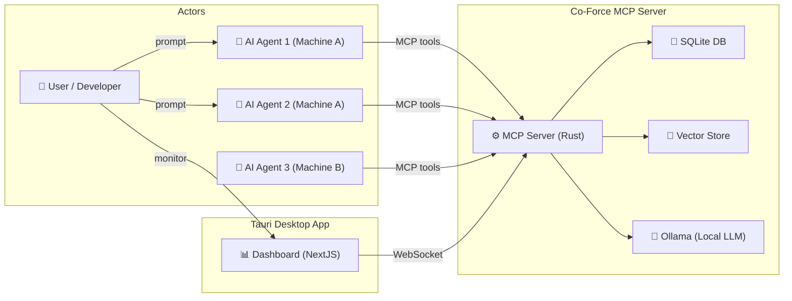

| Actor                | Description                                                | Interaction                                  |
| :------------------- | :--------------------------------------------------------- | :------------------------------------------- |
| **User / Developer** | End-user writing prompts for the AI agent                  | Indirectly via agents; directly via Dashboard |
| **AI Agent**         | Any AI agent supporting MCP (Claude Code, Cursor, etc.)     | Directly invokes MCP tools                   |
| **Co-Force MCP**     | Passive server responding to tool calls                    | Never executes spontaneously                 |
| **Ollama**           | Local LLM server for embeddings and classification         | HTTP API, running in the background          |
| **Dashboard**        | Web interface within the Tauri app (or embedded in server)  | WebSockets / HTTP REST API                   |

---

## 5. System Architecture Overview

### 5.1 High-Level Architecture

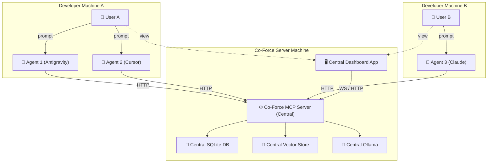

### 5.2 Data Storage Architecture

```
~/.co-force/                          # Global configuration (Tauri app data)
├── config.toml                       # Global settings
├── workspaces.json                   # Index of known workspaces
└── logs/                             # Server logs

<project>/.co-force/                  # Per-workspace data (git-ignored)
├── workspace.json                    # Workspace identity
├── agent.json                        # Local agent session cache
└── token                             # Long-term machine token (0600)
```

### 5.3 Database Schema (SQLite)

```sql
-- Agent Registry
CREATE TABLE agents (
    agent_id TEXT PRIMARY KEY,
    workspace_id TEXT NOT NULL,
    name TEXT NOT NULL,
    role TEXT DEFAULT 'developer',
    provider TEXT,                      -- 'antigravity', 'cursor', 'claude', etc.
    machine_id TEXT NOT NULL,
    state TEXT DEFAULT 'idle',          -- idle, working, paused, disconnected
    current_task_id TEXT,
    capabilities TEXT,                  -- JSON array
    last_seen TIMESTAMP DEFAULT CURRENT_TIMESTAMP,
    created_at TIMESTAMP DEFAULT CURRENT_TIMESTAMP
);

-- Task Management
CREATE TABLE tasks (
    task_id TEXT PRIMARY KEY,
    workspace_id TEXT NOT NULL,
    title TEXT NOT NULL,
    objective TEXT,
    status TEXT DEFAULT 'draft',        -- draft, spec_review, awaiting_approval, approved, in_progress, blocked, completed, rework
    assigned_agent_id TEXT,
    delegated_from_agent_id TEXT,
    parent_task_id TEXT,                -- For subtasks
    use_cases TEXT,                     -- JSON array of UseCase objects
    prerequisites TEXT,                 -- JSON array of strings
    verification_plan TEXT,             -- JSON array of VerificationStep
    required_skills TEXT,               -- JSON array of strings
    locked_files TEXT,                  -- JSON array of file paths
    impact_analysis TEXT,               -- JSON object: {affectedTasks, systemImpact, description}
    priority INTEGER DEFAULT 0,
    sort_order INTEGER DEFAULT 0,
    revision INTEGER DEFAULT 1,
    rework_cycle INTEGER DEFAULT 0,
    created_at TIMESTAMP DEFAULT CURRENT_TIMESTAMP,
    updated_at TIMESTAMP DEFAULT CURRENT_TIMESTAMP,
    completed_at TIMESTAMP,
    FOREIGN KEY (assigned_agent_id) REFERENCES agents(agent_id),
    FOREIGN KEY (parent_task_id) REFERENCES tasks(task_id)
);

-- File Locks (Database-based, NOT git-committed)
CREATE TABLE file_locks (
    id INTEGER PRIMARY KEY AUTOINCREMENT,
    workspace_id TEXT NOT NULL,
    file_path TEXT NOT NULL,
    agent_id TEXT NOT NULL,
    machine_id TEXT NOT NULL,
    task_id TEXT,
    reason TEXT,
    locked_at TIMESTAMP DEFAULT CURRENT_TIMESTAMP,
    expires_at TIMESTAMP,               -- Auto-expire stale locks
    UNIQUE(workspace_id, file_path),
    FOREIGN KEY (agent_id) REFERENCES agents(agent_id),
    FOREIGN KEY (task_id) REFERENCES tasks(task_id)
);

-- Memory / Knowledge entries (metadata — vectors stored in database as BLOB)
CREATE TABLE memory_entries (
    entry_id TEXT PRIMARY KEY,
    workspace_id TEXT NOT NULL,
    entry_type TEXT NOT NULL,           -- 'memory', 'knowledge', 'skill'
    content TEXT NOT NULL,
    source TEXT,                        -- File path, conversation, etc.
    agent_id TEXT,                      -- Which agent stored this
    confidence REAL DEFAULT 1.0,
    tags TEXT,                          -- JSON array
    embedding BLOB,                     -- Vector embedding (floats BLOB)
    created_at TIMESTAMP DEFAULT CURRENT_TIMESTAMP,
    accessed_at TIMESTAMP,
    access_count INTEGER DEFAULT 0
);

-- Skills
CREATE TABLE skills (
    skill_id TEXT PRIMARY KEY,
    workspace_id TEXT NOT NULL,
    name TEXT NOT NULL,
    description TEXT,
    category TEXT,                      -- 'deployment', 'testing', 'coding', etc.
    steps TEXT,                         -- JSON array of step strings
    source_memories TEXT,               -- JSON array of memory_entry_ids that generated this skill
    usage_count INTEGER DEFAULT 0,
    created_at TIMESTAMP DEFAULT CURRENT_TIMESTAMP,
    updated_at TIMESTAMP DEFAULT CURRENT_TIMESTAMP
);

-- Embedding Cache (to avoid redundant Ollama API calls)
CREATE TABLE embedding_cache (
    content_hash TEXT PRIMARY KEY,       -- SHA-256 hash of text content
    embedding TEXT NOT NULL,            -- JSON array of floats (1024 dimensions)
    created_at TIMESTAMP DEFAULT CURRENT_TIMESTAMP
);

-- Agent Activities (structured activity log)
CREATE TABLE agent_activities (
    activity_id TEXT PRIMARY KEY,
    workspace_id TEXT NOT NULL,
    agent_id TEXT NOT NULL,
    activity_type TEXT NOT NULL,         -- 'check_in', 'task_started', 'task_completed', 'file_edited',
                                        -- 'memory_stored', 'delegation', 'lock_acquired', 'lock_released'
    content TEXT,                        -- JSON object: {summary, details, related_context}
    related_task_id TEXT,
    related_files TEXT,                  -- JSON array of file paths
    version INTEGER DEFAULT 1,           -- Versioning for merge conflict resolution
    occurred_at TIMESTAMP DEFAULT CURRENT_TIMESTAMP,
    FOREIGN KEY (agent_id) REFERENCES agents(agent_id)
);

-- Shared Contexts (cross-agent context sharing)
CREATE TABLE shared_contexts (
    context_id TEXT PRIMARY KEY,
    workspace_id TEXT NOT NULL,
    source_agent_id TEXT NOT NULL,
    target_agent_id TEXT,                -- NULL = broadcast to all agents in workspace
    context_type TEXT NOT NULL,          -- 'task_context', 'knowledge_share', 'file_reference',
                                        -- 'session_summary', 'delegation_context'
    content TEXT NOT NULL,               -- Structured JSON content
    resolved BOOLEAN DEFAULT FALSE,      -- Has the target agent read/processed this
    created_at TIMESTAMP DEFAULT CURRENT_TIMESTAMP,
    resolved_at TIMESTAMP,
    FOREIGN KEY (source_agent_id) REFERENCES agents(agent_id)
);
```

---

## 6. LLM Orchestration, Embedding & Vector Database Architecture

### 6.1 Ollama LLM Orchestration
Since Ollama runs locally on the central server and inference tasks consume substantial hardware resources (CPU/GPU/RAM/VRAM), Co-Force implements a strict orchestration mechanism:
1. **Concurrency Control:**
   - Prevents uncontrolled parallel API calls to Ollama from multiple agents, which can lead to VRAM exhaustion or system hangs.
   - Co-Force implements a **Mutex Task Queue / Semaphore** in the Rust core library to serialize inference requests. The maximum number of concurrent inference runs is capped (default: `concurrency_limit = 2`), configured via `server.toml`.
2. **Model Loading & Lifecycle Management:**
   - Ollama loads models into memory on the first request and keeps them cached for a period (default 5 minutes).
   - Co-Force optimizes loading times by partitioning model roles:
     - **Embedding Model (`mxbai-embed-large`):** A small model (334M params), kept in memory longer due to high-frequency vector generation requests.
     - **Classifier LLM (`gemma4:e2b`):** A reasoning model (2B params), released faster after classification or task analysis completes.
   - The queue ensures that while large-batch embeddings are running, classification requests are queued (and vice versa) to prevent memory contention.
3. **Timeout & Retries with Fail-Loud Behavior:**
   - Sets timeouts for the Ollama API (e.g. 30s for classification, 15s for embedding).
   - If Ollama is offline or crashes:
     - Under the **No Silent Degradation** policy, the server returns a clear `SERVICE_UNAVAILABLE` error code with a `recovery_action` prompting the user or agent to wait and retry. No lower-quality fallback results are silently generated.

### 6.2 Vector Database Deployment
Co-Force integrates vector embeddings directly inside the SQLite database to simplify deployment and guarantee atomic transactions:
1. **Storage Structure:**
   - Embedding vectors are saved as binary BLOBs (`memory_entries.embedding`) directly in the workspace SQLite database file `/var/lib/co-force/data/{workspaceId}/co-force.db`.
   - Workspace data is fully isolated across database files.
2. **Cosine Similarity Search:**
   - Searches are executed via brute-force cosine similarity over the memory vectors in Rust.
   - At typical workspace scales (a few thousand entries), brute-force computation completes in < 10ms, eliminating the overhead of managing a separate HNSW file index or risks of index corruption.
3. **SQLite Vector Integration:**
   - The `memory_entries` table stores metadata alongside the raw vector BLOB.
   - Query flow (`co_force_recall`):
     1. Client calls recall. Server embeds the query string.
     2. Server retrieves all records matching the query filters, computes cosine similarities in memory, and returns the top K results.

### 6.3 LLM Management, Extensibility & First-Time Onboarding

Co-Force is designed with pluggable provider support. Both the **Reasoner LLM** and **Embedding Models** support extensibility through traits.

#### 1. Setup Wizard Flow
When Co-Force starts for the first time (or detects that `/etc/co-force/server.toml` is missing), the server triggers an interactive setup script:

```mermaid
graph TD
    Start([Start Co-Force first time]) --> CheckConfig{Is server.toml present?}
    CheckConfig -->|Yes| RunServer[Run Server]
    
    CheckConfig -->|No| Wizard[Start Setup Wizard]
    
    subgraph "Setup Wizard Flow"
        Wizard --> Step1[Step 1: Select LLM Provider<br/>Ollama | OpenAI | Anthropic | Gemini]
        Step1 --> CheckCreds{Needs API Key?}
        CheckCreds -->|Yes| InputKey[Input API Key to secrets.toml]
        CheckCreds -->|No / Ollama| SetUrl[Set Ollama URL]
        
        InputKey --> Step2[Step 2: Choose LLM Model<br/>e.g. gpt-4o-mini, claude-3-5-haiku, gemma4:e2b]
        SetUrl --> Step2
        
        Step2 --> Step3[Step 3: Choose Embedding Model<br/>e.g. text-embedding-3-small, mxbai-embed-large]
        
        Step3 --> SaveConfig[Save to server.toml]
    end
    
    SaveConfig --> RunServer
```

- **CLI Mode:** Terminal prompts guide the user through provider selection, model choice, and key validation.
- **Desktop/Web Dashboard:** Renders an onboarding wizard, querying available local models from Ollama to populate choices.

#### 2. Extensible Architecture
Embedding and classification tasks interface through abstract Rust traits:
- **`EmbeddingProvider` Trait:** Defines embedding generation protocols.
  - **Ollama**: Connects to the local API.
  - **OpenAI/Gemini**: Calls cloud endpoints.
  - Vector dimensions map dynamically based on the configured model (e.g. 1024d for `mxbai-embed-large`, 1536d for `text-embedding-3-small`).
- **`LlmProvider` Trait:** Defines completion and classification interfaces.

#### 3. Configuration Schema (`server.toml`):
See the finalized configuration schema in [Plan 06](file:///Users/trungtran/ai-agents/co-force/docs/plans/06_server_deployment_and_tunnel.md#L214).

### 6.4 Embedding Strategy
1. **Dimension Mapping:**
   - Supported dimensions adapt to the configured model. Changing models triggers a background re-embedding daemon.
2. **Chunking & Batching:**
   - Embeddings are generated in batches (max 16 chunks per API call) via an async queue to prevent timeouts.
3. **Embedding Cache:**
   - The `embedding_cache` table stores SHA-256 hashes of text chunks mapped to computed float arrays. Matches bypass LLM computation entirely, saving up to 80% of processing during re-indexing.

---

## 7. Use Case Catalog

### 7.1 Summary Table

| UC ID | Group         | Use Case                            | Priority | Complexity |
| :---- | :------------ | :---------------------------------- | :------- | :--------- |
| UC-01 | Identity      | Agent Check-in (First Time)         | P0       | Low        |
| UC-02 | Identity      | Agent Check-in (Returning)          | P0       | Low        |
| UC-03 | Identity      | Agent Whoami (Quick Status)         | P0       | Low        |
| UC-04 | Identity      | Agent Heartbeat / Disconnect        | P1       | Medium     |
| UC-05 | Task          | User Prompt → Task Analysis & Draft | P0       | High       |
| UC-06 | Task          | Task Recheck (Subagent Validation)  | P0       | High       |
| UC-07 | Task          | User Task Approval                  | P0       | Low        |
| UC-08 | Task          | Task Execution with Status Updates  | P0       | Medium     |
| UC-09 | Task          | Task Completion                     | P0       | Low        |
| UC-10 | Task          | Task Failure & Recovery             | P1       | Medium     |
| UC-11 | Task          | Task Dependency Chain               | P1       | High       |
| UC-12 | Coordination  | Cross-Agent Task Delegation         | P0       | High       |
| UC-13 | Coordination  | File Lock Acquisition               | P0       | Medium     |
| UC-14 | Coordination  | File Lock Conflict Detection        | P0       | Medium     |
| UC-15 | Coordination  | File Lock Release & Cleanup         | P0       | Low        |
| UC-16 | Coordination  | List Active Agents & Their Work     | P0       | Low        |
| UC-17 | RAG           | Memory Storage (Auto-classify)      | P1       | High       |
| UC-18 | RAG           | Knowledge Recall (Semantic Search)  | P1       | High       |
| UC-19 | RAG           | Skill Auto-Detection & Creation     | P1       | Very High  |
| UC-20 | RAG           | Skill Retrieval for Task Execution  | P1       | Medium     |
| UC-21 | Multi-Machine | Same Workspace on Multiple Machines | P2       | High       |
| UC-22 | Multi-Machine | Cross-Machine Agent Awareness       | P2       | High       |
| UC-23 | Multi-Machine | Post-Task Code Merge                | P2       | Medium     |
| UC-24 | Dashboard     | Real-time Agent Status Monitoring   | P2       | Medium     |
| UC-25 | Dashboard     | Task Board (Kanban View)            | P2       | Medium     |
| UC-26 | Dashboard     | Memory/Knowledge Browser            | P2       | Medium     |
| UC-27 | Error         | Agent Crash Recovery                | P1       | Medium     |
| UC-28 | Error         | Ollama Unavailable Fallback         | P1       | Medium     |
| UC-29 | Error         | Stale Lock Auto-cleanup             | P1       | Low        |
| UC-30 | Error         | Vector DB Corruption Recovery       | P2       | Medium     |
| UC-31 | Onboarding    | Agent Onboarding Guide              | P0       | Low        |
| UC-32 | Config        | LLM Model Selection                 | P1       | Low        |
| UC-33 | Coordination  | Agent Context Retrieval              | P0       | Medium     |
| UC-34 | Coordination  | Workspace Activity Stream            | P1       | Medium     |
| UC-35 | Coordination  | Cross-Agent Context Sharing          | P1       | Medium     |
| UC-36 | Coordination  | Dynamic AGENTS.md Generation         | P0       | Medium     |
| UC-37 | A2A           | Sub-Agent Spawning                   | P2       | High       |
| UC-38 | A2A           | Task Handover / Fallback             | P2       | High       |

---

## 8. Detailed Use Cases

### Group A: Agent Lifecycle

#### UC-01: Agent Check-in (First Time — New Workspace / New Agent Registration)

**Actor:** AI Agent  
**Preconditions:** Agent connects to the Co-Force Central Server via HTTP, pointing to a project folder that lacks a local `.co-force/agent.json` cache or has no active session.  
**Postconditions:** Workspace is resolved, the agent is registered on the Central Server, and the local session cache is written.

##### 📋 Definition of "New Agent", Multi-Agent Support, and Identity Drift Solutions

An agent instance is identified as **new** if:
1. **Fresh setup:** The developer machine does not contain `.co-force/agent.json`.
2. **Session reset:** The agent connects without an `agentId` (or passes `agentId: null`).
3. **Identity change:** The identity tuple (`workspaceId`, `machineId`, `agentName`, `role`) does not exist in the database.

**Multi-Agent Support & Session Binding:**
- Developers can run multiple terminals or parallel sessions. The client-side launcher (or IDE shell integration) generates a unique `agentSessionId` (UUID v4) using process variables.
- The `agentSessionId` along with `workspaceId`, `machineId`, `agentName`, and `role` are transmitted during check-in.
- **Implicit Session Binding:** To prevent LLM context compaction from losing track of the agent's ID, Co-Force maps HTTP/Streamable sessions directly to active agent records. Agents call tools (e.g. `whoami`, `lock_files`) without passing `agentId` as a parameter. The server resolves identity from the connection context, eliminating context drift.

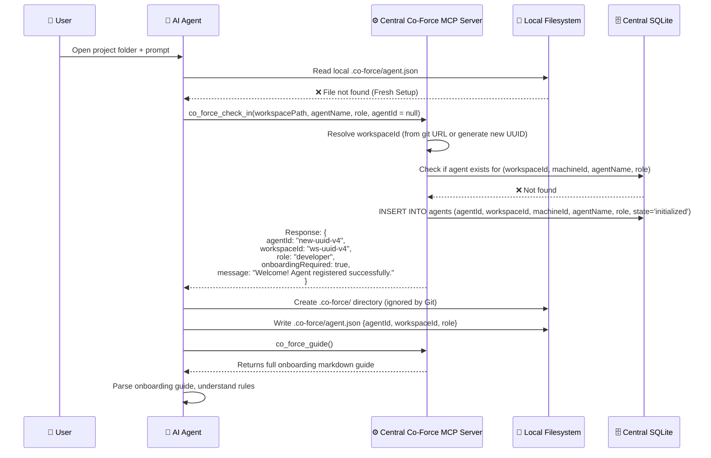

**Alternative Flows:**
- **A1: Local `.co-force/agent.json` exists but the ID is unknown to the server:** Treated as a new registration, writing a fresh `agentId` to the local cache.

---

#### UC-02: Agent Check-in (Returning — Existing Workspace)

**Actor:** AI Agent  
**Preconditions:** Workspace exists, local `.co-force/agent.json` contains a valid `agentId` and `workspaceId`.  
**Postconditions:** Restores the agent's session, synchronizing active tasks and locks.

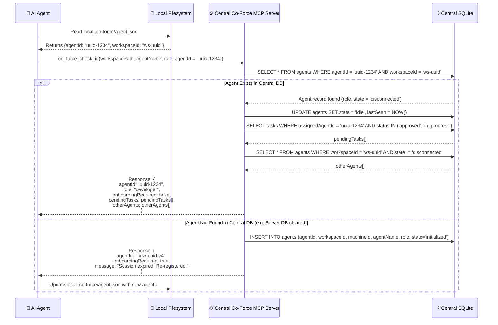

---

#### UC-03: Agent Whoami (Quick Status)

**Actor:** AI Agent  
**Preconditions:** Agent has checked in.  
**Objective:** Lightweight query to resolve active context.

**Tool:** `co_force_whoami()`

**Response:**
```json
{
  "agentId": "...",
  "name": "Agent-Alpha",
  "role": "developer",
  "state": "working",
  "currentTask": { "taskId": "...", "title": "Implement login" },
  "lockedFiles": ["/src/auth/login.ts"],
  "activeAgentsCount": 3,
  "pendingTasksCount": 5
}
```

---

#### UC-04: Agent Heartbeat / Disconnect Detection

**Actor:** Co-Force Central Server (automatic)  
**Preconditions:** Agent checked in, maintaining active connection.

**Monitoring Mechanism:**
- **Instant Disconnect Detection:** Since clients connect via persistent HTTP connections, the server monitors socket states. Closed terminals, killed agent processes, or network failures close the connection, immediately updating the agent's state to `disconnected`.
- **Temporary State (Paused Tasks):**
  - Upon disconnect, the agent's state becomes `disconnected`.
  - All tasks marked `in_progress` assigned to the agent are set to `paused` to preserve locks and avoid coordination conflicts.
- **Grace Period:** The server starts a **2-minute** countdown.
  - Reconnecting within 2 minutes restores state to `working`, retaining old locks and tasks.
- **Auto-Reclaiming (Post-Timeout):**
  - If the grace period expires:
    1. **Release file locks:** All locks associated with the agent are cleared.
    2. **Return tasks to Backlog:** Tasks transition from `paused` back to `approved` (removing `assignedAgentId`) for other agents to claim.

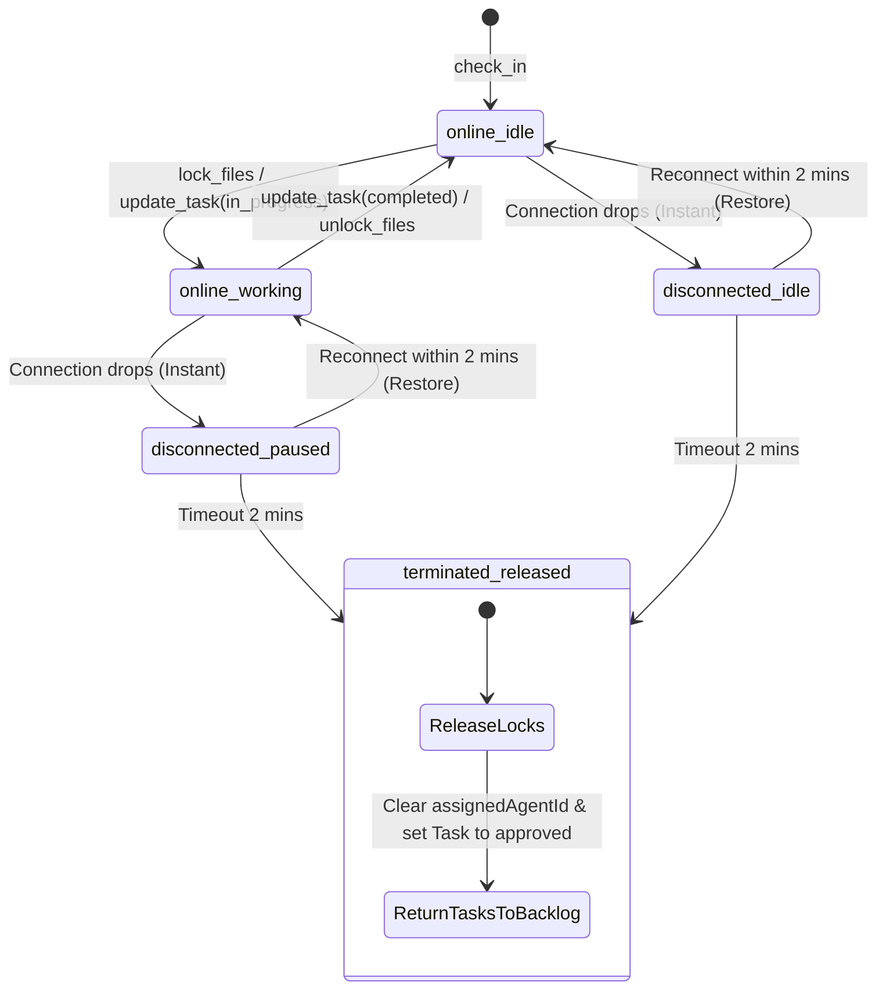

---

### Group B: Task Management

#### UC-05: User Prompt → Task Analysis & Draft

**Actor:** AI Agent  
**Preconditions:** Agent checked in, receives user prompt.

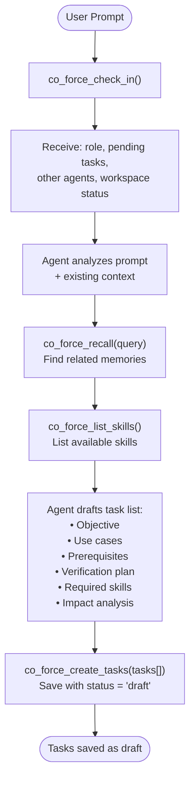

**Task Fields:**

| Field              | Required | Description                                            |
| :----------------- | :------- | :----------------------------------------------------- |
| `title`            | ✅       | Concise name of the task                               |
| `objective`        | ✅       | Concrete objective                                     |
| `useCases`         | ✅       | Array of use cases (actors, flows, postconditions)     |
| `prerequisites`    | ✅       | Prerequisites for execution                            |
| `verificationPlan` | ✅       | Concrete verification plan (test cases, manual checks) |
| `requiredSkills`   | ✅       | Required skill profiles                                |
| `impactAnalysis`   | ✅       | Impact assessment: {affectedTasks, systemImpact}       |
| `lockedFiles`      | ❌       | File paths to lock (claimed on start)                  |
| `status`           | Auto     | draft → spec_review → awaiting_approval → approved...  |

---

#### UC-06: Task Recheck (Subagent Validation)

**Actor:** AI Agent (as subagent / quality role)  
**Preconditions:** Tasks are drafted.  
**Objective:** Validate specifications, logic gaps, and edge cases before user approval.

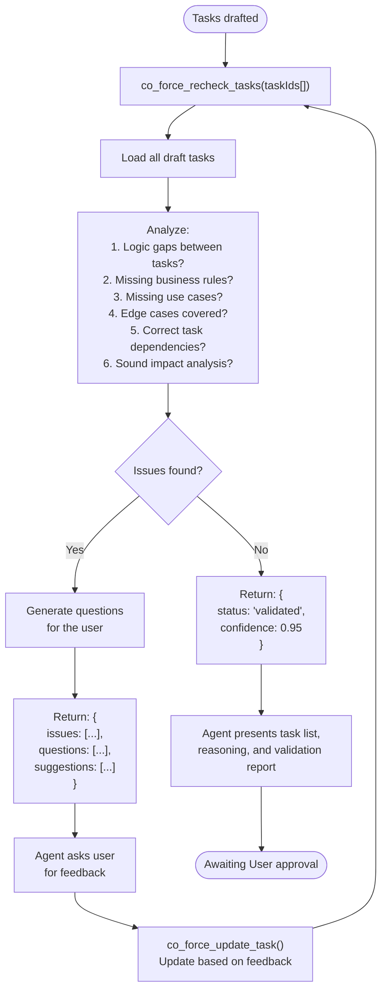

---

#### UC-07: User Task Approval

**Actor:** AI Agent (representing User choice)

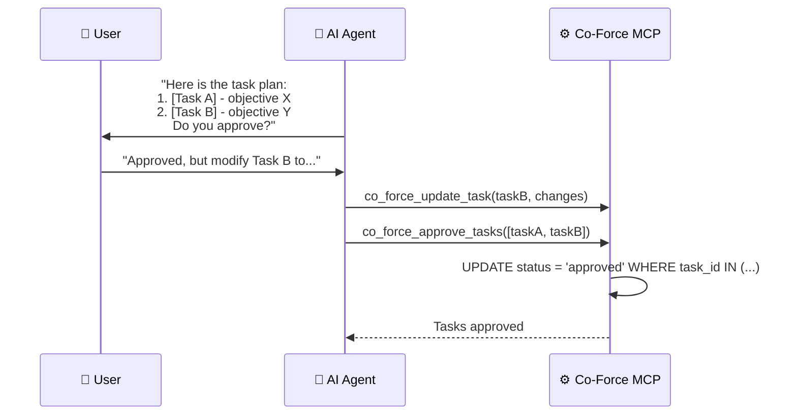

**Rule:** Agents **MUST NOT** execute tasks without user approval.

---

#### UC-08: Task Execution with Status Updates

**Actor:** AI Agent

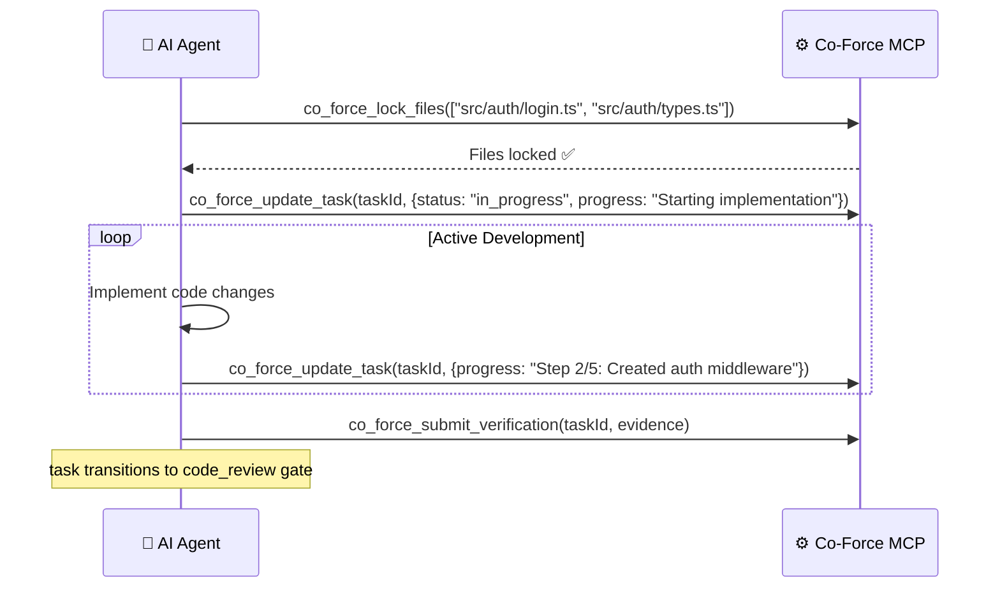

---

#### UC-10: Task Failure & Impact Cascade

**Actor:** AI Agent

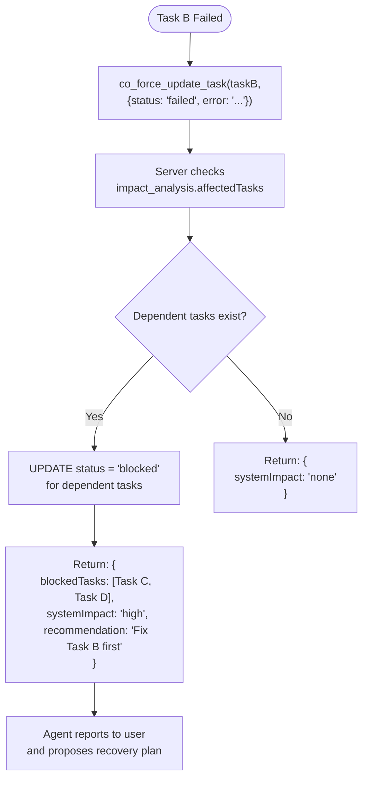

---

### Group C: Cross-Agent Coordination

#### UC-12: Cross-Agent Task Delegation

**Actor:** AI Agent  
**Preconditions:** Agent executing a task identifies a sub-component suitable for delegation.

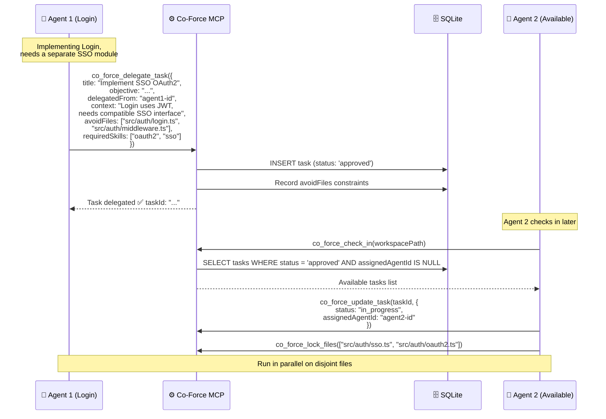

---

#### UC-13 & UC-14: File Lock Acquisition & Conflict Detection

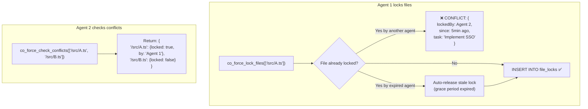

---

#### UC-16: List Active Agents & Their Work

**Tool:** `co_force_list_agents()`

**Response Example:**
```json
{
  "workspace": "co-force",
  "agents": [
    {
      "agentId": "...",
      "name": "Agent-Alpha",
      "provider": "antigravity",
      "machine": "MacBook-Pro-Trung",
      "state": "working",
      "currentTask": "Implement Login (3/5 steps done)",
      "lockedFiles": ["src/auth/login.ts"],
      "lastSeen": "2 minutes ago"
    },
    {
      "agentId": "...",
      "name": "Agent-Beta",
      "provider": "cursor",
      "machine": "MacBook-Pro-Trung",
      "state": "idle",
      "currentTask": null,
      "lockedFiles": [],
      "lastSeen": "30 seconds ago"
    }
  ],
  "summary": {
    "total": 2,
    "working": 1,
    "idle": 1,
    "disconnected": 0,
    "totalLockedFiles": 1
  }
}
```

---

### Group D: Memory & Knowledge (Agentic RAG)

#### UC-17: Memory Storage (Auto-classify)

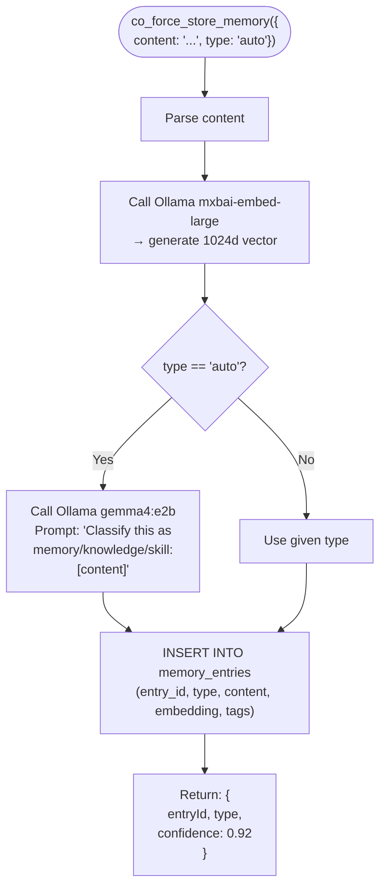

**Classification Prompt (sent to Ollama):**
```
You are a classifier. Categorize the following text into exactly ONE category:

- MEMORY: Specific event, context, or fact from a work session. Time-bound, session-specific.
  Examples: "File X has a bug in line 42", "User wants PostgreSQL not MySQL"

- KNOWLEDGE: General-purpose pattern, best practice, or reusable principle. Timeless.
  Examples: "React hooks must be called at top level", "Always use parameterized SQL queries"

- SKILL: Step-by-step procedure that can be reused. Actionable, sequential.
  Examples: "To deploy Docker: 1) Build image 2) Push to registry 3) kubectl apply"

Text: "{content}"

Respond with ONLY the category name: MEMORY, KNOWLEDGE, or SKILL
```

---

#### UC-18: Knowledge Recall (Semantic Search)

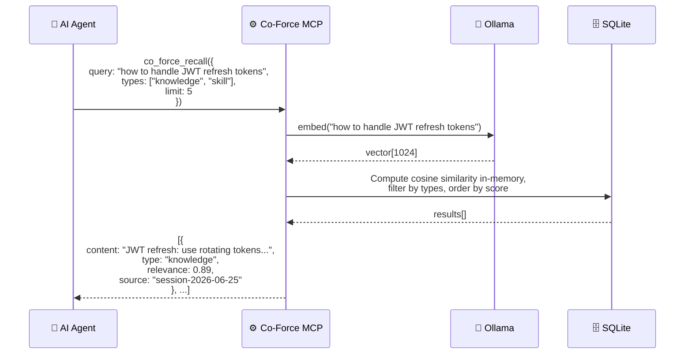

---

#### UC-19: Skill Auto-Detection & Creation

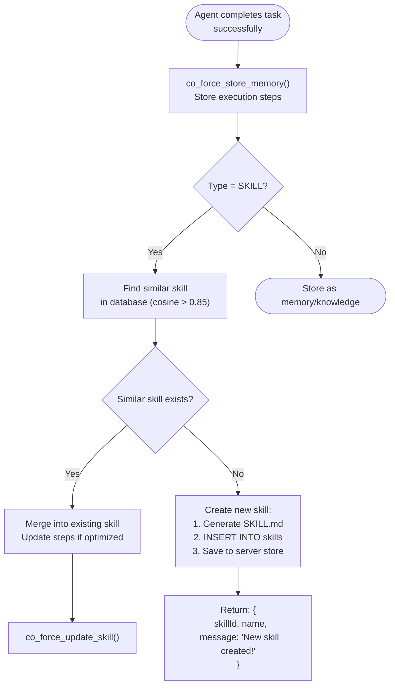

**Auto-Generated SKILL.md Structure:**
```markdown
---
name: deploy-docker-container
description: Step-by-step guide to deploy a Docker container to production
category: deployment
auto_generated: true
source_task: "task-uuid-xxx"
confidence: 0.88
---

# Deploy Docker Container

## Prerequisites
- Docker installed and running
- Access to container registry
- kubectl configured

## Steps
1. Build Docker image: `docker build -t app:latest .`
2. Tag for registry: `docker tag app:latest registry/app:latest`
3. Push to registry: `docker push registry/app:latest`
4. Apply to cluster: `kubectl apply -f deployment.yaml`

## Verification
- Run `kubectl get pods` — verify pod status is Running
- Check logs: `kubectl logs <pod-name>`

## Common Issues
- Build fails: Check Dockerfile syntax and base image
- Push denied: Verify registry credentials
```

---

### Group E: Multi-Machine Coordination

#### UC-21: Same Workspace on Multiple Machines

**Scenario:** Workspace `my-project` is cloned on Developer Machine A and Developer Machine B. Both machines connect to the same **Co-Force Central Server**.

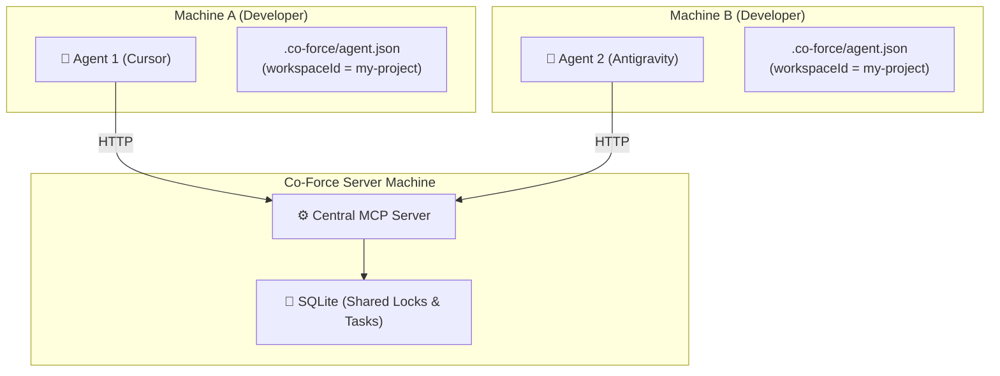

**Mechanism:**
1. **Workspace Identification:** Project configuration `.co-force/agent.json` maps to the centralized `workspaceId` (derived from git remote URL).
2. **Central Storage:** Task states, file locks, and team registry reside in SQLite DB files on the **Co-Force Central Server**.
3. **Real-time Synchronization:** File lock claims write instantly to the central server. Conflicts are detected immediately across active clients without intermediate git syncs.

---

#### UC-22: Cross-Machine Agent Awareness

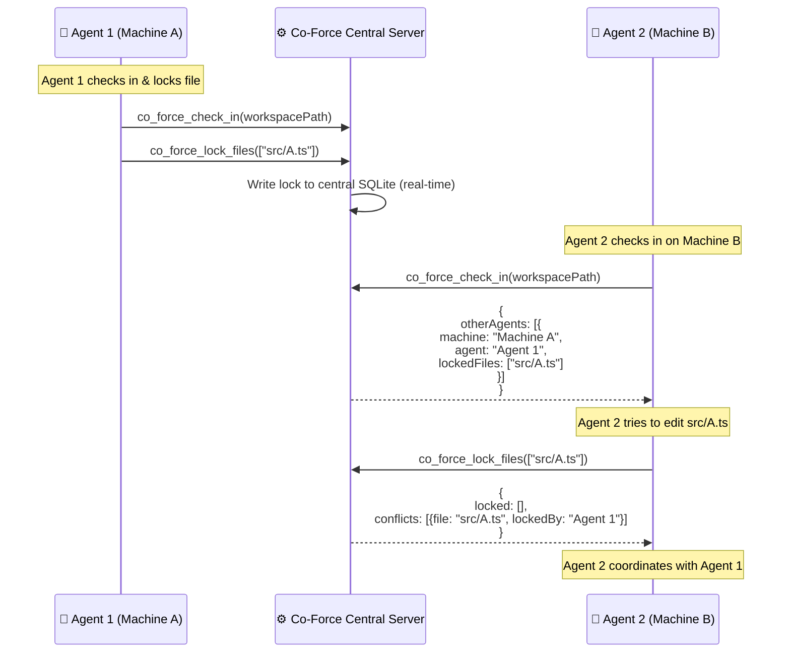

---

### Group F: Dashboard & Monitoring

#### UC-24: Real-time Agent Status Monitoring

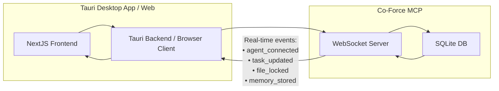

**Dashboard Views:**

| View                    | Description                                                                                               |
| :---------------------- | :-------------------------------------------------------------------------------------------------------- |
| **Agent Status Panel**  | Cards for active agents: name, provider, status (color-coded), current task, locked files, last seen      |
| **Task Board (Kanban)** | Columns: Draft → Spec Review → Awaiting Approval → Approved → In Progress → Code Review → Completed/Rework |
| **Workspace Overview**  | Metrics: total tasks, completion rate, active agents, memory count, skill count                           |
| **Memory Explorer**     | Search + browse memory/knowledge/skills. Filter by type, date, agent.                                     |

---

### Group G: Error Handling & Recovery

#### UC-27: Agent Crash Recovery

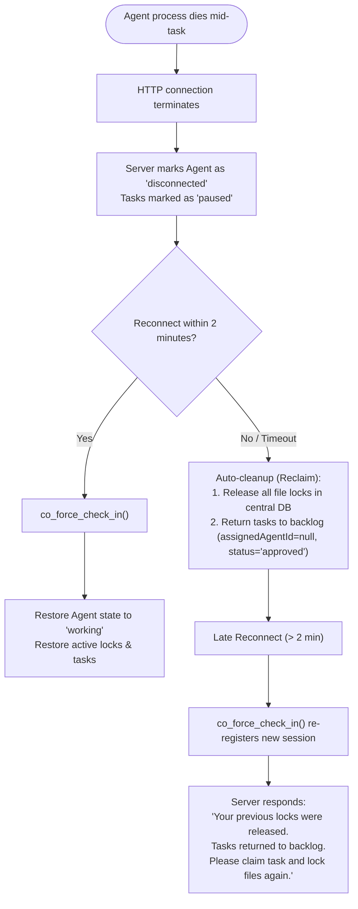

#### UC-28: Ollama Unavailable Fallback

```mermaid
flowchart TD
    Call(["co_force_store_memory()"]) --> CheckOllama{Ollama reachable?}

    CheckOllama -->|Yes| Normal["Normal flow: embed + classify"]

    CheckOllama -->|No| Fail["Return SERVICE_UNAVAILABLE<br/>(No silent degradation)"]
```

#### UC-32: LLM Model Selection

**Tool:** `co_force_config({embeddingModel: "...", classifierModel: "..."})`

Allows the user/agent to modify model runtime settings:
```json
{
  "embeddingModel": "mxbai-embed-large",
  "classifierModel": "gemma4:e2b",
  "alternativeModels": {
    "embedding": ["nomic-embed-text"],
    "classifier": ["qwen3:14b", "llama3.3:8b"]
  }
}
```

---

### Agent Onboarding (UC-31)

**Tool:** `co_force_guide()`

When an agent checks in, it can invoke `co_force_guide()` to receive the onboarding protocol:

```markdown
# 🤖 Co-Force MCP — Agent Onboarding Guide

You are connected to the Co-Force MCP Server. This serves as the shared coordination core of this workspace.

## ⚡ Mandatory First Step
You MUST call `co_force_check_in` before any other tools. All other tools are blocked until check-in.

## 📋 Tool Execution Pipeline

### Phase 1: Identity & Setup
- `co_force_check_in`: Registers session, retrieves pending tasks, lists online teammates.
- `co_force_whoami`: Returns active profile, locked files, and task context.
- `co_force_guide`: Returns this manual.

### Phase 2: Design & Tasks
- `co_force_recall`: Semantic search over workspace memory and design patterns.
- `co_force_list_skills`: Lists established task skill patterns.
- `co_force_create_tasks`: Drafts task structures (objectives, edge cases, verification plans).
- `co_force_recheck_tasks`: Run reasoner spec validations to detect logic gaps.

### Phase 3: Coding & Execution
- `co_force_approve_tasks`: Commit approved tasks (user-driven proxy).
- `co_force_lock_files`: Acquire exclusive logical locks BEFORE editing.
- `co_force_update_task`: Maintain progress journal.
- `co_force_submit_verification`: Submit verification evidence (test outputs, commit_sha).

### Phase 4: Closure & Synthesis
- `co_force_unlock_files`: Release logical locks.
- `co_force_store_memory`: Synthesize lessons, gotchas, and patterns.

## ⚠️ Enforced Rules
1. Never edit a file without locking it first.
2. Never review or approve your own tasks (enforced by the server).
3. Do not attempt direct status=completed transitions; verify first.
4. Process incoming inbox review requests prior to claiming new tasks.
```

---

### Group H: Cross-Agent Context Sharing

> [!NOTE]
> **Source:** The context-sharing use cases are inspired by the architecture of [Tutti](ref/tutti/) — a local-first desktop workspace allowing coordinated multi-agent execution via activity projection and context routing. Co-Force implements these patterns in-band via MCP envelopes.

#### UC-33: Agent Context Retrieval

**Actor:** AI Agent seeking context on a teammate's activities.  
**Preconditions:** Both agents checked into the workspace.

**Tool:** `co_force_get_agent_context(agentId?, includeHistory?)`

```mermaid
sequenceDiagram
    participant A1 as 🤖 Agent 1 (Frontend)
    participant MCP as ⚙️ Co-Force MCP
    participant DB as 🗄️ SQLite
    participant A2 as 🤖 Agent 2 (Backend)

    Note over A1: Needs to check Agent 2's<br/>API progress

    A1->>MCP: co_force_get_agent_context({<br/>  agentId: "agent-2-id",<br/>  includeHistory: true<br/>})

    MCP->>DB: SELECT from agents WHERE agent_id = ?
    MCP->>DB: SELECT from agent_activities WHERE agent_id = ?
    MCP->>DB: SELECT from shared_contexts WHERE source_agent_id = ?
    MCP->>DB: SELECT from memory_entries WHERE agent_id = ?

    MCP-->>A1: {<br/>  agent: {name: "Agent-Beta", provider: "claude-code"},<br/>  currentTask: {title: "Setup REST API", progress: "4/6"},<br/>  recentActivity: [<br/>    {type: "file_edited", file: "src/api/routes.ts", at: "2min ago"},<br/>    {type: "task_completed", task: "DB Schema", at: "15min ago"}<br/>  ],<br/>  sharedMemories: [<br/>    "API uses Express.js",<br/>    "Endpoints: /api/auth/login"<br/>  ],<br/>  contextSummary: "Building Express API..."<br/>}
```

---

#### UC-34: Workspace Activity Stream

**Actor:** AI Agent checking recent workspace changes.  
**Preconditions:** Agent checked in.

**Tool:** `co_force_get_workspace_activity(limit?, types?)`

```mermaid
sequenceDiagram
    participant Agent as 🤖 AI Agent
    participant MCP as ⚙️ Co-Force MCP
    participant DB as 🗄️ SQLite

    Agent->>MCP: co_force_get_workspace_activity({<br/>  limit: 20,<br/>  types: ["task_completed", "file_edited", "delegation"]<br/>})

    MCP->>DB: SELECT from agent_activities WHERE workspace_id = ?<br/>AND activity_type IN (?) ORDER BY occurred_at DESC LIMIT 20
    MCP-->>Agent: activity list + workspace summary
```

---

#### UC-35: Cross-Agent Context Sharing

**Actor:** AI Agent sharing context with another agent.  
**Preconditions:** Agent checked in.

**Tool:** `co_force_share_context(content, targetAgentId?, type)`

```mermaid
sequenceDiagram
    participant A1 as 🤖 Agent 1 (Backend)
    participant MCP as ⚙️ Co-Force MCP
    participant DB as 🗄️ SQLite
    participant A2 as 🤖 Agent 2 (Frontend)

    Note over A1: Shared API spec with Frontend agent

    A1->>MCP: co_force_share_context({<br/>  content: { endpoints: ["POST /api/auth/login"] },<br/>  targetAgentId: "agent-2-id",<br/>  type: "knowledge_share"<br/>})

    MCP->>DB: INSERT INTO shared_contexts(...)
    MCP-->>A1: {contextId: "ctx-123", delivered: false}

    Note over A2: Agent 2 checks in later

    A2->>MCP: co_force_check_in(workspacePath)
    MCP->>DB: SELECT from shared_contexts WHERE target_agent_id = ? AND resolved = FALSE
    MCP-->>A2: { pendingContexts: [ctx-123], protocol_next_step: "Review context" }
    MCP->>DB: UPDATE shared_contexts SET resolved = TRUE WHERE context_id = 'ctx-123'
```

---

#### UC-36: Dynamic AGENTS.md Generation

**Actor:** Co-Force Server (automatic)  
**Trigger:** State changes (check_in, locks, task_updates).

```mermaid
flowchart TD
    Trigger([State Change Event]) --> EventBus["tokio::broadcast Event Bus"]
    EventBus --> Generator["AGENTS.md Generator"]
    Generator --> QueryState["Query current workspace state"]
    QueryState --> DB["SQLite DB Query"]
    DB --> BuildMD["Build managed block content"]
    BuildMD --> WriteFile["Write AGENTS.md<br/>(L3 worker worktrees FS only)"]
    WriteFile --> Dashboard["Render dynamic rules for Dashboard API"]
```

Dynamic rules are rendered dynamically to L3 worker files and served to the dashboard API. Static rules are enrolled on the client machine once.

---

### Group I: Active A2A Orchestration

#### UC-37: Sub-Agent Spawning

**Actor:** AI Agent (e.g. L1 developer) spawning a sub-agent.  
**Preconditions:** Co-Force MCP has access permission.

**Tool:** `co_force_spawn_agent(provider, task_id, context)`

```mermaid
sequenceDiagram
    participant Dev as 🤖 Dev Agent (client, L1)
    participant MCP as ⚙️ Co-Force MCP
    participant W as 🤖 Worker Agent (server, L3)

    Dev->>MCP: co_force_spawn_agent({provider: "claude-code", task_id: "t-backend"})
    Note over MCP: Spawns L3 worker process in separate git worktree
    MCP-->>Dev: sub_agent status: running
    W->>MCP: co_force_check_in()
```

---

#### UC-38: Task Handover / Fallback

**Actor:** AI Agent hitting resource limit or rate limit constraints.  
**Preconditions:** Invoked before exit.

**Tool:** `co_force_handover(reason, current_task_id, state_summary, next_provider)`

```mermaid
sequenceDiagram
    participant AG as 🤖 Antigravity (Current)
    participant MCP as ⚙️ Co-Force MCP
    participant CC as 🤖 Claude Code (Next)

    Note over AG: Hitting context limits

    AG->>MCP: co_force_handover({<br/>  reason: "context_exhausted",<br/>  current_task_id: "task-123",<br/>  state_summary: "Parsed file A, coding file B...",<br/>  next_provider: "claude-code"<br/>})

    MCP->>MCP: Set task to pending_handover,<br/>escrow locks to task
    MCP->>MCP: Trigger spawn / assign to successor
    MCP-->>AG: { status: "handed_over", safe_to_exit: true }
    
    Note over CC: Successor starts, check-in, receives package
```

---

## 9. Agent Activation & Adoption Mechanism

### 9.1 The "Chicken and Egg" Dilemma in Passive MCP
Since MCP is a passive protocol driven entirely by client tool calls, the server cannot independently invoke client actions. If developer agents ignore Co-Force tools and modify files directly, they bypass tasks, locks, and quality gates.

To solve this, Co-Force enforces **4-Layer Guardrails**:

```mermaid
graph TD
    UserPrompt["👤 User Input / Task Prompt"] --> Agent["🤖 AI Agent (Cursor/Claude...)"]
    
    subgraph "Layer 1: Rule Injection"
        Rules[".cursorrules / AGENTS.md / .clauderules<br/>→ Require check-in first"]
    end
    Rules -.->|System Instructions| Agent
    
    subgraph "Layer 2: Cognitive Inducement"
        Desc["Tool Descriptions<br/>→ MANDATORY: Check-in first!"]
    end
    Desc -.->|Inspect tools| Agent
    
    Agent -->|1. Edit file directly?| LockCheck{"Did it lock_files?"}
    LockCheck -->|No| RulesWarning["System instructions demand lock"]
    LockCheck -->|Yes| CheckInVerify{"Is checked in?"}
    
    subgraph "Layer 3: Interlocking Failures"
        CheckInVerify -->|No| BlockErr["Tool returns error:<br/>CHECK_IN_REQUIRED"]
        BlockErr -->|Enforce correction| CallCheckIn["🔧 Call co_force_check_in()"]
    end
    
    CheckInVerify -->|Yes| Exec["Execute successfully"]
    CallCheckIn --> Exec
    
    subgraph "Layer 4: Local Guard (Opt-in strict mode)"
        SessionJSON[".co-force/session_status.json<br/>→ Active locks list"]
    end
    Agent -.->|Read local state| SessionJSON
```

### 9.2 Details of the 4 Guardrail Layers

#### 1. Layer 1: Workspace Rule Auto-Generation
Upon setup, the enrollment script injects static workspace rule configurations:
- **Cursor:** `.cursorrules` in workspace root.
- **Claude Project CLI:** `.clauderules`.
- **Windsurf:** `.windsurfrules`.
- **Universal:** `AGENTS.md` at project root.

#### 2. Layer 2: LLM Cognitive Inducement
Tool descriptions in the schema returned to client runtimes use command-driven vocabulary:
- **`co_force_check_in`**: `"MANDATORY: MUST be called on the very first turn of any workspace session. Registers session, active role, and retrieves pending tasks. All other tools return CHECK_IN_REQUIRED until check-in is complete."`
- **`co_force_lock_files`**: `"MANDATORY: MUST be called before modifying any files. Requests exclusive workspace write locks. Editing files without locking violates protocol and is rejected."`

#### 3. Layer 3: Interlocking Failures
All business use case tools verify connection session status. Requests without a checked-in session return the `CHECK_IN_REQUIRED` error with a structured `recovery_action` pointing to `co_force_check_in(...)`, driving an immediate self-correction loop in LLMs.

#### 4. Layer 4: Local Guard & Session Files
- `.co-force/session_status.json` caches active lock status (used for LAN configurations).
- **Strict Mode Write Protection (Optional Opt-in):** In strict configuration mode, workspace source files are kept read-only (`chmod -w`). Successful `lock_files` calls toggle the target files to writeable (`chmod +w`), restoring them to read-only upon `unlock_files`. File writing without lock requests throws OS permission errors, enforcing compliance.

---

### 9.3 Instruction Strategy for Compliance

> [!IMPORTANT]
> **Replaced by Plan 09:** The section below represents the original design. It has been replaced by the finalized templates and enforcement matrix documented in [Plan 09](file:///Users/trungtran/ai-agents/co-force/docs/plans/09_agent_operating_protocol.md).

---

## 10. Complete Agent Workflow

> [!IMPORTANT]
> **Obsolete Workflow:** With the introduction of the Quality Engine (Plan 07), direct status=completed transitions are forbidden. Task progress traverses `submit_verification` (evidence + commit_sha) → `code_review` chéo → rework/approve. The finalized workflow is documented in [Plan 09](file:///Users/trungtran/ai-agents/co-force/docs/plans/09_agent_operating_protocol.md) §2 and §5.

---

## 11. Multi-Dimensional Effectiveness Analysis

### 11.1 Analysis Matrix

| Scenario                            | Scalability | Coordination Overhead | Conflict Risk | Performance | UX Complexity |
| :---------------------------------- | :---------- | :-------------------- | :------------ | :---------- | :------------ |
| **1 User, 1 Agent, 1 Workspace**    | ⭐⭐⭐⭐⭐  | None                  | None          | Excellent   | Simple        |
| **1 User, N Agents, 1 Workspace**   | ⭐⭐⭐⭐    | Low                   | Medium        | Good        | Medium        |
| **N Users, N Agents, 1 Workspace**  | ⭐⭐⭐      | Medium                | High          | Good        | Complex       |
| **1 User, 1 Agent, N Workspaces**   | ⭐⭐⭐⭐⭐  | None                  | None          | Excellent   | Simple        |
| **N Users, N Agents, N Workspaces** | ⭐⭐⭐      | High                  | High          | Fair        | Complex       |

### 11.2 Scenario Details

#### Scenario 1: Single User, Single Agent, Single Workspace (Baseline)
- **Effectiveness:** ⭐⭐⭐⭐⭐ — Delivers full task, memory, and skill accumulation benefits.
- **Overhead:** Minimal — zero coordination required.
- **Value Prop:** Persistent memory across sessions, structured tasks.

#### Scenario 2: Single User, Multiple Agents, Single Workspace
- **Effectiveness:** ⭐⭐⭐⭐ — Parallel work paths, delegation, shared knowledge.
- **Coordination:** File locks prevent overlaps. Teammate awareness via `list_agents`.
- **Value Prop:** Multi-agent specialization, consolidated memory.

#### Scenario 3: Multiple Users, Multiple Agents, Single Workspace (Same machine)
- **Effectiveness:** ⭐⭐⭐ — Collaborative execution, requires developer alignment.
- **Coordination:** Draggable task boards, lock conflicts visible.

#### Scenario 4: Multiple Users, Multiple Agents, Multiple Workspaces (Distributed)
- **Effectiveness:** ⭐⭐⭐ — Real-time distributed synchronization.
- **Coordination:** Central SQLite manages conflicts; client long-polling provides real-time updates.

---

### 11.3 Effectiveness Summary

```mermaid
quadrantChart
    title Effectiveness vs Complexity
    x-axis Low Complexity --> High Complexity
    y-axis Low Effectiveness --> High Effectiveness
    quadrant-1 "Sweet Spot"
    quadrant-2 "Overkill"
    quadrant-3 "Not Worth It"
    quadrant-4 "Challenging"
    "1U 1A 1W": [0.15, 0.70]
    "1U NA 1W": [0.35, 0.85]
    "NU NA 1W (same machine)": [0.55, 0.80]
    "1U 1A NW": [0.20, 0.60]
    "NU NA NW (distributed)": [0.80, 0.65]
```

**Sweet Spot:** 1 User, 2-3 Agents, 1 Workspace running on the same host — maximum value, reasonable complexity.

---

## 12. Feasibility Analysis

### 12.1 Component Feasibility Matrix

| Component                  | Feasibility | Confidence | Key Challenge                          | Mitigation                                                     |
| :------------------------- | :---------- | :--------- | :------------------------------------- | :------------------------------------------------------------- |
| **MCP Server (Rust/rmcp)** | 🟢 High     | 97%        | API changes                            | Interface abstracted behind standard core traits               |
| **SQLite (rusqlite)**      | 🟢 High     | 95%        | Concurrent write latency               | Enable WAL mode, configure busy timeout                        |
| **Ollama Integration**     | 🟢 High     | 95%        | Ollama service stability               | Standard status probes, restart triggers                       |
| **Vector DB (embedded)**   | 🟢 High     | 95%        | Search latency at scale                | Use in-memory float calculation, upgrade path to sqlite-vec     |
| **Agentic Chunking**       | 🟡 Medium   | 70%        | Code boundary parsing                  | structural parser + regex fallbacks                            |
| **Tauri App**              | 🟢 High     | 90%        | WebView layout compatibility           | Tauri template defaults                                        |

### 12.2 Overall Feasibility Score

- Phase 1 (Core MCP): 🟢 88%
- Phase 2 (RAG & LLM): 🟡 73%
- Phase 3 (Dashboard): 🟢 85%
- **Overall: 🟡 82%** (5-8 weeks estimated effort)

---

## 13. Risk Matrix & Mitigation

| Risk ID | Risk                                          | Probability | Impact | Level | Mitigation                                                              |
| :------ | :-------------------------------------------- | :---------- | :----- | :---- | :---------------------------------------------------------------------- |
| R-01    | `rmcp` API breaking changes                   | Medium      | High   | 🟡    | Pin stable rmcp versions in Cargo.toml                                  |
| R-02    | Ollama service down                           | High        | Medium | 🟡    | systemd watchdog alerts, tools return ServiceUnavailable                |
| R-04    | Server offline                                | Medium      | High   | 🔴    | Long-polling timeouts set to 55s, client auto-reconnect loops           |
| R-06    | Agent bypasses protocol                       | High        | Medium | 🟡    | Enforced via 4-Layer Guardrails (Layers 1-3 active by default)          |
| R-08    | Classifier model inaccurate                   | Medium      | High   | 🟡    | Few-shot prompts, validation threshold keys                             |

---

## 14. Codebase Architecture & Engineering Guidelines

### 14.1 Clean Architecture
The codebase is structured under Clean Architecture principles to enforce domain decoupling:
1. **Domain Layer (`src/domain/` & `src/types/`):** Pure models (`Agent`, `Task`, `Memory`) and business logic rules. Free from external library imports or DB adapters.
2. **Ports Layer (`engine/ports.rs`):** Defines Rust traits (e.g. `LockRepository`, `LlmProvider`) mediating application logic and implementation layers.
3. **Use Case Layer (`engine/`):** Implements business workflows (e.g. `CheckInUseCase`). Interacts strictly with traits and domain models.
4. **Adapters Layer (`src/db/`, `src/llm/`):** Concrete implementations (e.g. SQLite database read/writes, Ollama HTTP queries).
5. **Presentation Layer (`co-force-mcp`):** Handles tool routing and exposes tools.

### 14.2 Event-Driven Architecture
Loosely coupled modules coordinate via an in-memory broadcast channel (`tokio::sync::broadcast`). System daemons subscribe to `WorkspaceEvent` signals (e.g. `FilesLocked`) to trigger document regeneration or heartbeat validations asynchronously.

### 14.3 Engineering Principles
- **Strong Typing:** Wrap primitives using Newtype wrappers (`TaskId(String)`) to catch logic errors at compile-time.
- **Dependency Inversion:** Instructure dependencies are injected into Use Cases via `Arc<dyn Trait>` (allowing clean unit mock configurations using `mockall`).
- **Lints Enforced:** Crate roots deny Clippy warnings: `#![deny(clippy::all, clippy::pedantic)]`.

---

## 15. Appendix

### A. Agentic RAG Chunking Strategy

```
Input: Any text (code, prose, config, markdown)
                    │
                    ▼
┌─────────────────────────────────────────────────┐
│  Step 1: Document Type Detection                │
│  ─────────────────────────────────              │
│  Detect via file extension + content heuristics:│
│  • .rs, .ts, .py → Code                        │
│  • .md, .txt → Prose                            │
│  • .json, .toml, .yaml → Config                │
└──────────────────┬──────────────────────────────┘
                   │
                   ▼
┌─────────────────────────────────────────────────┐
│  Step 2: Structural Splitting                   │
│  ───────────────────────────                    │
│  Code: Split by function/class/module           │
│  Prose: Split by heading/paragraph              │
│  Config: Split by top-level key group           │
└──────────────────┬──────────────────────────────┘
                   │
                   ▼
┌─────────────────────────────────────────────────┐
│  Step 3: Semantic Boundary Refinement           │
│  ────────────────────────────────               │
│  Compute cosine similarity between adjacent     │
│  sentences. Split if similarity drops below 0.3 │
└──────────────────┬──────────────────────────────┘
                   │
                   ▼
┌─────────────────────────────────────────────────┐
│  Step 4: Parent-Child Hierarchy                 │
│  ──────────────────────────────                 │
│  Child chunks: 128-256 tokens (retrieval)       │
│  Parent chunks: 512-1024 tokens (context)       │
└──────────────────┬──────────────────────────────┘
                   │
                   ▼
┌─────────────────────────────────────────────────┐
│  Step 5: Metadata Enrichment                    │
│  ───────────────────────                        │
│  Annotate chunks with source file, headers,     │
│  and relations.                                 │
└─────────────────────────────────────────────────┘
```

### B. MCP Tool Signatures
Refer to [docs/architecture.md](file:///Users/trungtran/ai-agents/co-force/docs/architecture.md#L371) for the finalized list of 39 MCP tools.
