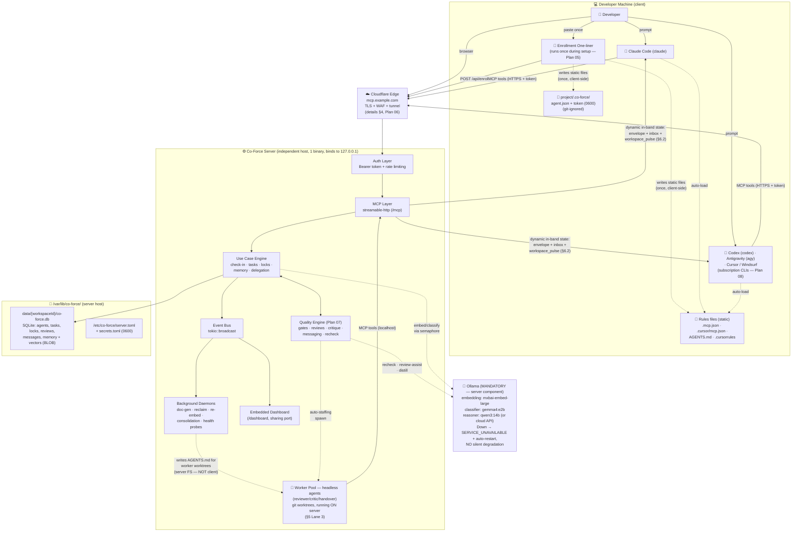
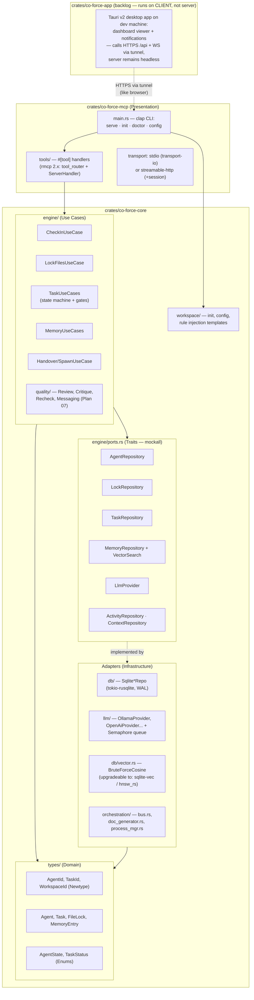
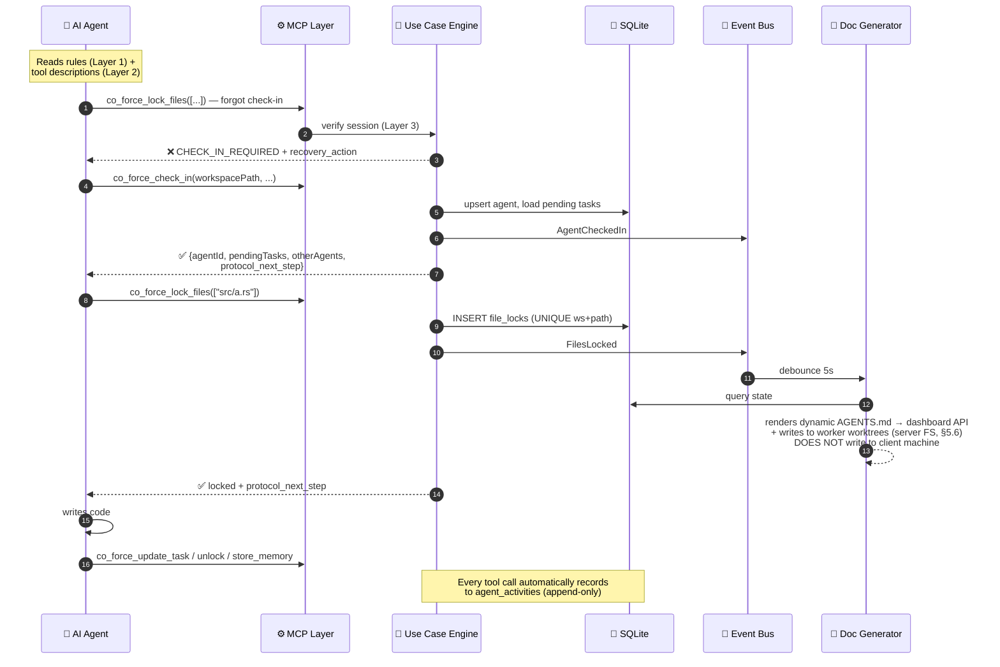
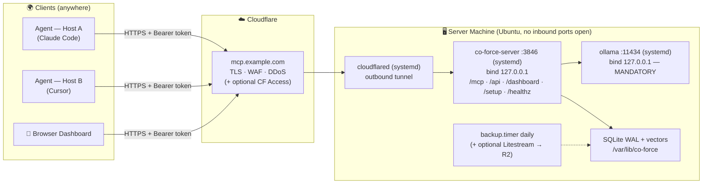
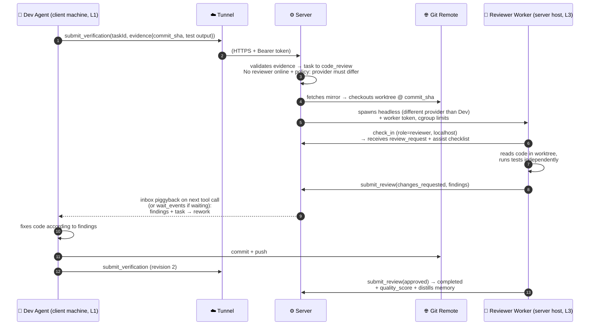
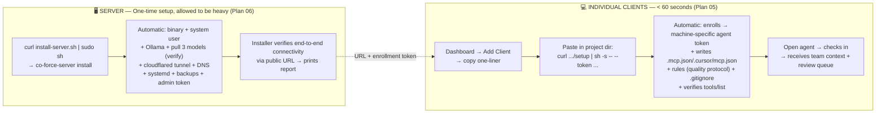
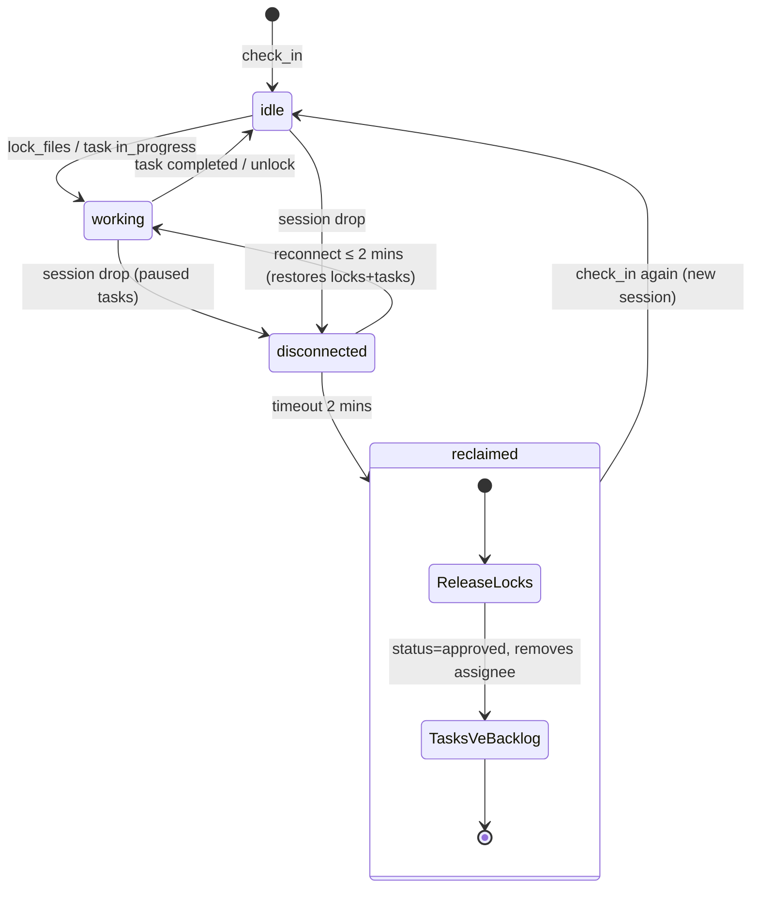

# Co-Force — Unified Architecture Specification

**Date:** 2026-07-08 (v2 — updated for a single, product-ready release, see `plans/00_roadmap.md`)  
**Status:** Baseline finalized after review (see `review_findings.md` §5–6 for foundational decisions)

This document is the **single source of truth for the system architecture** — replacing scattered and conflicting diagrams in URD §5. In case of discrepancies between the URD and this file, this file takes precedence.

**Core Principles (Master Plan §1):** quality-first (mandatory quality gates — Plan 07) · no degraded mode with cut features (Ollama is **mandatory** on the server, fail-loud + auto-heals) · heavy server, light client (clients do not install binaries) · independent server exposed via a **cloudflared tunnel** · **the server is always headless** (bare-metal systemd or Docker — Plan 06); all GUIs (web dashboards, future Tauri apps) are **clients** accessing the server via HTTPS.

**Consequence of the One-Way Tunnel (read before viewing diagrams):** The server **never** makes inbound connections to the client machine's filesystem. All project files on the client (`.mcp.json`, rules, `.co-force/`) are written by the **enrollment script once during setup**; all **dynamic states** (locks, tasks, team, inbox) are delivered **in-band** inside tool responses (§6.2), not via files.

---

## 1. System Context — The Big Picture



**Key Points:**
- **The server is always headless** — a single binary containing the MCP server + web dashboard + quality engine + daemons; runs bare-metal (systemd) or via **Docker Compose** (Plan 06 §2.1). No GUI on the server.
- **No binaries installed on clients** — developer agents communicate via streamable HTTP directly to the public URL using Bearer tokens (Plan 05). The Tauri application (backlog) is a **client-side application**, calling HTTPS endpoints just like a browser.
- **The server never writes files to the client:** static files (rules, config) are written by the enrollment script once; dynamic states are delivered in-band via tool responses. The doc-generator strictly writes files on the server's own filesystem (for worker worktrees) and renders them for the dashboard. Details in §5.6.
- Solid arrows = mandatory flows; dashed arrows = background/supplementary flows.

---

## 2. Crate & Layer Architecture (Clean Architecture)



**Dependency Rules:** `types/` has no dependencies; `engine/` depends only on `types/` + traits in `ports.rs`; adapters implement ports traits; `co-force-mcp` strictly calls use cases — it contains zero business logic. All use cases receive `Arc<dyn Trait>` via `new()` (DIP, mocked using `mockall`).

---

## 3. Runtime Flows — Tool Calls with Interlocking Guardrails



**Session Binding by Transport (replaces old URD SSE description):**
- **stdio:** 1 process = 1 agent = 1 session → natural binding, the agent never needs to remember or pass its `agentId`.
- **Streamable HTTP:** the rmcp session feature provides an `Mcp-Session-Id` header; the server maps the session to the agent record in RAM. If the session drops → the agent is marked `disconnected` → 2-minute grace period starts → reclaim daemon runs (releases locks, returns tasks to backlog). Reconnecting within the grace period restores the session state.

---

## 4. Production Deployment — Independent Server + Cloudflare Tunnel



- **Security:** the only ingress is the tunnel; authentication via Bearer tokens per client machine (independently revocable); rate limiting per token. Details in Plan 06 §4.
- **Long-polling `wait_events`** is capped at 55s per poll to fit under Cloudflare's ~100s proxy timeout (Plan 06 §3.1).
- **LAN/Local Variant:** same binary, **same features** (Ollama remains mandatory) — simply bypasses cloudflared, client points to `http://<lan-ip>:3846/mcp`. No reduced feature sets exist.

---

## 5. A2A Execution Model in Production (where agents run, spawn/handover workflow)

### 5.1 Three Foundational Constraints

1. **The Tunnel is One-Way:** The server cannot open inbound connections to the client machine (no SSH, no push commands). All server communication to the client goes in-band via tool responses, inbox piggybacking, or `wait_events` long-polling.
2. **Code resides on client machines**, the server strictly holds state/memory/reviews. If the server needs to *read* code for reviews, it must fetch it via the **git remote** — no other path exists.
3. **No binaries installed on clients** (principle N3) — no Co-Force client daemon exists to execute spawn commands.

From these constraints, agent execution is split across **3 lanes**:

| Lane | Agent Type | Runs Where | Process Spawner | Used For |
| :--- | :--- | :--- | :--- | :--- |
| **L1 — Interactive** | User-driven (Claude Code, Cursor) | Client machine | User opens IDE/CLI | Core development: coding, drafting tasks |
| **L2 — Spawn-by-directive** | Background, same machine as requester | Client machine | **The requesting agent executes the command** returned by the server (all agents have shell tools) | Delegating tasks requiring local files not yet pushed; handovers while client is active |
| **L3 — Server Worker Pool** | Headless worker | **Server host**, inside a git worktree sandbox | Server (ProcessManager, Plan 03) | Auto-staffing reviewers/critics, resource-intensive rechecks, handovers when client is offline, independent delegated tasks |

Supported Provider CLIs (subscription-first — specs, headless flags, MCP configs, auth markers per provider: **Plan 08**): Claude Code (`claude`), Codex CLI (`codex`), Antigravity CLI (`agy`), Cursor CLI — declared in config registry, not hardcoded (F-05).

### 5.2 Lane 2 — Spawn-by-directive (server cannot reach client machine → delegates execution)

1. Agent A calls `co_force_spawn_agent({provider, taskId, placement: "local", context})`.
2. The server validates the request: checks quality policies, `max_spawn_depth`, budget limits → prepares the **bootstrap package**: bootstrap prompt (taskId + state summary + protocol rules) + short-lived scoped agent token for the child process.
3. The server **does not run the process** — it returns a `spawn_directive: {command, args, env, cwd}` — a complete command executing the provider CLI in non-interactive/background mode.
4. Agent A executes the directive locally using its own shell tool. The child process starts inside the local workspace → reads rules → calls `check_in` with the specified role → claims the task.
5. Server monitoring: if the child agent fails to check in within the `spawn_timeout` (120s) → alerts Agent A via the inbox with diagnostics (missing CLI? command failed?).

### 5.3 Lane 3 — Server Worker Pool (headless, git-based)

**Activation Conditions** (configured during server installation or workspace enrollment — Plan 06):
- Workspace has a git remote configured + server is provisioned with a **read-only deploy key** (mandatory); push permission permitted for `co-force/*` branches (optional, only if workers write code).
- Provider CLIs + API keys installed on the server (optional installer step).

**Mechanisms:**
```
/var/lib/co-force/workspaces/{wsId}/
├── mirror.git                      # bare clone, fetched when a job triggers (and cron every 10 mins)
└── jobs/{taskId}/                  # git worktree per job — isolated sandbox,
                                    # deleted after job completion
```
1. The Quality Engine needs an absent role (e.g. reviewer for task X) → creates a job.
2. ProcessManager: fetches mirror → checkouts **the exact `commit_sha`** declared by the developer in `submit_verification` to a private worktree → spawns the headless provider CLI (`claude -p` / `codex exec` / `agy -p` — specs + caveats per provider: **Plan 08 §3**) with the MCP config pointing to `localhost:3846` + the worker token; limited by resource quotas (nice/cgroup), timeouts, and token budgets.
3. The worker checks in as a normal agent (reviewer role, provider ≠ author if required by policy) → receives the `review_request` → **reads actual code in the worktree** → calls `submit_review(findings)`.
4. Outputs take two forms:
   - **Data-only** (default — sufficient for reviewers/critics/rechecks): findings/critique returned via MCP, no code modified.
   - **Code** (only if permitted): commits to the branch `co-force/{taskId}` → pushes to origin → client pulls / creates a PR. **Workers never push directly to main.**
5. Job completes → worktree is deleted, worker process is reaped; the entire execution path is logged in `agent_activities` + displayed on the dashboard (can be terminated from the UI).

### 5.4 Placement Decision Matrix (spawn & handover)

| Scenario | Selected Lane |
| :--- | :--- |
| Needs to read/write local files **not yet pushed** | L2 (only feasible option) |
| Missing role (reviewer/critic) and code has been pushed to remote | **L3 preferred** — conserves dev machine resources, simplifies provider diversity enforcement |
| Handover: agent is running out of context **or hitting rate limits** but can still call tools | Handover package (validated) + locks to **escrow tied to task** → prioritize **online agent of different provider** (offer via inbox) → L3 if pushed → L2 same machine if local code is not pushed. Provider cooldown is recorded. Details: Plan 03 §5 |
| Client dies suddenly (no handover sent) | Reclaim after 2-minute grace period; **if another provider agent is online → auto-sends offer** with a server-synthesized package (task + activity journal + git state); if WIP is pushed → L3; if nothing is available → task returns to backlog + alerts |
| Workspace has no git remote | Strictly L1/L2; requesting L3 returns `SPAWN_DENIED {reason: "no_remote_for_server_placement"}` — reports clearly, never bypasses gates |

### 5.5 Code & Lock Synchronization across Machines

- **Source of truth for code = git remote.** File locks are **logical path claims** in the central DB: preventing two agents (regardless of host, including L3 workers) from *claiming work* on the same files — conflicts are blocked at task assignment, not during merge.
- Final merges go through git; the `code_review` gate (Plan 07) stands before merge, ensuring unreviewed code cannot enter main.

### 5.6 Dynamic Context for Clients — Delivered In-Band, NOT via Files

The old local-server design (URD UC-36, Layer 4) had the server write dynamic `AGENTS.md`/`session_status.json` directly into the workspace — **impossible in production** since the server cannot access the client filesystem. Replaced by in-band delivery, separated by content type:

| Content | Nature | Production Mechanism |
| :--- | :--- | :--- |
| Protocol rules, MCP configs, check-in instructions | **Static** (unchanged by state) | Enrollment script writes once during setup (Plan 05 §3); re-run one-liner to update rules version |
| Active locks/tasks/team/inbox states | **Dynamic** | **In-Band**: delivered inside `check_in` payload + `workspace_pulse` and `inbox` piggybacking in EVERY tool response (§6.2) + `wait_events`. Agents always have the latest state *in their conversation context* — more reliable than files (never stale, requires no manual reading) |
| Complete dynamic AGENTS.md (agents, locks, backlog) | Dynamic | Server renders and (a) writes to **L3 worker worktrees** (server FS — worker reads like a normal file), (b) serves at `GET /api/workspaces/{id}/agents.md` for the dashboard/humans; client agents wanting a snapshot call `co_force_workspace_status` |
| `session_status.json` | Dynamic | **Removed in production** — replaced by in-band `workspace_pulse`. Retained strictly for LAN setups where server and workspace share a filesystem |

Consequences for 4-Layer Guardrails (URD §9): Layer 1 (static rules) is written via enrollment; Layer 2 (tool descriptions) remains unchanged; Layer 3 (interlocking errors) remains unchanged and acts as the primary barrier; **Layer 4 shifts form** from "server-written local files" to "in-band states in all responses" — achieving the same goal (agents cannot avoid seeing coordination states) with a production-compatible mechanism.

### 5.7 End-to-End Sequence: Complete A2A Flow in Production



---

## 6. MCP Tool Interface — Protocol Details

> The client side of this protocol — **how agents learn to interact with these tools** (rules templates, tool descriptions, guide commands, playbooks, uniform behavior enforcement matrix) — is specified in **Plan 09 (Agent Operating Protocol)**.

### 6.1 Agent Connection Lifecycle

1. **Config:** The client reads `.mcp.json` (written by the enrollment script): `{"type":"http", "url":"https://mcp.example.com/mcp", "headers":{"Authorization":"Bearer <agent-token>"}}`.
2. **Initialize:** The MCP `initialize` handshake occurs over streamable HTTP → the server issues an `Mcp-Session-Id` header (all subsequent requests carry this header). The auth layer maps the token to the machine/identity before the request reaches the MCP layer.
3. **Check-in:** The agent calls `co_force_check_in(workspacePath, agentName, role)` → server **binds session ↔ agent record**. From this point on, all tool calls automatically infer `agentId` from the session context — **no tools require the agent to remember or pass its agentId** (preventing identity loss during context compaction).
4. **Tool Calls:** JSON-RPC `tools/call` over POST `/mcp`; all responses follow the envelope schema in §6.2.
5. **Disconnect:** Session drops → agent marked `disconnected`, tasks `paused` → 2-minute grace period starts → reclaim daemon executes (§9). Reconnecting within the grace period restores the session state.

### 6.2 Response Envelope (applies to all tools)

```json
{
  "status": "success",
  "data": { "...business logic result..." },
  "inbox": {
    "unread": 2,
    "urgent": [
      {"messageId": "m-91", "kind": "review_request", "from": "Agent-Beta",
       "summary": "Review task 'Auth API' — 3 files, checklist attached"}
    ]
  },
  "protocol_next_step": "You have 1 blocking review_request. Handle it via co_force_respond_message or begin the review before continuing your own task.",
  "workspace_pulse": {"agents_online": 3, "tasks_at_gates": 2, "server_health": "healthy"}
}
```

- **`inbox` piggybacks on EVERY response** — the primary channel for the server to communicate through the one-way tunnel: active agents receive real-time messages without explicit polling.
- **`protocol_next_step`** — directs the agent's next action; LLMs comply as it resides directly in their active context window.
- On error:

```json
{
  "status": "error",
  "error": {
    "code": "CHECK_IN_REQUIRED",
    "message": "Protocol Violation: State is [INIT]...",
    "recovery_action": "co_force_check_in(workspacePath)",
    "retry_after_secs": null
  }
}
```

### 6.3 Standard Error Codes (agents self-correct via `recovery_action`)

| Code | When | Typical `recovery_action` |
| :--- | :--- | :--- |
| `UNAUTHORIZED` | Token invalid, expired, or revoked | Re-run the enrollment one-liner |
| `CHECK_IN_REQUIRED` | Tool called before checking in (Layer 3 interlocking) | `co_force_check_in(...)` |
| `LOCK_CONFLICT` | File already locked by another agent | `co_force_check_conflicts` → coordinate/delegate |
| `GATE_VIOLATION` | Attempted invalid task state transition (e.g. setting `completed` directly) | `co_force_submit_verification(...)` |
| `EVIDENCE_STALE` | Evidence bound to an older revision, or `commit_sha` missing in mirror (unpushed — F-21) | Re-run tests / push commit → submit again |
| `SPAWN_DENIED` | Depth exceeded / remote missing / provider not in allowlist | Explains the specific cause |
| `HANDOVER_INCOMPLETE` | Handover package missing fields or ambiguous (Plan 03 §5.2) | Complete the missing fields indicated and retry |
| `SERVICE_UNAVAILABLE` | Server component down (LLM, DB, etc.) — fail-loud N2 | Retry after `retry_after_secs`; alerts sent to ops |
| `PARTIAL_INDEX` (warning with data) | Recall called while re-indexing is running | Return results with `pending_count` — transparent confidence |
| `RATE_LIMITED` | Token rate limit exceeded | Backoff and retry after `retry_after_secs` |

### 6.4 Catalog of 39 MCP Tools (finalized for 1.0)

| # | Tool | Summary | Session/Gate Notes |
| :- | :--- | :--- | :--- |
| **Identity** | | | |
| 1 | `co_force_check_in` | Registers/restores session, returns tasks + team + inbox | Does not require binding header |
| 2 | `co_force_whoami` | Displays identity, active tasks, active locks | |
| 3 | `co_force_guide` | Dynamic onboarding guide based on current workspace policy/state | Does not require binding header |
| **Task** | | | |
| 4 | `co_force_create_tasks` | Drafts tasks (objective/use cases/verification plan) | → enters `spec_review` |
| 5 | `co_force_list_tasks` | Filters tasks by status/agent/gate | |
| 6 | `co_force_update_task` | Updates progress/details | Cannot set `completed` directly (`GATE_VIOLATION`) |
| 7 | `co_force_approve_tasks` | Records user approval for tasks | Only from `awaiting_approval` |
| 8 | `co_force_recheck_tasks` | Triggers reasoner spec validation | Server-side LLM |
| 9 | `co_force_delegate_task` | Delegates task to another agent (with avoidFiles, context) | |
| 10 | `co_force_submit_verification` | Submits verification evidence (test output + `commit_sha`) | Mandatory gate before review |
| **Locks** | | | |
| 11 | `co_force_lock_files` | Locks file paths exclusively (workspace-wide) | |
| 12 | `co_force_unlock_files` | Releases file locks | |
| 13 | `co_force_check_conflicts` | Checks which files are locked by whom | |
| **Awareness** | | | |
| 14 | `co_force_list_agents` | Lists online agents (dev + L3 workers) and their states | |
| 15 | `co_force_workspace_status` | Metrics + gates waiting + health status | |
| 16 | `co_force_get_agent_context` | Displays recent activities/context of another agent | |
| 17 | `co_force_get_workspace_activity` | Append-only workspace activity log | |
| **Messaging / A2A** | | | |
| 18 | `co_force_send_message` | Sends message to specific agent or role | |
| 19 | `co_force_respond_message` | Responds to message via correlationId | |
| 20 | `co_force_wait_events` | Long-polls ≤ 55s for messages/gate events (standby mode) | Cloudflare compatible |
| 21 | `co_force_share_context` | Shares specific context blocks (lazy resolution) | |
| 22 | `co_force_spawn_agent` | Requests spawn → returns `spawn_directive` (L2) or starts worker (L3) | Placement matrix §5.4 |
| 23 | `co_force_handover` | Handover on context limits or rate limits (validated package + WIP) | Locks escrowed, transferred atomically — cross-provider: Plan 03 §5 |
| 39 | `co_force_plan_team` | Solo/PM: analyzes backlog → estimates team (dev/reviewer/qa/ba) + spawns | Plan 10 §3; includes check_in solo nudge |
| **Quality** | | | |
| 24 | `co_force_request_review` | Requests review (typically auto-triggered by verification) | Separation of duties enforced |
| 25 | `co_force_submit_review` | Structural review verdict + findings | Reviewer ≠ author |
| 26 | `co_force_request_critique` | Requests multi-agent critiques for architecture/specs | Prioritizes provider diversity |
| 27 | `co_force_submit_critique` | Structured critique response (position, risks, options) | |
| **RAG / Memory** | | | |
| 28 | `co_force_store_memory` | Stores + auto-classifies workspace memory/knowledge/skills | |
| 29 | `co_force_recall` | Semantic search (returns transparent index status) | |
| 30 | `co_force_classify` | Classifies standalone content blocks | |
| 31 | `co_force_create_skill` | Creates a manual skill entry | |
| 32 | `co_force_list_skills` | Lists skills by category | |
| 33 | `co_force_get_skill` | Reads SKILL.md contents | |
| 34 | `co_force_consolidate_memory` | Triggers manual memory consolidation (outside nightly timer) | |
| **Config / Admin** | | | |
| 35 | `co_force_config` | Reads/writes config at runtime (subject to token scopes) | |
| 36 | `co_force_register_role` | Modifies agent role in workspace | |
| 37 | `co_force_quality_policy` | Reads/modifies workspace quality policy | Requires admin token |
| 38 | `co_force_health` | Returns detailed component health metrics | Requires token |

---

## 7. Storage Layout

```
# SERVER HOST (production — set up by installer; local dev setups mirror this structure in ~/.co-force/)
/etc/co-force/
├── server.toml                     # bindings, public_url, LLM providers/models, quality defaults
├── secrets.toml                    # API keys (0600)
└── .install-state.json             # installer checkpoints for resumption
/var/lib/co-force/
├── server.db                       # SERVER-LEVEL DB (F-17): api_tokens, workspaces registry,
│                                   # audit_logs — resolved before workspace context is loaded;
│                                   # admin/enrollment token scope is "*"
└── data/
    └── {workspaceId}/
        └── co-force.db             # SQLite per-workspace: agents, tasks, file_locks,
                                    # memory_entries (embedding BLOB), skills,
                                    # embedding_cache, agent_activities, shared_contexts,
                                    # agent_messages, reviews, critiques,
                                    # verification_records, quality_policies,
                                    # quality_scores
/var/lib/co-force/workspaces/       # Worker Pool (§5.3)
└── {wsId}/
    ├── mirror.git                  # bare clone via deploy key (read-only)
    └── jobs/{taskId}/              # git worktree sandbox per job (deleted post-job)
/var/backups/co-force/              # daily backups (tar.zst), retaining 14 archives
/var/log/co-force/

# INDIVIDUAL PROJECTS (client-side — written ONCE by the setup enrollment script;
# the server NEVER writes files directly here. .gitignore is added BEFORE tokens are written)
<project>/.co-force/
├── agent.json                      # serverUrl + workspaceId (static)
└── token                           # local machine's agent token (0600, static)
# Dynamic states (locks/tasks/team/inbox) are delivered IN-BAND via tool responses.
# Static rules are in the project root (AGENTS.md managed block).
# Skills: retrieved via co_force_get_skill (content returned in-band).
```

The separate `embedvec-index/` directory is removed — vectors reside directly in `co-force.db` (decision F-02).

---

## 8. Setup & Onboarding Workflow (heavy server init · < 60s client setup)



All setup complexity is concentrated on the server (installed once, self-managing); clients do not install binaries, require no sudo permissions, and require no manual configuration. If the server is `degraded`, clients are notified clearly instead of receiving lower-quality fallback results.

---

## 9. Agent Lifecycle State Machine



(The `chmod -w` workspace write protection during reclaim runs strictly in strict mode — decision F-04.)

**Task State Machine** (draft → spec_review → awaiting_approval → approved → in_progress → verification → code_review → completed, with rework loops): detailed in Plan 07 §3 — the core engine enforcing quality gates.
