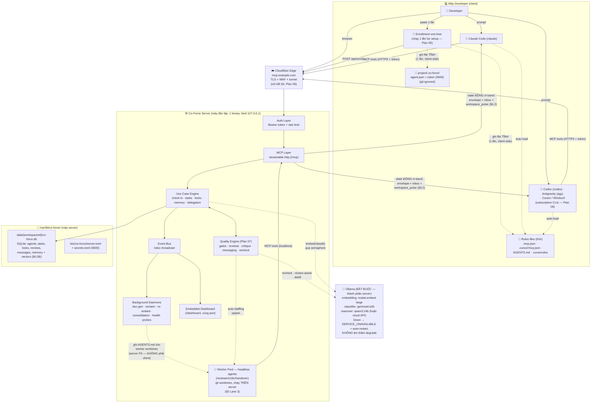
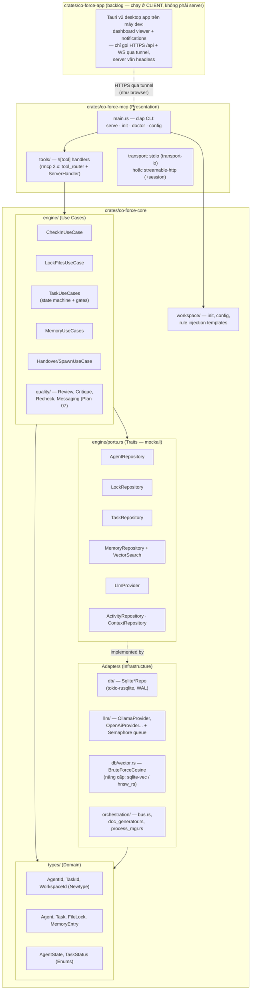
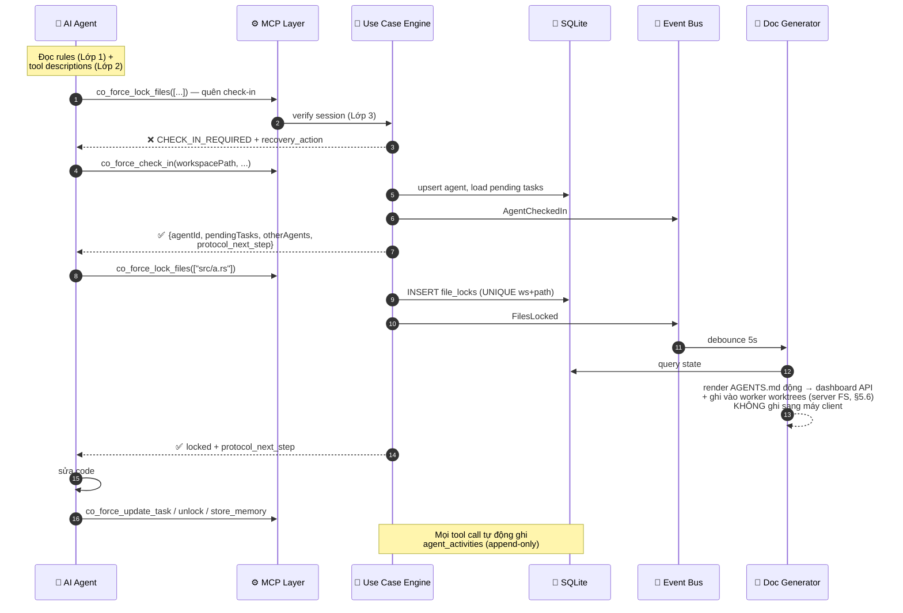
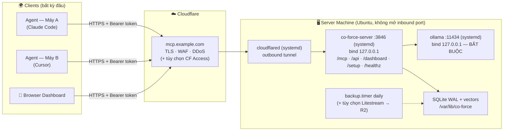
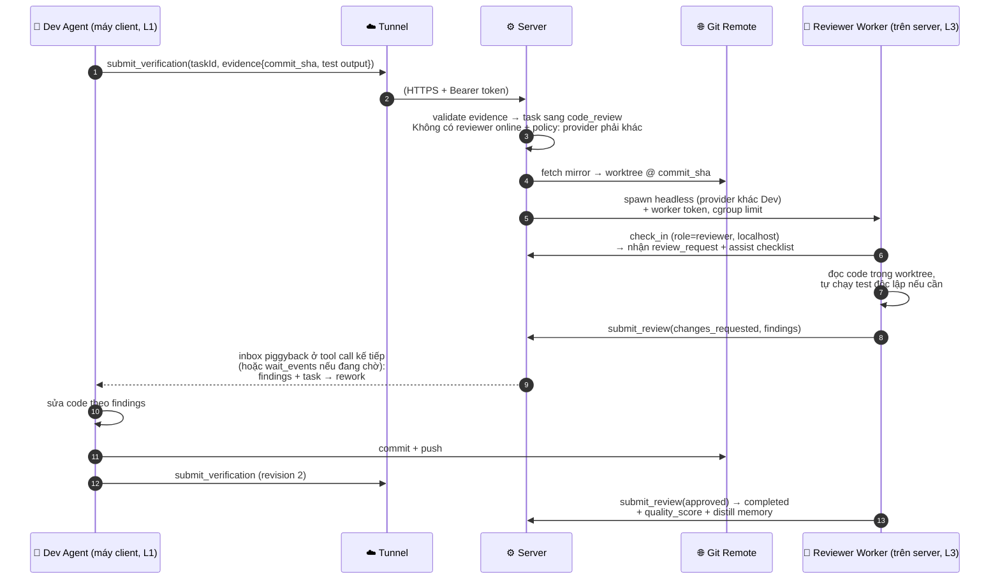
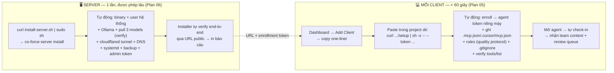
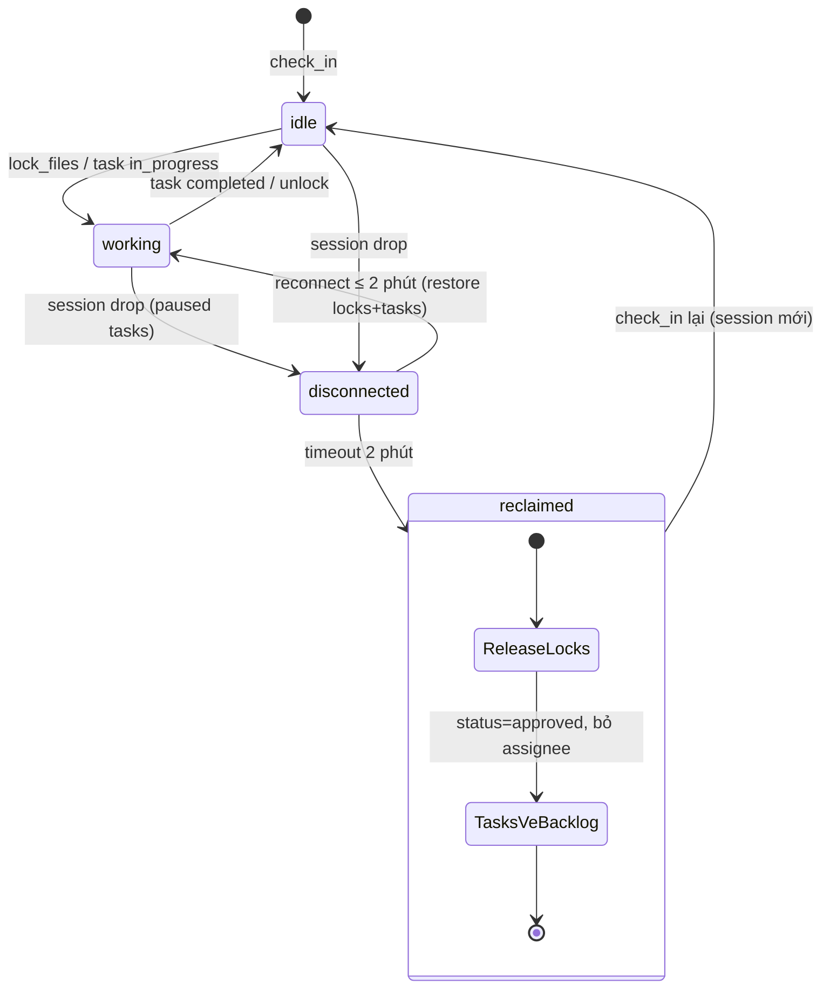

# Co-Force — Sơ đồ Kiến trúc Tổng hợp

**Ngày:** 2026-07-08 (v2 — cập nhật theo định hướng product-ready một release, xem `plans/00_roadmap.md`)
**Trạng thái:** Chốt sau review (`review_findings.md` §5–6 cho các quyết định nền tảng)

Tài liệu này là **nguồn sự thật duy nhất về kiến trúc** — thay thế các sơ đồ rải rác và mâu thuẫn trong URD §5. Khi URD và file này lệch nhau, file này thắng.

**Nguyên tắc chi phối (Master Plan §1):** quality-first (quality gates bắt buộc — Plan 07) · không có degraded mode cắt tính năng (Ollama **bắt buộc** trên server, fail-loud + auto-heal) · server nặng, client nhẹ (client không cần cài binary) · server độc lập expose qua **cloudflared tunnel** · **server luôn headless** (bare-metal systemd hoặc Docker — Plan 06); mọi GUI (dashboard web, Tauri app tương lai) đều là **client** truy cập qua HTTPS.

**Hệ quả của tunnel một chiều (đọc trước khi xem sơ đồ):** server **không bao giờ** chạm được vào filesystem của máy client. Mọi file trong project client (`.mcp.json`, rules, `.co-force/`) do **enrollment script ghi một lần lúc setup**; mọi **state động** (locks, tasks, team, inbox) được deliver **in-band** trong tool response (§6.2), không phải qua file.

---

## 1. System Context — Bức tranh toàn cảnh



**Điểm mấu chốt:**
- **Server luôn headless** — một binary chứa MCP server + dashboard (web tĩnh) + quality engine + daemons; chạy bare-metal (systemd) hoặc **Docker Compose** (Plan 06 §2.1). Không có GUI trên server.
- **Client không cài gì** — agent client nói streamable HTTP thẳng tới URL public với Bearer token (Plan 05). Tauri app (backlog) cũng là **ứng dụng phía client**, chỉ gọi HTTPS như browser.
- **Server không bao giờ ghi file sang client:** file tĩnh (rules, config) do enrollment script ghi 1 lần; state động đi in-band qua tool response. Doc-generator chỉ ghi file trên filesystem của chính server (worker worktrees) và render cho dashboard. Chi tiết §5.6.
- Mũi tên liền = luồng bắt buộc; mũi tên đứt = luồng nền/phụ trợ.

---

## 2. Kiến trúc Crate & Layer (Clean Architecture)



**Quy tắc phụ thuộc:** `types/` không phụ thuộc gì; `engine/` chỉ biết `types/` + traits trong `ports.rs`; adapters implement traits; `co-force-mcp` chỉ gọi use cases — không chứa business logic. Mọi use case nhận `Arc<dyn Trait>` qua `new()` (DIP, mock được bằng `mockall`).

---

## 3. Luồng Runtime — Tool call với Interlocking Guardrails



**Session binding theo transport (thay thế mô tả SSE cũ trong URD):**
- **stdio:** 1 process = 1 agent = 1 session → binding tự nhiên, agent không bao giờ cần nhớ `agentId`.
- **Streamable HTTP:** rmcp session feature cấp `Mcp-Session-Id`; server map session → agent record trong RAM. Session drop → agent `disconnected` → grace period 2 phút → reclaim (nhả locks, trả task về backlog).

---

## 4. Triển khai Production (chuẩn) — Server độc lập + Cloudflare Tunnel



- **Bảo mật:** đường vào duy nhất là tunnel; auth Bearer token per máy client (revoke độc lập); rate limit per token. Chi tiết Plan 06 §4.
- **Long-poll `wait_events`** giới hạn 55s/lượt để nằm dưới timeout ~100s của Cloudflare proxy (Plan 06 §3.1).
- **Biến thể LAN/local:** cùng binary, cùng **đầy đủ tính năng** (Ollama vẫn bắt buộc) — chỉ bỏ bước cloudflared, client trỏ `http://<lan-ip>:3846/mcp`. Không tồn tại "chế độ rút gọn".

---

## 5. Mô hình Thực thi A2A trong Production (agents chạy Ở ĐÂU, spawn/handover NHƯ THẾ NÀO)

### 5.1 Ba ràng buộc nền tảng quyết định thiết kế

1. **Tunnel là một chiều:** server không thể mở kết nối tới máy client (không SSH, không push command). Mọi thứ server muốn "nói" với client chỉ đi được qua 3 kênh mà client chủ động mở: tool response, inbox piggyback, và `wait_events` long-poll.
2. **Code nằm trên máy client**, server chỉ giữ state/memory/reviews. Server muốn *đọc* code để review thì phải lấy qua **git remote** — không có đường nào khác.
3. **Client không cài binary** (nguyên tắc N3) — không có daemon Co-Force nào ở client để nhận lệnh spawn.

Từ 3 ràng buộc này, agents thực thi theo **3 lane**:

| Lane | Loại agent | Chạy ở đâu | Ai khởi động process | Dùng cho |
| :--- | :--- | :--- | :--- | :--- |
| **L1 — Interactive** | User-driven (Claude Code, Cursor) | Máy client | User mở IDE/CLI | Công việc chính: code, draft tasks |
| **L2 — Spawn-by-directive** | Background, cùng máy với requester | Máy client | **Agent yêu cầu spawn tự chạy lệnh** mà server trả về (agent nào cũng có shell tool) | Delegate việc cần file local chưa push; handover khi máy client còn sống |
| **L3 — Server Worker Pool** | Headless worker | **Máy server**, trong git worktree sandbox | Server (ProcessManager, Plan 03) | Auto-staffing reviewer/critic, recheck nặng, handover khi client offline, delegated task độc lập |

Provider CLIs được hỗ trợ (subscription-first — spec, flags headless, MCP config, auth markers per provider: **Plan 08**): Claude Code (`claude`), Codex CLI (`codex`), Antigravity CLI (`agy`), Cursor CLI — registry khai báo trong config, không hardcode (F-05).

### 5.2 Lane 2 — Spawn-by-directive (server không chạm được máy client → mượn tay agent)

1. Agent A gọi `co_force_spawn_agent({provider, taskId, placement: "local", context})`.
2. Server validate: quality policy, `max_spawn_depth`, budget → chuẩn bị **bootstrap package**: bootstrap prompt (taskId + state summary + protocol rules) + scoped agent token TTL ngắn cho process con.
3. Server **không chạy gì cả** — trả về `spawn_directive: {command, args, env, cwd}` — lệnh hoàn chỉnh chạy provider CLI ở chế độ non-interactive/background.
4. Agent A tự thực thi directive bằng shell tool của chính nó. Process con khởi động ngay trong workspace local → đọc rules → `check_in` với role được chỉ định → claim task.
5. Server giám sát: không thấy check-in của agent con trong `spawn_timeout` (120s) → báo lại Agent A qua inbox kèm chẩn đoán (CLI thiếu? command fail?).

### 5.3 Lane 3 — Server Worker Pool (headless, git-based)

**Điều kiện kích hoạt** (cấu hình lúc cài server hoặc enroll workspace — Plan 06):
- Workspace có git remote + server được cấp **read-only deploy key** (bắt buộc); quyền push branch `co-force/*` (tùy chọn, chỉ khi cho phép worker viết code).
- Provider CLI + API key cài trên server (bước tùy chọn của installer).

**Cơ chế:**
```
/var/lib/co-force/workspaces/{wsId}/
├── mirror.git                      # bare clone, fetch khi có job (và cron 10 phút)
└── jobs/{taskId}/                  # git worktree per job — sandbox cô lập,
                                    # xóa sau khi job xong
```
1. Quality Engine cần role thiếu (vd reviewer cho task X) → tạo job.
2. ProcessManager: fetch mirror → checkout **đúng `commit_sha`** mà developer khai trong `submit_verification` vào worktree riêng → spawn provider CLI headless (`claude -p` / `codex exec` / `agy -p` — spec + caveats per provider: **Plan 08 §3**) với MCP config trỏ `localhost:3846` + worker token; giới hạn tài nguyên (nice/cgroup), timeout, token budget.
3. Worker check-in như một agent bình thường (role reviewer, provider ≠ tác giả nếu policy yêu cầu) → nhận `review_request` → **đọc code thật trong worktree** → `submit_review(findings)`.
4. Output hai dạng:
   - **Data-only** (mặc định — đủ cho reviewer/critic/recheck): findings/critique trả về qua MCP, không đụng code.
   - **Code** (chỉ khi được phép): commit trên branch `co-force/{taskId}` → push origin → client pull/tạo PR. **Worker không bao giờ push thẳng main.**
5. Job xong → worktree xóa, worker process reaped; toàn bộ hành trình nằm trong `agent_activities` + hiển thị trên dashboard (kill được từ UI).

### 5.4 Ma trận quyết định Placement (spawn & handover)

| Tình huống | Lane được chọn |
| :--- | :--- |
| Cần sửa/đọc file local **chưa push** | L2 (duy nhất khả thi) |
| Cần role bù (reviewer/critic) và code đã có trên remote | **L3 ưu tiên** — không tốn tài nguyên máy dev, đảm bảo diversity provider dễ hơn |
| Handover: agent sắp cạn context nhưng còn gọi được tool | Server hướng dẫn qua `protocol_next_step`: commit + push WIP branch → L3 tiếp tục; hoặc L2 nếu tiếp tục trên cùng máy |
| Client chết đột ngột (không kịp handover) | Reclaim sau grace 2 phút; có WIP branch đã push → L3 tiếp tục được; không có → task về backlog chờ client |
| Workspace không có git remote | Chỉ L1/L2; yêu cầu L3 → `SPAWN_DENIED {reason: "no_remote_for_server_placement"}` — báo rõ, không âm thầm bỏ gate |

### 5.5 Đồng bộ code & locks đa máy

- **Nguồn sự thật code = git remote.** File locks là **logical path claims** trong DB trung tâm: ngăn hai agent (bất kể máy nào, kể cả worker L3) *nhận việc* trên cùng files — xung đột bị chặn từ lúc phân việc, không phải lúc merge.
- Merge cuối cùng vẫn qua git; gate `code_review` (Plan 07) đứng trước merge nên code chưa qua review không có đường vào main.

### 5.6 Context động cho client — KHÔNG dùng file, dùng in-band delivery

Thiết kế local-server cũ (URD UC-36, Lớp 4) cho server ghi trực tiếp `AGENTS.md`/`session_status.json` động vào workspace — **bất khả thi trong production** vì server không chạm được filesystem client. Cơ chế thay thế, phân theo loại nội dung:

| Nội dung | Bản chất | Cơ chế trong production |
| :--- | :--- | :--- |
| Protocol rules, MCP config, hướng dẫn check-in | **Tĩnh** (không đổi theo state) | Enrollment script ghi 1 lần lúc setup (Plan 05 §3); re-run one-liner khi cần update version rules |
| Locks/tasks/team/inbox hiện hành | **Động** | **In-band**: payload của `check_in` + `workspace_pulse` và `inbox` piggyback trong MỌI tool response (§6.2) + `wait_events`. Agent luôn có state mới nhất *ngay trong context hội thoại* — thực tế còn tin cậy hơn file (không bao giờ stale, không cần agent nhớ đi đọc) |
| AGENTS.md động đầy đủ (bảng agents, locks, pending) | Động | Server render và (a) ghi vào **worker worktrees L3** (server FS — worker đọc như file thường), (b) serve tại `GET /api/workspaces/{id}/agents.md` cho dashboard/con người; agent client nào muốn bản snapshot thì gọi `co_force_workspace_status` |
| `session_status.json` | Động | **Bỏ trong production** — thay bằng `workspace_pulse` in-band. Chỉ còn dùng ở biến thể LAN khi server và workspace chung filesystem |

Hệ quả cho 4-Layer Guardrails (URD §9): Lớp 1 (rules tĩnh) giữ nguyên qua enrollment; Lớp 2 (tool descriptions) giữ nguyên; Lớp 3 (interlocking errors) giữ nguyên và là lớp chủ lực; **Lớp 4 đổi hình thái** từ "file cục bộ server ghi" thành "in-band state trong mọi response" — cùng mục đích (agent không thể không nhìn thấy trạng thái phối hợp), cơ chế khả thi hơn.

### 5.7 Sơ đồ end-to-end: một vòng A2A hoàn chỉnh trong production



---

## 6. MCP Tool Interface — Giao thức chi tiết trong Production

### 6.1 Vòng đời kết nối của một agent client

1. **Config:** client đọc `.mcp.json` (do enrollment script ghi): `{"type":"http", "url":"https://mcp.example.com/mcp", "headers":{"Authorization":"Bearer <agent-token>"}}`.
2. **Initialize:** MCP `initialize` handshake qua streamable HTTP → server cấp `Mcp-Session-Id` (mọi request sau mang header này). Auth layer đã map token → máy/identity trước khi request tới MCP layer.
3. **Check-in:** agent gọi `co_force_check_in(workspacePath, agentName, role)` → server **bind session ↔ agent record**. Từ đây mọi tool call được tự suy ra `agentId` từ session — **không tool nào yêu cầu agent nhớ/truyền agentId** (chống trôi định danh khi context bị compact).
4. **Tool calls:** JSON-RPC `tools/call` qua POST `/mcp`; mọi response theo envelope §6.2.
5. **Đứt kết nối:** session drop → agent `disconnected`, tasks `paused` → grace 2 phút → reclaim (§9). Reconnect trong grace → khôi phục nguyên trạng.

### 6.2 Response Envelope (mọi tool đều trả về khuôn này)

```json
{
  "status": "success",
  "data": { "...kết quả nghiệp vụ của tool..." },
  "inbox": {
    "unread": 2,
    "urgent": [
      {"messageId": "m-91", "kind": "review_request", "from": "Agent-Beta",
       "summary": "Review task 'Auth API' — 3 files, checklist đính kèm"}
    ]
  },
  "protocol_next_step": "You have 1 blocking review_request. Handle it via co_force_respond_message or begin the review before continuing your own task.",
  "workspace_pulse": {"agents_online": 3, "tasks_at_gates": 2, "server_health": "healthy"}
}
```

- **`inbox` piggyback trên MỌI response** — đây chính là kênh "server nói với agent" xuyên qua tunnel một chiều: agent càng làm việc càng nhận tin realtime, không cần poll riêng.
- **`protocol_next_step`** — chỉ thị hành động kế tiếp; LLM tuân theo vì nó nằm ngay trong context vừa nạp.
- Khi lỗi:

```json
{
  "status": "error",
  "error": {
    "code": "CHECK_IN_REQUIRED",
    "message": "Protocol Violation: State is [INIT]...",
    "recovery_action": "co_force_check_in(workspacePath)",
    "retry_after_secs": null
  }
}
```

### 6.3 Error codes chuẩn (agent tự sửa sai theo `recovery_action`)

| Code | Khi nào | recovery_action điển hình |
| :--- | :--- | :--- |
| `UNAUTHORIZED` | token sai/revoked/hết hạn | chạy lại enrollment one-liner |
| `CHECK_IN_REQUIRED` | gọi tool khi chưa check-in (Lớp 3 interlocking) | `co_force_check_in(...)` |
| `LOCK_CONFLICT` | file đã bị agent khác claim | `co_force_check_conflicts` → phối hợp/delegate |
| `GATE_VIOLATION` | nhảy cóc state machine (vd set `completed` trực tiếp) | `co_force_submit_verification(...)` |
| `EVIDENCE_STALE` | evidence gắn revision cũ, hoặc `commit_sha` không tồn tại trong mirror (chưa push — F-21) | re-run tests / push commit → submit lại |
| `SPAWN_DENIED` | quá depth / thiếu remote / provider ngoài allowlist | kèm reason cụ thể |
| `SERVICE_UNAVAILABLE` | component server down (LLM, DB...) — fail-loud N2 | retry sau `retry_after_secs`; ops đã được alert |
| `PARTIAL_INDEX` (warning kèm data) | recall khi re-embed đang chạy | kết quả kèm `pending_count` — minh bạch độ tin cậy |
| `RATE_LIMITED` | vượt rpm per token | backoff theo `retry_after_secs` |

### 6.4 Catalog 38 MCP Tools (chốt cho Release 1.0 — signatures chi tiết: URD App. B + Plan 07 §4–6)

| # | Tool | Một dòng | Ghi chú gate/session |
| :- | :--- | :--- | :--- |
| **Identity** | | | |
| 1 | `co_force_check_in` | Đăng ký/khôi phục phiên, nhận pending tasks + team + inbox tồn | Không cần session bind (như `guide`) |
| 2 | `co_force_whoami` | Tôi là ai, đang làm gì, lock gì | |
| 3 | `co_force_guide` | Onboarding guide sinh động theo workspace (policy, team, ví dụ) | Không cần session |
| **Task** | | | |
| 4 | `co_force_create_tasks` | Draft tasks (đủ objective/use cases/verification plan) | → tự động vào `spec_review` |
| 5 | `co_force_list_tasks` | Lọc theo status/agent/gate | |
| 6 | `co_force_update_task` | Cập nhật tiến độ/nội dung | Không set được `completed` trực tiếp (`GATE_VIOLATION`) |
| 7 | `co_force_approve_tasks` | Ghi nhận user approval | Chỉ từ `awaiting_approval` |
| 8 | `co_force_recheck_tasks` | Yêu cầu reasoner recheck lại spec | Server-side LLM |
| 9 | `co_force_delegate_task` | Giao task cho agent khác (kèm avoidFiles, context) | |
| 10 | `co_force_submit_verification` | Nộp evidence (test/lint output + `commit_sha`) | Gate bắt buộc trước review |
| **Locks** | | | |
| 11 | `co_force_lock_files` | Claim độc quyền paths (logical, toàn cluster) | |
| 12 | `co_force_unlock_files` | Nhả claim | |
| 13 | `co_force_check_conflicts` | Xem paths nào đang bị ai giữ | |
| **Awareness** | | | |
| 14 | `co_force_list_agents` | Ai online (mọi máy + workers L3), làm gì | |
| 15 | `co_force_workspace_status` | Metrics + gates đang chờ + health | |
| 16 | `co_force_get_agent_context` | Context/hoạt động gần đây của agent khác | |
| 17 | `co_force_get_workspace_activity` | Activity stream (append-only) | |
| **Messaging / A2A** | | | |
| 18 | `co_force_send_message` | Nhắn agent cụ thể hoặc theo role | |
| 19 | `co_force_respond_message` | Trả lời theo correlationId | |
| 20 | `co_force_wait_events` | Long-poll ≤ 55s chờ tin/gate event (agent "trực chiến") | Tương thích Cloudflare timeout |
| 21 | `co_force_share_context` | Share context có chủ đích (lazy resolve) | |
| 22 | `co_force_spawn_agent` | Xin spawn → `spawn_directive` (L2) hoặc server tự chạy worker (L3) | Placement matrix §5.4 |
| 23 | `co_force_handover` | Bàn giao khi cạn context (state summary + WIP) | Tự nhả locks |
| **Quality** | | | |
| 24 | `co_force_request_review` | Xin review (thường tự kích hoạt khi qua verification) | Separation of duties enforce ở server |
| 25 | `co_force_submit_review` | Verdict + findings có cấu trúc | Reviewer ≠ tác giả |
| 26 | `co_force_request_critique` | Fan-out phản biện N agents (spec/kiến trúc) | Ưu tiên đa dạng provider |
| 27 | `co_force_submit_critique` | Position + arguments + risks + alternatives | |
| **RAG / Memory** | | | |
| 28 | `co_force_store_memory` | Lưu + auto-classify (memory/knowledge/skill) | |
| 29 | `co_force_recall` | Semantic search (kèm `index_status` minh bạch) | |
| 30 | `co_force_classify` | Phân loại nội dung standalone | |
| 31 | `co_force_create_skill` | Tạo skill thủ công | |
| 32 | `co_force_list_skills` | Danh sách skill theo category | |
| 33 | `co_force_get_skill` | Nội dung SKILL.md | |
| 34 | `co_force_consolidate_memory` | Dedup/distill ngay (ngoài lịch nightly) | |
| **Config / Admin** | | | |
| 35 | `co_force_config` | Đọc/sửa config runtime (scoped theo quyền token) | |
| 36 | `co_force_register_role` | Khai báo/đổi role của agent trong workspace | |
| 37 | `co_force_quality_policy` | Xem/sửa quality policy workspace | Admin token |
| 38 | `co_force_health` | Trạng thái components chi tiết | Cần token (public chỉ ok/fail) |

---

## 7. Bố cục Dữ liệu (chốt — thay thế URD §5.2 và §6.2)

```
# Trên MÁY SERVER (production — installer tạo; bản dev local dùng ~/.co-force/ cùng cấu trúc)
/etc/co-force/
├── server.toml                     # bind, public_url, LLM providers/models, quality defaults
├── secrets.toml                    # API keys (0600)
└── .install-state.json             # checkpoint của installer (resume được)
/var/lib/co-force/
├── server.db                       # DB cấp SERVER (F-17): api_tokens, workspaces
│                                   # registry, audit_log — auth tra ở đây TRƯỚC khi
│                                   # biết workspace; admin/enrollment token scope "*"
└── data/
    └── {workspaceId}/
        └── co-force.db             # SQLite per-workspace: agents, tasks, file_locks,
                                    # memory_entries (embedding BLOB), skills,
                                    # embedding_cache, agent_activities, shared_contexts,
                                    # agent_messages, reviews, critiques,
                                    # verification_records, quality_policies,
                                    # quality_scores
/var/lib/co-force/workspaces/       # Worker Pool (§5.3)
└── {wsId}/
    ├── mirror.git                  # bare clone qua deploy key (read-only)
    └── jobs/{taskId}/              # git worktree sandbox per job (xóa sau job)
/var/backups/co-force/              # daily .backup + tar.zst, giữ 14 bản
/var/log/co-force/

# Trong MỖI PROJECT (client-side — TOÀN BỘ do enrollment script ghi 1 lần lúc setup;
# server KHÔNG BAO GIỜ ghi được vào đây. .gitignore được thêm TRƯỚC khi ghi token)
<project>/.co-force/
├── agent.json                      # serverUrl + workspaceId (tĩnh)
└── token                           # agent token của máy này (0600, tĩnh)
# State động (locks/tasks/team/inbox): KHÔNG qua file — đi in-band trong tool
# response (§5.6, §6.2). AGENTS.md/rules tĩnh nằm ở project root (managed block).
# Skills: agent lấy qua co_force_get_skill (nội dung trả in-band).
```

Không còn thư mục `embedvec-index/` — vectors nằm trong `co-force.db` (quyết định F-02).

---

## 8. Luồng Setup & Onboarding (server nặng một lần · client < 60 giây — chi tiết Plan 05, 06)



Nguyên tắc: **toàn bộ độ phức tạp dồn về server** (cài một lần, tự vận hành); client không cài binary, không sudo, không cấu hình tay. Không có chế độ chạy thiếu tính năng — nếu server `degraded`, client được báo rõ thay vì nhận kết quả kém.

---

## 9. Máy trạng thái Agent (giữ nguyên từ URD, tham chiếu nhanh)



(Bước `chmod -w` khi reclaim chỉ chạy ở strict mode — quyết định F-04.)

**Task state machine** (draft → spec_review → awaiting_approval → approved → in_progress → verification → code_review → completed, với vòng rework): xem Plan 07 §3 — đây là nơi các quality gates được enforce.
