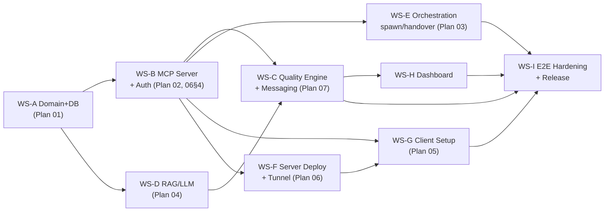

# Kế Hoạch Tổng: 00 - Master Plan — Release 1.0 End-to-End (Product Ready)

**Status:** Approved baseline — 2026-07-08 (v2, thay thế hoàn toàn bản phased-MVP cùng ngày)
**Vai trò:** Master plan cho **một release duy nhất, đầy đủ tính năng, product-ready**. Không có MVP trung gian. Khi có xung đột với plan khác, file này thắng.

*Tham chiếu:* `docs/architecture.md` (kiến trúc chốt), `docs/plans/01–09` (08 = provider CLI integration subscription-first; 09 = agent operating protocol — onboarding & hành vi đồng nhất), `docs/review_findings.md` (§6 — điều chỉnh định hướng)

---

## 1. Tầm nhìn & Các Nguyên tắc Bất biến (Non-negotiables)

> **Co-Force tồn tại để nâng chất lượng đầu ra của AI agents đến cực hạn — không phải để chạy nhanh hơn.** Các agent phải tương tác 2 chiều với nhau như một product team thật: có vai trò, có review chéo, có phản biện, có bằng chứng verify — không agent nào tự chấm bài của chính mình.

| # | Nguyên tắc | Hệ quả thiết kế |
| :- | :--- | :--- |
| N1 | **Quality-first, tốc độ là thứ yếu** | Quality gates (spec review, code review chéo, verification evidence) là bắt buộc mặc định, không phải opt-in. Chấp nhận task chậm hơn để qua đủ gates. |
| N2 | **Không có degraded mode cắt tính năng** | Ollama là thành phần **bắt buộc** trên server. Khi một thành phần lỗi → tool trả `SERVICE_UNAVAILABLE` rõ ràng + hệ thống tự phục hồi (systemd restart, retry queue) + cảnh báo ops. Không bao giờ âm thầm trả kết quả chất lượng thấp hơn (vd keyword search thay semantic). |
| N3 | **Server nặng, client nhẹ** | Server init được phép lâu (cài Ollama, pull models, tunnel, systemd). Client setup < 60 giây, **không cần cài binary** — agent client nói streamable HTTP thẳng tới URL public. |
| N4 | **Server độc lập, truy cập từ mọi nơi** | Máy chủ riêng + **cloudflared tunnel** → domain public (`https://mcp.<domain>/mcp`). Không mở port, TLS do Cloudflare. LAN/localhost vẫn dùng được cùng binary — cùng feature set, chỉ khác cách expose. |
| N5 | **Bidirectional A2A** | Agents gửi/nhận message, yêu cầu review, phản biện lẫn nhau — qua inbox piggyback + long-poll. Server có thể chủ động spawn agent bù vai trò thiếu. |
| N6 | **Mở rộng được sau release** | Clean Architecture + trait ports + provider registry — tính năng mới (Tauri, SSO, Postgres, vector engine mới) là adapter mới, không đổi core. |

---

## 2. Phạm vi Release 1.0 (toàn bộ ship một lần)

### 2.1 Năng lực chính
1. **Coordination đầy đủ:** check-in/identity, task lifecycle mở rộng (§Plan 07), file locks + conflict, delegation, activity stream, shared contexts, dynamic AGENTS.md.
2. **Quality Engine (Plan 07 — trái tim sản phẩm):** role system, quality policy per workspace, review chéo bắt buộc, server-side recheck bằng LLM, verification evidence, critique fan-out, quality metrics.
3. **A2A hai chiều:** messaging + inbox + long-poll `wait_events`, spawn sub-agent, handover, auto-staffing vai trò thiếu.
4. **Agentic RAG (Plan 04):** semantic memory/knowledge/skill, agentic chunking, embedding cache, re-embed queue (resilience, không phải degrade), memory consolidation nightly.
5. **Server hạ tầng (Plan 06):** installer một lệnh, cloudflared tunnel, auth token, systemd + watchdog, backup/restore, health/alerting, dashboard ops.
6. **Client onboarding (Plan 05):** enrollment one-liner từ dashboard, tự cấu hình Claude Code / **Codex CLI** / **Antigravity CLI (agy)** / Cursor / Windsurf / Copilot (spec per CLI: Plan 08), rule injection theo **Agent Operating Protocol (Plan 09)** — điểm khởi đầu check_in, bản đồ tool, hành vi đồng nhất qua 4 lớp enforce.
7. **Dashboard web** (embedded, cùng port): agent status realtime, kanban, review queue, memory browser, quality metrics, quản trị token/enrollment.

### 2.2 MCP Tools (38 tools — bảng đầy đủ tại URD Appendix B + Plan 07 §5)

| Nhóm | Tools |
| :--- | :--- |
| Identity (3) | check_in, whoami, guide |
| Task (7) | create_tasks, list_tasks, update_task, approve_tasks, recheck_tasks, delegate_task, submit_verification |
| Locks (3) | lock_files, unlock_files, check_conflicts |
| Awareness (4) | list_agents, workspace_status, get_agent_context, get_workspace_activity |
| Messaging/A2A (6) | send_message, respond_message, wait_events, share_context, spawn_agent, handover |
| Quality (4) | request_review, submit_review, request_critique, submit_critique |
| RAG (7) | store_memory, recall, classify, create_skill, list_skills, get_skill, consolidate_memory |
| Config/Admin (4) | config, register_role, quality_policy, health |

### 2.3 Ngoài phạm vi 1.0 (backlog mở rộng sau — N6)
Tauri desktop app **phía client** (dashboard viewer + notifications, gọi HTTPS qua tunnel — server luôn headless; dashboard web đã đủ cho 1.0) · SSO/OIDC · Postgres backend option · sqlite-vec/HNSW upgrade (trait đã chừa sẵn) · mobile push notification · multi-org/multi-tenant · marketplace skill sharing · IDE extensions native.

---

## 3. Cấu trúc Workstream (WS) & Phụ thuộc

Một release duy nhất vẫn cần thứ tự tích hợp. 9 workstreams, tích hợp liên tục trên `main` sau CI xanh:

### WS-A — Domain & Database (Plan 01) · ~1.5 tuần
- Strong types, enums (thêm các status/bảng mới của Plan 07: `agent_messages`, `reviews`, `critiques`, `quality_policies`, `verification_records`)
- Migrations cho **2 tầng DB** (F-17): `server.db` cấp server (`api_tokens`, `workspaces` registry, `audit_log` — auth tra trước khi biết workspace) + DB per-workspace (12 bảng nghiệp vụ), `memory_entries.embedding BLOB`, index cho hot paths (locks by ws+path, messages by target+undelivered, activities by ws+time)
- Repository traits + Sqlite impls + integration tests in-memory
- **DoD:** `cargo test` xanh; mọi bảng có repo + test CRUD; migration chạy idempotent.

### WS-B — MCP Server, Transport & Auth · ~2 tuần
- rmcp 2.x: `tool_router` + `ServerHandler`; streamable HTTP (+session) là transport chính, stdio phụ
- Axum router hợp nhất: `/mcp` (MCP) + `/api` (dashboard REST) + `/dashboard` (static) + `/healthz` + `/setup` (enrollment script) — **một port duy nhất**
- Auth middleware (tower layer): Bearer token → identity; token hashed trong DB; rate limit per token; audit log
- Session binding `Mcp-Session-Id` → agent record; disconnect → grace period → reclaim daemon
- Interlocking Lớp 3 (`CHECK_IN_REQUIRED` + `recovery_action` + `protocol_next_step` trong mọi response); 38 tool descriptions theo chuẩn Plan 09 §3 (Lớp 2)
- **DoD:** 2 client thật (Claude Code + Cursor) connect qua HTTPS công khai với token, check-in/lock/conflict hoạt động; request không token bị 401; token revoke có hiệu lực ngay.

### WS-C — Quality Engine & A2A Messaging (Plan 07) · ~2.5 tuần — **critical path**
- Task state machine mở rộng + quality policy engine
- Messaging (send/respond/inbox piggyback/wait_events long-poll)
- Review workflow (request/assign/submit/rework), critique fan-out
- Server-side LLM services: spec recheck, review assistant, session summary
- Verification evidence enforcement
- **DoD:** kịch bản "3 agents như một team" (§6.1) pass tự động trong integration test với mock LLM + pass thủ công với LLM thật.

### WS-D — RAG & LLM Infrastructure (Plan 04) · ~2 tuần
- `LlmProvider` trait, 3 vai trò model: `embedding` / `classifier` / `reasoner`; providers: Ollama (mặc định) + Anthropic/OpenAI/Gemini (cho reasoner nếu user muốn chất lượng cao hơn nữa)
- Semaphore concurrency, timeout, retry có backoff; re-embed queue (fail-loud: recall khi thiếu vector báo `PARTIAL_INDEX` chứ không âm thầm)
- Brute-force cosine + trait `VectorSearch`; embedding cache SHA-256
- Agentic chunking (structural + semantic boundary — làm đủ, không cắt scope)
- Nightly consolidation: dedup memory (cosine > 0.92), distill session memories → knowledge
- **DoD:** benchmark 10k entries recall < 50ms; kill Ollama giữa chừng → tool báo lỗi rõ, queue giữ nguyên, tự hồi phục khi Ollama restart; consolidation giảm ≥ 30% duplicate trong test corpus.

### WS-E — Active Orchestration (Plan 03) · ~1.5 tuần
- Event bus; doc generator (AGENTS.md managed block, debounce); provider registry trong config (**Plan 08** — spec verified cho claude/codex/agy/cursor-agent, template lệnh, `max_spawn_depth`, budget flags, auth probes); ProcessManager (spawn/reap/kill, log ra activity)
- Handover flow; auto-staffing: quality policy thiếu reviewer → server spawn agent role reviewer
- **DoD:** handover thật giữa 2 provider CLI; spawn có depth limit; kill từ dashboard hoạt động.

### WS-F — Server Deployment & Ops (Plan 06) · ~1.5 tuần (song song từ sớm)
- Installer `co-force-server install` (hoặc install.sh): binary, user hệ thống, Ollama + pull 3 models, cloudflared tunnel + DNS, systemd units + hardening, backup timer, secrets
- Health model per-component + `/healthz`; alert webhook (Discord/Slack/Telegram); admin CLI (token, status, backup, upgrade)
- **DoD:** từ máy Ubuntu trắng → server public hoạt động trong 1 lần chạy installer (interactive); restore từ backup drill thành công; reboot máy → mọi service tự lên.

### WS-G — Client Setup & Onboarding (Plan 05) · ~1 tuần
- Endpoint `/setup` serve script enrollment (sh + ps1) templated URL; dashboard sinh one-liner kèm token
- Script: detect project + IDE, ghi config **machine-scope** (`claude mcp add -s local` / `~/.cursor/mcp.json` — token per-máy không vào file project, F-18) + rules template Plan 09 §2 + `.co-force/` + gitignore, verify kết nối, in hướng dẫn 3 dòng
- `co_force_guide` động + cờ `onboarding: true` + E2E "cold agent tự tuân protocol" (Plan 09 §4, §7.6)
- **DoD:** trên máy client trắng (chỉ có Cursor), từ paste one-liner đến agent check-in thành công **< 60 giây**; chạy lại idempotent.

### WS-H — Dashboard · ~2 tuần (song song sau WS-B)
- SPA nhẹ (SvelteKit/React static build nhúng vào binary qua `include_dir`), WS realtime từ event bus
- Views: Agents, Kanban + review queue, Messages/critiques, Memory browser, Quality metrics (rework rate, review coverage, findings/task), Admin (tokens, enrollment, health, spawn/kill)
- **DoD:** mọi state change hiển thị < 1s; issue/revoke token từ UI; xem và can thiệp review queue.

### WS-I — E2E Hardening & Release · ~1.5 tuần (cuối, không song song)
- E2E test matrix (§6), load test (20 agents đồng thời, 100 req/s trên tunnel), security pass (§6.3), backup/restore + upgrade drill, docs người dùng (server admin guide + client quickstart), versioning + release CI (cargo-dist)
- **DoD:** toàn bộ checklist §6 pass; tag v1.0.0; install từ artifact công khai thành công trên máy sạch.

---

## 4. Ước lượng & Nhân lực

| Tổng effort | ~15.5 tuần-người |
| :--- | :--- |
| Song song hóa thực tế (multi-agent dev theo AGENTS.md: PM/DEV/TEST/QA) | **10–12 tuần lịch** |
| Critical path | WS-A → WS-B → WS-C → WS-I |

Rủi ro tiến độ lớn nhất: WS-C (Quality Engine là phần chưa có tiền lệ tham chiếu trực tiếp) và độ ổn định long-poll qua Cloudflare (timeout 100s của Cloudflare → thiết kế `wait_events` timeout 55s + reconnect loop).

---

## 5. Chính sách "No Silent Degradation" (thay thế mọi fallback cũ)

| Sự cố | Hành vi CŨ (đã bỏ) | Hành vi 1.0 |
| :--- | :--- | :--- |
| Ollama down | Store không vector, recall keyword LIKE (âm thầm) | Per-tool (F-19): `store_memory` vẫn lưu nhưng response ghi rõ `index_status: "pending"` (dữ liệu không mất, minh bạch); `recall`/`classify`/`recheck` trả `SERVICE_UNAVAILABLE {component: "llm", retry_after}` — không có kết quả thay thế; systemd watchdog restart Ollama; alert webhook |
| Model chưa pull | Bỏ qua classify | Installer đảm bảo pull xong mới hoàn tất; `/healthz` fail nếu thiếu model; server không nhận traffic khi `degraded` |
| Vector thiếu (re-embed đang chạy) | Trả kết quả keyword âm thầm | Recall trả kèm `index_status: PARTIAL (n pending)` — agent và user biết chính xác độ tin cậy |
| Tunnel/DNS lỗi | — | Client script verify kết nối lúc setup; server alert khi cloudflared unit fail |
| Reviewer vắng mặt | Task tự complete | Task đứng ở gate + server auto-spawn reviewer (WS-E) hoặc thông báo user trên dashboard |

---

## 6. Tiêu chí Nghiệm thu Release (Acceptance)

### 6.1 Kịch bản E2E "Product Team" (bắt buộc pass với LLM thật, qua tunnel public)
1. Admin cài server trên máy độc lập bằng installer; dashboard truy cập được qua `https://mcp.<domain>`.
2. Client A (Claude Code) và Client B (Cursor) enroll bằng one-liner < 60s mỗi máy.
3. Agent A (role: developer) check-in, nhận prompt tính năng → draft tasks → **server recheck bằng LLM tìm ra gap thật** → user approve trên dashboard.
4. Agent A lock files, code, `submit_verification` kèm output test → task sang `code_review`.
5. Agent B (role: reviewer) nhận review request qua `wait_events`, đọc diff context, `submit_review` với ≥ 1 finding → task về `rework` → A sửa → B approve → `completed`.
6. Memory phiên làm việc được store + consolidation; phiên sau agent mới `recall` ra đúng knowledge.
7. Kill -9 tiến trình agent A giữa chừng → sau grace period locks được reclaim, task về backlog, dashboard hiển thị đúng.

### 6.2 Hiệu năng
- Tool call p95 < 300ms (không gồm LLM calls); recall p95 < 800ms (gồm embed query)
- 20 agents đồng thời / 3 workspaces không lỗi ghi (WAL + busy_timeout)
- `wait_events` ổn định ≥ 24h qua Cloudflare (reconnect tự động)

### 6.3 Bảo mật
- Không endpoint nào trả dữ liệu khi thiếu/sai token (kể cả `/healthz` chi tiết — bản public chỉ trả ok/fail)
- Token lưu hashed; revoke tức thời; rate limit hoạt động; secrets file 0600; server bind 127.0.0.1 (chỉ tunnel expose)
- `cargo audit` sạch; dependency review; không log token/API key

### 6.4 Vận hành
- Reboot server → tất cả tự phục hồi; backup hàng ngày + restore drill có tài liệu; upgrade binary không mất data; alert webhook bắn khi component down > 1 phút
