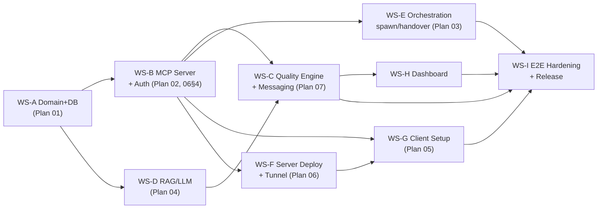

# Master Plan: 00 - Roadmap — Release 1.0 End-to-End (Product Ready)

**Status:** Approved baseline — 2026-07-08 (v2, completely replaces the phased-MVP plan of the same date)
**Role:** Master plan for **a single, fully-featured, product-ready release**. No intermediate MVPs. In case of conflict with other plans, this file wins.

*Reference Documents:*
- `docs/architecture.md` (finalized architecture)
- `docs/plans/01–10` (08 = provider CLI subscription-first; 09 = agent operating protocol; 10 = solo orchestration & team bootstrap)
- `docs/review_findings.md` (§6 — orientation adjustment)

---

## 1. Vision & Immutable Principles (Non-negotiables)

> **Co-Force exists to drive the output quality of AI agents to the absolute limit — not just to run faster.** Agents must interact bi-directionally like a real product team: with distinct roles, cross-reviews, constructive critiques, and verification evidence — no agent ever grades its own work.

| # | Principle | Design Consequence |
| :- | :--- | :--- |
| N1 | **Quality-First, Speed is Secondary** | Quality gates (spec reviews, cross code reviews, verification evidence) are mandatory by default, not opt-in. Accept slower task completion to satisfy all gates. |
| N2 | **No Degraded Mode with Cut Features** | Ollama is a **mandatory** component on the server. If a component fails → tools return a clear `SERVICE_UNAVAILABLE` error + the system automatically self-recovers (systemd restarts, retry queues) + alerts ops. Never silently return lower quality results (e.g. keyword LIKE searches instead of semantic search). |
| N3 | **Heavy Server, Light Client** | Server initialization is permitted to take longer (installing Ollama, pulling models, setting up tunnels, configuring systemd). Client setup must take < 60 seconds and **require no binaries** — client agents speak streamable HTTP directly to the public URL. |
| N4 | **Independent Server, Access from Anywhere** | Private server + **cloudflared tunnel** → public domain (`https://mcp.<domain>/mcp`). No ports exposed, TLS handled by Cloudflare. LAN/localhost remains supported using the same binary — same feature set, only the exposure method differs. |
| N5 | **Bidirectional A2A** | Agents send/receive messages, request reviews, and critique each other — via inbox piggybacking + long-polling. The server can actively spawn agents to fill missing roles. |
| N6 | **Extensible Post-Release** | Clean Architecture + trait ports + provider registry — new features (Tauri client viewer, SSO, Postgres, new vector engines) are new adapters, leaving the core untouched. |

---

## 2. Release 1.0 Scope (All shipped in one release)

### 2.1 Core Capabilities
1. **Full Coordination:** check-in/identity, extended task lifecycle (§Plan 07), file locks + conflicts, delegation, activity stream, shared contexts, dynamic AGENTS.md.
2. **Quality Engine (Plan 07 — Heart of the Product):** role system, per-workspace quality policies, mandatory cross-reviews, server-side LLM-driven spec rechecks, verification evidence, critique fan-out, quality metrics.
3. **Two-Way A2A:** messaging + inbox + `wait_events` long-poll, sub-agent spawning, handover, auto-staffing missing roles; **solo orchestration** (Plan 10) — 1 agent + large backlog → promotes itself to PM, estimates dev/reviewer/qa/ba via `plan_team`, spawns subagents with narrow context to prevent hallucinations, race-safe execution on the same machine.
4. **Agentic RAG (Plan 04):** semantic memory/knowledge/skills, agentic chunking, embedding cache, re-embedding queues (resilience, not degradation), nightly memory consolidation.
5. **Infrastructure Server (Plan 06):** one-command installer, cloudflared tunnel, auth tokens, systemd + watchdog, backup/restore, health/alerting, ops dashboard.
6. **Client Onboarding (Plan 05):** enrollment one-liner from dashboard, auto-configures Claude Code / **Codex CLI** / **Antigravity CLI (agy)** / Cursor / Windsurf / VS Code Copilot (CLI specs: Plan 08), rule injection per **Agent Operating Protocol (Plan 09)** — check-in starting point, tool map, uniform behavior enforced across 4 layers.
7. **Web Dashboard** (embedded, sharing server port): real-time agent status, kanban board, review queue, memory browser, quality metrics, token/enrollment management.

### 2.2 MCP Tools (39 tools — full catalog at architecture §6.4)

| Group | Tools |
| :--- | :--- |
| Identity (3) | check_in, whoami, guide |
| Task (7) | create_tasks, list_tasks, update_task, approve_tasks, recheck_tasks, delegate_task, submit_verification |
| Locks (3) | lock_files, unlock_files, check_conflicts |
| Awareness (4) | list_agents, workspace_status, get_agent_context, get_workspace_activity |
| Messaging/A2A (7) | send_message, respond_message, wait_events, share_context, spawn_agent, handover, plan_team |
| Quality (4) | request_review, submit_review, request_critique, submit_critique |
| RAG (7) | store_memory, recall, classify, create_skill, list_skills, get_skill, consolidate_memory |
| Config/Admin (4) | config, register_role, quality_policy, health |

### 2.3 Out of Scope for 1.0 (Future backlog — N6)
Tauri desktop app **client-side** (dashboard viewer + native notifications, calls HTTPS via tunnel — the server is always headless; the web dashboard is sufficient for 1.0) · SSO/OIDC · Postgres backend option · sqlite-vec/HNSW upgrade (traits already abstracted) · mobile push notifications · multi-org/multi-tenant · marketplace skill sharing · native IDE extensions.

---

## 3. Workstream (WS) Structure & Dependencies

Although shipped in a single release, integration follows a structured dependency order. 9 workstreams integrated continuously on `main` once CI passes:

### WS-A — Domain & Database (Plan 01) · ~1.5 weeks
- Strong types, enums (adding new tables/status from Plan 07: `agent_messages`, `reviews`, `critiques`, `quality_policies`, `verification_records`)
- Migrations for the **two-tier DB** (F-17): `server.db` at the server level (`api_tokens`, `workspaces` registry, `audit_log`, `provider_status` — rate-limit cooldown per machine/provider) + DB per-workspace (13 business tables, including `handovers` — Plan 03 §5.6), `memory_entries.embedding BLOB`, index optimization for hot paths (locks by ws+path, messages by target+undelivered, activities by ws+time)
- Repository traits + SQLite implementations + in-memory integration tests
- **DoD:** `cargo test` passes; all tables have repos + CRUD tests; migrations run idempotently.

### WS-B — MCP Server, Transport & Auth · ~2 weeks
- rmcp 2.x: `tool_router` + `ServerHandler`; streamable HTTP (+session) is the primary transport, stdio secondary
- Consolidated Axum router: `/mcp` (MCP) + `/api` (dashboard REST) + `/dashboard` (static) + `/healthz` + `/setup` (enrollment script) — **sharing a single port**
- Auth middleware (tower layer): Bearer token → identity; tokens hashed in DB; rate limiting per token; audit logging
- Session binding `Mcp-Session-Id` → agent record; disconnect detection → grace period → reclaim daemon runs
- Layer 3 Interlocking (`CHECK_IN_REQUIRED` + `recovery_action` + `protocol_next_step` on all responses); 39 tool descriptions matching Plan 09 §3 standards (Layer 2)
- **DoD:** 2 real clients (Claude Code + Cursor) connect via public HTTPS using tokens, check-in/lock/conflict workflows function; requests without tokens return 401; revoked tokens take effect immediately.

### WS-C — Quality Engine & A2A Messaging (Plan 07) · ~2.5 weeks — **critical path**
- Task state machine extension + quality policy engine
- Messaging (send/respond/inbox piggyback/wait_events long-poll)
- Review workflow (request/assign/submit/rework), critique fan-out
- Server-side LLM services: spec recheck, review assistant, session summary
- Verification evidence enforcement
- **DoD:** "3 agents as a team" scenario (§6.1) passes automatically in integration tests with mock LLM + passes manually with real LLM.

### WS-D — RAG & LLM Infrastructure (Plan 04) · ~2 weeks
- `LlmProvider` trait, 3 model roles: `embedding` / `classifier` / `reasoner`; providers: Ollama (default) + Anthropic/OpenAI/Gemini (optional for reasoner if the user requests higher quality)
- Semaphore concurrency, timeouts, retries with backoff; re-embed queue (fail-loud: recall requests with missing vectors report `PARTIAL_INDEX` rather than silently degrading)
- Brute-force cosine + `VectorSearch` trait; SHA-256 embedding cache
- Agentic chunking (structural + semantic boundary — full implementation, no scope cuts)
- Nightly consolidation: memory deduplication (cosine similarity > 0.92), distilling session memories → knowledge
- **DoD:** benchmark 10k entries recall < 50ms; killing Ollama mid-run → tools report a clear error, queue remains intact, auto-recovers when Ollama restarts; consolidation reduces duplicates by ≥ 30% in test corpus.

### WS-E — Active Orchestration (Plan 03) · ~1.5 weeks
- Event bus; doc generator (AGENTS.md managed block, debounced); provider registry in configuration (**Plan 08** — specs verified for claude/codex/agy/cursor-agent, command templates, `max_spawn_depth`, budget flags, auth probes); ProcessManager (spawn/reap/kill, logging to activities)
- Handover workflow; auto-staffing: quality policy missing a reviewer → server spawns agent with reviewer role
- Solo orchestration (Plan 10): `plan_team` heuristics + reasoner, solo nudge, stall detector, local worktrees option, PM playbook
- **Extended DoD:** Plan 10 §8.7 scenario passes — 1 agy agent + 8 tasks → auto-bootstraps team of 3 subagents, all gates pass, no races
- Cross-provider handover (Plan 03 §5): package validated + lock escrow + provider cooldown + re-dispatch on client death
- **DoD:** real handover between 2 provider CLIs — standard scenario "Claude hits rate limit → agy takes over the same feature, no gates dropped" (active + passive kill -9); spawning depth limited; kill from dashboard functions.

### WS-F — Server Deployment & Ops (Plan 06) · ~1.5 weeks (run in parallel early on)
- Installer `co-force-server install` (or install.sh): binary setup, system user creation, Ollama setup + pull 3 models, cloudflared tunnel + DNS setup, systemd units + hardening, backup timer, secrets management
- Per-component health model + `/healthz` endpoint; alert webhooks (Discord/Slack/Telegram); admin CLI (token, status, backup, upgrade)
- **DoD:** from a blank Ubuntu machine → public server works in a single installer run (interactive); restoring from backup drill succeeds; rebooting machine → all services start automatically.

### WS-G — Client Setup & Onboarding (Plan 05) · ~1 week
- Endpoint `/setup` serves enrollment script (sh + ps1) with templated URL; dashboard generates one-liner with token
- Script: detects project + IDE, writes **machine-scope** config (`claude mcp add -s local` / `~/.cursor/mcp.json` — token per-machine not in project files, F-18) + Plan 09 §2 rules template + `.co-force/` + gitignore, verifies connection, prints 3-line instructions
- Dynamic `co_force_guide` + `onboarding: true` flag + E2E "cold agent automatically follows protocol" (Plan 09 §4, §7.6)
- **DoD:** on a blank client machine (with only Cursor), from pasting the one-liner to agent check-in success takes **< 60 seconds**; runs idempotently.

### WS-H — Dashboard · ~2 weeks (run in parallel after WS-B)
- Light SPA (SvelteKit/React static build embedded in binary via `include_dir`), real-time WS from event bus
- Views: Agents list, Kanban + review queue, Messages/critiques, Memory browser, Quality metrics (rework rate, review coverage, findings/task), Admin (tokens, enrollment, health, spawn/kill)
- **DoD:** all state changes display < 1s; issue/revoke tokens from UI; view and intervene in the review queue.

### WS-I — E2E Hardening & Release · ~1.5 weeks (final work, no parallel tasks)
- E2E test matrix (§6), load testing (20 concurrent agents, 100 req/s over tunnel), security verification (§6.3), backup/restore + upgrade drills, user documentation (server admin guide + client quickstart), versioning + release CI (cargo-dist)
- **DoD:** all checklist items in §6 pass; tag v1.0.0; installation from public artifacts successful on clean machines.

---

## 4. Estimates & Staffing

| Total Effort | ~15.5 person-weeks |
| :--- | :--- |
| Practical Parallelization (multi-agent dev via AGENTS.md: PM/DEV/TEST/QA) | **10–12 calendar weeks** |
| Critical Path | WS-A → WS-B → WS-C → WS-I |

Largest schedule risks: WS-C (Quality Engine has no direct precedent to reference) and long-poll connection stability over Cloudflare (Cloudflare's 100s timeout → `wait_events` designed with a 55s timeout + reconnect loop).

---

## 5. "No Silent Degradation" Policy (replaces all old fallbacks)

| Failure | Old Behavior (Removed) | 1.0 Behavior |
| :--- | :--- | :--- |
| Ollama down | Store without vector, recall keyword LIKE (silent) | Per-tool (F-19): `store_memory` still saves but response explicitly states `index_status: "pending"` (no data lost, transparent); `recall`/`classify`/`recheck` return `SERVICE_UNAVAILABLE {component: "llm", retry_after}` — no fallback results; systemd watchdog restarts Ollama; alert webhook fires |
| Model not pulled | Skip classify | Installer ensures all models are pulled before completing; `/healthz` fails if models are missing; server rejects traffic when `degraded` |
| Vector missing (re-embed running) | Silent keyword search | Recall returns `index_status: PARTIAL (n pending)` — agent and user know exact confidence |
| Tunnel/DNS failure | — | Client script verifies connection during setup; server alerts when cloudflared unit fails |
| Reviewer absent | Task automatically completes | Task stays locked at the gate + server auto-spawns a reviewer (WS-E) or notifies user via dashboard |

---

## 6. Release Acceptance Criteria

### 6.1 E2E "Product Team" Scenario (must pass with real LLM, over public tunnel)
1. Admin installs server on an independent machine using the installer; dashboard accessible via `https://mcp.<domain>`.
2. Client A (Claude Code) and Client B (Cursor) enroll using the one-liner < 60s per machine.
3. Agent A (role: developer) checks in, receives prompt → drafts tasks → **server rechecks via LLM to find a real gap** → user approves on the dashboard.
4. Agent A locks files, writes code, `submit_verification` with test output → task enters `code_review`.
5. Agent B (role: reviewer) receives review request via `wait_events`, reads diff context, `submit_review` with ≥ 1 finding → task returns to `rework` → A fixes → B approves → `completed`.
6. Session memory is stored + consolidated; next session a new agent `recalls` correct knowledge.
7. Kill -9 agent A process mid-run → after grace period locks are reclaimed, task returns to backlog, dashboard updates correctly.

### 6.2 Performance
- Tool call p95 < 300ms (excluding LLM calls); recall p95 < 800ms (including query embedding)
- 20 concurrent agents / 3 workspaces without write failures (WAL + busy_timeout configuration)
- `wait_events` remains stable ≥ 24h over Cloudflare (automatic reconnects)

### 6.3 Security
- No endpoint returns data when token is missing/invalid (including detailed `/healthz` — public version only returns ok/fail)
- Tokens stored hashed; immediate revocation; rate limiting active; secrets files 0600; server binds to 127.0.0.1 (exposed via tunnel only)
- `cargo audit` clean; dependency review complete; no tokens/API keys in logs

### 6.4 Operations
- Reboot server → all services self-recover; daily backups + documented restore drills; binary upgrades do not lose data; alert webhook fires if component is down > 1 minute
