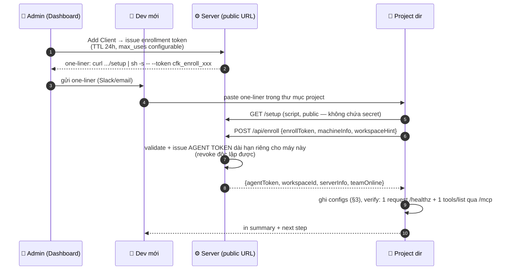

# Kế Hoạch Triển Khai Chi Tiết: 05 - Client Setup & Onboarding (nhanh nhất có thể)

**Status:** Ready for Implementation (WS-G)
**Target:** endpoint `/setup` + `/api/enroll` trên server, templates trong `co-force-core/src/workspace/`

> **Cập nhật 2026-07-08 (v2):** Viết lại toàn bộ theo định hướng mới — **server nặng, client nhẹ** (nguyên tắc N3, Master Plan). Phần cài đặt server (trước ở §3–6 bản cũ) chuyển hết sang Plan 06. File này chỉ còn một nhiệm vụ: **từ máy client trắng đến agent check-in thành công trong < 60 giây**.

## 1. Context & Mục Tiêu

Server đã gánh toàn bộ độ phức tạp (Ollama, models, tunnel, auth — Plan 06). Client vì thế **không cần cài bất kỳ binary nào**: Claude Code / Cursor / Windsurf đều nói streamable HTTP trực tiếp tới `https://mcp.<domain>/mcp`. Việc duy nhất cần làm ở client là **ghi đúng config files vào project** — một script làm trong vài giây.

**Trải nghiệm mục tiêu:**
```
# User copy từ Dashboard → paste vào terminal tại thư mục project:
curl -fsSL https://mcp.example.com/setup | sh -s -- --token cfk_enroll_xxxx

✅ Co-Force connected.
   Workspace:  my-project (ws-a1b2c3)  ·  Server: mcp.example.com (healthy)
   Configured: Claude Code (~/.claude.json, scope local) · Cursor (~/.cursor/mcp.json)
   Team online: Agent-Alpha (reviewer)
   → Mở agent của bạn và bắt đầu. Agent sẽ tự check-in theo rules đã tiêm.
```

## 2. Enrollment Flow (bảo mật + nhanh)



Lý do đổi enrollment token → agent token: token trong one-liner có thể bị lộ qua chat history — nó chỉ sống 24h và không dùng được sau khi đổi; token dài hạn mỗi máy một cái, thu hồi từng máy không ảnh hưởng người khác.

## 3. Script `/setup` làm gì (idempotent, POSIX sh + biến thể PowerShell)

1. **Detect môi trường:** git repo? (lấy remote URL → workspaceId hint) · client nào có mặt (binaries: `claude`, `codex`, `agy`, `cursor-agent`; dirs: `.cursor/`, `.windsurf/`, `.vscode/`) · OS.
2. **Enroll** (§2) — nhận `agentToken` + `workspaceId`.
3. **Ghi config cho từng client phát hiện được** — nguyên tắc chốt theo **F-18**: agent token là **per-máy** nên phải nằm trong config **user/machine-scope ngoài repo**, KHÔNG nằm trong file project được commit. (Lưu ý: env expansion `${VAR}` trong `.mcp.json` đọc biến môi trường của process client — không có cơ chế tự đọc file, nên "token trong `.co-force/token` + tham chiếu `${VAR}`" không hoạt động.)

   | Client | Cách cấu hình (machine-scope) | Ghi chú |
   | :--- | :--- | :--- |
   | Claude Code | `claude mcp add -s local -t http co-force https://mcp.example.com/mcp --header "Authorization: Bearer <token>"` → ghi vào `~/.claude.json` (per-project-per-máy, ngoài repo) | Không đụng `.mcp.json` của repo |
   | Codex CLI | `~/.codex/config.toml`: `[mcp_servers.co-force] url = "https://mcp.example.com/mcp"` + `bearer_token_env_var = "CO_FORCE_TOKEN"` — script thêm export vào shell profile (managed block) | HTTP + Bearer native; env var phải tồn tại (Plan 08 C2), fail → stdio shim `mcp-remote` |
   | Antigravity CLI (`agy`) | `.agents/mcp_config.json` (per-workspace) hoặc `~/.gemini/config/mcp_config.json` (global), field `serverUrl` | Header auth cần verify lúc enroll (Plan 08 C3); fail → stdio shim |
   | Cursor | merge vào `~/.cursor/mcp.json` (global) | Kèm headers Authorization |
   | Windsurf | merge vào `~/.codeium/windsurf/mcp_config.json` (global) | tương tự |
   | VS Code Copilot | `.vscode/mcp.json` dùng **inputs/secret prompt** hoặc fallback bên dưới | `.vscode/` thường được commit — không ghi token thẳng |
   | CI / generic | ghi `.mcp.json` với token thẳng — **fallback duy nhất được ghi token vào project** | Bắt buộc qua bước 4 |

   Danh sách CLI phát hiện được (claude/codex/agy/cursor-agent) được gửi kèm trong `/api/enroll` (`machineInfo.clis`) — server dùng để chọn placement L2 và gợi ý diversity policy (Plan 08 §4).

4. **Token hygiene (chỉ áp cho fallback ghi token vào project):** `.gitignore` được bổ sung **trước khi** ghi file chứa token; script verify hiệu lực bằng `git check-ignore` — fail thì dừng và báo, không bao giờ để token có thể bị commit. `.co-force/` (agent.json, không chứa secret trong luồng chuẩn) vẫn luôn được gitignore.
5. **Rule injection (Lớp 1):** ghi managed block vào `AGENTS.md`, `CLAUDE.md`, `.cursorrules` — **template chốt tại Plan 09 §2** (thay thế URD §9.3 cũ): điểm khởi đầu check_in, vòng đời task theo quality gates, quy tắc hành vi đồng nhất, bảng "tool nào khi nào". Render với biến `{{workspace_name}}`, `{{server_url}}`.
6. **Tạo `.co-force/`:** `agent.json` (serverUrl, workspaceId), thư mục cache.
7. **Verify end-to-end:** gọi `tools/list` qua `/mcp` với token thật **qua đúng đường config vừa ghi** (xác nhận client thật sự gửi được header — F-18) → in số tools + team đang online. Fail → in chẩn đoán cụ thể (DNS? 401 = header không tới nơi? server degraded?) và exit non-zero; client không hỗ trợ custom header → in hướng dẫn thủ công thay vì để lại config chết.
8. **In summary** (mẫu ở §1).

**Không có bước nào cần sudo, không cài package, không phụ thuộc gì ngoài `curl` + `sh`** (Windows: `irm https://mcp.example.com/setup.ps1 | iex` với tham số tương đương).

## 4. Onboarding agent lần đầu (sau setup)

Toàn bộ hành trình "agent lạnh học protocol" (4 điểm chạm: rules → tool descriptions → check_in response → envelope mọi response) đặc tả tại **Plan 09 §1**. Tóm tắt:
- Rules đã tiêm khiến agent gọi `co_force_check_in` ngay prompt đầu.
- Response check-in đầu tiên kèm `onboarding: true` → agent được hướng dẫn gọi `co_force_guide()` — guide **sinh động theo workspace** (Plan 09 §4: quality policy đang bật, team hiện tại, backlog, 3 ví dụ tool call đúng chuẩn, playbook theo role) chứ không phải markdown tĩnh.
- Tin nhắn chờ (shared contexts, review requests tồn đọng cho role của agent) được deliver ngay trong check-in response.

## 5. Re-setup & thu hồi

| Tình huống | Cách xử lý |
| :--- | :--- |
| Máy bị mất/lộ token | Dashboard → Clients → Revoke máy đó (agent token vô hiệu ngay; các máy khác không ảnh hưởng) |
| Đổi server URL/domain | chạy lại one-liner mới — script phát hiện config cũ, cập nhật in-place |
| Thêm project thứ 2 trên cùng máy | paste cùng one-liner trong thư mục project mới (enrollment token còn hạn) hoặc admin issue token mới |
| CI/headless | `curl .../setup \| sh -s -- --token X --non-interactive --client generic` → chỉ ghi `.mcp.json` |

## 6. Trình tự Triển khai (Step-by-Step)

1. `/api/enroll` endpoint + enrollment token kind trong bảng `api_tokens` (Plan 06 §4.1) — TDD với in-memory DB.
2. Script template engine phía server (`/setup` render sh/ps1 với `public_url` từ config); script viết dạng file template có test text-based.
3. Config writers dạng thư viện Rust (server render sẵn JSON blocks đưa vào script — script chỉ việc ghi/merge bằng `jq` fallback pure-sh); golden-file tests cho từng client × trạng thái (file chưa có / đã có config khác / đã có block Co-Force cũ).
4. Rule injection templates (chia sẻ với doc_generator Plan 03 — cùng managed block writer).
5. Dashboard "Add Client" UI (WS-H) sinh one-liner + QR code.
6. E2E test: container sạch có git + curl → chạy one-liner với server test → assert `tools/list` thành công < 60s.
