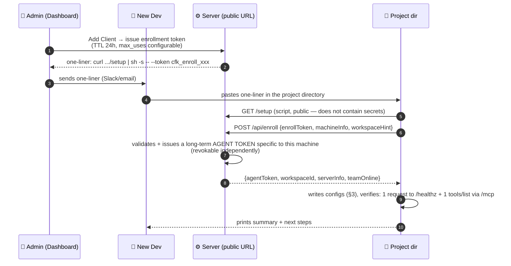

# Detailed Implementation Plan: 05 - Client Setup & Onboarding (Fastest Possible)

**Status:** Ready for Implementation (WS-G)
**Target:** Endpoint `/setup` + `/api/enroll` on the server, templates in `co-force-core/src/workspace/`

> **Update 2026-07-08 (v2):** Completely rewritten based on the new direction — **heavy server, light client** (principle N3, Master Plan). The server installation part (previously in §3–6 of the old version) is moved entirely to Plan 06. This file now has only one task: **go from a blank client machine to a successful agent check-in in < 60 seconds**.

## 1. Context & Objectives

The server handles all the complexity (Ollama, models, tunnels, auth — Plan 06). Therefore, the client **does not need to install any binaries**: Claude Code / Cursor / Windsurf all speak streamable HTTP directly to `https://mcp.<domain>/mcp`. The only thing needed on the client is to **write the correct config files to the project** — a script does this in a few seconds.

**Target Experience:**
```
# User copies from the Dashboard → pastes into the terminal in the project directory:
curl -fsSL https://mcp.example.com/setup | sh -s -- --token cfk_enroll_xxxx

✅ Co-Force connected.
   Workspace:  my-project (ws-a1b2c3)  ·  Server: mcp.example.com (healthy)
   Configured: Claude Code (~/.claude.json, scope local) · Cursor (~/.cursor/mcp.json)
   Team online: Agent-Alpha (reviewer)
   → Open your agent and begin. The agent will automatically check-in based on injected rules.
```

## 2. Enrollment Flow (Secure + Fast)



The reason for changing from enrollment token to agent token: the token in the one-liner could be leaked via chat history — it only lives for 24 hours and is useless after exchange; the long-term token is one per machine, and revoking it does not affect others.

## 3. What the `/setup` Script Does (Idempotent, POSIX sh + PowerShell variant)

1. **Environment Detection:** git repo? (gets remote URL → workspaceId hint) · which clients are present (binaries: `claude`, `codex`, `agy`, `cursor-agent`; directories: `.cursor/`, `.windsurf/`, `.vscode/`) · OS.
2. **Enrollment** (§2) — receives `agentToken` + `workspaceId`.
3. **Write Configuration for Each Detected Client** — final principle according to **F-18**: the agent token is **per-machine** and must reside in the **user/machine-scope config outside the repo**, NOT in project files committed to git. (Note: env expansion `${VAR}` in `.mcp.json` reads env variables from the client process — it cannot read files dynamically, so "token in `.co-force/token` + referencing `${VAR}`" does not work.)

   | Client | Configuration Method (machine-scope) | Notes |
   | :--- | :--- | :--- |
   | Claude Code | `claude mcp add -s local -t http co-force https://mcp.example.com/mcp --header "Authorization: Bearer <token>"` → writes to `~/.claude.json` (per-project-per-machine, outside repo) | Does not modify the repo's `.mcp.json` |
   | Codex CLI | `~/.codex/config.toml`: `[mcp_servers.co-force] url = "https://mcp.example.com/mcp"` + `bearer_token_env_var = "CO_FORCE_TOKEN"` — script appends export to shell profile (managed block) | Native HTTP + Bearer; env var must exist (Plan 08 C2), falls back to stdio shim `mcp-remote` on failure |
   | Antigravity CLI (`agy`) | `.agents/mcp_config.json` (per-workspace) or `~/.gemini/config/mcp_config.json` (global), field `serverUrl` | Header auth needs to be verified during enrollment (Plan 08 C3); falls back to stdio shim on failure |
   | Cursor | merge into `~/.cursor/mcp.json` (global) | Includes Authorization headers |
   | Windsurf | merge into `~/.codeium/windsurf/mcp_config.json` (global) | Same as above |
   | VS Code Copilot | `.vscode/mcp.json` using **inputs/secret prompt** or fallback below | `.vscode/` is typically committed — do not write token directly |
   | CI / generic | writes `.mcp.json` with token directly — **the only fallback allowed to write token into project** | Must pass step 4 |

   The list of detected CLIs (claude/codex/agy/cursor-agent) is sent in `/api/enroll` (`machineInfo.clis`) — the server uses this to choose L2 placement and suggest diversity policies (Plan 08 §4).

4. **Token Hygiene (only applied for project token fallbacks):** `.gitignore` is appended **before** writing the file containing the token; the script verifies using `git check-ignore` — halts and reports on failure, ensuring the token is never committed. `.co-force/` (agent.json, containing no secrets in the standard flow) is always git-ignored.
5. **Rule Injection (Layer 1):** writes managed block into `AGENTS.md`, `CLAUDE.md`, `.cursorrules` — **template finalized in Plan 09 §2** (replacing old URD §9.3): check-in starting point, task lifecycle by quality gates, uniform behavior rules, "which tool when" table. Rendered with variables `{{workspace_name}}`, `{{server_url}}`.
6. **Create `.co-force/`:** `agent.json` (serverUrl, workspaceId), cache directory.
7. **Verify End-to-End:** calls `tools/list` via `/mcp` with the real token **using the exact path of the written config** (confirming the client can actually send the header — F-18) → prints the number of tools + online team members. Prints specific diagnostics on failure (DNS? 401 = header not received? server degraded?) and exits non-zero; if the client does not support custom headers → prints manual instructions instead of leaving a broken config.
8. **Print Summary** (example in §1).

**No step requires sudo, no packages are installed, no dependencies except `curl` + `sh`** (Windows: `irm https://mcp.example.com/setup.ps1 | iex` with equivalent arguments).

## 4. First-Time Agent Onboarding (Post-Setup)

The entire journey of a "cold agent learning the protocol" (4 touchpoints: rules → tool descriptions → check-in response → envelope on all responses) is specified in **Plan 09 §1**. Summary:
- Injected rules force the agent to call `co_force_check_in` on the very first prompt.
- The first check-in response includes `onboarding: true` → the agent is instructed to call `co_force_guide()` — a **dynamic workspace-specific guide** (Plan 09 §4: active quality policy, current team, backlog, 3 standard tool call examples, playbook by role) rather than static markdown.
- Pending messages (shared contexts, pending review requests for the agent's role) are delivered directly in the check-in response.

## 5. Re-Setup & Revocation

| Situation | Resolution |
| :--- | :--- |
| Machine lost/token leaked | Dashboard → Clients → Revoke that machine (agent token is immediately invalidated; other machines are unaffected) |
| Server URL/domain changed | run the new one-liner again — the script detects the old config and updates it in-place |
| Add second project on same machine | paste the same one-liner in the new project directory (if enrollment token is still valid) or admin issues a new token |
| CI/headless | `curl .../setup \| sh -s -- --token X --non-interactive --client generic` → writes only `.mcp.json` |

## 6. Steps to Implement (Step-by-Step)

1. `/api/enroll` endpoint + enrollment token kind in the `api_tokens` table (Plan 06 §4.1) — TDD with in-memory DB.
2. Server-side script template engine (`/setup` renders sh/ps1 with `public_url` from config); script written as template file with text-based tests.
3. Config writers as Rust libraries (server renders JSON blocks to inject into script — script simply writes/merges using `jq` falling back to pure-sh); golden-file tests for each client × state (file not exists / has other config / has old Co-Force block).
4. Rule injection templates (shared with doc_generator Plan 03 — same managed block writer).
5. Dashboard "Add Client" UI (WS-H) generating one-liner + QR code.
6. E2E test: clean container with git + curl → run one-liner with test server → assert successful `tools/list` < 60s.
