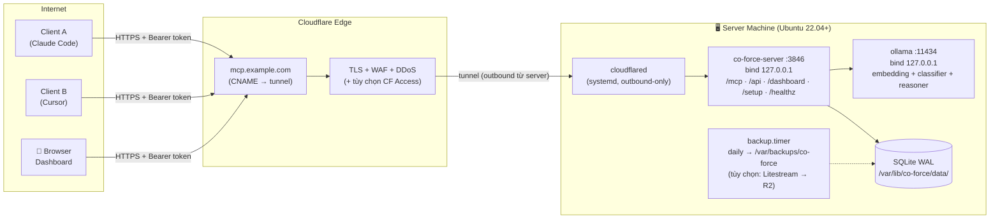

# Kế Hoạch Triển Khai Chi Tiết: 06 - Server Deployment, Cloudflared Tunnel & Operations

**Status:** Ready for Implementation (WS-F)
**Target:** `crates/co-force-mcp/src/cli/server_admin/`, `deploy/` (scripts, systemd units), tài liệu admin

## 1. Context & Mục Tiêu

Server Co-Force chạy trên **một máy độc lập** (home server / mini PC / VPS), được expose ra internet qua **Cloudflare Tunnel** với domain riêng — không mở port trên router, TLS tự động, chống DDoS bởi Cloudflare edge. Quá trình cài server **được phép lâu và nặng** (nguyên tắc N3): installer làm hết mọi thứ một lần, đổi lại vận hành về sau hoàn toàn tự động (systemd + watchdog + backup + alert).

**Yêu cầu phần cứng khuyến nghị** (quality-first — model lớn hơn = chất lượng cao hơn):

| Tier | Cấu hình | Models chạy được | Ghi chú |
| :--- | :--- | :--- | :--- |
| Tối thiểu | 8GB RAM, 4 cores, 30GB disk | embedding + classifier (gemma4:e2b), reasoner dùng cloud API | Đủ nếu reasoner đi cloud |
| **Khuyến nghị** | 16–32GB RAM (hoặc GPU 12GB+) | + reasoner local `qwen3:14b` | Full local, không data ra ngoài |
| Cao cấp | GPU 24GB+ | reasoner `qwen3:32b` / lớn hơn | Chất lượng recheck/critique tối đa |

---

## 2. Topology



Điểm an toàn then chốt: `co-force-server` và `ollama` **chỉ bind 127.0.0.1** — con đường duy nhất vào là tunnel đã mã hóa; máy server không cần mở bất kỳ inbound port nào.

**Server luôn headless** — không GUI, không desktop environment. Hai hình thái triển khai tương đương về tính năng:
- **Bare-metal + systemd** (mặc định của installer §3) — khuyến nghị khi có GPU (Ollama truy cập GPU trực tiếp, không cần container toolkit).
- **Docker Compose** (§2.1) — khuyến nghị khi muốn cô lập/di chuyển dễ, hoặc máy đã chạy Docker sẵn.

### 2.1 Biến thể Docker Compose

```yaml
# deploy/docker-compose.yml
services:
  co-force:
    image: ghcr.io/hiimtrung/co-force-server:1.0
    restart: unless-stopped
    depends_on: { ollama: { condition: service_healthy } }
    volumes:
      - coforce-data:/var/lib/co-force
      - ./server.toml:/etc/co-force/server.toml:ro
      - ./secrets.toml:/etc/co-force/secrets.toml:ro
    environment:
      - CO_FORCE_OLLAMA_URL=http://ollama:11434
      # F-16: trong container PHẢI bind 0.0.0.0 — bind 127.0.0.1 thì container
      # cloudflared không với tới được (mỗi container 1 network namespace).
      # Cô lập do compose network đảm nhiệm: không publish port nào ra host.
      - CO_FORCE_BIND=0.0.0.0:3846

  ollama:
    image: ollama/ollama:latest
    restart: unless-stopped
    volumes: [ ollama-models:/root/.ollama ]
    healthcheck:
      test: ["CMD", "ollama", "list"]
      interval: 30s
    # GPU: bật deploy.resources.reservations.devices (nvidia-container-toolkit)

  cloudflared:
    image: cloudflare/cloudflared:latest
    restart: unless-stopped
    command: tunnel run --token ${CLOUDFLARE_TUNNEL_TOKEN}
    depends_on: [ co-force ]

volumes:
  coforce-data:
  ollama-models:
```

- Init model pull: một-shot service `ollama-init` (hoặc `co-force-server install --docker-init`) pull + verify 3 models trước khi `co-force` nhận traffic — giữ nguyên nguyên tắc N2 (không chạy khi thiếu model).
- Tunnel dùng **token mode** (tạo tunnel trên Cloudflare dashboard → copy token vào `.env`) — không cần `cloudflared login` interactive trong container. Public hostname cấu hình trên CF dashboard trỏ `http://co-force:3846` (tên service trong compose network, không phải 127.0.0.1).
- **Lưu ý bind (F-16):** nguyên tắc "bind 127.0.0.1" ở §2 chỉ áp dụng bare-metal. Trong Docker, các service bind `0.0.0.0` bên trong container; an toàn tương đương vì compose network nội bộ không publish port ra host — đường vào duy nhất vẫn là tunnel.
- Worker Pool (§3.3) trong Docker: provider CLIs được đưa vào image `co-force-server` (build arg chọn providers); worktrees nằm trong volume `coforce-data`.
- systemd units (§3.1 bước 6) không áp dụng — `restart: unless-stopped` + Docker healthcheck thay thế watchdog; backup timer chạy bằng sidecar cron container hoặc host cron gọi `docker exec co-force co-force-server backup now`.

---

## 3. Installer `co-force-server install` (một lần, interactive)

Phát hành dưới dạng: `curl -fsSL https://github.com/hiimtrung/co-force/releases/latest/download/install-server.sh | sudo sh`
Script tải binary đúng arch rồi chạy `co-force-server install` — phần còn lại là Rust (test được, idempotent, có `--resume` khi đứt giữa chừng).

### 3.1 Các bước installer (theo thứ tự, mỗi bước có checkpoint)

1. **Preflight:** OS/arch check, RAM/disk check theo tier (§1), cảnh báo nếu dưới khuyến nghị; kiểm tra systemd; kiểm tra chưa có instance cũ (nếu có → chuyển sang chế độ `upgrade`).
2. **System setup:** tạo user `coforce` (no-login), thư mục:
   - `/etc/co-force/` — `server.toml`, `secrets.toml` (0600)
   - `/var/lib/co-force/data/{workspaceId}/co-force.db`
   - `/var/log/co-force/`, `/var/backups/co-force/`
3. **Ollama:** cài qua script chính thức → systemd enable → **pull models và verify checksum trước khi đi tiếp** (bước lâu nhất, hiển thị progress):
   - `mxbai-embed-large` (embedding, ~670MB)
   - `gemma4:e2b` (classifier)
   - reasoner theo tier user chọn (`qwen3:14b` mặc định tier khuyến nghị) — hoặc user chọn cloud provider cho reasoner (nhập API key vào `secrets.toml`)
   - Smoke test: 1 embed + 1 classify + 1 generate thật, đo latency, ghi vào báo cáo cài đặt.
4. **Config generation:** sinh `server.toml` (§5) với defaults; sinh **admin token** (in ra MỘT LẦN, lưu hashed).
5. **Cloudflared:**
   - Cài package chính thức; `cloudflared tunnel login` (mở URL — user authorize domain trên Cloudflare, bước interactive duy nhất cần browser)
   - `cloudflared tunnel create co-force` → credentials JSON vào `/etc/cloudflared/`
   - Hỏi hostname (vd `mcp.example.com`) → `cloudflared tunnel route dns co-force mcp.example.com`
   - Ghi `/etc/cloudflared/config.yml`:
     ```yaml
     tunnel: <TUNNEL_ID>
     credentials-file: /etc/cloudflared/<TUNNEL_ID>.json
     ingress:
       - hostname: mcp.example.com
         service: http://127.0.0.1:3846
         originRequest: { noTLSVerify: false, connectTimeout: 30s }
       - service: http_status:404
     ```
   - `cloudflared service install` (systemd)
   - **Lưu ý kỹ thuật cho `wait_events` (Plan 07):** Cloudflare proxy timeout ~100s → long-poll phía server đặt max 55s rồi trả `no_events`, client loop lại. Streamable HTTP sessions hoạt động bình thường qua tunnel.
6. **systemd units** (kèm hardening):
   ```ini
   # /etc/systemd/system/co-force.service
   [Unit]
   After=network-online.target ollama.service
   Wants=ollama.service
   [Service]
   User=coforce
   ExecStart=/usr/local/bin/co-force-server serve --config /etc/co-force/server.toml
   Restart=always
   RestartSec=3
   # Hardening
   ProtectSystem=strict
   ReadWritePaths=/var/lib/co-force /var/log/co-force
   NoNewPrivileges=true
   PrivateTmp=true
   [Install]
   WantedBy=multi-user.target
   ```
7. **Backup:** `co-force-backup.timer` daily 03:00 — `sqlite3 ... ".backup"` cho `server.db` (tokens/registry — F-17) + từng workspace + `config` → tar.zst, giữ 14 bản, verify integrity (`PRAGMA integrity_check` trên bản backup). Tùy chọn bật **Litestream** replicate liên tục lên Cloudflare R2/S3 (hỏi trong installer).
8. **Verification cuối:** installer tự gọi `https://mcp.example.com/healthz` từ chính nó (qua internet, không phải localhost) → xác nhận tunnel end-to-end; chạy đủ 1 vòng check_in → lock → unlock bằng test client nội bộ.
9. **In báo cáo cài đặt:**
   ```
   ✅ Co-Force Server v1.0.0 — READY
      URL:            https://mcp.example.com
      Dashboard:      https://mcp.example.com/dashboard
      Admin token:    cfk_admin_************ (LƯU NGAY — không hiển thị lại)
      Models:         mxbai-embed-large ✓  gemma4:e2b ✓  qwen3:14b ✓ (avg gen 1.8s)
      Backup:         daily 03:00 → /var/backups/co-force (14 bản)
      Enrollment client:  mở Dashboard → Add Client → copy one-liner
   ```

### 3.2 Idempotency & Resume
Mỗi bước ghi checkpoint vào `/etc/co-force/.install-state.json`. Chạy lại installer → skip bước done, retry bước fail. `co-force-server install --check` = dry-run báo cáo trạng thái.

### 3.3 Worker Pool provisioning (khuyến nghị bật — cần cho auto-staffing reviewer/critic, architecture.md §5.3)
Installer hỏi có bật **Lane 3 Worker Pool** không. Nếu có:
1. **Provider CLIs trên server (subscription-first — Plan 08):** cài các CLI được chọn (`claude`, `codex`, `agy`, `cursor-agent`) chạy dưới user `coforce`; **login bằng subscription** theo flow headless của từng CLI (Plan 08 §3: `claude setup-token`; `codex login` qua SSH port-forward; `agy` in URL + one-time code hoàn tất trên browser máy khác) — API key vào `secrets.toml` (0600) chỉ là fallback per-provider. Smoke test per CLI: 1 lệnh headless (`claude -p "ping"` / `codex exec "ping"` / `agy -p "ping"`) xác nhận auth OK; health probe auth-status định kỳ, subscription hết hạn → component down + alert kèm lệnh re-login (không âm thầm chuyển API key).
2. **Git access per workspace:** sinh SSH deploy key riêng (`/etc/co-force/keys/{wsId}`), in public key để admin add vào repo (GitHub/GitLab deploy key, **read-only mặc định**; cho phép push branch `co-force/*` nếu muốn worker viết code). Verify bằng `git ls-remote`.
3. Tạo cấu trúc `/var/lib/co-force/workspaces/{wsId}/mirror.git` + quota disk cho `jobs/`.
Không bật worker pool → hệ thống vẫn hoạt động nhưng auto-staffing chỉ dùng được Lane 2 (spawn trên máy client) — installer nói rõ trade-off này.

---

## 4. Authentication & Security

### 4.1 Token model (bảng `api_tokens` — nằm trong **DB cấp server** `/var/lib/co-force/server.db`, KHÔNG phải DB per-workspace)

> **F-17:** Token phải tra được **trước khi** biết request thuộc workspace nào (AuthLayer chạy trước routing nghiệp vụ; enrollment xảy ra trước khi workspace tồn tại; admin token scope `*`). Vì vậy `api_tokens` + `workspaces` registry + `audit_log` sống trong `server.db` dùng chung; DB per-workspace chỉ chứa dữ liệu nghiệp vụ của workspace đó.

| Cột | Ý nghĩa |
| :--- | :--- |
| `token_id` | UUID |
| `token_hash` | SHA-256 của token (token thô chỉ hiển thị 1 lần lúc issue) |
| `label` | "Máy MacBook Trung", "CI runner"... |
| `kind` | `admin` \| `agent` \| `enrollment` |
| `workspace_scope` | `*` hoặc workspaceId cụ thể |
| `expires_at`, `revoked_at`, `last_used_at`, `created_by` | vòng đời & audit |

- Format: `cfk_<kind>_<32 bytes base62>`. 
- **Enrollment token** (TTL 24h, dùng N lần theo config): nhúng trong one-liner setup; script client dùng nó gọi `/api/enroll` → server **đổi lấy agent token dài hạn** riêng cho máy đó (mỗi máy 1 token → revoke từng máy độc lập).
- Admin thao tác qua dashboard hoặc CLI: `co-force-server token issue|list|revoke`.

### 4.2 Middleware chain (tower layers trên axum)
`TraceLayer` → `RateLimit (per-token: 60 rpm mặc định, burst 120)` → `BodyLimit 2MB` → `AuthLayer (Bearer → Identity, inject vào extensions)` → route.

- `/healthz` public chỉ trả `{"status":"ok|fail"}`; bản chi tiết component cần token.
- `/setup` (script enrollment) public nhưng script không chứa secret — token nằm trong tham số one-liner user copy từ dashboard (sau đăng nhập).
- Audit: mọi request ghi (token_id, tool, latency, status) vào log có rotation; hành vi nghiệp vụ đã có `agent_activities`.

### 4.3 Lớp phòng thủ bổ sung (tài liệu hóa, tùy chọn bật)
- **Cloudflare Access service tokens** trước cả app auth (zero-trust 2 lớp)
- Cloudflare WAF rate limiting rule cho `/mcp`
- Fail2ban-style: > 10 lần 401 liên tiếp từ 1 IP → server báo alert (block để Cloudflare làm)

---

## 5. Config Schema `/etc/co-force/server.toml`

```toml
[server]
bind = "127.0.0.1:3846"
public_url = "https://mcp.example.com"     # dùng để sinh enrollment script & AGENTS.md
data_dir = "/var/lib/co-force/data"

[llm]
embedding_provider = "ollama"              # BẮT BUỘC hoạt động — không có chế độ tắt
classifier_provider = "ollama"
reasoner_provider = "ollama"               # ollama | anthropic | openai | gemini

[llm.ollama]
url = "http://127.0.0.1:11434"
embedding_model = "mxbai-embed-large"
classifier_model = "gemma4:e2b"
reasoner_model = "qwen3:14b"
concurrency_limit = 2
timeout_embed_secs = 15
timeout_generate_secs = 60

[llm.anthropic]                             # nếu reasoner đi cloud
api_key = "file:/etc/co-force/secrets.toml#anthropic"
reasoner_model = "claude-sonnet-5"

[quality]                                   # defaults — override per workspace (Plan 07)
reviews_required = 1
reviewer_must_differ = "agent"              # agent | provider
require_recheck = true
require_verification_evidence = true
critique_fanout = 2

[a2a]
max_spawn_depth = 1                         # subagent không được spawn tiếp (Plan 10 §7)
wait_events_max_secs = 55                   # < Cloudflare 100s timeout
spawn_timeout_secs = 120                    # L2: chờ agent con check-in
solo_team_threshold_tasks = 3               # solo + backlog > N → nudge plan_team (Plan 10 §2)
max_agents_per_machine = 3                  # trần subagent L2 per máy client
stall_timeout_secs = 900                    # in_progress không activity → báo PM
use_local_worktrees = false                 # true → spawn L2 vào git worktree riêng (Plan 10 §5)

[workers]                                   # Lane 3 worker pool (architecture.md §5.3)
enabled = true
max_concurrent_jobs = 2
job_timeout_secs = 1800
allow_code_push = false                     # true → worker được push branch co-force/*
providers = ["claude-code", "codex", "antigravity"]  # CLI đã cài + login + smoke test lúc install
                                            # ≥ 2 providers → mở khóa reviewer_must_differ="provider"
                                            # spec/flags/caveats per provider: Plan 08 §3
mirror_fetch_interval_secs = 600

[ops]
alert_webhook = ""                          # Discord/Slack/Telegram webhook URL
backup_dir = "/var/backups/co-force"
backup_keep = 14
```

---

## 6. Health Model & Alerting (thực thi nguyên tắc N2 — fail-loud)

- **Component registry:** `db`, `llm.embedding`, `llm.classifier`, `llm.reasoner`, `tunnel`(kiểm tra cloudflared unit qua D-Bus/systemctl), `disk` (< 10% free → warn), `provider.<cli>` per worker-pool CLI (auth-status probe 30 phút/lần — Plan 08 C4; hết hạn subscription → down + hướng dẫn re-login). Mỗi component: probe định kỳ 30s + probe khi lỗi runtime.
- **Trạng thái server:** `healthy` | `degraded` (một component down). Khi `degraded`:
  1. Tool phụ thuộc component đó trả `SERVICE_UNAVAILABLE {component, retry_after_secs, incident_id}` — **không bao giờ** trả kết quả thay thế chất lượng thấp.
  2. Alert webhook bắn 1 lần khi down > 60s + 1 lần khi recovered (không spam).
  3. Dashboard banner đỏ + incident log.
- systemd `Restart=always` cho cả 3 services là tầng tự phục hồi thứ nhất; re-embed/re-classify queue tự xả khi LLM trở lại (resilience ≠ degradation: dữ liệu không mất, tính năng không bị "giả vờ hoạt động").

---

## 7. Vận hành hằng ngày (Admin CLI + Dashboard)

| Việc | Lệnh / UI |
| :--- | :--- |
| Xem trạng thái | `co-force-server status` (components, agents online, version) / Dashboard Admin |
| Token | `co-force-server token issue --label "..." [--workspace X]` / UI |
| Backup ngay | `co-force-server backup now` |
| Restore | `co-force-server restore <archive>` (dừng service, restore, integrity check, start) |
| Upgrade | `co-force-server upgrade` (tải release mới, backup trước, swap binary, restart — migration tự chạy có version gate) |
| Đổi model | sửa `server.toml` + `co-force-server reload` — nếu đổi embedding model/dimension → tự re-embed toàn bộ (chạy nền, dashboard hiển thị progress, recall báo `PARTIAL_INDEX` trong lúc đó) |
| Logs | `journalctl -u co-force -f` |

---

## 8. Trình tự Triển khai (Step-by-Step, TDD nơi test được)

1. Auth: `server.db` (bảng `api_tokens`, `workspaces`, `audit_log` — F-17) + repo + `AuthLayer` (unit test: valid/expired/revoked/scope sai) — **làm trước vì WS-B cần**.
2. Axum router hợp nhất + `/healthz` + component registry (mock probes trong test).
3. Admin CLI (`token`, `status`, `backup`, `restore`) — logic trong core, test với tempdir.
4. Installer: từng bước là function riêng có checkpoint (test trên container Ubuntu qua CI); bước Ollama/cloudflared mock được bằng trait `SystemRunner`.
5. systemd unit files + install-server.sh trong `deploy/`; CI job `installer-e2e` chạy trên VM GitHub Actions (trừ bước cloudflared login — mock).
6. Backup/restore + upgrade path + tài liệu admin (`docs/ops/server_admin_guide.md`).
7. Alert webhook adapters (Discord/Slack/Telegram — chung 1 trait `Alerter`).
