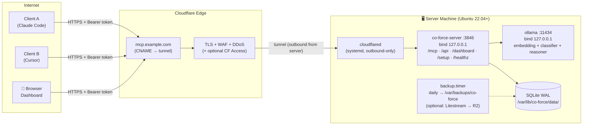

# Detailed Implementation Plan: 06 - Server Deployment, Cloudflared Tunnel & Operations

**Status:** Ready for Implementation (WS-F)
**Target:** `crates/co-force-mcp/src/cli/server_admin/`, `deploy/` (scripts, systemd units), admin documentation

## 1. Context & Objectives

The Co-Force Server runs on **an independent machine** (home server / mini PC / VPS) and is exposed to the internet via a **Cloudflare Tunnel** using a private domain — avoiding open ports on the router, enabling automatic TLS, and preventing DDoS attacks at the Cloudflare edge. The server installation process **is allowed to take longer and be resource-intensive** (principle N3): the installer handles everything once, in exchange for fully automated operations later (systemd + watchdog + backups + alerts).

**Recommended Hardware Requirements** (quality-first — larger models = higher quality):

| Tier | Configuration | Models Run | Notes |
| :--- | :--- | :--- | :--- |
| Minimum | 8GB RAM, 4 cores, 30GB disk | embedding + classifier (gemma4:e2b), reasoner uses cloud API | Sufficient if reasoner goes to cloud |
| **Recommended** | 16–32GB RAM (or GPU 12GB+) | + local reasoner `qwen3:14b` | Full local, no data leaves the machine |
| High-end | GPU 24GB+ | reasoner `qwen3:32b` / larger | Maximum recheck/critique quality |

---

## 2. Topology



Key Security Feature: `co-force-server` and `ollama` **bind to 127.0.0.1 only** — the sole entry point is the encrypted tunnel; the server machine requires no inbound ports to be open.

**The server is always headless** — no GUI, no desktop environment. Two deployment forms have identical features:
- **Bare-metal + systemd** (installer default §3) — recommended when a GPU is present (Ollama accesses the GPU directly without container toolkit overhead).
- **Docker Compose** (§2.1) — recommended for isolation/portability or if the machine already runs Docker.

### 2.1 Docker Compose Variant

```yaml
# deploy/docker-compose.yml
services:
  co-force:
    image: ghcr.io/hiimtrung/co-force-server:1.0
    restart: unless-stopped
    depends_on: { ollama: { condition: service_healthy } }
    volumes:
      - coforce-data:/var/lib/co-force
      - ./server.toml:/etc/co-force/server.toml:ro
      - ./secrets.toml:/etc/co-force/secrets.toml:ro
    environment:
      - CO_FORCE_OLLAMA_URL=http://ollama:11434
      # F-16: inside the container MUST bind to 0.0.0.0 — binding to 127.0.0.1
      # prevents the cloudflared container from reaching it (each container has its own network namespace).
      # Isolation is handled by the compose network: no ports are published to the host.
      - CO_FORCE_BIND=0.0.0.0:3846

  ollama:
    image: ollama/ollama:latest
    restart: unless-stopped
    volumes: [ ollama-models:/root/.ollama ]
    healthcheck:
      test: ["CMD", "ollama", "list"]
      interval: 30s
    # GPU: enable deploy.resources.reservations.devices (nvidia-container-toolkit)

  cloudflared:
    image: cloudflare/cloudflared:latest
    restart: unless-stopped
    command: tunnel run --token ${CLOUDFLARE_TUNNEL_TOKEN}
    depends_on: [ co-force ]

volumes:
  coforce-data:
  ollama-models:
```

- Model Pull Initialization: a one-shot `ollama-init` service (or `co-force-server install --docker-init`) pulls + verifies the 3 models before `co-force` accepts traffic — upholding the N2 principle (never run with missing models).
- Tunnel uses **token mode** (create the tunnel on the Cloudflare dashboard → copy the token into `.env`) — no interactive `cloudflared login` required inside the container. The public hostname configured on the Cloudflare dashboard points to `http://co-force:3846` (service name in the compose network, not 127.0.0.1).
- **Bind Note (F-16):** the "bind to 127.0.0.1" rule in §2 applies only to bare-metal setups. In Docker, services bind to `0.0.0.0` inside containers; safety is equivalent because the internal compose network does not publish ports to the host — the only way in is still the tunnel.
- Worker Pool (§3.3) in Docker: provider CLIs are included in the `co-force-server` image (build args select providers); worktrees reside in the `coforce-data` volume.
- systemd units (§3.1 step 6) do not apply — `restart: unless-stopped` + Docker healthcheck replace the watchdog; the backup timer runs via a sidecar cron container or host cron calling `docker exec co-force co-force-server backup now`.

---

## 3. Installer `co-force-server install` (One-time, Interactive)

Distributed as: `curl -fsSL https://github.com/hiimtrung/co-force/releases/latest/download/install-server.sh | sudo sh`
The script downloads the correct binary for the architecture and executes `co-force-server install` — the remaining steps are in Rust (testable, idempotent, with `--resume` on mid-run failures).

### 3.1 Installer Steps (sequential, each with checkpoints)

1. **Preflight:** OS/arch checks, RAM/disk checks matching the selected tier (§1), warnings if below recommendations; systemd checks; checks that no old instances are running (if found → switches to `upgrade` mode).
2. **System Setup:** creates a system user `coforce` (no-login), directories:
   - `/etc/co-force/` — `server.toml`, `secrets.toml` (0600)
   - `/var/lib/co-force/data/{workspaceId}/co-force.db`
   - `/var/log/co-force/`, `/var/backups/co-force/`
3. **Ollama:** installs via the official script → systemd enable → **pulls models and verifies checksums before proceeding** (longest step, displays progress):
   - `mxbai-embed-large` (embedding, ~670MB)
   - `gemma4:e2b` (classifier)
   - reasoner based on selected tier (`qwen3:14b` default for recommended tier) — or the user selects a cloud provider for the reasoner (input API keys in `secrets.toml`)
   - Smoke test: runs 1 real embed + 1 classify + 1 generate call, measures latency, writes to the installation report.
4. **Config Generation:** generates `server.toml` (§5) with defaults; generates the **admin token** (printed ONCE, stored hashed).
5. **Cloudflared:**
   - Installs official package; runs `cloudflared tunnel login` (opens URL — user authorizes the domain on Cloudflare, the only interactive step requiring a browser)
   - Runs `cloudflared tunnel create co-force` → credential JSON written to `/etc/cloudflared/`
   - Prompts for the hostname (e.g. `mcp.example.com`) → runs `cloudflared tunnel route dns co-force mcp.example.com`
   - Writes `/etc/cloudflared/config.yml`:
     ```yaml
     tunnel: <TUNNEL_ID>
     credentials-file: /etc/cloudflared/<TUNNEL_ID>.json
     ingress:
       - hostname: mcp.example.com
         service: http://127.0.0.1:3846
         originRequest: { noTLSVerify: false, connectTimeout: 30s }
       - service: http_status:404
     ```
   - Installs `cloudflared` systemd service
   - **Technical Note for `wait_events` (Plan 07):** Cloudflare proxy timeout is ~100s → server-side long-polling is set to a max of 55s before returning `no_events`, client loops and reconnects. Streamable HTTP sessions function normally through the tunnel.
6. **systemd units** (with hardening):
   ```ini
   # /etc/systemd/system/co-force.service
   [Unit]
   After=network-online.target ollama.service
   Wants=ollama.service
   [Service]
   User=coforce
   ExecStart=/usr/local/bin/co-force-server serve --config /etc/co-force/server.toml
   Restart=always
   RestartSec=3
   # Hardening
   ProtectSystem=strict
   ReadWritePaths=/var/lib/co-force /var/log/co-force
   NoNewPrivileges=true
   PrivateTmp=true
   [Install]
   WantedBy=multi-user.target
   ```
7. **Backup:** `co-force-backup.timer` daily at 03:00 — runs `sqlite3 ... ".backup"` for `server.db` (tokens/registry — F-17) + each workspace + `config` → tar.zst, retains 14 archives, verifies integrity (`PRAGMA integrity_check` on the backup file). Option to enable **Litestream** continuous replication to Cloudflare R2/S3 (prompted in the installer).
8. **Final Verification:** the installer calls `https://mcp.example.com/healthz` from itself (via the internet, not localhost) → confirms end-to-end tunnel connectivity; runs 1 complete check_in → lock → unlock loop using an internal test client.
9. **Prints Installation Report:**
   ```
   ✅ Co-Force Server v1.0.0 — READY
      URL:            https://mcp.example.com
      Dashboard:      https://mcp.example.com/dashboard
      Admin token:    cfk_admin_************ (SAVE THIS NOW — will not be displayed again)
      Models:         mxbai-embed-large ✓  gemma4:e2b ✓  qwen3:14b ✓ (avg gen 1.8s)
      Backup:         daily 03:00 → /var/backups/co-force (14 copies)
      Enrollment:     open Dashboard → Add Client → copy one-liner
   ```

### 3.2 Idempotency & Resume
Each step writes its checkpoint to `/etc/co-force/.install-state.json`. Re-running the installer skips completed steps and retries failed ones. Running `co-force-server install --check` runs a dry-run reporting status.

### 3.3 Worker Pool Provisioning (recommended — required for auto-staffing reviewer/critic, architecture.md §5.3)
The installer prompts whether to enable the **Lane 3 Worker Pool**. If enabled:
1. **Provider CLIs on the Server (subscription-first — Plan 08):** installs the selected CLIs (`claude`, `codex`, `agy`, `cursor-agent`) running under the `coforce` user; **logs in via subscription** matching the headless login flow of each CLI (Plan 08 §3: `claude setup-token`; `codex login` via SSH port-forward; `agy` prints URL + one-time code completed on browser of another machine) — API keys in `secrets.toml` (0600) act strictly as fallbacks per-provider. Smoke-tests each CLI: 1 headless command (`claude -p "ping"` / `codex exec "ping"` / `agy -p "ping"`) confirms auth is OK; health probes verify auth-status periodically, if subscription expires → component is set to down + alerts with re-login command (no silent fallback to API keys).
2. **Git Access per Workspace:** generates a unique SSH deploy key (`/etc/co-force/keys/{wsId}`), printing the public key for the admin to add to the repo (GitHub/GitLab deploy key, **read-only by default**; write permission permitted for `co-force/*` branches if workers write code). Verifies via `git ls-remote`.
3. Creates directory structure `/var/lib/co-force/workspaces/{wsId}/mirror.git` + disk quota for `jobs/`.
If the worker pool is disabled → the system functions but auto-staffing only uses Lane 2 (spawning on developer machines) — the installer documents this trade-off.

---

## 4. Authentication & Security

### 4.1 Token Model (`api_tokens` table — resides in **server-level DB** `/var/lib/co-force/server.db`, NOT workspace DBs)

> **F-17:** Tokens must be resolved **before** knowing which workspace the request belongs to (AuthLayer runs before routing; enrollment happens before a workspace exists; admin tokens have scope `*`). Therefore, `api_tokens` + `workspaces` registry + `audit_log` reside in `server.db`; the DB per-workspace strictly stores business data for that workspace.

| Column | Meaning |
| :--- | :--- |
| `token_id` | UUID |
| `token_hash` | SHA-256 of the token (raw token is displayed only once during issue) |
| `label` | "MacBook-Trung", "CI-runner"... |
| `kind` | `admin` \| `agent` \| `enrollment` |
| `workspace_scope` | `*` or specific workspaceId |
| `expires_at`, `revoked_at`, `last_used_at`, `created_by` | lifecycle & audit |

- Format: `cfk_<kind>_<32 bytes base62>`.
- **Enrollment Token** (TTL 24h, N-uses per configuration): embedded in the setup one-liner; client scripts use it to call `/api/enroll` → server **exchanges it for a long-term agent token** specific to that machine (one token per machine → machine-level revocation is independent).
- Admin management via dashboard or CLI: `co-force-server token issue|list|revoke`.

### 4.2 Middleware Chain (tower layers on axum)
`TraceLayer` → `RateLimit (per-token: 60 rpm default, burst 120)` → `BodyLimit 2MB` → `AuthLayer (Bearer → Identity, injects extensions)` → route.

- Public `/healthz` only returns `{"status":"ok|fail"}`; detailed component status requires token auth.
- `/setup` (enrollment script) is public, but the script contains no secrets — the token is passed as an argument in the one-liner copied from the dashboard (post-login).
- Audit: every write request logs (token_id, tool, latency, status) into rotated log files; business activities are already logged in `agent_activities`.

### 4.3 Supplementary Defense Layers (documented, optional)
- **Cloudflare Access service tokens** in front of app auth (two-layer zero-trust)
- Cloudflare WAF rate limiting rule for `/mcp`
- Fail2ban-style behavior: > 10 consecutive 401s from an IP → alerts ops (block via Cloudflare firewall)

---

## 5. Config Schema `/etc/co-force/server.toml`

```toml
[server]
bind = "127.0.0.1:3846"
public_url = "https://mcp.example.com"     # used for generating enrollment scripts & AGENTS.md
data_dir = "/var/lib/co-force/data"

[llm]
embedding_provider = "ollama"              # REQUIRED — no disabled mode
classifier_provider = "ollama"
reasoner_provider = "ollama"               # ollama | anthropic | openai | gemini

[llm.ollama]
url = "http://127.0.0.1:11434"
embedding_model = "mxbai-embed-large"
classifier_model = "gemma4:e2b"
reasoner_model = "qwen3:14b"
concurrency_limit = 2
timeout_embed_secs = 15
timeout_generate_secs = 60

[llm.anthropic]                             # if reasoner uses cloud
api_key = "file:/etc/co-force/secrets.toml#anthropic"
reasoner_model = "claude-sonnet-5"

[quality]                                   # defaults — overridden per workspace (Plan 07)
reviews_required = 1
reviewer_must_differ = "agent"              # agent | provider
require_recheck = true
require_verification_evidence = true
critique_fanout = 2

[a2a]
max_spawn_depth = 1                         # subagents cannot spawn further subagents (Plan 10 §7)
wait_events_max_secs = 55                   # < Cloudflare 100s timeout
spawn_timeout_secs = 120                    # L2: wait for child agent check-in
solo_team_threshold_tasks = 3               # solo + backlog > N → nudges plan_team (Plan 10 §2)
max_agents_per_machine = 3                  # L2 subagent cap per client machine
stall_timeout_secs = 900                    # in_progress task with no activity → alerts PM
use_local_worktrees = false                 # true → spawn L2 into separate git worktree (Plan 10 §5)

[workers]                                   # Lane 3 worker pool (architecture.md §5.3)
enabled = true
max_concurrent_jobs = 2
job_timeout_secs = 1800
allow_code_push = false                     # true → worker allowed to push branch co-force/*
providers = ["claude-code", "codex", "antigravity"]  # CLIs installed + logged in + smoke-tested
                                            # ≥ 2 providers → unlocks reviewer_must_differ="provider"
                                            # spec/flags/caveats per provider: Plan 08 §3
mirror_fetch_interval_secs = 600

[ops]
alert_webhook = ""                          # Discord/Slack/Telegram webhook URL
backup_dir = "/var/backups/co-force"
backup_keep = 14
```

---

## 6. Health Model & Alerting (enforces N2 — fail-loud)

- **Component Registry:** `db`, `llm.embedding`, `llm.classifier`, `llm.reasoner`, `tunnel` (checks cloudflared unit via D-Bus/systemctl), `disk` (< 10% free → warn), `provider.<cli>` per worker-pool CLI (auth-status probed every 30 minutes — Plan 08 C4; subscription expiration → down + prints re-login commands). Each component: probed every 30s + probed on runtime failures.
- **Server Status:** `healthy` | `degraded` (a component is down). When `degraded`:
  1. Tools dependent on the failed component return `SERVICE_UNAVAILABLE {component, retry_after_secs, incident_id}` — **never** return lower-quality fallback results.
  2. The alert webhook fires once when down > 60s + once when recovered (no spam).
  3. Displays a red banner on the dashboard + logs the incident.
- systemd `Restart=always` for all 3 services acts as the primary self-recovery layer; the re-embed/re-classify queue flushes automatically when the LLM recovers (resilience ≠ degradation: data is not lost, features do not "pretend to work").

---

## 7. Daily Operations (Admin CLI & Dashboard)

| Action | Command / UI |
| :--- | :--- |
| Check Status | `co-force-server status` (components, agents online, version) / Admin Dashboard |
| Tokens | `co-force-server token issue --label "..." [--workspace X]` / UI |
| Run Backup | `co-force-server backup now` |
| Restore | `co-force-server restore <archive>` (stops service, restores, verifies integrity, starts) |
| Upgrade | `co-force-server upgrade` (downloads new release, backs up first, swaps binary, restarts — migration runs automatically with version gates) |
| Change Model | edit `server.toml` + `co-force-server reload` — changing the embedding model/dimension → automatically re-embeds everything (background execution, progress displayed on dashboard, recall returns `PARTIAL_INDEX` in the interim) |
| Logs | `journalctl -u co-force -f` |

---

## 8. Steps to Implement (Step-by-Step, TDD where applicable)

1. Auth: set up `server.db` (`api_tokens`, `workspaces`, `audit_log` tables — F-17) + repo + `AuthLayer` (unit tests: valid/expired/revoked/invalid scope) — **do first as WS-B depends on this**.
2. Consolidated Axum router + `/healthz` + component registry (mock probes in tests).
3. Admin CLI (`token`, `status`, `backup`, `restore`) — logic in core, tested using temporary directories.
4. Installer: implement each step as a separate function with checkpoints (tested on Ubuntu container in CI); mock Ollama/cloudflared steps via the `SystemRunner` trait.
5. systemd unit files + install-server.sh in `deploy/`; CI job `installer-e2e` running on GitHub Actions VM (excluding cloudflared login — mocked).
6. Backup/restore + upgrade path + admin documentation (`docs/ops/server_admin_guide.md`).
7. Alert webhook adapters (Discord/Slack/Telegram — sharing the `Alerter` trait).
