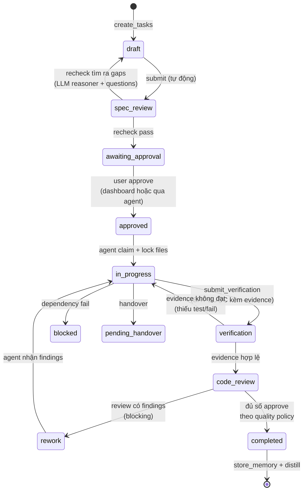
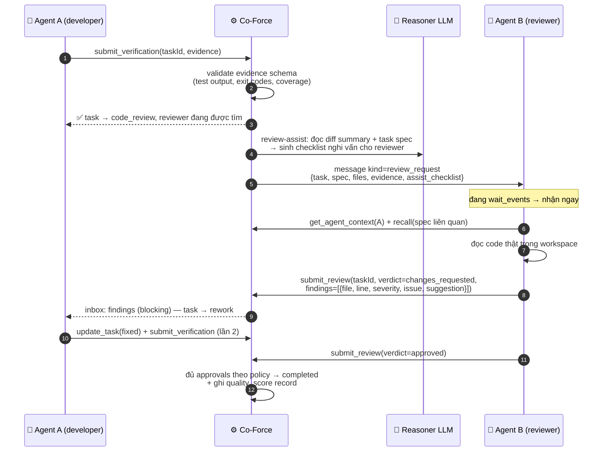

# Kế Hoạch Triển Khai Chi Tiết: 07 - Quality Engine & Bidirectional A2A

**Status:** Ready for Implementation (WS-C — critical path)
**Target:** `crates/co-force-core/src/quality/`, `src/messaging/`, mở rộng `engine/`

## 1. Context & Mục Tiêu

Đây là **lý do tồn tại của Co-Force**: biến một nhóm agent rời rạc thành một **product team thật** — có vai trò, có phản biện, có review chéo, có bằng chứng nghiệm thu. Mục tiêu không phải làm nhanh hơn mà là **đẩy chất lượng đầu ra của LLM đến cực hạn** bằng cơ chế đã được chứng minh ở team người: *không ai tự chấm bài của chính mình, và mọi claim phải có evidence*.

Cơ sở lý luận (đã phản ánh trong AGENTS.md của chính repo này): LLM đơn lẻ có blind spots hệ thống — tự tin sai, bỏ edge case, khai man "đã test". Ba đòn bẩy chất lượng mà server ép buộc được:
1. **Separation of duties** — agent viết code ≠ agent review ≠ (LLM) recheck spec.
2. **Evidence, not claims** — `completed` chỉ tồn tại sau khi có verification record máy-đọc-được.
3. **Adversarial critique** — nhiều agent/model khác nhau phản biện cùng một artifact; bất đồng là tín hiệu, không phải nhiễu.

---

## 2. Role System & Team Staffing

### 2.1 Roles
`role` khai báo lúc check-in (hoặc gán bởi user/dashboard): `pm` | `architect` | `developer` | `reviewer` | `qa` | `researcher`. Một agent có thể nhiều role; **ràng buộc separation áp theo task**: agent đã đóng vai developer của task X không được nhận review/QA của chính task X (enforce ở server, không dựa vào thiện chí LLM).

### 2.2 Auto-staffing (liên kết Plan 03)
Khi task tới gate cần role chưa có agent online đảm nhận:
1. Server tìm agent online khác role phù hợp → gửi review request qua inbox.
2. Không có → **spawn** agent mới với role đó qua **Lane 3 worker pool** — headless trên server, đọc code từ git worktree (architecture.md §5.3; provider registry, ưu tiên **provider/model KHÁC** với agent tác giả để tăng diversity phản biện).
3. Không spawn được → task đứng ở gate + banner dashboard + alert. **Không bao giờ tự bỏ qua gate.**

---

## 3. Task State Machine mở rộng (thay thế TaskStatus cũ)



**Bất biến do server enforce (không phải hướng dẫn suông):**
- `update_task(status=completed)` trực tiếp → lỗi `GATE_VIOLATION` kèm `recovery_action` (phải đi qua `submit_verification` → review).
- Transition sang `code_review` yêu cầu ≥ 1 `verification_records` hợp lệ cho đúng task revision.
- Approve review chỉ được tính từ agent ≠ tác giả (theo `reviewer_must_differ`: khác agent, hoặc nghiêm hơn: khác provider/model).
- Mỗi lần `rework` tăng `rework_cycle`; quá `max_rework_cycles` (default 3) → escalate cho user (không auto-loop vô hạn đốt token).

---

## 4. Bidirectional Messaging (nền tảng tương tác 2 chiều)

### 4.1 Bảng `agent_messages`
```sql
CREATE TABLE agent_messages (
    message_id TEXT PRIMARY KEY,
    workspace_id TEXT NOT NULL,
    from_agent_id TEXT NOT NULL,
    to_agent_id TEXT,                 -- NULL = broadcast theo role_filter
    role_filter TEXT,                 -- 'reviewer' → gửi mọi agent role đó
    kind TEXT NOT NULL,               -- info | question | review_request | critique_request
                                      -- | review_response | critique_response | answer
    payload TEXT NOT NULL,            -- JSON có schema theo kind
    correlation_id TEXT,              -- nối request ↔ response
    requires_response BOOLEAN DEFAULT FALSE,
    created_at TIMESTAMP DEFAULT CURRENT_TIMESTAMP,
    delivered_at TIMESTAMP,
    responded_at TIMESTAMP
);
CREATE INDEX idx_msg_inbox ON agent_messages(workspace_id, to_agent_id, delivered_at);
```

### 4.2 Cơ chế delivery — 3 kênh phối hợp
1. **Piggyback inbox (chủ lực):** MỌI tool response đều kèm `inbox: {unread: n, urgent: [...tóm tắt]}` — agent đang làm việc luôn thấy tin mới mà không cần tool riêng, được `protocol_next_step` hướng dẫn xử lý tin `requires_response` trước.
2. **`co_force_wait_events(timeout_secs≤55, filters?)` (long-poll):** agent rảnh (vd reviewer được spawn để trực) block chờ; server trả ngay khi có message/gate event cho agent đó, hoặc `no_events` khi hết timeout → agent gọi lại. 55s < Cloudflare timeout 100s (Plan 06 §3.1). Đây là cách một agent "trực chiến" như thành viên team thật.
3. **Check-in delivery:** tin chưa delivered trả đầy đủ khi agent check-in (phiên mới).

### 4.3 Tools
| Tool | Input | Hành vi |
| :--- | :--- | :--- |
| `co_force_send_message` | `{to?: agentId, roleFilter?, kind, payload, requiresResponse?}` | Ghi message + event bus; trả `messageId, correlationId` |
| `co_force_respond_message` | `{correlationId, payload}` | Đóng vòng request-response, notify người gửi |
| `co_force_wait_events` | `{timeoutSecs?, kinds?[]}` | Long-poll như §4.2.2 |

---

## 5. Review Workflow (gate chính)



### 5.1 Verification evidence schema (bảng `verification_records`)
```json
{
  "task_revision": 2,
  "commit_sha": "a1b2c3d...",
  "steps": [
    {"kind": "test",  "command": "cargo test -p co-force-core", "exit_code": 0,
     "summary": "142 passed, 0 failed", "output_digest": "sha256:..."},
    {"kind": "lint",  "command": "cargo clippy -- -D warnings", "exit_code": 0},
    {"kind": "manual","description": "UI hiển thị đúng ở dark mode", "artifact": "screenshot ref"}
  ]
}
```
Server validate: có ≥ 1 step `kind=test` với `exit_code=0` (theo policy); evidence gắn với `task_revision` hiện tại — sửa code sau khi submit → revision tăng → evidence cũ vô hiệu (chống khai man phổ biến nhất của LLM: "đã test rồi" từ lần trước).

### 5.2 Bảng `reviews`
`review_id, task_id, task_revision, reviewer_agent_id, verdict (approved|changes_requested), findings JSON, assist_checklist JSON, created_at`.

## 6. Critique Fan-out (phản biện đa mô hình)

`co_force_request_critique({subject, content, fanout?})` — dùng cho quyết định kiến trúc/spec quan trọng, trước khi code:
1. Server chọn `fanout` agents (ưu tiên đa dạng provider/model; thiếu → spawn).
2. Mỗi agent nhận `critique_request`, trả `submit_critique({position: agree|disagree, arguments[], risks[], alternatives[]})`.
3. Server dùng reasoner LLM **tổng hợp bất đồng** (không vote đa số — bất đồng được trình bày nguyên vẹn cho user/agent chủ trì quyết định).
4. Kết quả lưu `critiques` + distill vào knowledge.

## 7. Server-side LLM Quality Services (dùng reasoner model — Plan 06 §5)

| Service | Trigger | Việc làm |
| :--- | :--- | :--- |
| **Spec Recheck** (UC-06 nâng cấp) | task vào `spec_review` | Reasoner phân tích use cases/edge cases/security/dependency giữa các tasks → trả `gaps[], questions[]`; có gap → task về `draft` kèm câu hỏi cho user |
| **Review Assist** | task vào `code_review` | Sinh checklist nghi vấn theo diff + spec cho reviewer (reviewer vẫn là agent — assist không thay thế) |
| **Session Distillation** | task `completed` / nightly | Memories phiên → knowledge tổng quát; phát hiện skill candidates |
| **Memory Consolidation** | nightly | Dedup (cosine > 0.92), decay entries không dùng, re-score confidence |
| **Quality Scoring** | task `completed` | Ghi `quality_scores`: rework_cycles, findings theo severity, thời gian ở mỗi gate, review coverage |

## 8. Quality Policy per Workspace (bảng `quality_policies`)

```toml
# override defaults của server.toml [quality] — chỉnh qua dashboard hoặc co_force_quality_policy (admin)
reviews_required = 1                # số approve cần
reviewer_must_differ = "provider"   # "agent" | "provider" (khắt khe hơn: model khác hẳn)
require_recheck = true
require_verification_evidence = true
required_evidence_kinds = ["test", "lint"]
critique_fanout = 2
max_rework_cycles = 3
definition_of_done = ["tests pass", "no clippy warnings", "docs updated"]  # inject vào review checklist
```

## 9. Quality Metrics (dashboard — đo chất lượng, không đo tốc độ)

- **Rework rate** = tasks có ≥1 rework / tổng — cao nghĩa là review đang bắt được lỗi (tốt) hoặc spec kém (xem cùng recheck-gap count)
- **Findings/task theo severity**; **escaped defects** (bug phát hiện sau completed — đánh dấu hồi tố)
- **Review coverage** (% tasks qua đủ gates — mục tiêu 100%), **evidence integrity** (% verification đúng revision)
- **Memory reuse rate** (recall hits được cite trong task mới) — đo giá trị tri thức tích lũy

## 10. Trình tự Triển khai (Step-by-Step, TDD)

1. Migrations: `agent_messages`, `reviews`, `critiques`, `verification_records`, `quality_policies`, `quality_scores` + repos (mockall).
2. Task state machine mới: pure function `transition(task, action, policy) -> Result<TaskStatus, GateViolation>` — unit test đủ mọi cạnh (đây là logic quan trọng nhất, test trước tiên).
3. Messaging: send/respond + inbox piggyback middleware (mọi tool response đi qua decorator gắn inbox) + `wait_events` (tokio watch/notify per agent, timeout 55s).
4. Verification evidence validator + revision tracking (revision tăng khi lock/unlock ghi nhận file đổi sau submit).
5. Review workflow use cases + separation-of-duties checks + auto-staffing hook (gọi sang Plan 03 spawn).
6. LLM services: recheck, review-assist, distillation, consolidation — mỗi service 1 struct nhận `Arc<dyn LlmProvider>` (mock cho unit test; prompt templates để trong `quality/prompts/` dạng file, có versioning).
7. Critique fan-out + tổng hợp bất đồng.
8. Quality scores + metrics API cho dashboard.
9. Integration test "3 agents như một team" (kịch bản Master Plan §6.1) với mock LLM + mock 3 MCP sessions.
