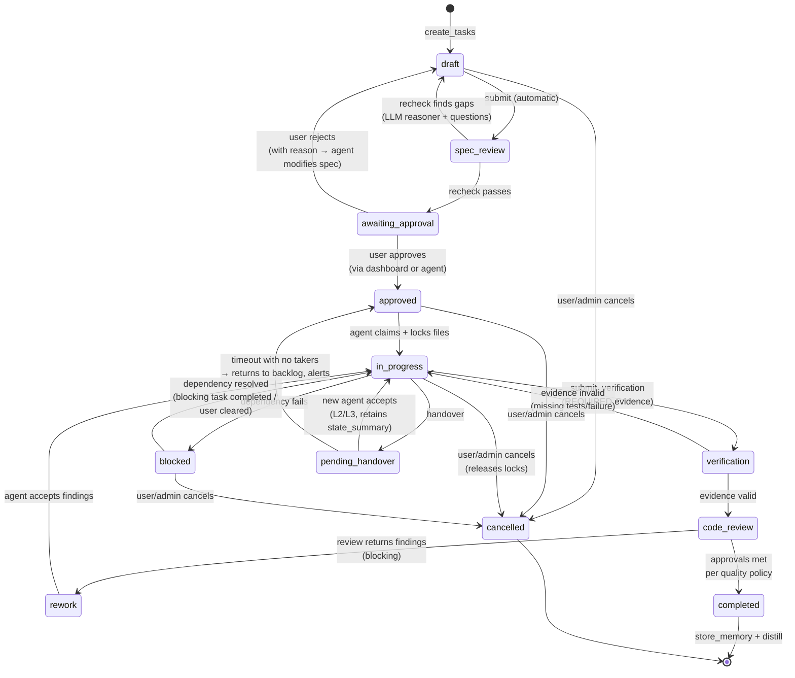
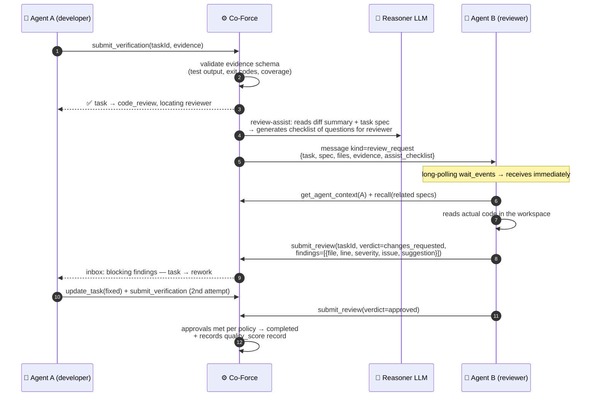

# Detailed Implementation Plan: 07 - Quality Engine & Bidirectional A2A

**Status:** Ready for Implementation (WS-C — critical path)
**Target:** `crates/co-force-core/src/quality/`, `src/messaging/`, extending `engine/`

## 1. Context & Objectives

This is the **raison d'être of Co-Force**: turning a loose group of agents into a **real product team** — with distinct roles, constructive critiques, cross-reviews, and verification evidence. The goal is not to execute faster but to **drive the output quality of LLMs to the absolute limit** using mechanisms proven in human teams: *no one grades their own work, and every claim must be backed by evidence*.

Theoretical Basis (reflected in this repository's own `AGENTS.md`): Single LLMs suffer from systematic blind spots — false confidence, missed edge cases, and claiming "it's already tested" when it isn't. The three quality levers enforced by the server are:
1. **Separation of Duties** — the agent writing the code ≠ the agent reviewing the code ≠ the (LLM) rechecking the specification.
2. **Evidence, Not Claims** — a task cannot be set to `completed` without a machine-readable verification record.
3. **Adversarial Critique** — multiple distinct agents/models critiquing the same artifact; disagreement is a signal, not noise.

---

## 2. Role System & Team Staffing

### 2.1 Roles
Roles are declared during check-in (or assigned by the user/dashboard): `pm` | `architect` | `developer` | `reviewer` | `qa` | `researcher`. An agent can hold multiple roles; **separation of duties is enforced at the task level**: the agent who acted as the developer for task X is barred from acting as the reviewer or QA for task X (enforced server-side, not relying on LLM goodwill).

### 2.2 Auto-staffing (aligned with Plan 03)
When a task reaches a gate requiring a role that no currently online agent possesses:
1. The server searches for another online agent with a matching role → sends a review request via the inbox.
2. If none exist → **spawns** a new agent with that role via the **Lane 3 worker pool** — headless on the server, reading code from a git worktree (architecture.md §5.3; provider registry **Plan 08**, prioritizing a **DIFFERENT provider/model** than the authoring agent to maximize critique diversity — with 3 CLI subscriptions (Claude/Codex/agy), the diversity picker covers Anthropic ↔ OpenAI ↔ Google before repeating a provider).
3. If spawning fails → the task halts at the gate + displays a banner on the dashboard + triggers an alert. **Never bypass a gate.**

**Solo Workstream (Plan 10):** When the workspace has only 1 agent and the backlog exceeds the threshold, staffing does not wait for a gate block — the original agent is nudged to promote itself to PM from the start (`co_force_plan_team` estimates dev/reviewer/qa/ba → spawns L2 locally or L3 on another provider). Cross-reviews in solo mode run between **distinct identities** (`reviewer_must_differ="agent"` — valid under the §8 validator); model diversity is supplemented by the server-side reasoner + L3 reviewer from a different provider if the worker pool is active.

---

## 3. Extended Task State Machine (replaces old TaskStatus)



> **F-20:** `blocked` and `pending_handover` must have exits (otherwise tasks are locked forever); `awaiting_approval` must support a reject path; `cancelled` must be reachable from any state that is not `completed` (triggered only by user/admin — agents do not cancel tasks; diagram displays primary transitions). Cancelling tasks in `code_review` or `verification` is also permitted via the dashboard.

**Invariants Enforced by Server (not just guidelines):**
- Direct `update_task(status=completed)` → returns a `GATE_VIOLATION` error with a `recovery_action` (must traverse `submit_verification` → review).
- Transition to `code_review` requires ≥ 1 valid `verification_records` for the current task revision.
- Review approvals are only counted from agents ≠ author (subject to `reviewer_must_differ`: different agent, or stricter: different provider/model).
- Each `rework` cycle increments `rework_cycle`; exceeding `max_rework_cycles` (default 3) → escalates to the user (no infinite loops burning tokens).

---

## 4. Bidirectional Messaging (Foundation for 2-way Interaction)

### 4.1 `agent_messages` Table
```sql
CREATE TABLE agent_messages (
    message_id TEXT PRIMARY KEY,
    workspace_id TEXT NOT NULL,
    from_agent_id TEXT NOT NULL,
    to_agent_id TEXT,                 -- NULL = broadcast by role_filter
    role_filter TEXT,                 -- 'reviewer' → sends to all agents with that role
    kind TEXT NOT NULL,               -- info | question | review_request | critique_request
                                      -- | review_response | critique_response | answer
    payload TEXT NOT NULL,            -- JSON schema specific to kind
    correlation_id TEXT,              -- connects request ↔ response
    requires_response BOOLEAN DEFAULT FALSE,
    created_at TIMESTAMP DEFAULT CURRENT_TIMESTAMP,
    delivered_at TIMESTAMP,
    responded_at TIMESTAMP
);
CREATE INDEX idx_msg_inbox ON agent_messages(workspace_id, to_agent_id, delivered_at);
```

### 4.2 Delivery Mechanisms — 3 Coordinated Channels
1. **Piggyback Inbox (Primary):** EVERY tool response is appended with `inbox: {unread: n, urgent: [...summary]}` — active agents always see new messages without invoking a separate tool, and are guided by `protocol_next_step` to handle `requires_response` messages first.
2. **`co_force_wait_events(timeout_secs≤55, filters?)` (Long-Poll):** Idle agents (e.g. reviewers spawned to watch the queue) block and wait; the server returns immediately when a message or gate event occurs for that agent, or returns `no_events` when the timeout is reached → agent loops and calls again. 55s < Cloudflare's 100s timeout (Plan 06 §3.1). This lets an agent stand by like a real team member. **Note (F-24):** some MCP clients have custom tool-call timeouts shorter than 55s → default `timeoutSecs = 25`, max 55; the enrollment script tests `wait_events` once to measure and print recommendations if the client cuts it off early. Each poll cycle consumes 1 tool call in the agent's context — active standby workers should be allocated dedicated token budgets (Plan 03 L3).
3. **Check-in Delivery:** Undelivered messages are delivered in full when an agent checks in (new session).

### 4.3 Tools
| Tool | Input | Behavior |
| :--- | :--- | :--- |
| `co_force_send_message` | `{to?: agentId, roleFilter?, kind, payload, requiresResponse?}` | Writes message + alerts event bus; returns `messageId, correlationId` |
| `co_force_respond_message` | `{correlationId, payload}` | Completes the request-response cycle, notifying the sender |
| `co_force_wait_events` | `{timeoutSecs?, kinds?[]}` | Long-polls as described in §4.2.2 |

---

## 5. Review Workflow (Primary Gate)



### 5.1 Verification Evidence Schema (table `verification_records`)
```json
{
  "task_revision": 2,
  "commit_sha": "a1b2c3d...",
  "steps": [
    {"kind": "test",  "command": "cargo test -p co-force-core", "exit_code": 0,
     "summary": "142 passed, 0 failed", "output_digest": "sha256:..."},
    {"kind": "lint",  "command": "cargo clippy -- -D warnings", "exit_code": 0},
    {"kind": "manual","description": "UI displays correctly in dark mode", "artifact": "screenshot ref"}
  ]
}
```
Server validates: contains ≥ 1 step `kind=test` with `exit_code=0` (per policy); evidence is bound to the current `task_revision` — incrementing the revision invalidates old evidence (preventing the common LLM lie: "already tested" from a previous run).

**Revision Tracking — Solely based on events OBSERVED BY THE SERVER (F-21).** The server cannot inspect the client's local filesystem to detect changes; the revision increments when:
1. The task returns to `in_progress` (rework);
2. The agent locks additional files or re-locks existing files for the task **after** evidence has been submitted;
3. A new `submit_verification` or new `commit_sha` is received.

When a git remote is configured + the Worker Pool is active: the server **fetches the mirror and verifies the `commit_sha` exists** during `submit_verification` — if missing → returns `EVIDENCE_STALE {reason: "commit_not_found"}` (the agent must push first, which is also required for the L3 reviewer to inspect the correct code). Without a remote: trusts local execution limits — the primary gate is the reviewer **running tests independently**, and evidence acts as supplementary proof.

### 5.2 `reviews` Table
`review_id, task_id, task_revision, reviewer_agent_id, verdict (approved|changes_requested), findings JSON, assist_checklist JSON, created_at`.

## 6. Critique Fan-out (Adversarial Critique)

`co_force_request_critique({subject, content, fanout?})` — used for major architectural/specification decisions before coding starts:
1. The server selects `fanout` agents (prioritizing diverse providers/models; spawns if missing).
2. Each agent receives the `critique_request` and returns a `submit_critique({position: agree|disagree, arguments[], risks[], alternatives[]})`.
3. The server uses the reasoner LLM to **consolidate disagreements** (not a simple majority vote — disagreements are presented intact to the user/agent driving the decision).
4. The output is recorded in `critiques` + distilled into workspace knowledge.

## 7. Server-Side LLM Quality Services (using reasoner model — Plan 06 §5)

> **Subscription Option (Plan 08 §5):** `reasoner_provider = "cli-worker"` — tasks that do not require low latency (distillation, consolidation, nightly rechecks) are routed as L3 jobs running on a CLI subscription instead of calling a cloud reasoner API. Spec Recheck/Review Assist should remain interactive and run via the reasoner API/Ollama (must be fast).

| Service | Trigger | Actions |
| :--- | :--- | :--- |
| **Spec Recheck** (UC-06 upgraded) | task enters `spec_review` | Reasoner analyzes use cases/edge cases/security/task dependencies → returns `gaps[], questions[]`; if gaps exist → task returns to `draft` with questions for the user |
| **Review Assist** | task enters `code_review` | Generates a checklist of questions based on diff + spec for the reviewer (the reviewer is still an agent — assist does not replace them) |
| **Handover Package Validate** | `co_force_handover` | Verifies the completion of the handover package (remaining/next_steps/gotchas) — missing/ambiguous fields → returns `HANDOVER_INCOMPLETE` with details (Plan 03 §5.2); sloppy handovers are blocked |
| **Session Distillation** | task gets `completed` / nightly | Distills session memories → general workspace knowledge; identifies skill candidates |
| **Memory Consolidation** | nightly | Deduplicates (cosine similarity > 0.92), decays unused entries, re-scores confidence |
| **Quality Scoring** | task gets `completed` | Records `quality_scores`: rework_cycles, findings by severity, duration at each gate, review coverage |

## 8. Quality Policy per Workspace (table `quality_policies`)

```toml
# overrides server.toml [quality] defaults — modified via dashboard or co_force_quality_policy (admin)
reviews_required = 1                # number of approvals needed
reviewer_must_differ = "provider"   # "agent" | "provider" (stricter: different model)
require_recheck = true
require_verification_evidence = true
required_evidence_kinds = ["test", "lint"]
critique_fanout = 2
max_rework_cycles = 3
definition_of_done = ["tests pass", "no clippy warnings", "docs updated"]  # injected into the review checklist
```

**Validate when SETTING policy, do not wait for runtime (F-22):** Setting `reviewer_must_differ = "provider"` when the system has < 2 available providers (online agents + worker pool `[workers].providers`) → **rejects the change** with instructions (add providers to the worker pool, or lower settings to `"agent"`); the dashboard displays warnings immediately if the number of active providers drops to 1 (e.g. revoking the last Cursor machine). Failing to validate early results in tasks locking at `code_review` indefinitely — freezing at gates + alerting fits N2, but exposing configuration deadlocks to users at runtime is unacceptable.

## 9. Quality Metrics (Dashboard — measures quality, not speed)

- **Rework rate** = tasks with ≥1 rework / total tasks — high values indicate reviews are catching bugs (good) or specification quality is low (correlate with recheck-gap count).
- **Findings per task** grouped by severity; **escaped defects** (bugs reported after completion — marked retroactively).
- **Review coverage** (% of tasks passing all gates — target 100%), **evidence integrity** (% of verifications matching task revision).
- **Memory reuse rate** (recall hits cited in new tasks) — measures the value of accumulated knowledge.

## 10. Steps to Implement (Step-by-Step, TDD)

1. Migrations: set up `agent_messages`, `reviews`, `critiques`, `verification_records`, `quality_policies`, `quality_scores` tables + repositories (mockall).
2. New task state machine: implement the pure function `transition(task, action, policy) -> Result<TaskStatus, GateViolation>` — write unit tests for every transition path (this is critical logic, test first).
3. Messaging: implement send/respond + inbox piggyback middleware (every tool response passes through a decorator appending the inbox) + `wait_events` (tokio watch/notify per agent, 55s timeout).
4. Verification evidence validator + revision tracking based on server-observed events (§5.1 — F-21) + verify `commit_sha` in the mirror when a remote is configured.
5. Review workflow use cases + separation-of-duties checks + auto-staffing hook (calls Plan 03 spawn).
6. LLM services: recheck, review-assist, distillation, consolidation — each service is a struct receiving `Arc<dyn LlmProvider>` (mock for unit tests; prompt templates located in `quality/prompts/` as versioned files).
7. Critique fan-out + dispute consolidation.
8. Quality scores + metrics API for the dashboard.
9. Integration test: "3 agents working as a team" (Master Plan §6.1 scenario) with mock LLM + mock 3 MCP sessions.
