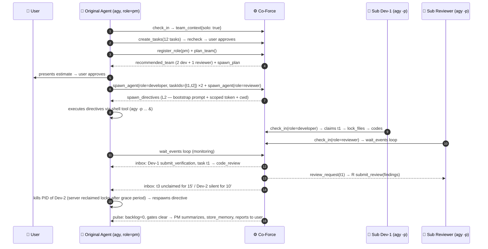

# Detailed Implementation Plan: 10 - Solo Orchestration & Team Bootstrap

**Status:** Ready for Implementation (supports WS-C/E, finalized 2026-07-08)
**Target:** `crates/co-force-core/src/quality/team_planner.rs`, extending `orchestration/`, Plan 09 template
**Target Scenario:** A **long, difficult job with many subtasks** in a workspace with **only a single agent** (e.g. Antigravity on one machine). One agent doing everything → context window bloat → hallucinations, quality collapse. Needs a mechanism where the agent **automatically detects it is solo**, promotes itself to **PM**, estimates the required developer/tester/ba/qa roles, spawns subagents, and Co-Force acts as the **single source of truth + state synchronizer** between subagents — preventing race conditions, maximizing quality.

---

## 1. Principle: Prevent Hallucination by Splitting Context, Not Quality

| Problem with 1 Agent doing a long job | Co-Force Mechanism |
| :--- | :--- |
| Context bloat → forgets specs, mixes tasks, false confidence | Each subagent receives a **minimal bootstrap package** (1 task + protocol pointer) — keeping the context window narrow and clean |
| No cross-checking | Subagents act as **distinct identities** → separation of duties remains enforced (reviewer ≠ author) even with the same provider |
| State stored in agent's "memory" → lost during compaction | State resides in the **server database** (tasks, locks, activities, messages) — accessible by any agent, never stale |
| PM directly coding to "be fast" → bloats context again | PM Playbook (Plan 09 §5): **PM does not code while the team runs** — coordinates only, prompted continuously by `protocol_next_step` |

## 2. Solo Detection & Triggering (How the agent "knows")

Three tiers of signaling, not relying on the agent's goodwill:

1. **Rules (Layer 1):** The Plan 09 §2 rules template includes solo rules: *"If the check_in response indicates you are the only agent online and the backlog spreads across > 3 tasks → register the `pm` role and call `co_force_plan_team` instead of attempting everything yourself."*
2. **Check-in response (Layer 4 in-band):** includes `team_context: {agents_online: 1, solo: true, providers: ["antigravity"]}` — ground truth from the server, not guessed by the agent.
3. **Active Server Nudge (Layer 3):** When the approved backlog of the workspace exceeds a threshold (`[a2a] solo_team_threshold_tasks = 3`) and only 1 agent is online → all responses to that agent are appended with `protocol_next_step: "You are solo with N approved tasks. Register role pm and call co_force_plan_team before claiming tasks yourself."` If the agent ignores this and claims a second task while task 1 is in progress → stronger warnings are returned in the response envelope (not hard blocked — the user can override, configuration option to disable).

## 3. New Tool: `co_force_plan_team` (tool #39, Messaging/A2A group)

Input: `{scope?: taskIds[] | "backlog"}`. The server (reasoner + heuristics) analyzes the approved backlog and returns a **reasoned staffing estimate**:

```json
{
  "analysis": {
    "tasks": 12,
    "parallel_lanes": 3,
    "lane_clusters": [
      {"area": "api/", "tasks": 5},
      {"area": "web/", "tasks": 4},
      {"area": "infra/", "tasks": 3}
    ],
    "spec_gap_score": "low",          // from recheck history → indicates if a BA is needed
    "machine_capacity": {"max_agents_per_machine": 3, "provider": "antigravity"}
  },
  "recommended_team": [
    {"role": "developer", "count": 2, "rationale": "3 lanes but machine capacity is 3 agents max"},
    {"role": "reviewer",  "count": 1, "rationale": "mandatory — reviews_required=1, must differ from author identity"},
    {"role": "qa",        "count": 0, "rationale": "reviewer acts as QA when team size ≤ 4 (default policy)"},
    {"role": "ba",        "count": 0, "rationale": "spec_gap_score=low; server recheck handles validation"}
  ],
  "spawn_plan": [
    {"role": "developer", "taskIds": ["t1","t2"], "directive_ready": true},
    ...
  ],
  "protocol_next_step": "Confirm with the user, then call co_force_spawn_agent for each member. You are PM: do not claim coding tasks while the team runs."
}
```

**Heuristic Engine (runs locally without LLM, reasoner refines):**
- `parallel_lanes` = number of task clusters with **disjoint lock sets** (clustered by expected `locked_files`/`avoidFiles` + dependency graph) — this is the maximum safe level of concurrency.
- Number of developers = min(parallel_lanes, `max_agents_per_machine` − 1 reviewer − 1 PM slot).
- Reviewers ≥ 1 always (different identity); QA is separated only when the team size > 4 or policy `required_evidence_kinds` has many items; BA only when continuous rechecks return gaps (high spec_gap_score).
- Estimates must be **presented to the user for approval** before spawning (approval button on the dashboard or directly requested by PM) — spawning consumes machine resources + subscription tokens.

## 4. PM Subagent Management — Full Lifecycle



**Clear Separation of Responsibilities:**

| Action | Server (Ground Truth) | PM (Coordinator) |
| :--- | :--- | :--- |
| Conflict-free allocation | Lock claims UNIQUE(ws,path) — atomic in DB; task claim atomic (1 assignee) | Assigns taskIds along lanes when spawning; uses `delegate_task(avoidFiles)` |
| Execution order | Task dependencies (prerequisites) — tasks cannot be claimed until prerequisites are met | Organizes lanes, decides priority |
| Detect dead/stuck subagents | Session drops → 2 min grace period → reclaim locks + tasks back to backlog; **stall detector**: task `in_progress` without activity for > `stall_timeout` (15 min) → logs alert to PM inbox | Kills process (PID captured in spawn record), respawns or takes over manually |
| Quality Gates | Gates are identical (verification evidence + cross-review between identities) — **solo does not degrade standards** | Cannot self-review assigned tasks (enforced — PM is not the author; PM cannot review coding tasks written by themselves) |
| User Approval | `awaiting_approval` still requires the user (dashboard) | PM aggregates questions/decisions to present to the user once, preventing N subagents from asking the user N times |

## 5. Concurrency on a SINGLE Machine — Challenges & Solutions

Co-Force's logical locks prevent two agents from *claiming* the same file, but multiple subagents on the **same working tree** still clash at the filesystem layer: build artifacts, formatters running repository-wide, `git add -A` grabbing changes from other lanes. Resolved at two levels:

1. **Default (`use_local_worktrees = false`):** Shared working tree, safe only when lock sets are disjoint **and** rules prohibit repo-wide commands: the subagent's bootstrap prompt explicitly states *"only modify files you have locked; commit changes using explicit paths (`git add <files>`), never `git add -A` or `git commit -a`; do not run formatter/codemod scripts repository-wide"*. Sufficient for 2-3 subagents on disjoint lanes.
2. **Heavy Concurrency (`use_local_worktrees = true`):** The spawn_directive sets `cwd` to a **private git worktree** `.co-force/worktrees/{taskId}` on a dedicated branch `co-force/{taskId}` (matching L3 model but on the client machine). Absolute isolation; merged via branch + gate code_review before entering main. Trade-off: requires git, consumes disk space, PM/user merges at the end — enabled for large projects.

For both levels: **source of truth for code = git**, source of truth for state = **DB server** — subagents never "communicate directly"; all messaging is routed via `send_message`/inbox (audited, correlated), ensuring no out-of-band state drifts.

## 6. Solo + 1 Provider: How is Quality Maintained? (related to F-22)

- `reviewer_must_differ`: For single-provider workspaces, the policy validator (Plan 07 §8) automatically pins the check to `"agent"` — cross-reviews between **different identities** (private context windows, no bias from "I just wrote this block"). This is a massive upgrade over self-reviews: the reviewer reads code fresh and runs tests independently.
- **Model Diversity from the Server:** Rechecks/review assistance run on the reasoner (Ollama `qwen3` or cloud) — distinct from the local `agy` model, providing a true second opinion.
- Recommendation in `plan_team.analysis`: If the server has a Worker Pool enabled with a different provider (Plan 08) → suggests placing the reviewer on an **L3 worker of a different provider** instead of a local subagent of the same provider (higher diversity, zero local RAM consumption).

## 7. New Configuration (`server.toml [a2a]` — appends to Plan 06 §5)

```toml
[a2a]
solo_team_threshold_tasks = 3      # approved backlog > N with only 1 online agent → protocol_next_step suggests plan_team
max_agents_per_machine = 3         # max limit of L2 subagents per machine (RAM/CPU + subscription rate limit)
stall_timeout_secs = 900           # task in_progress without activity → alerts PM
use_local_worktrees = false        # true → spawns L2 into separate git worktree (§5.2)
```

`max_spawn_depth = 1` remains: subagents CANNOT spawn sub-subagents (prevents spawning explosions); if more resources are needed → request PM via inbox, PM decides.

## 8. Steps to Implement (Step-by-Step)

1. `team_planner.rs`: implement heuristic clustering of lanes based on expected locked_files and prerequisites (pure function, unit-tested against sample backlogs) + reasoner refinement (mock LLM).
2. Implement `co_force_plan_team` (#39) tool + include `team_context`/`solo` in the check_in response + return solo nudge in `protocol_next_step` based on config threshold.
3. Expand `spawn_agent` for L2: accepts `taskIds[]`, generates a narrow bootstrap prompt (1-2 tasks + explicit git rules §5.1), records the spawn (PID reported back by PM via `update`); if `use_local_worktrees` is true → directive includes commands to create the git worktree.
4. Set up the stall detector daemon (activity gap > threshold → alerts PM) + leverage existing reclaim daemon (architecture §9).
5. Implement PM Playbook (Plan 09 §5) + rules template: includes solo rules + "PM does not code while the team runs" rule.
6. Configure the policy validator: solo/1-provider → pins `reviewer_must_differ="agent"` + suggests different L3 provider if the worker pool is enabled.
7. E2E Acceptance: blank workspace + 1 agy agent + backlog of 8 tasks on 2 lanes → agent plans team → spawns 2 dev + 1 reviewer → all tasks pass gates, locks do not conflict, `git log` shows clean commits without cross-lane pollution; kill 1 subagent mid-way → PM is alerted, respawns it, completes execution.
