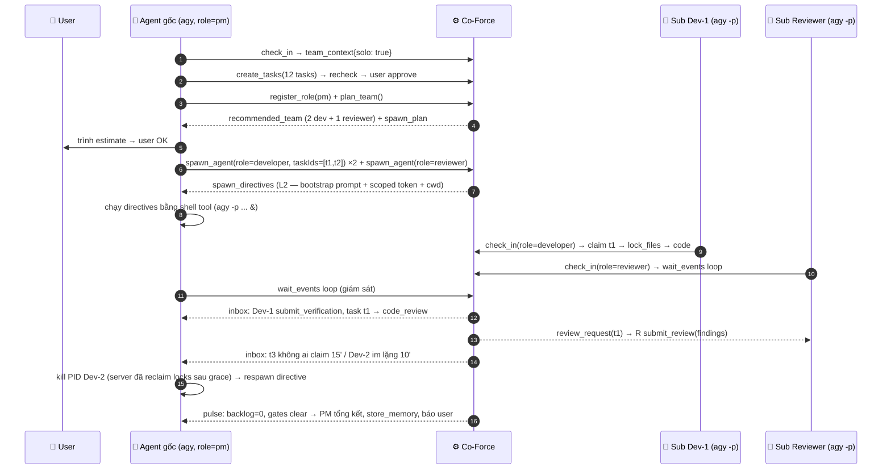

# Kế Hoạch Triển Khai Chi Tiết: 10 - Solo Orchestration & Team Bootstrap

**Status:** Ready for Implementation (bổ trợ WS-C/E, chốt 2026-07-08)
**Target:** `crates/co-force-core/src/quality/team_planner.rs`, mở rộng `orchestration/`, template Plan 09
**Kịch bản giải quyết:** công việc **dài, khó, nhiều task nhỏ** nhưng workspace chỉ có **1 agent duy nhất** (vd Antigravity trên 1 máy). Một agent ôm hết → context window phình → hallucinate, chất lượng sụp. Cần cơ chế để agent **tự biết mình đang solo**, tự đôn lên làm **PM**, ước lượng cần bao nhiêu dev/test/ba/qa, spawn subagents, và Co-Force làm **nguồn chân lý duy nhất + đồng bộ trạng thái** giữa các subagent — không race condition, chất lượng tối đa.

---

## 1. Nguyên lý: chống hallucinate bằng cách chia nhỏ context, không phải chia nhỏ chất lượng

| Vấn đề khi 1 agent ôm việc dài | Cơ chế Co-Force |
| :--- | :--- |
| Context phình → quên spec, trộn lẫn tasks, tự tin sai | Mỗi subagent chỉ nhận **bootstrap package tối thiểu** (1 task + protocol pointer) — context hẹp, sạch |
| Không ai kiểm tra chéo | Subagents là **identity riêng** → separation of duties vẫn enforce được (reviewer ≠ tác giả) dù cùng 1 provider |
| Trạng thái nằm trong "trí nhớ" của agent → mất khi compact | Trạng thái nằm trong **DB server** (tasks, locks, activities, messages) — agent nào cũng đọc lại được, không bao giờ stale |
| PM tự làm luôn cho nhanh → lại phình context | Playbook PM (Plan 09 §5): **PM không code khi team đang chạy** — chỉ điều phối, `protocol_next_step` liên tục nhắc |

## 2. Phát hiện solo & kích hoạt (agent "tự biết" bằng cách nào)

Ba tầng tín hiệu, không dựa vào việc agent tự giác:

1. **Rules (Lớp 1):** template Plan 09 §2 có quy tắc solo (đã bổ sung): *"Nếu check_in cho thấy bạn là agent duy nhất online và công việc trải trên >3 tasks → đăng ký role `pm` và gọi `co_force_plan_team` thay vì tự làm tất cả."*
2. **Check-in response (Lớp 4 in-band):** kèm `team_context: {agents_online: 1, solo: true, providers: ["antigravity"]}` — sự thật từ server, không phải agent đoán.
3. **Server chủ động (Lớp 3):** khi backlog `approved` của workspace vượt ngưỡng (`[a2a] solo_team_threshold_tasks = 3`) mà chỉ 1 agent online → mọi response cho agent đó gắn `protocol_next_step: "You are solo with N approved tasks. Register role pm and call co_force_plan_team before claiming tasks yourself."` Agent lờ đi và claim task thứ 2 khi task 1 chưa xong → cảnh báo mạnh hơn trong response (không chặn cứng — user có thể cố ý solo, config tắt được).

## 3. Tool mới: `co_force_plan_team` (tool #39, nhóm Messaging/A2A)

Input: `{scope?: taskIds[] | "backlog"}`. Server (reasoner + heuristic) phân tích backlog approved và trả về **staffing estimate có căn cứ**:

```json
{
  "analysis": {
    "tasks": 12, "parallel_lanes": 3,
    "lane_clusters": [
      {"area": "api/", "tasks": 5}, {"area": "web/", "tasks": 4}, {"area": "infra/", "tasks": 3}
    ],
    "spec_gap_score": "low",          // từ recheck history → có cần BA không
    "machine_capacity": {"max_agents_per_machine": 3, "provider": "antigravity"}
  },
  "recommended_team": [
    {"role": "developer", "count": 2, "rationale": "3 lanes nhưng máy cap 3 agents tổng"},
    {"role": "reviewer",  "count": 1, "rationale": "bắt buộc — reviews_required=1, phải khác identity tác giả"},
    {"role": "qa",        "count": 0, "rationale": "reviewer kiêm QA khi team ≤ 4 (policy default)"},
    {"role": "ba",        "count": 0, "rationale": "spec_gap_score=low; recheck server đảm nhiệm"}
  ],
  "spawn_plan": [ {"role": "developer", "taskIds": ["t1","t2"], "directive_ready": true}, ... ],
  "protocol_next_step": "Confirm with the user, then call co_force_spawn_agent for each member. You are PM: do not claim coding tasks while the team runs."
}
```

**Heuristic nền (chạy được không cần reasoner, reasoner tinh chỉnh):**
- `parallel_lanes` = số cụm task có **lock set rời nhau** (phân cụm theo `locked_files`/`avoidFiles` dự kiến + dependency graph) — đây chính là mức song song an toàn tối đa.
- Số dev = min(parallel_lanes, `max_agents_per_machine` − 1 reviewer − 1 PM đang chiếm slot nhẹ).
- Reviewer ≥ 1 luôn luôn (identity khác); QA tách riêng khi team > 4 hoặc policy `required_evidence_kinds` nhiều; BA chỉ khi recheck liên tục trả gaps (spec_gap_score cao).
- Ước lượng đều phải **trình user xác nhận** trước khi spawn (dòng approve trên dashboard hoặc PM hỏi trực tiếp) — spawn đốt tài nguyên máy + subscription.

## 4. PM quản lý subagents — vòng đời đầy đủ



**Trách nhiệm tách bạch — ai làm gì:**

| Việc | Server (nguồn chân lý) | PM (điều phối) |
| :--- | :--- | :--- |
| Phân việc không giẫm chân | Lock claims UNIQUE(ws,path) — atomic trong DB; task claim atomic (1 assignee) | Giao taskIds theo lane khi spawn; dùng `delegate_task(avoidFiles)` |
| Thứ tự thực hiện | Dependency giữa tasks (prerequisites) — task chưa đủ deps không claim được | Sắp lane, quyết định ưu tiên |
| Phát hiện subagent chết/kẹt | Session drop → grace 2' → reclaim locks + task về backlog; **stall detector**: task `in_progress` không có activity > `stall_timeout` (15') → inbox cho PM | Kill process (PID nằm trong spawn record), respawn hoặc tự làm nốt |
| Chất lượng | Gates y nguyên (verification evidence + cross review giữa các identity) — **solo không hạ chuẩn** | Không tự review task mình giao? Được — PM không phải tác giả code; nhưng PM không review task chính PM code |
| Approve của user | `awaiting_approval` vẫn cần user (dashboard) | PM gom câu hỏi/quyết định trình user 1 lần, không để N subagent hỏi user N lần |

## 5. Race condition trên MỘT máy — vấn đề thật sự và lời giải

Locks logic của Co-Force chặn 2 agent *nhận việc* trùng file, nhưng nhiều subagent trên **cùng working tree** vẫn đụng nhau ở tầng vật lý: build artifacts, formatter chạy toàn repo, `git add -A` vơ cả thay đổi của người khác. Chốt 2 mức:

1. **Mặc định (`use_local_worktrees = false`):** cùng working tree, chỉ an toàn khi lock sets rời nhau **và** rules cấm lệnh toàn-repo: bootstrap prompt của subagent ghi rõ *"chỉ đụng files đã lock; commit bằng đường dẫn tường minh (`git add <files>`), không bao giờ `git add -A`/`git commit -a`; không chạy formatter/codemod toàn repo"*. Đủ tốt cho 2–3 subagents lanes rời.
2. **Chế độ song song nặng (`use_local_worktrees = true`):** spawn_directive đặt `cwd` = **git worktree riêng** `.co-force/worktrees/{taskId}` trên branch `co-force/{taskId}` (đúng mô hình L3 nhưng trên máy client). Cô lập tuyệt đối; merge qua branch + gate code_review trước khi vào main. Trade-off: cần git, tốn disk, PM/user merge cuối — bật cho dự án lớn.

Cả hai mức: **nguồn chân lý code = git**, nguồn chân lý trạng thái = **DB server** — subagent không bao giờ "hỏi nhau trực tiếp"; mọi giao tiếp qua `send_message`/inbox (có audit, có correlation) nên không có kênh ngầm để lệch trạng thái.

## 6. Solo + 1 provider: chất lượng giữ bằng gì? (liên đới F-22)

- `reviewer_must_differ`: workspace 1 provider → policy validator (Plan 07 §8) tự chốt mức `"agent"` — review chéo giữa các **identity** khác nhau (context sạch riêng, không nhiễm bias "tôi vừa viết đoạn này"). Đây vẫn là nâng cấp lớn so với tự-review: reviewer đọc code lạnh, chạy test độc lập.
- **Diversity mô hình đến từ server:** recheck/review-assist chạy trên reasoner (Ollama `qwen3` hoặc cloud) — khác model với agy → góc nhìn thứ hai thật sự.
- Khuyến nghị trong `plan_team.analysis`: nếu server có Worker Pool bật với provider khác (Plan 08) → đề xuất đặt reviewer ở **L3 provider khác** thay vì subagent local cùng provider (diversity cao hơn, không tốn RAM máy dev).

## 7. Config mới (`server.toml [a2a]` — bổ sung Plan 06 §5)

```toml
[a2a]
solo_team_threshold_tasks = 3      # backlog approved > N mà solo → protocol_next_step gợi ý plan_team
max_agents_per_machine = 3         # trần subagent L2 per máy (RAM/CPU + rate limit subscription)
stall_timeout_secs = 900           # in_progress không activity → báo PM
use_local_worktrees = false        # true → spawn L2 vào git worktree riêng (§5.2)
```

`max_spawn_depth = 1` giữ nguyên: subagent KHÔNG được spawn tiếp (chống nổ đệ quy); cần thêm người → nhắn PM qua inbox, PM quyết.

## 8. Trình tự Triển khai (Step-by-Step)

1. `team_planner.rs`: heuristic phân cụm lanes từ locked_files/prerequisites (pure function, unit test với backlog mẫu) + reasoner refinement (mock LLM).
2. Tool `co_force_plan_team` (#39) + `team_context`/`solo` trong check_in response + solo nudge trong `protocol_next_step` (threshold config).
3. Mở rộng `spawn_agent` L2: nhận `taskIds[]`, sinh bootstrap prompt hẹp (1–2 tasks + quy tắc git tường minh §5.1), ghi spawn record (PID do PM báo lại qua `update`); `use_local_worktrees` → directive kèm lệnh tạo worktree.
4. Stall detector daemon (activity gap > threshold → inbox PM) + reclaim đã có sẵn (architecture §9).
5. Playbook PM (Plan 09 §5) + rules template: quy tắc solo + quy tắc "PM không code khi team chạy".
6. Policy validator: solo/1-provider → `reviewer_must_differ="agent"` + gợi ý L3 provider khác nếu worker pool bật.
7. E2E nghiệm thu: workspace trắng + 1 agent agy + backlog 8 tasks 2 lanes → agent tự plan_team → spawn 2 dev + 1 reviewer → toàn bộ tasks qua đủ gates, locks không conflict, `git log` không lẫn commit chéo lane; kill 1 subagent giữa chừng → PM được báo, respawn, hoàn thành.
