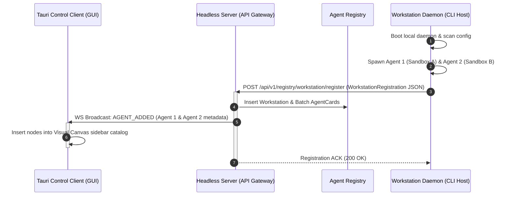
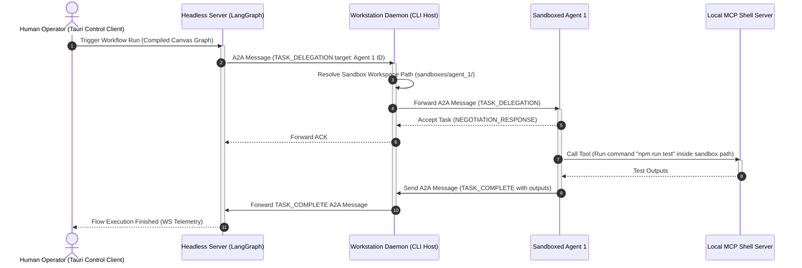

# System Architecture & Diagrams
## Project Co-Force: Centralized Agent Orchestration & Canvas Swarm Platform

#### 1. High-Level Architectural Layers
Co-Force decomposes its software footprint into distinct operational nodes:
1.  **Tauri Clients (User/Workspace Plane):** Run locally on client machines (macOS/Linux) or mobile devices.
    *   **Control Client (GUI):** Features a drag-and-drop Canvas workflow designer (SvelteFlow/ReactFlow) and execution monitor.
    *   **Client Agent (AI Agent - Antigravity):** A local CLI/Daemon agent that executes system-level tasks (e.g., coding, testing, local compiling) on the developer's machine, orchestrating local actions via MCP.
2.  **Headless Server (Control Plane):** Runs without a user interface. It acts as the centralized coordinator, hosting the API Gateways, Agent Registry, State/Trace Database, LangGraph runtime engine, and local LLM endpoints (via **Ollama**).
3.  **MCP Engine (Knowledge, Grounding & Skills):** Standardized Model Context Protocol servers connected either to the Headless Server (for shared enterprise knowledge/databases) or to the local Client Agent (for workstation-specific terminal execution and filesystem access).

---

### 2. Distributed System Topology

The following diagram illustrates the workstation-level daemon spawning multiple sandboxed agents and registering them dynamically with the central server:

```mermaid
graph TD
    %% Control Client
    subgraph UIClient ["Tauri GUI Plane"]
        Control["Tauri Control Client (Canvas UI)"]
    end

    %% Client Workstation
    subgraph Workstation ["Client Workstation Node (macOS / Linux CLI or App)"]
        Daemon["Workstation Daemon (A2A Bridge)"]
        subgraph Sandbox1 ["Sandbox Workspace 1"]
            Agent1["Sandboxed Agent A1 (Coder)"]
        end
        subgraph Sandbox2 ["Sandbox Workspace 2"]
            Agent2["Sandboxed Agent A2 (Tester)"]
        end
        LocalMCP["Workstation FS & Shell MCP Servers"]
    end

    %% Headless Server
    subgraph ServerNode ["Central Headless Server Core"]
        Gateway["API Gateway / WS Server"]
        Reg["Central Agent Registry"]
        LG["LangGraph Workflow Runner"]
        DB["State & Trace DB"]
        Ollama["Local LLM (Ollama)"]
    end

    %% MCP Infrastructure
    ServerMCP["Enterprise DB & KB MCP Servers"]

    %% Communications
    Control <-->|REST & WebSockets| Gateway
    Daemon <-->|Batch AgentCards & Heartbeats| Gateway
    Daemon <-->|A2A Task Forwarding| Agent1
    Daemon <-->|A2A Task Forwarding| Agent2

    %% Execution Bindings
    LG <-->|A2A Protocol (HTTP/2)| Daemon
    LG <-->|Read / Write State| DB
    LG <-->|Local Inference| Ollama
    LG <-->|A2A Capability Check| Reg

    %% MCP Tool Connections
    LG <-->|Enterprise Grounding| ServerMCP
    Agent1 & Agent2 <-->|Workstation FS & Shell| LocalMCP
```

*   **Workstation Daemon:** Manages the lifecycle of hosted agents. When booted, it reads a local configuration of needed agents, spins them up in directory sandboxes, and registers them in a single batch call.
*   **Sandbox Isolation:** Each sub-agent is mapped to a dedicated sub-folder on the workstation disk. The workstation daemon intercepts file path parameters and restricts all local filesystem MCP commands to the agent's specific sandbox.
*   **Dynamic Canvas Loading:** Whenever a workstation registers, the server triggers a WebSocket broadcast, pushing the new nodes to the Tauri Control Client's sidebar catalog in real-time.

---

### 3. Execution Sequence Diagrams

#### 3.1 Workstation Boot & Dynamic Canvas Registration Flow


#### 3.2 Task Delegation & Multi-Sandbox Execution Flow


---

### 4. Clean Architecture Directory Structure

The repository structure isolates system layers and decouples framework-specific tooling:

```
src/
├── domain/                      # Enterprise Core Rules (No external dependencies)
│   ├── entities/
│   │   ├── agent.py             # Agent representation
│   │   ├── agent_card.py        # Card validation schema
│   │   ├── workflow.py          # Workflow graph structure
│   │   └── message.py           # A2A Message envelopes
│   └── value_objects/
│       └── capability.py        # Capabilities list
│
├── use_cases/                   # Application Core Logic (Pure Python/TypeScript)
│   ├── interfaces/              # Abstractions of external storage & protocols
│   │   ├── agent_registry.py
│   │   ├── event_publisher.py
│   │   └── mcp_connector.py     # MCP client interface
│   ├── compile_workflow.py      # Parses canvas JSON into LangGraph specs
│   ├── delegate_task.py         # Standardizes A2A dispatching & validation
│   └── process_telemetry.py     # Routes telemetry events to clients
│
├── adapters/                    # Adapters mapping core logic to protocols
│   ├── controllers/
│   │   ├── canvas_api.py        # REST API endpoints for the Canvas UI
│   │   └── a2a_receiver.py      # A2A Message receiver endpoints
│   ├── gateways/
│   │   ├── mcp_client_adapter.py# Concrete MCP client implementation
│   │   └── redis_event_bus.py   # Asynchronous Event Broker interface
│   └── repositories/
│       └── db_registry.py       # Registry database connector
│
└── infrastructure/              # Libraries & Drivers (External setups)
    ├── api/                     # Server frameworks (e.g. FastAPI / Express)
    ├── langgraph_runner/        # Concrete LangGraph execution engine
    └── tests/                   # Test suite (Unit tests and integration mocks)
```

---

### 5. SOLID Principles Application

*   **Single Responsibility Principle (SRP):**
    *   `CanvasWorkflowCompiler` is only responsible for parsing UI diagrams and producing LangGraph configuration models. It has no knowledge of how tasks are dispatched over the network.
    *   `A2AMessageSender` handles network envelopes, ignoring what tools or MCP databases the target agent runs.
*   **Open/Closed Principle (OCP):**
    *   Adding new MCP servers (e.g., adding an API server or a memory retrieval system) does not modify the agent runtime logic. The runtime queries the MCP server dynamically for its capabilities, expanding its toolsets on the fly.
*   **Liskov Substitution Principle (LSP):**
    *   The `EventPublisher` interface can be swapped from `LocalMemoryPublisher` (used in local testing) to `RedisEventBus` or `KafkaPublisher` in clustered deployments, without altering use case behaviors.
*   **Interface Segregation Principle (ISP):**
    *   An agent only depends on the specific interfaces it uses, such as `MCPReader` (for knowledge query) or `MCPExecutor` (for executing tools), rather than a bloated, unified MCP interface.
*   **Dependency Inversion Principle (DIP):**
    *   The LangGraph runner (`infrastructure`) depends on the compiled workflow model defined in the `domain` layer. Use cases consume abstract repositories (`AgentRegistryReader`) instead of importing databases directly, allowing flexible mocking during testing.
