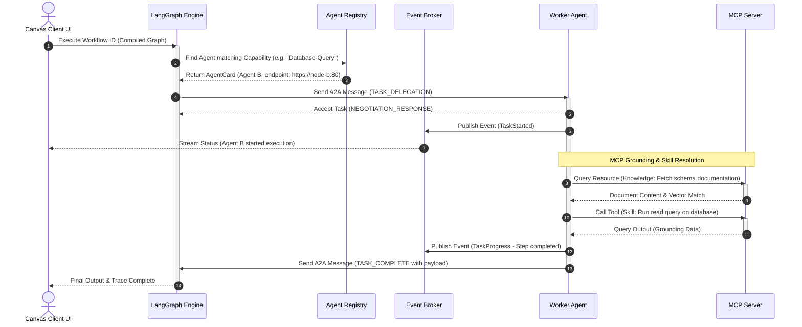

# System Architecture & Diagrams
## Project Co-Force: Centralized Agent Orchestration & Canvas Swarm Platform

### 1. High-Level Architectural Layers
Co-Force implements a highly decoupled architecture split into three core concepts:
1.  **Centralized Orchestration & Visualization (Control Plane):** Houses the user interface, workflow canvas editor, agent registry database, and the LangGraph graph execution engine.
2.  **Distributed Swarm Execution (Data Plane):** Comprises autonomous agent runtimes communicating with the Orchestration layer and peer agents via the **A2A Protocol**.
3.  **Context, Grounding & Capabilities (MCP Engine):** Decentralized **MCP servers** that expose environment access, database states, knowledge resources, and executable tools directly to the agent swarms.

---

### 2. Distributed System Topology

The following diagram illustrates the generalized logical layout of the platform components across a distributed network:

```mermaid
graph TD
    subgraph ClientLayer ["Client Interface"]
        UI["Visual Canvas UI (SvelteFlow / ReactFlow)"]
    end

    subgraph ControlPlane ["Central Control Plane / Orchestrator Node"]
        Reg["Central Agent Registry"]
        WS["WebSocket Telemetry Server"]
        Comp["Canvas Workflow Compiler"]
        LG["LangGraph Engine"]
    end

    subgraph DataPlane ["Distributed Worker Swarm Nodes"]
        Broker["Async Event Broker (Redis/AMQP)"]
        AgentA["Agent Process A (e.g. Coder)"]
        AgentB["Agent Process B (e.g. Tester)"]
    end

    subgraph MCPLayer ["MCP Grounding, Knowledge & Skill Servers"]
        MCP_FS["MCP Document & File Server"]
        MCP_DB["MCP Enterprise DB Server"]
        MCP_Tool["MCP Operating System / Shell Server"]
    end

    %% Client Communication
    UI <-->|HTTPS / WebSockets| WS
    UI --->|Submit Canvas JSON| Comp
    Comp --->|Build Executable State Graph| LG

    %% Control to Data Plane
    LG <-->|A2A Protocol (HTTP/2)| AgentA
    LG <-->|A2A Protocol (HTTP/2)| AgentB
    
    %% Telemetry Loop
    AgentA & AgentB --->|Publish Events| Broker
    Broker --->|Stream Progress Traces| WS

    %% MCP Access
    AgentA <-->|Stdio / SSE MCP| MCP_FS
    AgentA <-->|Stdio / SSE MCP| MCP_Tool
    AgentB <-->|Stdio / SSE MCP| MCP_DB
    AgentB <-->|Stdio / SSE MCP| MCP_FS
```

*   **The Canvas UI Compiler:** Compiles a visual node-link structure into a standard LangGraph declaration. Each node represents an A2A-delegated agent step, and edges represent conditional transitions.
*   **The A2A Broker:** Decouples message-passing using event logs. Agent processes do not need direct awareness of other execution runtimes; they only need to resolve the endpoints from the Central Registry.
*   **The MCP Boundary:** Agents remain pure reasoning entities. When an agent requires context (knowledge/grounding) or needs to execute an action (skills), it communicates over standard Model Context Protocol ports, separating reasoning from execution effects.

---

### 3. Execution Sequence Diagram

The following sequence outlines how a canvas-defined workflow executes across A2A nodes and uses MCP for data grounding:



---

### 4. Clean Architecture Directory Structure

The repository structure isolates system layers and decouples framework-specific tooling:

```
src/
├── domain/                      # Enterprise Core Rules (No external dependencies)
│   ├── entities/
│   │   ├── agent.py             # Agent representation
│   │   ├── agent_card.py        # Card validation schema
│   │   ├── workflow.py          # Workflow graph structure
│   │   └── message.py           # A2A Message envelopes
│   └── value_objects/
│       └── capability.py        # Capabilities list
│
├── use_cases/                   # Application Core Logic (Pure Python/TypeScript)
│   ├── interfaces/              # Abstractions of external storage & protocols
│   │   ├── agent_registry.py
│   │   ├── event_publisher.py
│   │   └── mcp_connector.py     # MCP client interface
│   ├── compile_workflow.py      # Parses canvas JSON into LangGraph specs
│   ├── delegate_task.py         # Standardizes A2A dispatching & validation
│   └── process_telemetry.py     # Routes telemetry events to clients
│
├── adapters/                    # Adapters mapping core logic to protocols
│   ├── controllers/
│   │   ├── canvas_api.py        # REST API endpoints for the Canvas UI
│   │   └── a2a_receiver.py      # A2A Message receiver endpoints
│   ├── gateways/
│   │   ├── mcp_client_adapter.py# Concrete MCP client implementation
│   │   └── redis_event_bus.py   # Asynchronous Event Broker interface
│   └── repositories/
│       └── db_registry.py       # Registry database connector
│
└── infrastructure/              # Libraries & Drivers (External setups)
    ├── api/                     # Server frameworks (e.g. FastAPI / Express)
    ├── langgraph_runner/        # Concrete LangGraph execution engine
    └── tests/                   # Test suite (Unit tests and integration mocks)
```

---

### 5. SOLID Principles Application

*   **Single Responsibility Principle (SRP):**
    *   `CanvasWorkflowCompiler` is only responsible for parsing UI diagrams and producing LangGraph configuration models. It has no knowledge of how tasks are dispatched over the network.
    *   `A2AMessageSender` handles network envelopes, ignoring what tools or MCP databases the target agent runs.
*   **Open/Closed Principle (OCP):**
    *   Adding new MCP servers (e.g., adding an API server or a memory retrieval system) does not modify the agent runtime logic. The runtime queries the MCP server dynamically for its capabilities, expanding its toolsets on the fly.
*   **Liskov Substitution Principle (LSP):**
    *   The `EventPublisher` interface can be swapped from `LocalMemoryPublisher` (used in local testing) to `RedisEventBus` or `KafkaPublisher` in clustered deployments, without altering use case behaviors.
*   **Interface Segregation Principle (ISP):**
    *   An agent only depends on the specific interfaces it uses, such as `MCPReader` (for knowledge query) or `MCPExecutor` (for executing tools), rather than a bloated, unified MCP interface.
*   **Dependency Inversion Principle (DIP):**
    *   The LangGraph runner (`infrastructure`) depends on the compiled workflow model defined in the `domain` layer. Use cases consume abstract repositories (`AgentRegistryReader`) instead of importing databases directly, allowing flexible mocking during testing.
